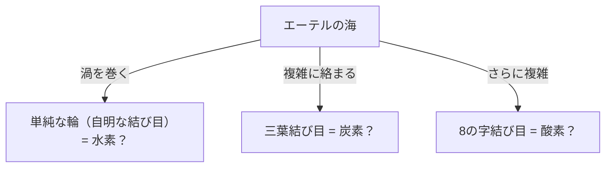
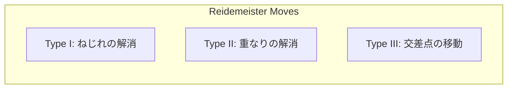

## 結び目理論とは何か？

日常生活で靴紐を結んだり、イヤホンのコードが絡まったりする経験は誰にでもあるでしょう。しかし、それが「数学の最先端」と深い関わりがあると言われたら驚くかもしれません。数学の一分野である「トポロジー（位相幾何学）」の中に位置する「結び目理論（Knot Theory）」は、まさにこの「絡まり」の性質を厳密に研究する学問です。

通常の結び目と数学的な結び目の最大の違いは、**両端がくっついている（閉曲線である）**という点にあります。端が固定されていなければ、どんな結び目も最終的にはスルリと解けてしまいます。しかし両端を繋いで輪にすると、その「絡まり方」は固定され、切断しない限り別の絡まり方へと変化させることはできません。

この一見すると単純な「閉じた紐の絡まり」を分類し、「ある結び目と別の結び目は同じか？」「この結び目は解けるのか？」を問うのが結び目理論の基本的な命題です。

## ケルヴィン卿の「渦原子仮説」：物理学からのロマンチックな起源

結び目理論が本格的に数学の対象となった背景には、19世紀の物理学者、ウィリアム・トムソン（後のケルヴィン卿）による魅力的な仮説があります。

1867年、ケルヴィン卿は「原子とは、エーテル（当時存在すると考えられていた宇宙を満たす媒質）の中にできた**渦の結び目**である」という「渦原子仮説（Vortex Atom Theory）」を提唱しました。
彼は、煙の輪（渦輪）が安定して形を保ち、ぶつかり合っても振動するだけで壊れない性質を持つことに着目しました。もし様々な元素の違いが、この渦の「結び目の種類（絡まり方の違い）」によって説明できるならば、化学の世界を純粋な幾何学として記述できるのではないかと考えたのです。

最終的にマイケルソン・モーリーの実験などによってエーテルの存在は否定され、渦原子仮説は物理学としては放棄されました。しかし、彼の仮説に触発されたピーター・テイトらの数学者たちが「すべての結び目を分類し、表を作成する」という壮大なプロジェクトを開始しました。これが、数学としての結び目理論の夜明けとなったのです。

## ライデマイスター移動：結び目を「変形」するルール

結び目理論における最大の難問は、「一見違うように見える２つの結び目が、実は同じもの（紐を切らずに変形させれば一致するもの）かどうか」を判定することです。
3次元空間にある結び目を紙の上（2次元）に射影して描いたものを「結び目の射影図」と呼びます。

1926年、クルト・ライデマイスターは、どんなに複雑な結び目の変形であっても、射影図上では**たった3種類の局所的な操作の組み合わせ**で表現できることを証明しました。これを「ライデマイスター移動（Reidemeister Moves）」と呼びます。

1. **タイプI（Type I）**: ねじれを加えたり、ほどいたりする操作。（紐のループを作ったり消したりする）
2. **タイプII（Type II）**: 2本の紐を重ねたり、引き離したりする操作。
3. **タイプIII（Type III）**: 紐の交差点の上を、別の紐がスライドして通り抜ける操作。

もし2つの結び目射影図が、この3つの移動を何度か繰り返して同じ図になるならば、それらは「同じ結び目（同値）」であると言えます。逆に言えば、「どんなにこの3つの操作を繰り返しても決して一致しない」ことを証明できれば、それらが別の結び目であることが確定します。

## ジョーンズ多項式：数学界を揺るがした大発見

長年、数学者たちは「2つの結び目が異なること」を証明するための強力な道具（結び目不変量）を探し求めていました。不変量とは、ライデマイスター移動を行っても絶対に変化しない値や数式のことです。

1928年にアレクサンダー多項式が発見され長らく標準的なツールとして使われていましたが、鏡に映した結び目（鏡像）を区別できないなどの弱点がありました。

1984年、ニュージーランドの数学者ヴォーン・ジョーンズは、フォン・ノイマン代数という全く異なる分野の研究から、突如として新しい結び目不変量を発見しました。これが「ジョーンズ多項式（Jones Polynomial）」です。

ジョーンズ多項式 $V(K)$ は、結び目の交差点の「符号（プラスかマイナスか）」を用いて再帰的に計算（スケイン関係式）されます。

ジョーンズ多項式の発見は、トポロジーだけでなく、統計力学や量子場理論など、他の物理学分野との間に深い架け橋を架けました。エドワード・ウィッテンは、ジョーンズ多項式がチェルン・サイモンズ理論という量子場理論の枠組みで自然に導出されることを示し、数学と物理学の融合を決定づけました。ジョーンズとウィッテンはこの功績により、1990年にフィールズ賞を受賞しています。

## 生命の神秘と結び目：DNAとトポイソメラーゼ

結び目理論は純粋数学の世界にとどまりません。私たちの細胞の中にあるDNAの挙動を理解する上で、結び目理論は不可欠な役割を果たしています。

DNAは二重らせん構造をしていますが、細胞分裂の際にDNAを複製するためには、このらせんをほどく必要があります。しかし、極めて長く細いDNAストランドは、細胞核という狭い空間に詰め込まれているため、複製や転写の過程で激しくねじれ、絡まり、文字通り「結び目」ができてしまいます。
この絡まりを放置すると、DNAはちぎれて細胞は死んでしまいます。

ここで活躍するのが「トポイソメラーゼ（Topoisomerase）」という特殊な酵素です。
トポイソメラーゼは、驚くべきことに**「DNAの鎖を一度ハサミのように切断し、別の鎖をその隙間に通してから、再び繋ぎ合わせる」**というマジックのような操作を行います。

- **タイプIトポイソメラーゼ**: 二重らせんの片方の鎖だけを切り、もう片方を通過させて再結合する。（絡み目数を1つ変える）
- **タイプIIトポイソメラーゼ**: 二重らせんの両方の鎖を切り、別の二重らせんを通過させて再結合する。（交差の上下を反転させる）

これは数学的に見れば、結び目の交差のプラスマイナスを人為的に反転させる操作に他なりません。数学者と生物学者は協力し、トポイソメラーゼがどのようにDNAの結び目を解いているのかを、結び目理論を用いて解析しています。

## 未来のテクノロジー：エニオンとトポロジカル量子計算

そして現代、結び目理論は次世代のコンピューターである「量子コンピューター」の実現に向けた最重要テーマの一つとなっています。

通常の量子コンピューターはノイズ（熱や電磁波）に非常に弱く、計算のエラーが起きやすいという致命的な弱点があります。これを克服するためのアイデアが「トポロジカル量子計算（Topological Quantum Computing）」です。

2次元空間に閉じ込められた特殊な粒子（または準粒子）である「エニオン（Anyon）」は、位置を入れ替える（組み紐のように絡み合わせる）と、粒子の量子状態（波動関数）が変化します。
エニオンの軌跡を時間軸（3次元目）に沿って描くと、文字通り「組み紐（Braid）」の軌跡が描かれます。

トポロジカル量子計算では、この「エニオンの組み紐の結び目」を量子ゲート（計算の操作）として利用します。
結び目は、多少紐を引っ張ったり揺らしたり（ノイズが加わったり）しても、紐を切らない限り（トポロジーが変化しない限り）その種類は変わりません。つまり、結び目の構造自体に情報を記録することで、環境ノイズに対して極めて堅牢な「エラーの起きない量子計算」が可能になるのです。

## おわりに：ほどけない謎への挑戦

ケルヴィン卿の失敗した原子模型から始まった結び目理論は、数世紀の時を経て、DNAの生命活動を解明し、未来の量子コンピューターを設計するための基盤となりました。

一見すると子供の遊びのように見える「紐の絡まり」に、宇宙の真理や生命の謎を解き明かす鍵が隠されている。これこそが、数学という学問の持つ最大の魅力であり、結び目理論が今なお多くの科学者を惹きつけてやまない理由なのです。
