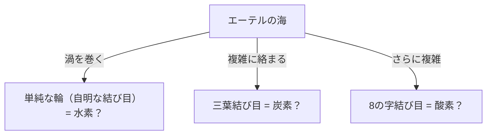
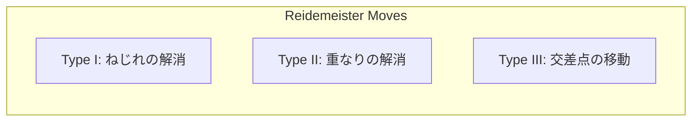

## O que é a Teoria dos Nós?

Todos nós já tivemos a experiência de amarrar cadarços ou de ter os fios dos fones de ouvido emaranhados no nosso dia a dia. No entanto, você pode se surpreender ao saber que isso tem uma profunda ligação com a "vanguarda da matemática". A "Teoria dos Nós" (Knot Theory), que se enquadra na "Topologia" (geometria da posição), uma ramificação da matemática, é exatamente o estudo rigoroso das propriedades desses "emaranhados".

A maior diferença entre os nós comuns e os nós matemáticos reside no fato de que **as duas extremidades estão unidas (formando uma curva fechada)**. Se as extremidades não estiverem fixadas, qualquer nó acabará se desfazendo. Mas, ao juntar as pontas para formar um laço, a sua "forma de emaranhamento" fica fixada e, a não ser que se corte, não pode ser transformada em outro tipo de emaranhado.

Classificar esse, à primeira vista, simples "emaranhado de uma corda fechada" e questionar "Um nó é igual a outro nó?" ou "Esse nó pode ser desfeito?" é a proposição básica da Teoria dos Nós.

## A "Hipótese do Átomo Vórtice" de Lord Kelvin: Uma origem romântica da física

Por trás da transformação da Teoria dos Nós em um autêntico objeto de estudo matemático, há uma hipótese fascinante proposta pelo físico do século XIX, William Thomson (mais tarde Lord Kelvin).

Em 1867, Lord Kelvin propôs a "Hipótese do Átomo Vórtice" (Vortex Atom Theory), que afirmava que "os átomos são **nós de vórtices** formados no éter (o meio que se acreditava preencher o universo na época)".

Ele notou que os anéis de fumaça (anéis de vórtice) mantêm sua forma de maneira estável e possuem a propriedade de não se desfazerem ao colidirem, apenas vibrando. Ele pensou que, se a diferença entre os vários elementos químicos pudesse ser explicada pelo "tipo de nó (diferença no emaranhamento)" desses vórtices, talvez fosse possível descrever o mundo da química como uma geometria pura.

Eventualmente, a existência do éter foi refutada por experimentos como o de Michelson-Morley, e a hipótese do átomo vórtice foi abandonada como física. No entanto, inspirados pela sua hipótese, matemáticos como Peter Tait iniciaram um grandioso projeto de "classificar todos os nós e criar uma tabela". Esse foi o alvorecer da Teoria dos Nós como matemática.

## Movimentos de Reidemeister: As regras para "deformar" nós

O maior desafio na Teoria dos Nós é determinar "se dois nós que parecem diferentes são, na verdade, a mesma coisa (ou seja, coincidem se deformados sem cortar a corda)".

A representação desenhada de um nó em um espaço tridimensional projetado em um papel (bidimensional) é chamada de "diagrama de projeção do nó".

Em 1926, Kurt Reidemeister provou que, não importa quão complexa seja a deformação do nó, no diagrama de projeção, ela pode ser expressa através de **uma combinação de apenas 3 tipos de operações locais**. Esses são chamados de "Movimentos de Reidemeister" (Reidemeister Moves).

1. **Tipo I (Type I)**: Operação de adicionar ou desfazer uma torção. (Criar ou remover um laço na corda)
2. **Tipo II (Type II)**: Operação de sobrepor ou separar duas cordas.
3. **Tipo III (Type III)**: Operação em que uma corda desliza por cima do ponto de interseção de outras duas.

Se dois diagramas de projeção de nós se tornarem o mesmo desenho após repetir esses 3 movimentos várias vezes, pode-se dizer que são "o mesmo nó (equivalentes)". Dito de outra forma, se você puder provar que "não importa quantas vezes você repita essas três operações, elas nunca coincidirão", fica confirmado que são nós diferentes.

## Polinômio de Jones: A grande descoberta que abalou a comunidade matemática

Por muitos anos, os matemáticos buscaram uma ferramenta poderosa (invariante de nó) para provar que "dois nós são diferentes". Um invariante é um valor ou fórmula que não muda, não importa quais movimentos de Reidemeister sejam realizados.

Em 1928, o polinômio de Alexander foi descoberto e serviu como a ferramenta padrão por muito tempo, mas tinha pontos fracos, como a incapacidade de distinguir um nó de sua reflexão no espelho (imagem espelhada).

Em 1984, o matemático neozelandês Vaughan Jones, a partir de estudos num campo completamente diferente, a álgebra de von Neumann, de repente descobriu um novo invariante de nó. Esse é o "Polinômio de Jones" (Jones Polynomial).

O polinômio de Jones $V(K)$ é calculado recursivamente (relação de skein) usando os "sinais (positivo ou negativo)" nos pontos de interseção dos nós.

A descoberta do polinômio de Jones construiu uma ponte profunda não apenas para a topologia, mas também com outros campos da física, como a mecânica estatística e a teoria quântica de campos. Edward Witten demonstrou que o polinômio de Jones pode ser derivado naturalmente no âmbito da teoria de Chern-Simons, uma teoria quântica de campos, selando a fusão entre a matemática e a física. Por suas realizações, Jones e Witten receberam a Medalha Fields em 1990.

## Os Mistérios da Vida e os Nós: DNA e Topoisomerase

A Teoria dos Nós não se restringe ao mundo da matemática pura. Ela desempenha um papel indispensável na compreensão do comportamento do DNA em nossas células.

O DNA possui uma estrutura de dupla hélice, mas para replicar o DNA durante a divisão celular, é necessário desenrolar essa hélice. No entanto, como as longas e finas fitas de DNA estão espremidas no espaço estreito do núcleo celular, durante os processos de replicação ou transcrição, elas torcem, se emaranham violentamente e literalmente formam "nós".

Se esse emaranhado for ignorado, o DNA se rompe e a célula morre.

Aqui entra em ação uma enzima especial chamada "Topoisomerase".

Surpreendentemente, a Topoisomerase realiza uma operação quase mágica: **"corta uma das fitas de DNA como uma tesoura, passa a outra fita através dessa lacuna e depois une as pontas novamente"**.

- **Topoisomerase do Tipo I**: Corta apenas uma das fitas da dupla hélice, permite que a outra passe e as une novamente. (Altera o número de ligação em 1)
- **Topoisomerase do Tipo II**: Corta ambas as fitas da dupla hélice, permite que outra dupla hélice passe e as une novamente. (Inverte as posições de cima e baixo do cruzamento)

De um ponto de vista matemático, isso nada mais é do que uma operação que inverte artificialmente o positivo e negativo no cruzamento dos nós. Matemáticos e biólogos trabalham juntos e analisam, usando a Teoria dos Nós, como a Topoisomerase desfaz os nós do DNA.

## Tecnologia do Futuro: Anyons e a Computação Quântica Topológica

Na era moderna, a Teoria dos Nós tornou-se um dos temas mais importantes na busca pela criação de "computadores quânticos", a próxima geração de computadores.

Os computadores quânticos convencionais têm a fraqueza fatal de serem extremamente sensíveis ao ruído (calor e ondas eletromagnéticas), tornando os erros de cálculo muito frequentes. A ideia para superar isso é a "Computação Quântica Topológica" (Topological Quantum Computing).

Quando "Anyons" (Anyons), que são partículas (ou quase-partículas) especiais confinadas em um espaço bidimensional, trocam de posição (emaranhando-se como tranças), o estado quântico (função de onda) das partículas muda.

Se você desenhar a trajetória de um Anyon ao longo do eixo do tempo (a terceira dimensão), você literalmente desenhará a trajetória de uma "trança" (Braid).

Na Computação Quântica Topológica, esse "nó de tranças de Anyons" é utilizado como uma porta quântica (operação de cálculo).

Mesmo que a corda de um nó seja ligeiramente puxada ou balançada (sob influência de ruído), a menos que seja cortada (a menos que a topologia mude), seu tipo permanece o mesmo. Isso significa que, ao gravar informações na própria estrutura do nó, é possível alcançar um "cálculo quântico livre de erros" incrivelmente robusto contra ruídos ambientais.

## Conclusão: Um desafio ao mistério que não se desfaz

A Teoria dos Nós, que começou a partir do modelo atômico fracassado de Lord Kelvin, após muitos séculos, desvendou as atividades biológicas do DNA e se tornou a base para o design dos computadores quânticos do futuro.

No "emaranhado de cordas", que à primeira vista parece uma brincadeira de criança, esconde-se a chave para desvendar as verdades do universo e os mistérios da vida. Este é precisamente o maior apelo da matemática como disciplina e o motivo pelo qual a Teoria dos Nós ainda cativa inúmeros cientistas.
