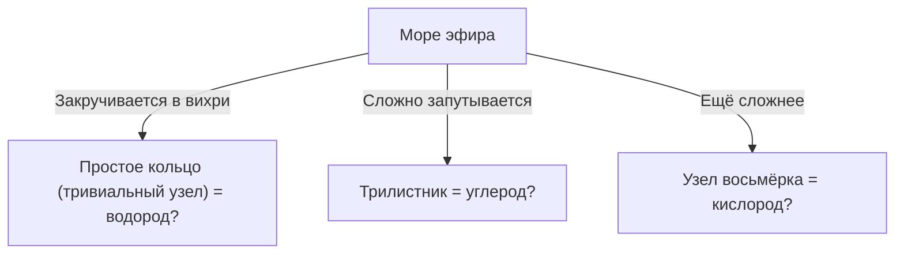
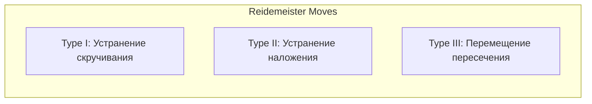

## Что такое теория узлов?

Наверное, каждый из нас сталкивался в повседневной жизни с завязыванием шнурков или запутыванием проводов от наушников. Но, возможно, вы удивитесь, узнав, что это глубоко связано с "передовым краем математики". Раздел математики "Топология", и в частности "Теория узлов" (Knot Theory), — это именно та дисциплина, которая строго изучает природу подобных "запутанностей".

Самое главное отличие обычного узла от математического заключается в том, что **его концы соединены (это замкнутая кривая)**. Если концы не закреплены, любой узел в конечном итоге легко распутается. Однако, если соединить концы, образовав кольцо, то "способ запутывания" фиксируется, и изменить его на другой без разрезания невозможно.

Классификация таких, на первый взгляд, простых "запутанностей замкнутых нитей", ответы на вопросы "Одинаковы ли этот узел и другой?" и "Можно ли распутать этот узел?" — это основные задачи теории узлов.

## "Теория вихревых атомов" лорда Кельвина: романтическое происхождение из физики

Причиной, по которой теория узлов стала серьезным объектом математических исследований, послужила увлекательная гипотеза, выдвинутая физиком 19-го века Уильямом Томсоном (позже лордом Кельвином).

В 1867 году лорд Кельвин предложил "Теорию вихревых атомов" (Vortex Atom Theory), согласно которой "атомы — это **узлы из вихрей** в эфире (среде, заполняющей Вселенную, в существование которой тогда верили)".
Он обратил внимание на то, что кольца дыма (вихревые кольца) стабильно сохраняют свою форму и даже при столкновении лишь вибрируют, не разрушаясь. Он подумал: если разницу между различными химическими элементами можно объяснить "типами узлов (различием в способах запутывания)" этих вихрей, то химический мир можно было бы описать как чистую геометрию.

В итоге эксперимент Майкельсона-Морли и другие опыты опровергли существование эфира, и теория вихревых атомов была отброшена физикой. Однако математики, такие как Питер Тэйт, вдохновленные его гипотезой, начали грандиозный проект по "классификации всех узлов и созданию их таблиц". Это стало рассветом теории узлов как математической дисциплины.

## Движения Рейдемейстера: правила "деформации" узлов

Самой большой проблемой в теории узлов является определение того, "являются ли два узла, которые на первый взгляд кажутся разными, на самом деле одним и тем же (совпадут ли они при деформации без разрезания нити)".
Проекция узла из трехмерного пространства на бумагу (в двумерное пространство) называется "проекцией узла".

В 1926 году Курт Рейдемейстер доказал, что любая, даже самая сложная деформация узла, может быть представлена на проекции как **комбинация всего трех типов локальных операций**. Это называется "Движениями Рейдемейстера" (Reidemeister Moves).

1. **Тип I (Type I)**: Операция добавления или удаления скручивания. (Создание или удаление петли на нити)
2. **Тип II (Type II)**: Операция наложения или раздвигания двух нитей.
3. **Тип III (Type III)**: Операция, при которой одна нить скользит и проходит над точкой пересечения двух других.

Если проекции двух узлов становятся одинаковыми после нескольких повторений этих трех движений, то можно сказать, что это "тот же самый узел (эквивалентный)". И наоборот, если можно доказать, что "как бы мы ни повторяли эти три операции, они никогда не совпадут", то это точно разные узлы.

## Полином Джонса: великое открытие, потрясшее математический мир

Долгие годы математики искали мощный инструмент (инвариант узлов) для доказательства того, что "два узла различны". Инвариант — это значение или математическое выражение, которое абсолютно не меняется при выполнении движений Рейдемейстера.

Полином Александера, открытый в 1928 году, долгое время использовался как стандартный инструмент, но имел свои недостатки, например, не мог отличить узел от его зеркального отражения.

В 1984 году новозеландский математик Воан Джонс, исследуя совершенно другую область — алгебры фон Неймана, неожиданно открыл новый инвариант узлов. Это "Полином Джонса" (Jones Polynomial).

Полином Джонса $V(K)$ вычисляется рекурсивно (скейн-соотношения) с использованием "знака (плюс или минус)" пересечений узла.

Открытие полинома Джонса перекинуло глубокий мост не только в топологии, но и в других областях физики, таких как статистическая механика и квантовая теория поля. Эдвард Виттен показал, что полином Джонса естественным образом выводится в рамках квантовой теории поля, известной как теория Черна-Саймонса, что стало решающим шагом к слиянию математики и физики. За эти достижения Джонс и Виттен были удостоены Филдсовской премии в 1990 году.

## Загадка жизни и узлы: ДНК и топоизомераза

Теория узлов не ограничивается миром чистой математики. Она играет важнейшую роль в понимании поведения ДНК внутри наших клеток.

ДНК имеет структуру двойной спирали, но для репликации ДНК при делении клетки эту спираль необходимо расплести. Однако, поскольку чрезвычайно длинная и тонкая нить ДНК упакована в узком пространстве клеточного ядра, в процессе репликации и транскрипции она сильно скручивается, переплетается и буквально образует "узлы".
Если оставить эти сплетения как есть, ДНК разорвется, и клетка погибнет.

Здесь на сцену выходит особый фермент под названием "топоизомераза" (Topoisomerase).
Удивительно, но топоизомераза выполняет поистине магическую операцию: **"она разрезает цепь ДНК, как ножницами, пропускает через образовавшуюся щель другую цепь, а затем снова соединяет разрезанные концы"**.

- **Топоизомераза типа I**: Разрезает только одну из нитей двойной спирали, пропускает через нее другую и воссоединяет. (Изменяет число зацеплений на единицу)
- **Топоизомераза типа II**: Разрезает обе нити двойной спирали, пропускает через них другую двойную спираль и воссоединяет. (Инвертирует пересечение: верх/низ)

С математической точки зрения это не что иное, как операция искусственного изменения знака пересечения узла. Математики и биологи сотрудничают, используя теорию узлов для анализа того, как топоизомераза распутывает узлы ДНК.

## Технологии будущего: энионы и топологические квантовые вычисления

В наше время теория узлов стала одной из важнейших тем на пути к созданию компьютеров следующего поколения — "квантовых компьютеров".

Обычные квантовые компьютеры очень уязвимы к шуму (теплу или электромагнитным волнам) и имеют фатальный недостаток в виде высокой вероятности ошибок при вычислениях. Идея, направленная на преодоление этого, называется "топологическими квантовыми вычислениями" (Topological Quantum Computing).

Особые частицы (или квазичастицы), называемые "энионами" (Anyon), запертые в двумерном пространстве, при изменении их положения (переплетении, подобно косе) меняют свое квантовое состояние (волновую функцию).
Если проследить траекторию энионов вдоль оси времени (третьего измерения), то в буквальном смысле будет нарисована траектория "косы" (Braid).

В топологических квантовых вычислениях эти "узлы энионных кос" используются в качестве квантовых вентилей (вычислительных операций).
Даже если узел немного потянуть или потрясти (добавить шум), его тип не изменится, пока нить не будет разрезана (пока не изменится топология). То есть, записывая информацию в саму структуру узла, можно добиться чрезвычайно надежных, устойчивых к шуму окружающей среды "квантовых вычислений без ошибок".

## Заключение: вызов неразрешимым загадкам

Теория узлов, начавшаяся с неудачной модели атома лорда Кельвина, спустя столетия стала основой для понимания жизненных процессов ДНК и проектирования квантовых компьютеров будущего.

В кажущейся детской игре "запутывания нитей" скрыты ключи к разгадке истин Вселенной и загадок жизни. И это является величайшим очарованием математики как науки, и причиной, по которой теория узлов до сих пор продолжает привлекать многих ученых.
