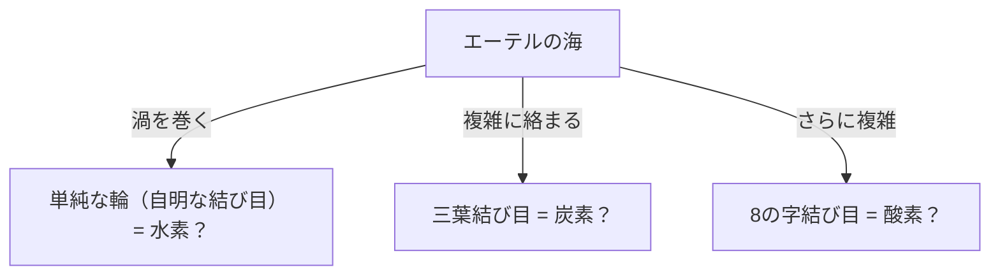
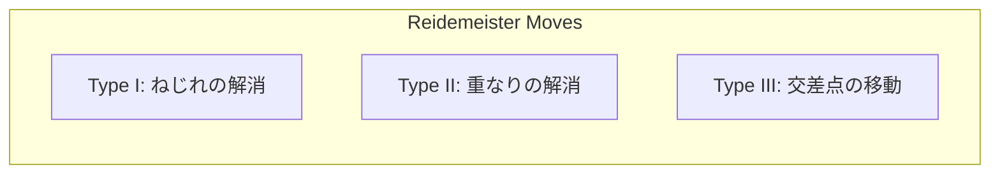

## 纽结理论是什么？

每个人在日常生活中大概都经历过系鞋带或耳机线缠结的情况。但是，如果说这与“数学的最前沿”有着密切联系，你可能会感到惊讶。作为数学分支“拓扑学”（Topology）的一部分，“纽结理论”（Knot Theory）正是一门严密研究这种“缠结”性质的学问。

普通的纽结与数学上的纽结最大的区别在于，**两端是连接在一起的（闭曲线）**。如果两端不固定，任何纽结最终都会滑脱解开。但是，如果将两端相连形成一个环，它的“缠结方式”就被固定下来了，除非将其切断，否则无法变成另一种缠结方式。

将这种看似简单的“闭合绳圈的缠结”进行分类，并探究“某个纽结与另一个纽结是否相同？”、“这个纽结能解开吗？”，这就是纽结理论的基本命题。

## 开尔文勋爵的“涡旋原子假说”：来自物理学的浪漫起源

纽结理论真正成为数学研究对象的背景中，有着19世纪物理学家威廉·汤姆孙（后来的开尔文勋爵）提出的一个迷人假说。

1867年，开尔文勋爵提出了“涡旋原子假说”（Vortex Atom Theory），认为“原子是在以太（当时被认为充满宇宙的介质）中形成的**涡旋纽结**”。
他注意到烟圈（涡环）能够稳定地保持形状，即使相互碰撞也只是振动而不会破坏。他构想，如果各种元素的差异可以通过这种涡旋的“纽结种类（缠结方式的不同）”来解释，那么也许就可以将化学世界描述为纯粹的几何学。

最终，由于迈克耳孙-莫雷实验等否定了以太的存在，涡旋原子假说在物理学上被放弃了。然而，受他假说启发的彼得·泰特等数学家们开始了一项“分类所有纽结并制作图表”的宏伟计划。这就成为了作为数学的纽结理论的黎明。

## 赖德马斯特移动：纽结的“变形”规则

纽结理论中的最大难题是判定“两个看似不同的纽结，是否实际上是相同的（在不切断绳子的情况下通过变形能否一致）”。
将三维空间中的纽结投影并画在纸上（二维），被称为“纽结投影图”。

1926年，库尔特·赖德马斯特证明了，无论多么复杂的纽结变形，在投影图上都可以表现为**仅3种局部操作的组合**。这被称为“赖德马斯特移动”（Reidemeister Moves）。

1. **类型I（Type I）**: 增加或解除扭转的操作。（生成或消除绳子的环）
2. **类型II（Type II）**: 将两根绳子重叠或拉开的操作。
3. **类型III（Type III）**: 一根绳子在另外两根绳子的交叉点上方滑过穿行的操作。

如果两个纽结投影图通过这三种移动的多次重复能变成相同的图，那么可以说它们是“相同的纽结（等价）”。反过来说，如果能证明“无论怎样重复这三种操作都绝不会一致”，就能确定它们是不同的纽结。

## 琼斯多项式：震惊数学界的重大发现

长期以来，数学家们一直在寻找一种强大的工具（纽结不变量）来证明“两个纽结是不同的”。不变量是指，即使进行赖德马斯特移动也绝对不会改变的值或数学式。

1928年发现了亚历山大多项式，它长期作为标准工具被使用，但它存在无法区分镜像（镜子里的纽结）等弱点。

1984年，新西兰数学家沃恩·琼斯从冯·诺依曼代数这一完全不同领域的研究中，突然发现了一种新的纽结不变量。这就是“琼斯多项式”（Jones Polynomial）。

琼斯多项式 $V(K)$ 是利用纽结交叉点的“符号（正或负）”递归计算（拆解关系式）出来的。

琼斯多项式的发现，不仅在拓扑学内部，更在统计力学和量子场论等其他物理学领域之间架起了一座深厚的桥梁。爱德华·威滕证明了琼斯多项式可以在陈-西蒙斯理论这一量子场论框架中被自然推导出来，决定性地促成了数学与物理学的融合。琼斯和威滕凭借这一成就，于1990年荣获了菲尔兹奖。

## 生命的奥秘与纽结：DNA与拓扑异构酶

纽结理论不仅停留在纯粹数学的世界。在理解我们细胞内DNA的行为方面，纽结理论发挥着不可或缺的作用。

DNA具有双螺旋结构，但在细胞分裂复制DNA时，必须解开这个螺旋。然而，极长且细的DNA链被塞在细胞核这个狭小的空间里，在复制和转录的过程中会剧烈扭转、缠结，字面意义上形成“纽结”。
如果放任这种缠结不管，DNA就会断裂，细胞就会死亡。

在这里大显身手的是一种叫做“拓扑异构酶”（Topoisomerase）的特殊酶。
令人惊讶的是，拓扑异构酶能够像魔术一样进行操作：**“像剪刀一样将DNA链切断，让另一条链穿过这个缝隙，然后再次连接起来”**。

- **I型拓扑异构酶**: 只切断双螺旋中的一条链，让另一条通过后重新结合。（改变1个缠绕数）
- **II型拓扑异构酶**: 切断双螺旋的两条链，让另一个双螺旋通过后重新结合。（反转交叉的上下关系）

从数学上看，这无非就是人为反转纽结交叉正负号的操作。数学家与生物学家携手合作，正运用纽结理论解析拓扑异构酶是如何解开DNA纽结的。

## 未来的技术：任意子与拓扑量子计算

在现代，纽结理论成为了实现[下一代计算机](/zh-cn/p/technology-quantum-computer/)——“量子计算机”的最重要主题之一。

普通的量子计算机对噪声（热或电磁波）非常敏感，存在容易发生计算错误的致命弱点。克服这一问题的构想就是“拓扑量子计算”（Topological Quantum Computing）。

被限制在二维空间中的特殊粒子（或准粒子）“任意子”（Anyon），当它们互换位置（像编织辫子一样缠绕在一起）时，粒子的量子态（波函数）就会发生变化。
如果沿着时间轴（第三个维度）描绘任意子的轨迹，就会画出字面意义上的“辫子”（Braid）轨迹。

在拓扑量子计算中，这种“任意子辫子的纽结”被用作量子门（计算操作）。
对于纽结来说，即使稍微拉扯或摇晃绳子（加入噪声），只要绳子不断（拓扑结构不改变），它的种类就不会改变。也就是说，通过在纽结结构本身中记录信息，就可以实现对环境噪声极其坚固的“无错误的量子计算”。

## 结语：挑战解不开的谜团

始于开尔文勋爵失败的原子模型的纽结理论，经过几个世纪的发展，如今已成为揭开DNA生命活动之谜、设计未来量子计算机的基石。

看似小孩子玩耍的“绳子缠结”中，隐藏着解开宇宙真理和生命奥秘的钥匙。这正是数学这门学问的最大魅力所在，也是纽结理论至今依然吸引着无数科学家的原因。
