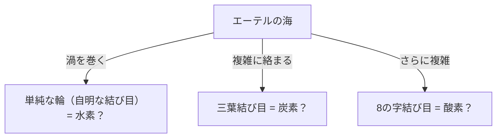
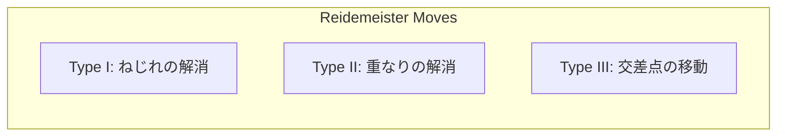

## 什麼是紐結理論？

日常生活中，每個人都有過綁鞋帶或耳機線糾纏在一起的經驗。然而，如果告訴你這與「最尖端的數學」有著深厚的關聯，你可能會感到驚訝。位於數學領域「拓樸學（Topology）」之中的「紐結理論（Knot Theory）」，正是嚴格研究這種「糾纏」性質的學問。

普通的紐結與數學上的紐結，最大的差異在於**兩端是相連的（即閉曲線）**。如果兩端沒有固定，任何紐結最終都能輕易解開。但是，當兩端相連形成一個環時，它的「糾纏方式」就被固定了，除非將其剪斷，否則無法改變成另一種糾纏方式。

將這種看似簡單的「封閉繩圈的糾纏」進行分類，並探問「某個紐結與另一個紐結是否相同？」、「這個紐結能解開嗎？」，這就是紐結理論的基本命題。

## 克耳文男爵的「渦旋原子假說」：來自物理學的浪漫起源

紐結理論之所以正式成為數學研究的對象，其背景源自 19 世紀物理學家威廉·湯姆森（William Thomson，後來的克耳文男爵）所提出的一個充滿魅力的假說。

1867 年，克耳文男爵提出了「渦旋原子假說（Vortex Atom Theory）」，認為「原子是在以太（當時被認為是充滿宇宙的介質）中形成的**渦旋紐結**」。
他注意到煙圈（渦環）能穩定保持形狀，即使相互碰撞也只會震動而不會破壞。他認為，如果各種元素的差異可以由這些渦旋的「紐結種類（糾纏方式的不同）」來解釋，那麼化學世界或許就能以純粹的幾何學來描述。

最終，邁克生-莫雷實驗（Michelson-Morley experiment）等結果否定了以太的存在，渦旋原子假說在物理學上被放棄了。然而，受到他假說啟發的彼得·泰特（Peter Guthrie Tait）等數學家們，展開了「將所有紐結分類並製作圖表」的宏大計畫。這成為了紐結理論作為數學領域的黎明。

## 萊德馬斯特操作：紐結的「變形」規則

紐結理論中最大的難題在於判定「兩個乍看之下不同的紐結，實際上是否相同（即在不剪斷繩子的情況下變形即可完全一致）」。
將位於三維空間的紐結投影（投射）並繪製在紙上（二維）的圖形，稱為「紐結投影圖」。

1926 年，庫爾特·萊德馬斯特（Kurt Reidemeister）證明了，無論多麼複雜的紐結變形，在投影圖上都只需透過**僅僅三種局部操作的組合**來表示。這被稱為「萊德馬斯特操作（Reidemeister Moves）」。

1. **第一種操作（Type I）**：增加或消除扭結的操作。（製造或消除繩子的迴圈）
2. **第二種操作（Type II）**：將兩根繩子重疊或分開的操作。
3. **第三種操作（Type III）**：一根繩子在一個交點上方滑動穿過的操作。

如果兩個紐結投影圖經過數次這三種操作後能變成相同的圖形，那麼它們就可以被稱為「相同的紐結（等價）」。反過來說，如果能證明「無論如何重複這三種操作都絕對無法一致」，就能確定它們是不同的紐結。

## 瓊斯多項式：震撼數學界的重大發現

長久以來，數學家們一直在尋找強有力的工具（紐結不變量）來證明「兩個紐結是不同的」。不變量是指，即使進行萊德馬斯特操作也絕對不會改變的數值或數學式。

1928 年發現了亞歷山大多項式（Alexander Polynomial），並長期作為標準工具被使用，但它有無法區分鏡中紐結（鏡像）等弱點。

1984 年，紐西蘭數學家沃恩·瓊斯（Vaughan Jones）從馮·諾伊曼代數這個完全不同領域的研究中，突然發現了新的紐結不變量。這就是「瓊斯多項式（Jones Polynomial）」。

瓊斯多項式 $V(K)$ 是利用紐結交點的「符號（正或負）」來遞迴計算（拆結關係式）出來的。

瓊斯多項式的發現，不僅在拓樸學，還在統計力學和量子場論等其他物理學領域之間搭起了一座深厚的橋樑。愛德華·威滕（Edward Witten）證明了瓊斯多項式可以在陳-西蒙斯理論（Chern-Simons theory）這個量子場論框架下自然推導出來，確立了數學與物理學的融合。瓊斯和威滕因這項成就，於 1990 年榮獲了費爾茲獎。

## 生命的奧秘與紐結：DNA 與拓樸異構酶

紐結理論並不僅限於純粹數學的世界。在理解我們細胞中 DNA 的行為時，紐結理論扮演著不可或缺的角色。

DNA 具有雙股螺旋結構，但在細胞分裂複製 DNA 時，必須解開這個螺旋。然而，極為細長的 DNA 鏈被擠在細胞核這個狹小的空間裡，在複製或轉錄的過程中會劇烈扭曲、糾纏，字面上地形成「紐結」。
如果對這些糾纏置之不理，DNA 就會斷裂，導致細胞死亡。

在這裡大顯身手的是一種被稱為「拓樸異構酶（Topoisomerase）」的特殊酵素。
令人驚訝的是，拓樸異構酶能像變魔術般執行<strong>「像剪刀一樣先剪斷 DNA 鏈，讓另一條鏈穿過這個空隙，然後再重新連接起來」</strong>的操作。

- **第一型拓樸異構酶**：只切斷雙股螺旋的其中一條鏈，讓另一條鏈穿過後重新結合。（改變 1 個環繞數）
- **第二型拓樸異構酶**：切斷雙股螺旋的兩條鏈，讓另一個雙股螺旋穿過後重新結合。（反轉交點的上下關係）

從數學的角度來看，這無非就是人為地反轉紐結交點的正負號的操作。數學家和生物學家攜手合作，利用紐結理論來解析拓樸異構酶是如何解開 DNA 紐結的。

## 未來的科技：任意子與拓樸量子計算

到了現代，紐結理論成為了實現次世代電腦——「量子電腦」的最重要主題之一。

普通的量子電腦對雜訊（熱或電磁波）非常敏感，有著容易發生計算錯誤的致命弱點。為了克服這個問題，誕生了「拓樸量子計算（Topological Quantum Computing）」的概念。

被限制在二維空間中的特殊粒子（或準粒子）「任意子（Anyon）」，當交換它們的位置時（像編織辮子一樣交纏），粒子的量子態（波函數）會發生變化。
如果沿著時間軸（第三維）描繪任意子的軌跡，就會畫出字面意義上的「辮群（Braid）」軌跡。

在拓樸量子計算中，正是利用這種「任意子辮群的紐結」作為量子閘（計算操作）。
紐結的特性是，即使稍微拉扯或搖晃繩子（加入雜訊），只要不剪斷繩子（只要拓樸結構不變），其種類就不會改變。也就是說，透過將資訊記錄在紐結結構本身之中，就能實現對環境雜訊極具抵抗力、「不發生錯誤的量子計算」。

## 結語：挑戰解不開的謎題

起源於克耳文男爵失敗原子模型的紐結理論，經歷了數個世紀的時間，不僅解明了 DNA 的生命活動，更成為了設計未來量子電腦的基礎。

乍看之下像是小孩遊戲般的「繩子糾纏」，竟然隱藏著解開宇宙真理與生命奧秘的鑰匙。這正是數學這門學問所擁有的最大魅力，也是紐結理論至今依然深深吸引著眾多科學家的原因。
