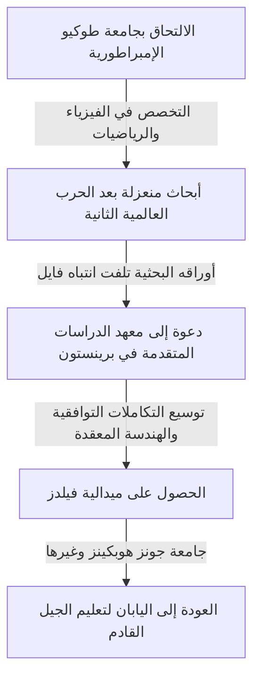

## 1. مقدمة

عالم الرياضيات الياباني العظيم **كونيهيكو كودايرا** (1915–1997) هو أول ياباني يفوز بميدالية فيلدز، وقد قدم مساهمات هائلة في الهندسة الجبرية ونظرية المتشعبات المعقدة في القرن العشرين. أثر عمله بعمق ليس فقط على الرياضيات الحديثة، بل أيضًا على الفيزياء النظرية مثل نظرية الأوتار. في هذا المقال، نستكشف حياة كودايرا وعالمه الرياضي المليء بالحدس.

## 2. مسار حياته

ولد كونيهيكو كودايرا في طوكيو عام 1915. استمتع بالعزف على البيانو منذ صغره، ويُقال إن حبه العميق للموسيقى أثر لاحقًا على تفكيره الرياضي. مقولته الشهيرة هي: "فهم الرياضيات يشبه الاستماع إلى الموسيقى والشعور بأنها جميلة".



في ظل نقص المواد والمعلومات خلال الحرب العالمية الثانية، درس كودايرا كتب هيرمان فايل وأجرى بحثًا مستقلاً حول نظرية التكاملات التوافقية.

## 3. أبرز الإنجازات الرياضية

كانت رياضيات كودايرا هندسية وبديهية إلى حد كبير.

### 3.1 توسيع التكاملات التوافقية

وسع كودايرا نظريات جورج دي رام و و. ف. د. هودج لتشمل المتشعبات غير المتراصة والحزم ذات المعاملات. أرسى هذا أساسًا للتعامل بدقة مع الكائنات الهندسية باستخدام طرق التحليل.

### 3.2 نظرية التضمين لكودايرا

من أشهر إنجازاته **نظرية التضمين لكودايرا** . توضح هذه النظرية أن أي متشعب كيلر متراص يلبي شرطًا تحليليًا معينًا (وجود مقياس هودج) يمكن بالضرورة تضمينه كتنوع جبري في فضاء إسقاطي معقد $\mathbb{P}^N$.

يتم التعبير عن جوهر النظرية بالمعادلة التالية. بالنسبة لحزمة خطية موجبة $L$، عندما تتطابق فئة تشيرن الأولى الخاصة بها $c_1(L)$ مع نموذج كيلر $[\omega]$،

$$ c_1(L) = [\omega] \in H^2(X, \mathbb{Z}) $$

يصبح هذا المتشعب $X$ إسقاطيًا. بعبارة أخرى، أصبح جسرًا قويًا يربط بين الهندسة التحليلية والهندسة الجبرية.

### 3.3 تصنيف الأسطح المعقدة وبُعد كودايرا

وسع كودايرا تصنيف المدرسة الإيطالية للأسطح الجبرية لتشمل الأسطح المعقدة المتراصة العامة. علاوة على ذلك، قدم ثابتًا يسمى **بُعد كودايرا** $\kappa(X)$، مما فتح الطريق لنظرية تصنيف التنوعات الجبرية ذات الأبعاد الأعلى.

$$ \kappa(X) = \begin{cases} \dim X & (\text{إذا كان من النوع العام}) \\ -\infty & (\text{خلاف ذلك}) \end{cases} $$

يوضح الكود الوهمي أدناه هذا المفهوم البسيط.

```python
# دالة لحساب بُعد المتشعب المعقد
def calculate_kodaira_dimension(is_general_type: bool, dim: int) -> int:
    """
    في حالة التنوع من النوع العام، يتطابق بُعد كودايرا مع بُعد المتشعب.
    """
    if is_general_type:
        return dim
    else:
        return -1 # عنصر نائب للنوع غير العام
```

### 3.4 نظرية كودايرا-سبنسر

إلى جانب دونالد سبنسر، أسس نظرية التشوه للهياكل المعقدة. كانت هذه نظرية رائدة تصف خصائص الشكل عندما يتغير هيكله باستمرار شيئًا فشيئًا.

## 4. كودايرا كمعلم و "الحس الرقمي"

بعد عودته إلى اليابان في عام 1967، قام بالتدريس في جامعة طوكيو ومؤسسات أخرى. جادل بأن البشر يمتلكون **"حسًا رقميًا"** لإدراك الرياضيات، يشبه إلى حد كبير حاسة البصر أو السمع، وأن فهم الإثبات الرياضي يعني "رؤية" بنية الكائن بوضوح من خلال هذا الحس.

## 5. خاتمة

تشبه الرياضيات التي تركها كونيهيكو كودايرا سيمفونية كبرى تتناغم فيها التحليلات والجبر والهندسة بشكل جميل. لا يزال نهجه البديهي ورؤاه العميقة تفتن العديد من علماء الرياضيات اليوم.
