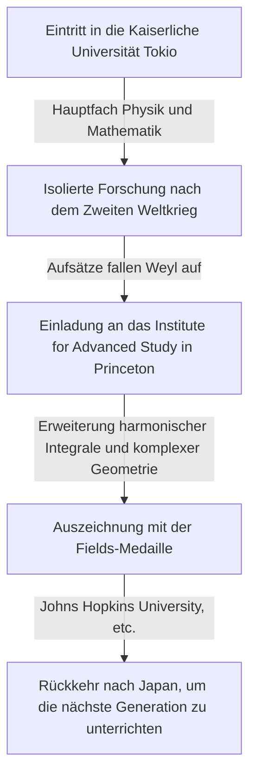

## 1. Einleitung

Der große japanische Mathematiker **[Kunihiko Kodaira](https://kenji.blog/p/kodaira-kunihiko/)** (1915–1997) war Japans erster Fields-Medaillen-Gewinner und leistete im 20. Jahrhundert immense Beiträge zur algebraischen Geometrie und zur Theorie komplexer Mannigfaltigkeiten. Sein Werk beeinflusste nicht nur die moderne Mathematik tiefgreifend, sondern auch die theoretische Physik, wie die Stringtheorie. In diesem Artikel erkunden wir das Leben von Kodaira und seine mathematisch intuitive Welt.

## 2. Lebenslauf

[Kunihiko Kodaira](https://kenji.blog/p/kodaira-kunihiko/) wurde 1915 in Tokio geboren. Er spielte schon in jungen Jahren gerne Klavier, und man sagt, dass seine tiefe Liebe zur Musik später sein mathematisches Denken beeinflusste. Sein Zitat "Mathematik zu verstehen ist wie Musik zu hören und zu spüren, dass sie schön ist" ist berühmt.



Inmitten des Mangels an Materialien und Informationen während des Zweiten Weltkriegs studierte Kodaira die Bücher von Hermann Weyl und führte unabhängige Forschungen zur Theorie harmonischer Integrale durch.

## 3. Wichtigste mathematische Errungenschaften

Kodairas Mathematik war extrem geometrisch und intuitiv.

### 3.1 Erweiterung harmonischer Integrale

Kodaira erweiterte die Theorien von Georges de Rham und W. V. D. Hodge auf nicht-kompakte Mannigfaltigkeiten und Garben mit Koeffizienten. Dies bildete eine Grundlage für den strengen Umgang mit geometrischen Objekten mithilfe von Methoden der Analysis.

### 3.2 Kodaira-Einbettungssatz

Eine seiner berühmtesten Errungenschaften ist der **Kodaira-Einbettungssatz** . Er zeigt, dass jede kompakte Kähler-Mannigfaltigkeit, die eine bestimmte analytische Bedingung erfüllt (die Existenz einer Hodge-Metrik), notwendigerweise als algebraische Varietät in einen komplexen projektiven Raum $\mathbb{P}^N$ eingebettet werden kann.

Der Kern des Satzes wird durch die folgende Gleichung ausgedrückt. Für ein positives Geradenbündel $L$, wenn seine erste Chern-Klasse $c_1(L)$ mit der Kähler-Form $[\omega]$ übereinstimmt,

$$ c_1(L) = [\omega] \in H^2(X, \mathbb{Z}) $$

Diese Mannigfaltigkeit $X$ wird projektiv. Mit anderen Worten, es wurde zu einer mächtigen Brücke, die die analytische Geometrie und die algebraische Geometrie verbindet.

### 3.3 Klassifikation komplexer Flächen und Kodaira-Dimension

Kodaira erweiterte die Klassifikation algebraischer Flächen der italienischen Schule auf allgemeine kompakte komplexe Flächen. Darüber hinaus führte er eine Invariante namens **Kodaira-Dimension** $\kappa(X)$ ein und ebnete damit den Weg zur Klassifikationstheorie höherdimensionaler algebraischer Varietäten.

$$ \kappa(X) = \begin{cases} \dim X & (\text{wenn von allgemeinem Typ}) \\ -\infty & (\text{sonst}) \end{cases} $$

Der Pseudocode, der dieses einfache Konzept demonstriert, ist unten dargestellt.

```python
# Funktion zur Berechnung der Dimension einer komplexen Mannigfaltigkeit
def calculate_kodaira_dimension(is_general_type: bool, dim: int) -> int:
    """
    Im Falle einer Varietät vom allgemeinen Typ entspricht die Kodaira-Dimension der Dimension der Mannigfaltigkeit.
    """
    if is_general_type:
        return dim
    else:
        return -1 # Platzhalter für nicht-allgemeinen Typ
```

### 3.4 Kodaira-Spencer-Theorie

Zusammen mit Donald Spencer begründete er die Deformationstheorie komplexer Strukturen. Dies war eine bahnbrechende Theorie, die die Eigenschaften einer Form beschreibt, wenn ihre Struktur kontinuierlich Stück für Stück verändert wird.

## 4. Kodaira als Pädagoge und "Zahlensinn"

Nach seiner Rückkehr nach Japan im Jahr 1967 lehrte er an der Universität Tokio und anderen Institutionen. Er argumentierte, dass der Mensch über einen **"Zahlensinn"** verfüge, um Mathematik wahrzunehmen, ähnlich wie das Sehen oder Hören, und dass das Verstehen eines mathematischen Beweises bedeute, die Struktur des Objekts durch diesen Sinn lebendig zu "sehen".

## 5. Fazit

Die von [Kunihiko Kodaira](https://kenji.blog/p/kodaira-kunihiko/) hinterlassene Mathematik gleicht einer großen Symphonie, in der Analysis, Algebra und Geometrie wunderbar harmonieren. Sein intuitiver Ansatz und seine tiefen Einsichten faszinieren auch heute noch viele Mathematiker.
