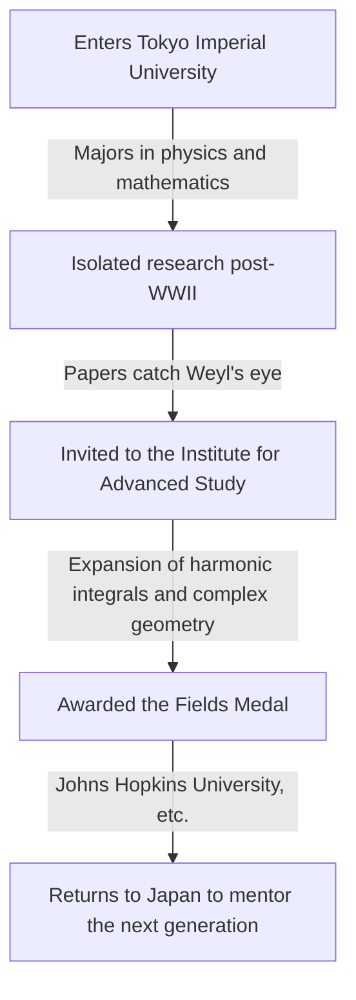

## 1. Introduction

The great Japanese mathematician **[Kunihiko Kodaira](https://kenji.blog/en/p/kodaira-kunihiko/)** (1915–1997) was Japan's first Fields Medalist and made immense contributions to algebraic geometry and the theory of complex manifolds in the 20th century. His work profoundly influenced not only modern mathematics but also theoretical physics, such as string theory. In this article, we explore Kodaira's life and his mathematically intuitive world.

## 2. Life Trajectory

[Kunihiko Kodaira](https://kenji.blog/en/p/kodaira-kunihiko/) was born in Tokyo in 1915. He enjoyed playing the piano from a young age, and it is said that his deep love for music later influenced his mathematical thinking. His quote, "Understanding mathematics is like listening to music and feeling it is beautiful," is famous.



Amidst the shortages of materials and information during World War II, Kodaira studied Hermann Weyl's books and pursued independent research on the theory of harmonic integrals.

## 3. Major Mathematical Achievements

Kodaira's mathematics was extremely geometric and intuitive.

### 3.1 Expansion of Harmonic Integrals

Kodaira extended the theories of Georges de Rham and W. V. D. Hodge to non-compact manifolds and sheaves with coefficients. This established a foundation for rigorously handling geometric objects using methods of analysis.

### 3.2 Kodaira Embedding Theorem

One of his most famous achievements is the **Kodaira Embedding Theorem**. It demonstrates that any compact Kähler manifold satisfying a certain analytical condition (the existence of a Hodge metric) can necessarily be embedded as an algebraic variety into a complex projective space $\mathbb{P}^N$.

The core of the theorem is expressed by the following equation. For a positive line bundle $L$, when its first Chern class $c_1(L)$ matches the Kähler form $[\omega]$,

$$ c_1(L) = [\omega] \in H^2(X, \mathbb{Z}) $$

This manifold $X$ becomes projective. In other words, it became a powerful bridge connecting analytic geometry and algebraic geometry.

### 3.3 Classification of Complex Surfaces and Kodaira Dimension

Kodaira extended the Italian school's classification of algebraic surfaces to general compact complex surfaces. Furthermore, he introduced an invariant called the **Kodaira dimension** $\kappa(X)$, opening the path to the classification theory of higher-dimensional algebraic varieties.

$$ \kappa(X) = \begin{cases} \dim X & (\text{if general type}) \\ -\infty & (\text{otherwise}) \end{cases} $$

The pseudocode demonstrating this simple concept is shown below.

```python
# Function to calculate the dimension of a complex manifold
def calculate_kodaira_dimension(is_general_type: bool, dim: int) -> int:
    """
    In the case of a variety of general type, the Kodaira dimension matches the manifold's dimension.
    """
    if is_general_type:
        return dim
    else:
        return -1 # Placeholder for non-general type
```

### 3.4 Kodaira-Spencer Theory

Along with Donald Spencer, he founded the deformation theory of complex structures. This was a groundbreaking theory describing the properties of a shape when its structure is continuously altered bit by bit.

## 4. Kodaira as an Educator and "Number Sense"

After returning to Japan in 1967, he taught at the University of Tokyo and other institutions. He argued that humans possess a **"number sense"** to perceive mathematics, much like sight or hearing, and that understanding a mathematical proof means vividly "seeing" the structure of the object through this sense.

## 5. Conclusion

The mathematics left by [Kunihiko Kodaira](https://kenji.blog/en/p/kodaira-kunihiko/) is like a grand symphony where analysis, algebra, and geometry are beautifully harmonized. His intuitive approach and deep insights continue to fascinate many mathematicians today.
