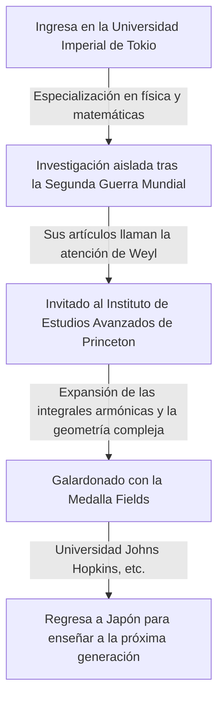

## 1. Introducción

El gran matemático japonés **[Kunihiko Kodaira](https://kenji.blog/p/kodaira-kunihiko/)** (1915–1997) fue el primer medallista Fields de Japón y realizó inmensas contribuciones a la geometría algebraica y a la teoría de variedades complejas en el siglo XX. Su trabajo ha influido profundamente no solo en las matemáticas modernas, sino también en la física teórica, como la teoría de cuerdas. En este artículo, exploramos la vida de Kodaira y su mundo matemático lleno de intuición.

## 2. Trayectoria vital

[Kunihiko Kodaira](https://kenji.blog/p/kodaira-kunihiko/) nació en Tokio en 1915. Disfrutaba tocando el piano desde muy joven, y se dice que su profundo amor por la música influyó posteriormente en su pensamiento matemático. Es famosa su frase: "Entender las matemáticas es como escuchar música y sentir que es hermosa".



En medio de la escasez de materiales e información durante la Segunda Guerra Mundial, Kodaira estudió los libros de Hermann Weyl y llevó a cabo investigaciones independientes sobre la teoría de las integrales armónicas.

## 3. Principales logros matemáticos

Las matemáticas de Kodaira eran extremadamente geométricas e intuitivas.

### 3.1 Expansión de las integrales armónicas

Kodaira extendió las teorías de Georges de Rham y W. V. D. Hodge a variedades no compactas y haces con coeficientes. Esto sentó las bases para el tratamiento riguroso de objetos geométricos mediante métodos de análisis.

### 3.2 Teorema de inmersión de Kodaira

Uno de sus logros más famosos es el **Teorema de inmersión de Kodaira** . Éste demuestra que cualquier variedad de Kähler compacta que cumpla cierta condición analítica (la existencia de una métrica de Hodge) puede ser sumergida como variedad algebraica en un espacio proyectivo complejo $\mathbb{P}^N$.

El núcleo del teorema se expresa mediante la siguiente ecuación. Para un fibrado en líneas positivo $L$, cuando su primera clase de Chern $c_1(L)$ coincide con la forma de Kähler $[\omega]$,

$$ c_1(L) = [\omega] \in H^2(X, \mathbb{Z}) $$

Esta variedad $X$ se vuelve proyectiva. En otras palabras, se convirtió en un poderoso puente que conecta la geometría analítica y la geometría algebraica.

### 3.3 Clasificación de superficies complejas y dimensión de Kodaira

Kodaira extendió la clasificación de superficies algebraicas de la escuela italiana a superficies complejas compactas generales. Además, introdujo un invariante llamado **dimensión de Kodaira** $\kappa(X)$, abriendo el camino a la teoría de clasificación de variedades algebraicas de dimensiones superiores.

$$ \kappa(X) = \begin{cases} \dim X & (\text{si es de tipo general}) \\ -\infty & (\text{en otro caso}) \end{cases} $$

A continuación se muestra el pseudocódigo que demuestra este concepto simple.

```python
# Función para calcular la dimensión de una variedad compleja
def calculate_kodaira_dimension(is_general_type: bool, dim: int) -> int:
    """
    En el caso de una variedad de tipo general, la dimensión de Kodaira coincide con la dimensión de la variedad.
    """
    if is_general_type:
        return dim
    else:
        return -1 # Marcador de posición para tipo no general
```

### 3.4 Teoría de Kodaira-Spencer

Junto con Donald Spencer, fundó la teoría de deformación de estructuras complejas. Ésta fue una teoría innovadora que describe las propiedades de una forma cuando su estructura se altera continuamente poco a poco.

## 4. Kodaira como educador y el "Sentido del número"

Tras regresar a Japón en 1967, fue profesor en la Universidad de Tokio y otras instituciones. Argumentaba que los humanos poseen un **"sentido del número"** para percibir las matemáticas, al igual que la vista o el oído, y que entender una demostración matemática significa "ver" vívidamente la estructura del objeto a través de este sentido.

## 5. Conclusión

Las matemáticas que nos dejó [Kunihiko Kodaira](https://kenji.blog/p/kodaira-kunihiko/) son como una gran sinfonía en la que el análisis, el álgebra y la geometría armonizan maravillosamente. Su enfoque intuitivo y sus profundos conocimientos siguen fascinando a muchos matemáticos en la actualidad.
