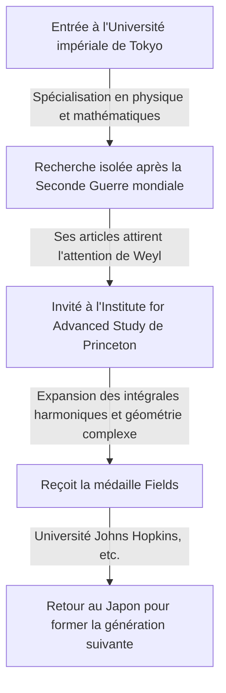

## 1. Introduction

Le grand mathématicien japonais **[Kunihiko Kodaira](https://kenji.blog/fr/p/kodaira-kunihiko/)** (1915-1997) a été le premier médaillé Fields du Japon et a apporté d'immenses contributions à la géométrie algébrique et à la théorie des variétés complexes au XXe siècle. Ses travaux ont profondément influencé non seulement les mathématiques modernes, mais aussi la physique théorique, comme la théorie des cordes. Dans cet article, nous explorons la vie de Kodaira et son monde mathématique rempli d'intuition.

## 2. Trajectoire de vie

[Kunihiko Kodaira](https://kenji.blog/fr/p/kodaira-kunihiko/) est né à Tokyo en 1915. Il aimait jouer du piano dès son plus jeune âge, et l'on dit que son amour profond pour la musique a plus tard influencé sa pensée mathématique. Sa citation est célèbre : "Comprendre les mathématiques, c'est comme écouter de la musique et la trouver belle."



Pendant la Seconde Guerre mondiale, face à la pénurie de matériel et d'informations, Kodaira a étudié les livres de Hermann Weyl et mené des recherches indépendantes sur la théorie des intégrales harmoniques.

## 3. Principales réalisations mathématiques

Les mathématiques de Kodaira étaient extrêmement géométriques et intuitives.

### 3.1 Expansion des intégrales harmoniques

Kodaira a étendu les théories de Georges de Rham et W. V. D. Hodge aux variétés non compactes et aux faisceaux avec coefficients. Cela a établi une base pour traiter rigoureusement des objets géométriques à l'aide de méthodes d'analyse.

### 3.2 Théorème de plongement de Kodaira

L'une de ses réalisations les plus célèbres est le **théorème de plongement de Kodaira** . Il démontre que toute variété kählérienne compacte satisfaisant une certaine condition analytique (l'existence d'une métrique de Hodge) peut être plongée de manière analytique comme variété algébrique dans un espace projectif complexe $\mathbb{P}^N$.

Le cœur du théorème est exprimé par l'équation suivante. Pour un fibré en droites positif $L$, lorsque sa première classe de Chern $c_1(L)$ correspond à la forme de Kähler $[\omega]$,

$$ c_1(L) = [\omega] \in H^2(X, \mathbb{Z}) $$

Cette variété $X$ devient projective. En d'autres termes, cela est devenu un pont puissant reliant la géométrie analytique et la géométrie algébrique.

### 3.3 Classification des surfaces complexes et dimension de Kodaira

Kodaira a étendu la classification des surfaces algébriques de l'école italienne aux surfaces complexes compactes générales. De plus, il a introduit un invariant appelé **dimension de Kodaira** $\kappa(X)$, ouvrant la voie à la théorie de classification des variétés algébriques de dimension supérieure.

$$ \kappa(X) = \begin{cases} \dim X & (\text{si de type général}) \\ -\infty & (\text{sinon}) \end{cases} $$

Le pseudocode illustrant ce concept simple est présenté ci-dessous.

```python
# Fonction pour calculer la dimension d'une variété complexe
def calculate_kodaira_dimension(is_general_type: bool, dim: int) -> int:
    """
    Dans le cas d'une variété de type général, la dimension de Kodaira correspond à la dimension de la variété.
    """
    if is_general_type:
        return dim
    else:
        return -1 # Espace réservé pour le type non général
```

### 3.4 Théorie de Kodaira-Spencer

Avec Donald Spencer, il a fondé la théorie de la déformation des structures complexes. Il s'agissait d'une théorie révolutionnaire décrivant les propriétés d'une forme lorsque sa structure est continuellement altérée petit à petit.

## 4. Kodaira en tant qu'éducateur et le "Sens des nombres"

Après son retour au Japon en 1967, il a enseigné à l'Université de Tokyo et dans d'autres institutions. Il soutenait que les humains possèdent un **"sens des nombres"** pour percevoir les mathématiques, tout comme la vue ou l'ouïe, et que comprendre une preuve mathématique signifie "voir" de manière vivante la structure de l'objet à travers ce sens.

## 5. Conclusion

Les mathématiques laissées par [Kunihiko Kodaira](https://kenji.blog/fr/p/kodaira-kunihiko/) sont comme une grande symphonie où l'analyse, l'algèbre et la géométrie s'harmonisent magnifiquement. Son approche intuitive et sa profonde perspicacité continuent de fasciner de nombreux mathématiciens aujourd'hui.
