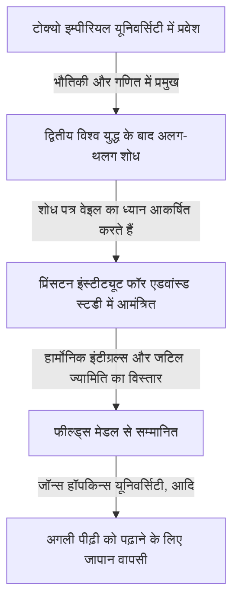

## 1. परिचय

महान जापानी गणितज्ञ **कुनिहिको कोडैरा** (1915-1997) जापान के पहले फील्ड्स मेडलिस्ट थे और उन्होंने 20वीं सदी में बीजगणितीय ज्यामिति और जटिल मैनिफोल्ड्स के सिद्धांत में असीम योगदान दिया। उनके काम ने न केवल आधुनिक गणित को बल्कि सैद्धांतिक भौतिकी, जैसे स्ट्रिंग थ्योरी को भी गहराई से प्रभावित किया। इस लेख में, हम कोडैरा के जीवन और उनकी गणितीय रूप से सहज दुनिया का पता लगाते हैं।

## 2. जीवन प्रक्षेपवक्र

कुनिहिको कोडैरा का जन्म 1915 में टोक्यो में हुआ था। उन्हें कम उम्र से ही पियानो बजाना पसंद था, और ऐसा कहा जाता है कि संगीत के प्रति उनके गहरे प्रेम ने बाद में उनकी गणितीय सोच को प्रभावित किया। उनका यह कथन बहुत प्रसिद्ध है, "गणित को समझना संगीत सुनने और यह महसूस करने जैसा है कि यह सुंदर है।"



द्वितीय विश्व युद्ध के दौरान सामग्री और जानकारी की कमी के बीच, कोडैरा ने हरमन वेइल की पुस्तकों का अध्ययन किया और हार्मोनिक इंटीग्रल्स के सिद्धांत पर स्वतंत्र शोध किया।

## 3. प्रमुख गणितीय उपलब्धियां

कोडैरा का गणित अत्यधिक ज्यामितीय और सहज था।

### 3.1 हार्मोनिक इंटीग्रल्स का विस्तार

कोडैरा ने जॉर्जेस डी राम और डब्ल्यू. वी. डी. हॉज के सिद्धांतों को गैर-कॉम्पैक्ट मैनिफोल्ड्स और गुणांकों के साथ शीव्स तक विस्तारित किया। इसने विश्लेषण के तरीकों का उपयोग करके ज्यामितीय वस्तुओं को कठोरता से संभालने की नींव स्थापित की।

### 3.2 कोडैरा एंबेडिंग प्रमेय

उनकी सबसे प्रसिद्ध उपलब्धियों में से एक **कोडैरा एंबेडिंग प्रमेय** है। यह प्रदर्शित करता है कि कोई भी कॉम्पैक्ट काहलर मैनिफोल्ड जो एक निश्चित विश्लेषणात्मक स्थिति (हॉज मीट्रिक का अस्तित्व) को पूरा करता है, उसे अनिवार्य रूप से एक जटिल प्रोजेक्टिव स्पेस $\mathbb{P}^N$ में एक बीजगणितीय विविधता के रूप में एम्बेड किया जा सकता है।

प्रमेय का मूल निम्नलिखित समीकरण द्वारा व्यक्त किया गया है। एक सकारात्मक लाइन बंडल $L$ के लिए, जब इसका पहला चेर्न क्लास $c_1(L)$ काहलर फॉर्म $[\omega]$ से मेल खाता है,

$$ c_1(L) = [\omega] \in H^2(X, \mathbb{Z}) $$

यह मैनिफोल्ड $X$ प्रोजेक्टिव बन जाता है। दूसरे शब्दों में, यह विश्लेषणात्मक ज्यामिति और बीजगणितीय ज्यामिति को जोड़ने वाला एक शक्तिशाली सेतु बन गया।

### 3.3 जटिल सतहों का वर्गीकरण और कोडैरा आयाम

कोडैरा ने इतालवी स्कूल के बीजगणितीय सतहों के वर्गीकरण को सामान्य कॉम्पैक्ट जटिल सतहों तक विस्तारित किया। इसके अलावा, उन्होंने **कोडैरा आयाम** $\kappa(X)$ नामक एक अपरिवर्तनीय पेश किया, जिससे उच्च-आयामी बीजगणितीय किस्मों के वर्गीकरण सिद्धांत का मार्ग प्रशस्त हुआ।

$$ \kappa(X) = \begin{cases} \dim X & (\text{यदि सामान्य प्रकार है}) \\ -\infty & (\text{अन्यथा}) \end{cases} $$

इस सरल अवधारणा को प्रदर्शित करने वाला छद्म कोड नीचे दिखाया गया है।

```python
# एक जटिल मैनिफोल्ड के आयाम की गणना करने का कार्य
def calculate_kodaira_dimension(is_general_type: bool, dim: int) -> int:
    """
    सामान्य प्रकार की विविधता के मामले में, कोडैरा आयाम मैनिफोल्ड के आयाम से मेल खाता है।
    """
    if is_general_type:
        return dim
    else:
        return -1 # गैर-सामान्य प्रकार के लिए प्लेसहोल्डर
```

### 3.4 कोडैरा-स्पेंसर सिद्धांत

डोनाल्ड स्पेंसर के साथ, उन्होंने जटिल संरचनाओं के विरूपण सिद्धांत की स्थापना की। यह एक अभूतपूर्व सिद्धांत था जो किसी आकार के गुणों का वर्णन करता है जब इसकी संरचना लगातार थोड़ी-थोड़ी बदलती है।

## 4. एक शिक्षक के रूप में कोडैरा और "नंबर सेंस"

1967 में जापान लौटने के बाद, उन्होंने टोक्यो विश्वविद्यालय और अन्य संस्थानों में पढ़ाया। उनका तर्क था कि मनुष्यों के पास गणित को समझने के लिए दृष्टि या श्रवण की तरह ही एक **"नंबर सेंस"** (संख्या बोध) होता है, और एक गणितीय प्रमाण को समझने का अर्थ है इस इंद्रिय के माध्यम से वस्तु की संरचना को स्पष्ट रूप से "देखना"।

## 5. निष्कर्ष

कुनिहिको कोडैरा द्वारा छोड़ा गया गणित एक भव्य सिम्फनी की तरह है जहाँ विश्लेषण, बीजगणित और ज्यामिति का खूबसूरती से सामंजस्य है। उनका सहज दृष्टिकोण और गहरी अंतर्दृष्टि आज भी कई गणितज्ञों को आकर्षित करती है।
