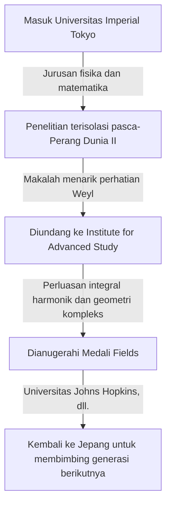

## 1. Pengantar

Matematikawan besar Jepang **Kunihiko Kodaira** (1915–1997) adalah peraih Medali Fields pertama dari Jepang dan memberikan kontribusi luar biasa pada geometri aljabar dan teori manifold kompleks pada abad ke-20. Karyanya sangat memengaruhi tidak hanya matematika modern tetapi juga fisika teoritis, seperti teori string. Dalam artikel ini, kita menjelajahi kehidupan Kodaira dan dunia matematikanya yang intuitif.

## 2. Perjalanan Hidup

Kunihiko Kodaira lahir di Tokyo pada tahun 1915. Dia menikmati bermain piano sejak usia muda, dan dikatakan bahwa kecintaannya yang mendalam pada musik kemudian memengaruhi pemikiran matematikanya. Kutipannya, "Memahami matematika itu seperti mendengarkan musik dan merasa itu indah," sangat terkenal.



Di tengah kekurangan bahan dan informasi selama Perang Dunia II, Kodaira mempelajari buku-buku Hermann Weyl dan melakukan penelitian independen tentang teori integral harmonik.

## 3. Pencapaian Matematika Utama

Matematika Kodaira sangat geometris dan intuitif.

### 3.1 Perluasan Integral Harmonik

Kodaira memperluas teori Georges de Rham dan W. V. D. Hodge ke manifold non-kompak dan berkas (sheaves) dengan koefisien. Hal ini menetapkan dasar untuk menangani objek geometris secara ketat menggunakan metode analisis.

### 3.2 Teorema Penyisipan Kodaira (Kodaira Embedding Theorem)

Salah satu pencapaiannya yang paling terkenal adalah **Teorema Penyisipan Kodaira** . Teorema ini menunjukkan bahwa setiap manifold Kähler kompak yang memenuhi kondisi analitis tertentu (keberadaan metrik Hodge) selalu dapat disisipkan sebagai varietas aljabar ke dalam ruang proyektif kompleks $\mathbb{P}^N$.

Inti dari teorema tersebut diekspresikan oleh persamaan berikut. Untuk bundel garis positif $L$, ketika kelas Chern pertamanya $c_1(L)$ cocok dengan bentuk Kähler $[\omega]$,

$$ c_1(L) = [\omega] \in H^2(X, \mathbb{Z}) $$

Manifold $X$ ini menjadi proyektif. Dengan kata lain, ini menjadi jembatan kuat yang menghubungkan geometri analitik dan geometri aljabar.

### 3.3 Klasifikasi Permukaan Kompleks dan Dimensi Kodaira

Kodaira memperluas klasifikasi permukaan aljabar mazhab Italia ke permukaan kompleks kompak umum. Selanjutnya, ia memperkenalkan sebuah invarian yang disebut **dimensi Kodaira** $\kappa(X)$, membuka jalan menuju teori klasifikasi varietas aljabar berdimensi tinggi.

$$ \kappa(X) = \begin{cases} \dim X & (\text{jika tipe umum}) \\ -\infty & (\text{jika tidak}) \end{cases} $$

Kode semu yang mendemonstrasikan konsep sederhana ini ditunjukkan di bawah ini.

```python
# Fungsi untuk menghitung dimensi manifold kompleks
def calculate_kodaira_dimension(is_general_type: bool, dim: int) -> int:
    """
    Dalam kasus varietas tipe umum, dimensi Kodaira cocok dengan dimensi manifold.
    """
    if is_general_type:
        return dim
    else:
        return -1 # Placeholder untuk tipe non-umum
```

### 3.4 Teori Kodaira-Spencer

Bersama dengan Donald Spencer, ia mendirikan teori deformasi struktur kompleks. Ini adalah teori perintis yang menggambarkan sifat-sifat suatu bentuk ketika strukturnya terus diubah sedikit demi sedikit.

## 4. Kodaira sebagai Pendidik dan "Kepekaan Angka"

Setelah kembali ke Jepang pada tahun 1967, ia mengajar di Universitas Tokyo dan institusi lainnya. Ia berargumen bahwa manusia memiliki **"kepekaan angka"** (number sense) untuk memahami matematika, sama seperti penglihatan atau pendengaran, dan bahwa memahami pembuktian matematika berarti secara jelas "melihat" struktur objek tersebut melalui indra ini.

## 5. Kesimpulan

Matematika yang ditinggalkan oleh Kunihiko Kodaira ibarat sebuah simfoni agung di mana analisis, aljabar, dan geometri diharmonisasikan dengan indah. Pendekatan intuitif dan wawasan mendalamnya terus memesona banyak matematikawan hingga hari ini.
