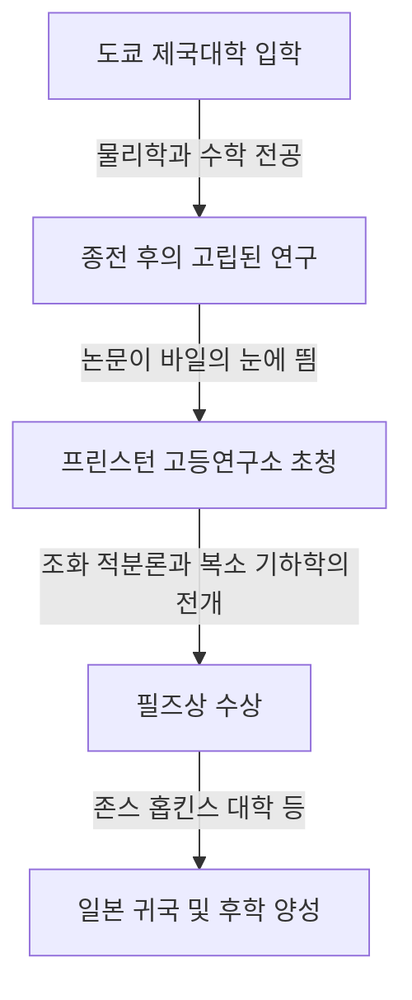

## 1. 서론

일본의 위대한 수학자 **[고다이라 구니히코](https://kenji.blog/ko/p/kodaira-kunihiko/)** ([Kunihiko Kodaira](https://kenji.blog/ko/p/kodaira-kunihiko/), 1915–1997) 는 일본 최초의 필즈상 수상자이며, 20세기 대수 기하학과 복소 다양체론에 큰 공헌을 했습니다. 그의 업적은 현대 수학뿐만 아니라 이론 물리학의 초끈 이론 등에도 깊은 영향을 미치고 있습니다. 본 기사에서는 고다이라의 생애와 직관이 넘치는 그의 수학 세계를 탐구합니다.

## 2. 생애의 궤적

[고다이라 구니히코](https://kenji.blog/ko/p/kodaira-kunihiko/)는 1915년 도쿄에서 태어났습니다. 어릴 때부터 피아노를 즐겨 쳤으며, 음악에 대한 깊은 애정은 이후의 수학적 사고에도 영향을 미쳤다고 알려져 있습니다. "수학을 이해한다는 것은 음악을 듣고 아름답다고 느끼는 것과 같다"는 그의 말은 매우 유명합니다.



제2차 세계 대전 중 물자와 정보가 부족한 상황에서도 고다라는 헤르만 바일의 저서를 읽고 조화 적분론에 대한 독자적인 연구를 진행했습니다.

## 3. 주요 수학적 업적

고다이라의 수학은 극히 기하학적이고 직관적이었습니다.

### 3.1 조화 적분론의 확장

고다이라는 조르주 드람(Georges de Rham)과 윌리엄 호지(W. V. D. Hodge)의 이론을 비콤팩트 다양체와 계수를 가지는 층으로 확장했습니다. 이를 통해 기하학적 대상을 해석학의 방법으로 엄밀하게 다루는 기초가 마련되었습니다.

### 3.2 고다이라 매장 정리 (Kodaira Embedding Theorem)

그의 가장 유명한 업적 중 하나는 **고다이라 매장 정리** 입니다. 이는 특정 해석적 조건(호지 계량의 존재)을 만족하는 콤팩트 켈러 다양체가 반드시 복소 사영 공간 $\mathbb{P}^N$ 에 대수 다양체로서 매장될 수 있음을 보여주는 것입니다.

정리의 핵심은 다음 수식으로 표현됩니다. 양의 선다발 $L$ 에 대해, 그 첫 번째 천 류 $c_1(L)$ 이 켈러 형식 $[\omega]$ 와 일치할 때,

$$ c_1(L) = [\omega] \in H^2(X, \mathbb{Z}) $$

이 다양체 $X$ 는 사영적이 됩니다. 즉, 해석 기하학과 대수 기하학을 연결하는 강력한 다리가 된 것입니다.

### 3.3 복소 곡면의 분류와 고다이라 차원

고다이라는 이탈리아 학파에 의한 대수 곡면의 분류를 일반적인 콤팩트 복소 곡면으로 확장했습니다. 나아가 **고다이라 차원** $\kappa(X)$ 라는 불변량을 도입하여 고차원 대수 다양체의 분류 이론으로 향하는 길을 열었습니다.

$$ \kappa(X) = \begin{cases} \dim X & (\text{일반형인 경우}) \\ -\infty & (\text{그 외}) \end{cases} $$

간단한 개념을 보여주는 의사 코드는 다음과 같습니다.

```python
# 복소 다양체의 차원을 계산하는 함수
def calculate_kodaira_dimension(is_general_type: bool, dim: int) -> int:
    """
    일반형의 다양체인 경우, 고다이라 차원은 다양체의 차원과 일치합니다.
    """
    if is_general_type:
        return dim
    else:
        return -1 # 일반형이 아닌 경우의 자리 표시자
```

### 3.4 고다이라-스펜서 이론

도널드 스펜서(Donald Spencer)와 함께 복소 구조의 변형 이론을 창시했습니다. 이는 도형의 구조를 연속적으로 조금씩 변화시켰을 때 어떤 성질이 유지되고 무엇이 변하는지를 기술하는 획기적인 이론이었습니다.

## 4. 교육자로서의 고다이라와 "수각"

1967년 일본으로 귀국한 후 도쿄 대학 등에서 교편을 잡았습니다. 그는 인간에게는 시각이나 청각처럼 수학을 감지하는 **"수각"** (number sense) 이 갖추어져 있으며, 수학의 증명을 이해한다는 것은 이 수각을 통해 대상의 구조를 생생하게 "보는" 것이라고 주장했습니다.

## 5. 결론

[고다이라 구니히코](https://kenji.blog/ko/p/kodaira-kunihiko/)가 남긴 수학은 해석학, 대수학, 기하학이 아름답게 조화를 이룬 웅장한 교향곡과 같습니다. 그의 직관적인 접근과 깊은 통찰은 오늘날까지도 많은 수학자들을 매료시키고 있습니다.
