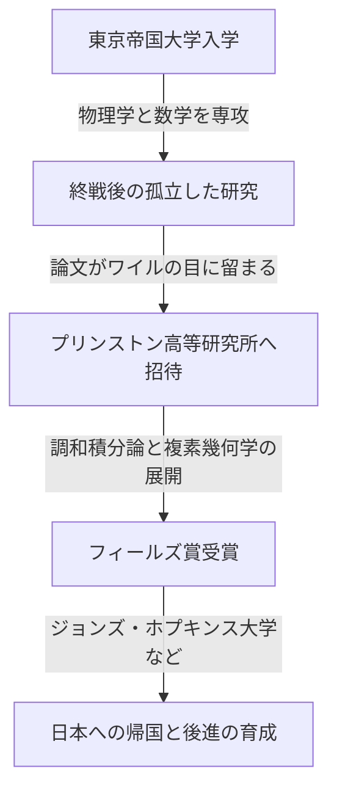

## 1. はじめに

日本の偉大な数学者である **[小平邦彦](https://kenji.blog/p/kodaira-kunihiko/)** ([Kunihiko Kodaira](https://kenji.blog/p/kodaira-kunihiko/), 1915–1997) は、日本初のフィールズ賞受賞者であり、20世紀の代数幾何学および複素多様体論に多大な貢献をしました。彼の業績は、現代の数学だけでなく、理論物理学における超弦理論などにも深い影響を与えています。本記事では、小平の生涯と、その直感に満ちた数学の世界を探求します。

## 2. 生涯の軌跡

[小平邦彦](https://kenji.blog/p/kodaira-kunihiko/)は1915年に東京で生まれました。幼少期からピアノに親しみ、音楽への深い愛情は後の数学的思考にも影響を与えたと言われています。「数学を理解するとは、音楽を聴いて美しいと感じることに似ている」という彼の言葉は有名です。



第二次世界大戦中の物資も情報も不足する中で、小平はヘルマン・ワイルの著書を読み込み、調和積分論の独自の研究を進めました。

## 3. 主要な数学的業績

小平の数学は、極めて幾何学的・直感的なものでした。

### 3.1 調和積分論の拡張

小平は、ジョルジュ・ド・ラームとウィリアム・ホッジの理論を、非コンパクトな多様体や係数をもつ層へと拡張しました。これにより、幾何学的な対象を解析学の手法で厳密に扱う基礎が築かれました。

### 3.2 小平埋め込み定理 (Kodaira Embedding Theorem)

彼の最も有名な業績の一つが、 **小平埋め込み定理** です。これは、ある解析的な条件（ホッジ計量の存在）を満たすコンパクト・ケーラー多様体が、必ず複素射影空間 $\mathbb{P}^N$ に代数多様体として埋め込めることを示すものです。

定理の核心は以下の式で表されます。正の直線束 $L$ に対して、その第一チャーン類 $c_1(L)$ がケーラー形式 $[\omega]$ と一致するとき、

$$ c_1(L) = [\omega] \in H^2(X, \mathbb{Z}) $$

この多様体 $X$ は射影的となります。つまり、解析幾何学と代数幾何学を繋ぐ強力な架け橋となったのです。

### 3.3 複素曲面の分類と小平次元

小平は、イタリア学派による代数曲面の分類を、一般のコンパクト複素曲面へと拡張しました。さらに、 **小平次元** $\kappa(X)$ という不変量を導入し、高次元の代数多様体の分類理論への道を開きました。

$$ \kappa(X) = \begin{cases} \dim X & (\text{一般型の場合}) \\ -\infty & (\text{それ以外}) \end{cases} $$

簡単な概念を示す擬似コードを以下に示します。

```python
# 複素多様体の次元を計算する関数
def calculate_kodaira_dimension(is_general_type: bool, dim: int) -> int:
    """
    一般型の多様体の場合、小平次元は多様体の次元と一致します。
    """
    if is_general_type:
        return dim
    else:
        return -1 # 一般型でない場合のプレースホルダー
```

### 3.4 小平・スペンサー理論

ドナルド・スペンサーとともに、複素構造の変形理論を創始しました。これは、図形の構造を連続的に少しずつ変化させたときの性質を記述する画期的な理論でした。

## 4. 教育者としての小平と「数覚」

1967年に日本に帰国した後、東京大学などで教鞭をとりました。彼は、人間には視覚や聴覚のように数学を感知する **「数覚」** が備わっており、数学の証明を理解するとは、この数覚を通して対象の構造をありありと「見る」ことであると主張しました。

## 5. 結論

[小平邦彦](https://kenji.blog/p/kodaira-kunihiko/)の遺した数学は、解析学、代数学、幾何学が美しく調和した壮大なシンフォニーのようです。彼の直感的なアプローチと深い洞察は、今もなお多くの数学者を魅了してやみません。
