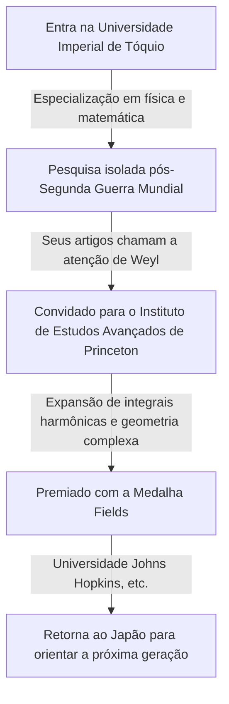

## 1. Introdução

O grande matemático japonês **[Kunihiko Kodaira](https://kenji.blog/pt/p/kodaira-kunihiko/)** (1915–1997) foi o primeiro medalhista Fields do Japão e fez imensas contribuições para a geometria algébrica e a teoria das variedades complexas no século XX. Seu trabalho influenciou profundamente não apenas a matemática moderna, mas também a física teórica, como a teoria das cordas. Neste artigo, exploramos a vida de Kodaira e seu mundo matemático intuitivo.

## 2. Trajetória de Vida

[Kunihiko Kodaira](https://kenji.blog/pt/p/kodaira-kunihiko/) nasceu em Tóquio em 1915. Ele gostava de tocar piano desde muito jovem e diz-se que seu profundo amor por a música mais tarde influenciou seu pensamento matemático. Sua frase "Entender matemática é como ouvir música e sentir que é bela" é famosa.



Em meio à escassez de materiais e informações durante a Segunda Guerra Mundial, Kodaira estudou os livros de Hermann Weyl e realizou pesquisas independentes sobre a teoria das integrais harmônicas.

## 3. Principais Conquistas Matemáticas

A matemática de Kodaira era extremamente geométrica e intuitiva.

### 3.1 Expansão das Integrais Harmônicas

Kodaira estendeu as teorias de Georges de Rham e W. V. D. Hodge para variedades não compactas e feixes com coeficientes. Isso estabeleceu uma base para lidar rigorosamente com objetos geométricos usando métodos de análise.

### 3.2 Teorema de Mergulho de Kodaira

Uma de suas conquistas mais famosas é o **Teorema de Mergulho de Kodaira** . Ele demonstra que qualquer variedade de Kähler compacta que satisfaça uma certa condição analítica (a existência de uma métrica de Hodge) pode necessariamente ser mergulhada como uma variedade algébrica em um espaço projetivo complexo $\mathbb{P}^N$.

O cerne do teorema é expresso pela seguinte equação. Para um fibrado de retas positivo $L$, quando sua primeira classe de Chern $c_1(L)$ coincide com a forma de Kähler $[\omega]$,

$$ c_1(L) = [\omega] \in H^2(X, \mathbb{Z}) $$

Esta variedade $X$ torna-se projetiva. Em outras palavras, tornou-se uma ponte poderosa conectando a geometria analítica e a geometria algébrica.

### 3.3 Classificação de Superfícies Complexas e Dimensão de Kodaira

Kodaira estendeu a classificação de superfícies algébricas da escola italiana para superfícies complexas compactas gerais. Além disso, introduziu um invariante chamado **dimensão de Kodaira** $\kappa(X)$, abrindo o caminho para a teoria de classificação de variedades algébricas de dimensões superiores.

$$ \kappa(X) = \begin{cases} \dim X & (\text{se de tipo geral}) \\ -\infty & (\text{caso contrário}) \end{cases} $$

O pseudocódigo que demonstra este conceito simples é mostrado abaixo.

```python
# Função para calcular a dimensão de uma variedade complexa
def calculate_kodaira_dimension(is_general_type: bool, dim: int) -> int:
    """
    No caso de uma variedade de tipo geral, a dimensão de Kodaira corresponde à dimensão da variedade.
    """
    if is_general_type:
        return dim
    else:
        return -1 # Espaço reservado para o tipo não geral
```

### 3.4 Teoria de Kodaira-Spencer

Junto com Donald Spencer, fundou a teoria da deformação de estruturas complexas. Esta foi uma teoria inovadora que descreve as propriedades de uma forma quando sua estrutura é continuamente alterada pouco a pouco.

## 4. Kodaira como Educador e "Senso Numérico"

Depois de retornar ao Japão em 1967, ele ensinou na Universidade de Tóquio e em outras instituições. Ele argumentou que os humanos possuem um **"senso numérico"** para perceber a matemática, muito parecido com a visão ou audição, e que entender uma prova matemática significa "ver" vividamente a estrutura do objeto através desse sentido.

## 5. Conclusão

A matemática deixada por [Kunihiko Kodaira](https://kenji.blog/pt/p/kodaira-kunihiko/) é como uma grande sinfonia onde a análise, a álgebra e a geometria estão lindamente harmonizadas. Sua abordagem intuitiva e insights profundos continuam a fascinar muitos matemáticos hoje.
