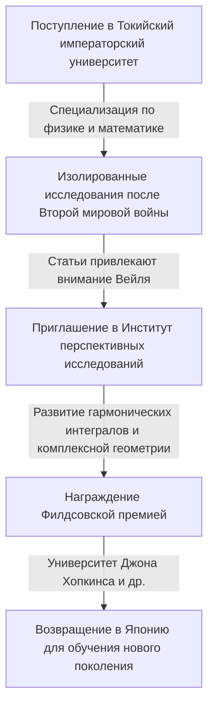

## 1. Введение

Великий японский математик **[Кунихико Кодаира](https://kenji.blog/p/kodaira-kunihiko/)** (1915–1997) был первым японским лауреатом Филдсовской премии и внес огромный вклад в алгебраическую геометрию и теорию комплексных многообразий в XX веке. Его работа оказала глубокое влияние не только на современную математику, но и на теоретическую физику, например, на теорию струн. В этой статье мы исследуем жизнь Кодаиры и его интуитивно понятный математический мир.

## 2. Жизненный путь

[Кунихико Кодаира](https://kenji.blog/p/kodaira-kunihiko/) родился в Токио в 1915 году. С юных лет он любил играть на фортепиано, и говорят, что его глубокая любовь к музыке позже повлияла на его математическое мышление. Известна его цитата: «Понимать математику — это как слушать музыку и чувствовать, что она прекрасна».



В условиях нехватки материалов и информации во время Второй мировой войны Кодаира изучал книги Германа Вейля и проводил независимые исследования теории гармонических интегралов.

## 3. Основные математические достижения

Математика Кодаиры была чрезвычайно геометрической и интуитивной.

### 3.1 Расширение теории гармонических интегралов

Кодаира расширил теории Жоржа де Рама и У. В. Д. Ходжа на некомпактные многообразия и пучки с коэффициентами. Это заложило основу для строгого обращения с геометрическими объектами с использованием методов математического анализа.

### 3.2 Теорема Кодаиры о вложении

Одним из его самых известных достижений является **теорема Кодаиры о вложении** . Она демонстрирует, что любое компактное кэлерово многообразие, удовлетворяющее определенному аналитическому условию (существованию метрики Ходжа), обязательно может быть вложено как алгебраическое многообразие в комплексное проективное пространство $\mathbb{P}^N$.

Суть теоремы выражается следующим уравнением. Для положительного линейного расслоения $L$, когда его первый класс Черна $c_1(L)$ совпадает с кэлеровой формой $[\omega]$,

$$ c_1(L) = [\omega] \in H^2(X, \mathbb{Z}) $$

Это многообразие $X$ становится проективным. Другими словами, оно стало мощным мостом, соединяющим аналитическую геометрию и алгебраическую геометрию.

### 3.3 Классификация комплексных поверхностей и размерность Кодаиры

Кодаира расширил классификацию алгебраических поверхностей итальянской школы на общие компактные комплексные поверхности. Кроме того, он ввел инвариант, названный **размерностью Кодаиры** $\kappa(X)$, открыв путь к теории классификации алгебраических многообразий более высоких размерностей.

$$ \kappa(X) = \begin{cases} \dim X & (\text{если общего типа}) \\ -\infty & (\text{иначе}) \end{cases} $$

Псевдокод, демонстрирующий эту простую концепцию, показан ниже.

```python
# Функция для вычисления размерности комплексного многообразия
def calculate_kodaira_dimension(is_general_type: bool, dim: int) -> int:
    """
    В случае многообразия общего типа размерность Кодаиры совпадает с размерностью многообразия.
    """
    if is_general_type:
        return dim
    else:
        return -1 # Заполнитель для не общего типа
```

### 3.4 Теория Кодаиры-Спенсера

Вместе с Дональдом Спенсером он основал теорию деформаций комплексных структур. Это была новаторская теория, описывающая свойства фигуры, когда ее структура непрерывно изменяется шаг за шагом.

## 4. Кодаира как педагог и «чувство чисел»

После возвращения в Японию в 1967 году он преподавал в Токийском университете и других учреждениях. Он утверждал, что люди обладают **«чувством чисел»** для восприятия математики, во многом похожим на зрение или слух, и что понимание математического доказательства означает живо «видеть» структуру объекта с помощью этого чувства.

## 5. Заключение

Математика, оставленная Кунихико Кодаирой, подобна великой симфонии, в которой прекрасно гармонируют анализ, алгебра и геометрия. Его интуитивный подход и глубокие идеи продолжают очаровывать многих математиков и сегодня.
