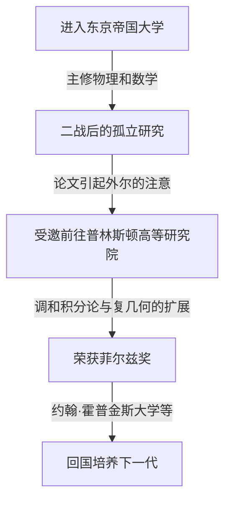

## 1. 引言

日本伟大的数学家 **[小平邦彦](https://kenji.blog/p/kodaira-kunihiko/)** (Kunihiko Kodaira, 1915–1997) 是日本首位菲尔兹奖得主，对20世纪的代数几何和复流形理论做出了巨大贡献。他的工作不仅对现代数学，而且对超弦理论等理论物理学也产生了深远的影响。在本文中，我们将探索小平的生平及其充满直觉的数学世界。

## 2. 人生轨迹

[小平邦彦](https://kenji.blog/p/kodaira-kunihiko/)于1915年出生在东京。他从小就喜欢弹钢琴，据说他对音乐的深厚热爱也影响了后来的数学思维。他的名言是：“理解数学就像听音乐并感到它是美妙的一样”。



在二战期间物资和信息短缺的情况下，小平研读了赫尔曼·外尔的著作，并独立开展了调和积分论的研究。

## 3. 主要数学成就

小平的数学是极其几何化和充满直觉的。

### 3.1 调和积分论的扩展

小平将乔治·德拉姆 (Georges de Rham) 和威廉·霍奇 (W. V. D. Hodge) 的理论扩展到非紧致流形和带系数的层。这为使用分析学方法严格处理几何对象奠定了基础。

### 3.2 小平嵌入定理

他最著名的成就之一是 **小平嵌入定理** 。它证明了满足特定解析条件（存在霍奇度量）的紧致凯勒流形，必定可以作为代数簇嵌入到复射影空间 $\mathbb{P}^N$ 中。

定理的核心由以下公式表示。对于正线丛 $L$，当其第一陈类 $c_1(L)$ 与凯勒形式 $[\omega]$ 一致时，

$$ c_1(L) = [\omega] \in H^2(X, \mathbb{Z}) $$

该流形 $X$ 成为射影的。换言之，这成为连接解析几何与代数几何的强大桥梁。

### 3.3 复曲面的分类与小平维度

小平将意大利学派关于代数曲面的分类扩展到一般的紧致复曲面。此外，他引入了称为 **小平维度** $\kappa(X)$ 的不变量，为高维代数簇的分类理论开辟了道路。

$$ \kappa(X) = \begin{cases} \dim X & (\text{一般型的情况}) \\ -\infty & (\text{其他}) \end{cases} $$

展示这一简单概念的伪代码如下所示。

```python
# 计算复流形维度的函数
def calculate_kodaira_dimension(is_general_type: bool, dim: int) -> int:
    """
    在一般型流形的情况下，小平维度与流形的维度一致。
    """
    if is_general_type:
        return dim
    else:
        return -1 # 非一般型时的占位符
```

### 3.4 小平-斯宾塞理论

他与唐纳德·斯宾塞 (Donald Spencer) 共同创立了复结构的变形理论。这是一项开创性的理论，描述了当图形的结构连续地产生微小变化时所保持和改变的性质。

## 4. 作为教育家的小平与“数觉”

1967年回到日本后，他在东京大学等地任教。他主张人类天生具备像视觉或听觉一样感知数学的 **“数觉”** ，而理解数学证明意味着通过这种数觉生动地“看到”对象的结构。

## 5. 结论

[小平邦彦](https://kenji.blog/p/kodaira-kunihiko/)留下的数学就像是一部解析学、代数学和几何学完美和谐交融的宏大交响乐。他直觉的方法和深刻的洞察力至今仍令许多数学家着迷。
