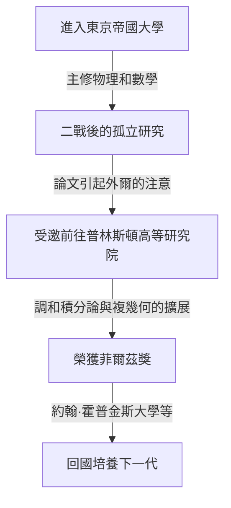

## 1. 引言

日本偉大的數學家 **[小平邦彥](https://kenji.blog/p/kodaira-kunihiko/)** ([Kunihiko Kodaira](https://kenji.blog/p/kodaira-kunihiko/), 1915–1997) 是日本首位菲爾茲獎得主，對20世紀的代數幾何和複流形理論做出了巨大貢獻。他的工作不僅對現代數學，而且對超弦理論等理論物理學也產生了深遠的影響。在本文中，我們將探索小平的生平及其充滿直覺的數學世界。

## 2. 人生軌跡

[小平邦彥](https://kenji.blog/p/kodaira-kunihiko/)於1915年出生在東京。他從小就喜歡彈鋼琴，據說他對音樂的深厚熱愛也影響了後來的數學思維。他的名言是：「理解數學就像聽音樂並感到它是美妙的一樣」。



在二戰期間物資和信息短缺的情況下，小平研讀了赫爾曼·外爾的著作，並獨立開展了調和積分論的研究。

## 3. 主要數學成就

小平的數學是極其幾何化和充滿直覺的。

### 3.1 調和積分論的擴展

小平將喬治·德拉姆 (Georges de Rham) 和威廉·霍奇 (W. V. D. Hodge) 的理論擴展到非緊緻流形和帶係數的層。這為使用分析學方法嚴格處理幾何對象奠定了基礎。

### 3.2 小平嵌入定理

他最著名的成就之一是 **小平嵌入定理** 。它證明了滿足特定解析條件（存在霍奇度量）的緊緻凱勒流形，必定可以作為代數簇嵌入到複射影空間 $\mathbb{P}^N$ 中。

定理的核心由以下公式表示。對於正線叢 $L$，當其第一陳類 $c_1(L)$ 與凱勒形式 $[\omega]$ 一致時，

$$ c_1(L) = [\omega] \in H^2(X, \mathbb{Z}) $$

該流形 $X$ 成為射影的。換言之，這成為連接解析幾何與代數幾何的強大橋樑。

### 3.3 複曲面的分類與小平維度

小平將義大利學派關於代數曲面的分類擴展到一般的緊緻複曲面。此外，他引入了稱為 **小平維度** $\kappa(X)$ 的不變量，為高維代數簇的分類理論開闢了道路。

$$ \kappa(X) = \begin{cases} \dim X & (\text{一般型的情況}) \\ -\infty & (\text{其他}) \end{cases} $$

展示這一簡單概念的偽代碼如下所示。

```python
# 計算複流形維度的函數
def calculate_kodaira_dimension(is_general_type: bool, dim: int) -> int:
    """
    在一般型流形的情況下，小平維度與流形的維度一致。
    """
    if is_general_type:
        return dim
    else:
        return -1 # 非一般型時的佔位符
```

### 3.4 小平-斯賓塞理論

他與唐納德·斯賓塞 (Donald Spencer) 共同創立了複結構的變形理論。這是一項開創性的理論，描述了當圖形的結構連續地產生微小變化時所保持和改變的性質。

## 4. 作為教育家的小平與「數覺」

1967年回到日本後，他在東京大學等地任教。他主張人類天生具備像視覺或聽覺一樣感知數學的 **「數覺」** ，而理解數學證明意味著通過這種數覺生動地「看到」對象的結構。

## 5. 結論

[小平邦彥](https://kenji.blog/p/kodaira-kunihiko/)留下的數學就像是一部解析學、代數學和幾何學完美和諧交融的宏大交響樂。他直覺的方法和深刻的洞察力至今仍令許多數學家著迷。
