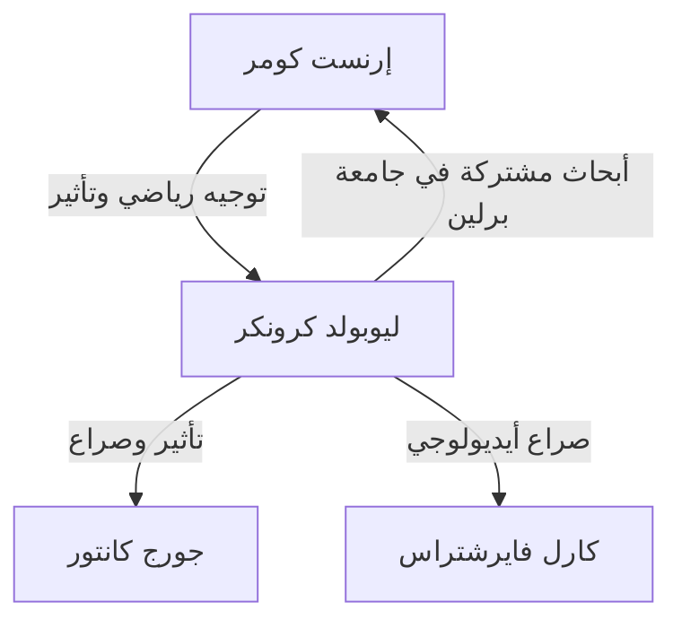

# 1. مقدمة: الإيمان المطلق بالأعداد الصحيحة

> "Die ganzen Zahlen hat der liebe Gott gemacht, alles andere ist Menschenwerk."
> (صنع الله الأعداد الصحيحة، وكل ما عداها من صنع الإنسان)

في تاريخ الرياضيات، قلما نجد اقتباسات شهيرة أو تلخص ببراعة أيديولوجية عالم رياضيات مثل هذه المقولة. صاحب هذه الكلمات هو عالم الرياضيات الألماني البارز في القرن التاسع عشر **ليوبولد كرونكر** (1823–1891).

لم يكن هذا التصريح مجرد تعبير شاعري؛ بل كان مدعوماً بإيمانه الشديد بـ **البنائية الرياضية**. في هذا المقال، نتعمق في حياة كرونكر، والخلافات التي أثارها في المجتمع الرياضي، والإرث العظيم الذي تركه في الرياضيات الحديثة.

# 2. حياة كرونكر ومحطاتها

## 2.1. ازدهار موهبته ولقاؤه بكومر

ولد كرونكر عام 1823 في عائلة يهودية ثرية في ليجنيتز، بروسيا (الآن ليجنيتسا، بولندا). أظهر ذكاءً استثنائياً منذ سن مبكرة، والتحق بالجيمنازيوم المحلي (مدرسة ثانوية متقدمة).

وهنا حدث لقاء مصيري. وصل معلم جديد إلى الجيمنازيوم وهو **[إرنست كومر](https://kenji.blog/ar/p/kummer/)** ، الذي سيصبح لاحقاً رائداً في نظرية المثاليات. أدرك كومر فوراً موهبة كرونكر وقدم له تعليماً رياضياً متقدماً ومخصصاً.

## 2.2. الحياة الأكاديمية والنجاح كرجل أعمال

في عام 1841، التحق كرونكر بجامعة برلين، ودرس تحت إشراف كبار علماء الرياضيات مثل بيتر جوستاف لوجون دركليه وكارل جوستاف جاكوب جاكوبي. بحلول عام 1845، حصل على الدكتوراه بأطروحة بارزة حول نظرية الأعداد الجبرية.

ومع ذلك، اتخذ كرونكر بعد ذلك مساراً مهنياً غريباً. فبدلاً من البحث عن منصب جامعي، عاد إلى مسقط رأسه لتولي إدارة العقارات الزراعية الواسعة والأعمال المصرفية لعمه. حقق نجاحاً هائلاً كرجل أعمال وجمع ثروة طائلة. طوال هذه الفترة، واصل أبحاثه الرياضية كهواية، مما جعله في الأساس أقوى عالم رياضيات هاوٍ في عصره.

## 2.3. العودة إلى جامعة برلين والبروز الأكاديمي

بعد تحقيقه الاستقلال المالي التام، عاد كرونكر إلى برلين في عام 1855. بدأ في إلقاء محاضرات في جامعة برلين كمحاضر خاص غير مدفوع الأجر (Privatdozent). ونظراً لأنه لم يكن بحاجة إلى راتب ليعيش، فقد استطاع الانغماس كلياً في الأبحاث والمحاضرات التي أحبها.

وفي النهاية، تم الاعتراف بإنجازاته الساحقة، وفي عام 1861 انتخب عضواً كاملاً في أكاديمية برلين للعلوم. وقد منحه هذا امتياز إلقاء محاضرات في الجامعة دون شغل منصب أستاذ رسمي (على الرغم من أنه أصبح أستاذاً متفرغاً في وقت لاحق).

# 3. الصراعات الأيديولوجية: البنائية مقابل نظرية المجموعات

عند مناقشة حياة كرونكر، لا يمكن للمرء أن يغفل نقاشاته العنيفة مع علماء الرياضيات الآخرين.

## 3.1. البنائية الصارمة

كان لدى كرونكر قناعة قوية بأن "الأشياء التي يمكن حسابها وبناؤها صراحةً في عدد محدود من العمليات هي فقط التي توجد رياضياً". وكان يحتقر بشدة براهين الوجود غير البنائية بالخلف (المنطق القائل بأنه "إذا افترضنا عدم وجود شيء، ينشأ تناقض؛ وبالتالي فهو موجود").

على سبيل المثال، فيما يتعلق بالنظرية الأساسية في الجبر، جادل بأن إثبات "وجود جذر" لم يكن كافياً؛ بل يجب أن يصاحبه خوارزمية تفصل "كيفية بناء الجذر صراحةً".

## 3.2. الصدامات مع كانتور وفايرشتراس

أدت هذه الأيديولوجية المتطرفة إلى صراعه مع معاصريه.

وأشهر هذه الصدامات كان انتقاده اللاذع لـ **[جورج كانتور](https://kenji.blog/ar/p/cantor/)** ونظريته في المجموعات. أدان كرونكر مفاهيم كانتور عن أعداد المجموعات اللانهائية والأعداد عبر المنتهية ووصفها بأنها "تصوف، وليست رياضيات"، بل واتخذ إجراءات لعرقلة نشر أبحاث كانتور.

كما اصطدم مع **كارل فايرشتراس** ، الذي كان صديقاً مقرباً له في الماضي. وفيما يتعلق بتحليل فايرشتراس (مثل بناء دوال متصلة غير قابلة للاشتقاق في أي مكان)، انتقد كرونكر مثل هذه الدوال ووصفها بأنها "مرضية" وأعلن أنها غير موجودة.

# 4. مساهمات عظيمة في الرياضيات

في حين أن أيديولوجية كرونكر كانت متطرفة في بعض الأحيان، إلا أن إنجازاته الرياضية كانت بلا شك من الطراز الأول، ويتوج اسمه العديد من المفاهيم في جميع أنحاء الرياضيات الحديثة.

## 4.1. دلتا كرونكر

ربما يكون الأكثر شهرة هو "دلتا كرونكر". يظهر هذا الرمز بشكل متكرر في الجبر الخطي والفيزياء (مثل ميكانيكا الكم وتحليل الموترات)، ويتم تعريفه على النحو التالي:

$$
\delta_{ij} = \begin{cases} 
1 & (i = j) \\ 
0 & (i \neq j) 
\end{cases}
$$

يسمح هذا الرمز البسيط بكتابة تعريفات الجداء الداخلي والمصفوفات المتعامدة بشكل موجز جداً. على سبيل المثال، يتم التعبير عن الجداء الداخلي لأساس متعامد منظم $\mathbf{e}_1, \dots, \mathbf{e}_n$ على النحو التالي:

$$
\mathbf{e}_i \cdot \mathbf{e}_j = \delta_{ij}
$$

## 4.2. جداء كرونكر

سمي "جداء كرونكر"، وهو نوع من الجداء الموتري للمصفوفات، باسمه أيضاً. بالنسبة للمصفوفة $A$ (بحجم $m \times n$) والمصفوفة $B$ (بحجم $p \times q$)، يتم تعريف جداء كرونكر $A \otimes B$ الخاص بهما كمصفوفة كتلية بحجم $(mp) \times (nq)$:

$$
A \otimes B = \begin{pmatrix}
a_{11} B & \cdots & a_{1n} B \\
\vdots & \ddots & \vdots \\
a_{m1} B & \cdots & a_{mn} B
\end{pmatrix}
$$

يلعب هذا دوراً أساسياً في وصف أنظمة متعددة الأجسام في نظرية المعلومات الكمومية، ومعالجة الإشارات، وخوارزميات التعلم الآلي.

## 4.3. نظرية كرونكر-فيبر

واحدة من الركائز التذكارية في نظرية الأعداد الجبرية هي "نظرية كرونكر-فيبر". تنص النظرية على ما يلي:

**نظرية (كرونكر-فيبر):** 
أي امتداد أبيلي منتهي لحقل الأعداد الكسرية $\mathbb{Q}$ هو حقل جزئي من حقل سايكلوتومي (دائري) ما $\mathbb{Q}(\zeta_n)$. (حيث $\zeta_n$ هو جذر الوحدة النوني البدائي).

$$
\text{Gal}(K / \mathbb{Q}) \text{ هي زمرة أبيلية } \implies \exists n, K \subseteq \mathbb{Q}(\zeta_n)
$$

توضح هذه النظرية أن المفهوم المجرد لـ "امتداد أبيلي للأعداد الكسرية" يمكن استنفاده تماماً بواسطة العملية الملموسة والمفهومة للغاية وهي "إضافة جذور الوحدة". إنها تجسد تماماً فلسفة كرونكر القائلة بأن كل شيء يجب أن يكون قابلاً للبناء.

## 4.4. حلم شباب كرونكر (Jugendtraum)

تعلقت نظرية كرونكر-فيبر بالامتدادات الأبيلية على الأعداد الكسرية $\mathbb{Q}$. كان كرونكر يحلم بتوسيع ذلك ليشمل حقولاً جبرية أكثر عمومية، مثل الحقول التربيعية التخيلية. سؤاله العظيم، "هل تتولد جميع الامتدادات الأبيلية لحقل تربيعي تخيلي بواسطة القيم الخاصة لدوال معينة؟"، تمت صياغته لاحقاً باعتباره **مسألة هيلبرت الثانية عشرة** .

أشار إلى هذا بأنه "حلم شبابه الأعز". في حين شهدت هذه المسألة تقدماً هائلاً من خلال نظرية حقل الفصل لتياجي تاكاجي ونظرية الضرب المركب اللاحقة، إلا أنها تظل مسألة رئيسية غير محلولة بالنسبة للحقول الجبرية العامة تماماً.

# 5. الخاتمة

كان ليوبولد كرونكر عالم رياضيات ذا قناعات فريدة وقوية وإحساس بالجمال الجمالي. في حين أن موقفه البنائي تسبب في احتكاك مع معاصريه مثل كانتور، تمت إعادة تقييمه في القرن العشرين في سياق حدسية براور والمقاربات الخوارزمية في علوم الكمبيوتر (نظرية القابلية للحساب).

"صنع الله الأعداد الصحيحة" — تلخص هذه الكلمات هوس كرونكر بالقضاء على المفاهيم غير المؤكدة القائمة على الحدس البشري وبناء الرياضيات على أساس صلب. يواصل "دلتا كرونكر" و"حلم شبابه" أسر علماء الرياضيات اليوم، ساطعين في طليعة الجبر والفيزياء.
