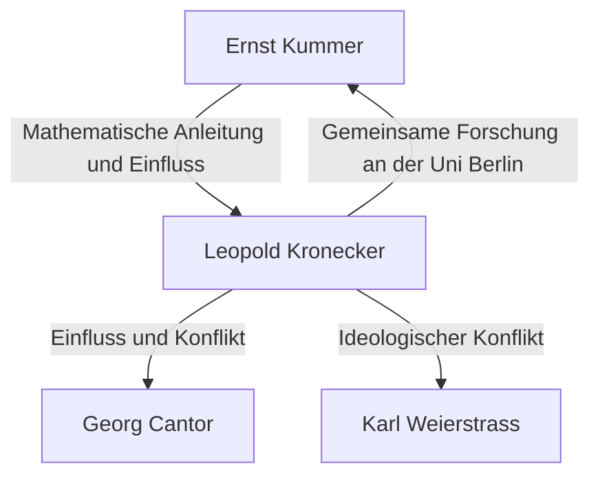

# 1. Einleitung: Absoluter Glaube an die ganzen Zahlen

> "Die ganzen Zahlen hat der liebe Gott gemacht, alles andere ist Menschenwerk."

In der Geschichte der Mathematik gibt es kaum ein Zitat, das so berühmt ist und die Ideologie eines Mathematikers so treffend zusammenfasst. Der Urheber dieser Worte ist der herausragende deutsche Mathematiker des 19. Jahrhunderts, **Leopold Kronecker** (1823–1891).

Diese Aussage war nicht nur poetisch; sie wurde durch seinen vehementen Glauben an den **mathematischen Konstruktivismus** gestützt. In diesem Artikel tauchen wir tief in Kroneckers Leben ein, beleuchten die Kontroversen, die er in der mathematischen Gemeinschaft auslöste, und das großartige Erbe, das er der modernen Mathematik hinterlassen hat.

# 2. Kroneckers Leben und Episoden

## 2.1. Aufblühendes Talent und die Begegnung mit Kummer

Kronecker wurde 1823 in eine wohlhabende jüdische Familie in Liegnitz, Preußen (heute Legnica, Polen), geboren. Schon früh zeigte er einen außergewöhnlichen Intellekt und besuchte das örtliche Gymnasium.

Hier fand eine schicksalhafte Begegnung statt. Ein neuer Lehrer kam an das Gymnasium – **Ernst Kummer** , der später ein Pionier der Idealtheorie werden sollte. Kummer erkannte Kroneckers Talent sofort und bot ihm fortgeschrittenen, persönlichen Mathematikunterricht.

## 2.2. Akademiker und Erfolg als Geschäftsmann

Im Jahr 1841 trat Kronecker in die Universität Berlin ein und studierte bei hochkarätigen Mathematikern wie Peter Gustav Lejeune Dirichlet und Carl Gustav Jacob Jacobi. Bis 1845 promovierte er mit einer herausragenden Arbeit über die algebraische Zahlentheorie.

Danach schlug Kronecker jedoch einen ungewöhnlichen Karriereweg ein. Anstatt eine Universitätsstelle zu suchen, kehrte er in seine Heimatstadt zurück, um das riesige landwirtschaftliche Gut und das Bankgeschäft seines Onkels zu übernehmen. Er erzielte als Geschäftsmann enormen Erfolg und häufte großen Reichtum an. Während dieser gesamten Zeit setzte er seine mathematische Forschung als Hobby fort, was ihn im Grunde zum stärksten Amateurmathematiker seiner Zeit machte.

## 2.3. Rückkehr an die Universität Berlin und akademische Prominenz

Nachdem er völlige finanzielle Unabhängigkeit erreicht hatte, kehrte Kronecker 1855 nach Berlin zurück. Er begann als unbezahlter Privatdozent an der Universität Berlin Vorlesungen zu halten. Da er kein Gehalt zum Leben brauchte, konnte er sich ganz der Forschung und den Vorlesungen widmen, die er liebte.

Schließlich wurden seine überwältigenden Leistungen anerkannt, und 1861 wurde er als ordentliches Mitglied in die Berliner Akademie der Wissenschaften gewählt. Dies gewährte ihm das Privileg, Vorlesungen an der Universität zu halten, ohne eine formelle Professur innezuhaben (obwohl er später ordentlicher Professor wurde).

# 3. Ideologische Konflikte: Konstruktivismus vs. Mengenlehre

Wenn man über Kroneckers Leben spricht, darf man seine heftigen Debatten mit anderen Mathematikern nicht unerwähnt lassen.

## 3.1. Strikter Konstruktivismus

Kronecker hatte die feste Überzeugung, dass "nur Dinge, die in einer endlichen Anzahl von Operationen explizit berechnet und konstruiert werden können, mathematisch existieren". Er verabscheute nicht-konstruktive Existenzbeweise durch Widerspruch (die Logik, dass "wenn wir annehmen, es existiere nicht, ein Widerspruch entsteht; folglich existiert es") zutiefst.

Zum Beispiel argumentierte er in Bezug auf den Fundamentalsatz der Algebra, dass der bloße Beweis, dass "eine Wurzel existiert", unzureichend sei; es müsse ein Algorithmus beigebracht werden, der detailliert beschreibt, "wie die Wurzel explizit konstruiert wird".

## 3.2. Zusammenstöße mit Cantor und Weierstraß

Diese extreme Ideologie brachte ihn in Konflikt mit seinen Zeitgenossen.

Am berühmtesten war seine vehemente Kritik an **Georg Cantor** und dessen Mengenlehre. Kronecker verurteilte Cantors Konzepte der Mächtigkeiten unendlicher Mengen und transfiniter Zahlen als "Mystizismus, nicht Mathematik" und ergriff sogar Maßnahmen, um die Veröffentlichung von Cantors Arbeiten zu behindern.

Er stieß auch mit **Karl Weierstrass** zusammen, der einst ein enger Freund war. Bezüglich der weierstraßschen Analysis (wie der Konstruktion stetiger, nirgends differenzierbarer Funktionen) kritisierte Kronecker solche Funktionen als "pathologisch" und erklärte, sie existierten nicht.

# 4. Große Beiträge zur Mathematik

Während Kroneckers Ideologie manchmal extrem war, waren seine mathematischen Errungenschaften unbestreitbar erstklassig, und sein Name krönt zahlreiche Konzepte in der gesamten modernen Mathematik.

## 4.1. Kronecker-Delta

Am bekanntesten ist vielleicht das "Kronecker-Delta". Dieses Symbol, das häufig in der linearen Algebra und Physik (wie der Quantenmechanik und Tensoranalysis) auftritt, wird wie folgt definiert:

$$
\delta_{ij} = \begin{cases} 
1 & (i = j) \\ 
0 & (i \neq j) 
\end{cases}
$$

Dieses einfache Symbol ermöglicht es, Definitionen von Skalarprodukten und orthogonalen Matrizen sehr prägnant zu schreiben. Zum Beispiel wird das Skalarprodukt einer Orthonormalbasis $\mathbf{e}_1, \dots, \mathbf{e}_n$ so ausgedrückt:

$$
\mathbf{e}_i \cdot \mathbf{e}_j = \delta_{ij}
$$

## 4.2. Kronecker-Produkt

Das "Kronecker-Produkt", eine Art Tensorprodukt für Matrizen, ist ebenfalls nach ihm benannt. Für eine Matrix $A$ (Größe $m \times n$) und eine Matrix $B$ (Größe $p \times q$) ist ihr Kronecker-Produkt $A \otimes B$ als Blockmatrix der Größe $(mp) \times (nq)$ definiert:

$$
A \otimes B = \begin{pmatrix}
a_{11} B & \cdots & a_{1n} B \\
\vdots & \ddots & \vdots \\
a_{m1} B & \cdots & a_{mn} B
\end{pmatrix}
$$

Dies spielt eine wesentliche Rolle bei der Beschreibung von Vielteilchensystemen in der Quanteninformationstheorie, der Signalverarbeitung und bei Algorithmen des maschinellen Lernens.

## 4.3. Satz von Kronecker-Weber

Eine der monumentalen Säulen der algebraischen Zahlentheorie ist der "Satz von Kronecker-Weber". Der Satz besagt Folgendes:

**Satz (Kronecker-Weber):** 
Jede endliche abelsche Erweiterung des Körpers der rationalen Zahlen $\mathbb{Q}$ ist ein Teilkörper eines Kreisteilungskörpers $\mathbb{Q}(\zeta_n)$. (Wobei $\zeta_n$ eine primitive $n$-te Einheitswurzel ist).

$$
\text{Gal}(K / \mathbb{Q}) \text{ ist abelsch} \implies \exists n, K \subseteq \mathbb{Q}(\zeta_n)
$$

Dieser Satz zeigt, dass das abstrakte Konzept einer "abelschen Erweiterung der rationalen Zahlen" durch die sehr konkrete und verständliche Operation des "Hinzufügens von Einheitswurzeln" vollständig ausgeschöpft werden kann. Er verkörpert Kroneckers Philosophie, dass alles konstruierbar sein muss, in Perfektion.

## 4.4. Kroneckers Jugendtraum

Der Satz von Kronecker-Weber bezog sich auf abelsche Erweiterungen über den rationalen Zahlen $\mathbb{Q}$. Kronecker träumte davon, dies auf allgemeinere algebraische Körper, wie imaginärquadratische Körper, auszudehnen. Seine große Frage, "Werden alle abelschen Erweiterungen eines imaginärquadratischen Körpers durch die speziellen Werte bestimmter Funktionen erzeugt?", wurde später als **Hilberts 12. Problem** formuliert.

Er bezeichnete dies als seinen "liebsten Jugendtraum". Obwohl dieses Problem durch Teiji Takagis Klassenkörpertheorie und die spätere Theorie der komplexen Multiplikation massive Fortschritte machte, bleibt es für vollständig allgemeine algebraische Körper ein ungelöstes Hauptproblem.

# 5. Fazit

Leopold Kronecker war ein Mathematiker mit einzigartigen, starken Überzeugungen und einem Sinn für ästhetische Schönheit. Während seine konstruktivistische Haltung zu Reibungen mit Zeitgenossen wie Cantor führte, wurde sie im 20. Jahrhundert im Kontext von Brouwers Intuitionismus und algorithmischen Ansätzen in der Informatik (Berechenbarkeitstheorie) neu bewertet.

"Die ganzen Zahlen hat der liebe Gott gemacht" – diese Worte fassen Kroneckers Besessenheit zusammen, auf menschlicher Intuition basierende unsichere Konzepte zu eliminieren und die Mathematik auf ein felsengefestigtes Fundament zu stellen. Sein "Kronecker-Delta" und sein "Jugendtraum" faszinieren noch heute Mathematiker und strahlen hell an vorderster Front von Algebra und Physik.
