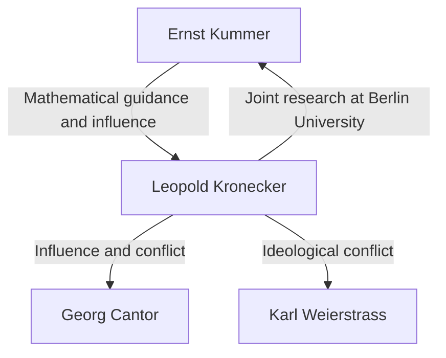

# 1. Introduction: Absolute Faith in Integers

> "Die ganzen Zahlen hat der liebe Gott gemacht, alles andere ist Menschenwerk."
> (God made the integers, all else is the work of man)

In the history of mathematics, few quotes are as famous or as perfectly summarize a mathematician's ideology as this one. The author of these words is the eminent 19th-century German mathematician **Leopold [Kronecker](https://kenji.blog/en/p/kronecker/)** (1823–1891).

This statement was not merely poetic; it was backed by his fierce belief in **mathematical constructivism**. In this article, we delve deep into [Kronecker](https://kenji.blog/en/p/kronecker/)'s life, the controversies he sparked in the mathematical community, and the magnificent legacy he left on modern mathematics.

# 2. [Kronecker](https://kenji.blog/en/p/kronecker/)'s Life and Episodes

## 2.1. Blossoming Talent and Meeting [Kummer](https://kenji.blog/en/p/kummer/)

[Kronecker](https://kenji.blog/en/p/kronecker/) was born in 1823 to a wealthy Jewish family in Liegnitz, Prussia (now Legnica, Poland). Exhibiting extraordinary intellect from a young age, he enrolled in the local Gymnasium (advanced secondary school).

It was here that a fateful encounter occurred. A new teacher arrived at the Gymnasium— **[Ernst Kummer](https://kenji.blog/en/p/kummer/)** , who would later become a pioneer of ideal theory. Kummer immediately recognized [Kronecker](https://kenji.blog/en/p/kronecker/)'s talent and provided him with advanced, personalized mathematical instruction.

## 2.2. Academics and Success as a Businessman

In 1841, [Kronecker](https://kenji.blog/en/p/kronecker/) entered the University of Berlin, studying under top-tier mathematicians like Peter Gustav Lejeune Dirichlet and [Carl Gustav Jacob Jacobi](https://kenji.blog/en/p/jacobi/). By 1845, he earned his doctorate with an outstanding thesis on algebraic number theory.

However, [Kronecker](https://kenji.blog/en/p/kronecker/) then took a strange career path. Instead of seeking a university post, he returned to his hometown to take over his uncle's vast farming estate and banking business. He achieved tremendous success as a businessman and amassed great wealth. Throughout this period, he continued his mathematical research as a hobby, essentially making him the strongest amateur mathematician of his time.

## 2.3. Return to the University of Berlin and Academic Prominence

Having achieved complete financial independence, [Kronecker](https://kenji.blog/en/p/kronecker/) returned to Berlin in 1855. He began lecturing at the University of Berlin as an unpaid private lecturer (Privatdozent). Because he did not need a salary to live, he could immerse himself entirely in the research and lectures he loved.

Eventually, his overwhelming achievements were recognized, and in 1861 he was elected as a full member of the Berlin Academy of Sciences. This granted him the privilege of giving lectures at the university without holding a formal professorship (though he would later become a full professor).

# 3. Ideological Conflicts: Constructivism vs. Set Theory

When discussing [Kronecker](https://kenji.blog/en/p/kronecker/)'s life, one cannot omit his fierce debates with other mathematicians.

## 3.1. Strict Constructivism

[Kronecker](https://kenji.blog/en/p/kronecker/) held a strong conviction that "only things that can be explicitly calculated and constructed in a finite number of operations mathematically exist." He fiercely despised non-constructive existence proofs by contradiction (the logic that "if we assume it does not exist, a contradiction arises; therefore, it exists").

For example, regarding the [Fundamental Theorem of Algebra](https://kenji.blog/en/p/fundamental-theorem-of-algebra/), he argued that merely proving "a root exists" was insufficient; an algorithm detailing "how to explicitly construct the root" must accompany it.

## 3.2. Clashes with Cantor and Weierstrass

This extreme ideology led him into conflict with his contemporaries.

The most famous of these was his vehement criticism of **[Georg Cantor](https://kenji.blog/en/p/cantor/)** and his Set Theory. [Kronecker](https://kenji.blog/en/p/kronecker/) condemned Cantor's concepts of cardinalities of infinite sets and transfinite numbers as "mysticism, not mathematics," and even took actions to hinder the publication of Cantor's papers.

He also clashed with **[Karl Weierstrass](https://kenji.blog/en/p/weierstrass/)** , who was once a close friend. Regarding Weierstrass's analysis (such as the construction of continuous functions that are nowhere differentiable), [Kronecker](https://kenji.blog/en/p/kronecker/) criticized such functions as "pathological" and declared they did not exist.

# 4. Great Contributions to Mathematics

While [Kronecker](https://kenji.blog/en/p/kronecker/)'s ideology was sometimes extreme, his mathematical achievements were undeniably top-tier, and his name is crowned upon numerous concepts throughout modern mathematics.

## 4.1. [Kronecker](https://kenji.blog/en/p/kronecker/) Delta

Perhaps the most widely known is the "[Kronecker](https://kenji.blog/en/p/kronecker/) delta." Frequently appearing in linear algebra and physics (such as quantum mechanics and tensor analysis), this symbol is defined as follows:

$$
\delta_{ij} = \begin{cases} 
1 & (i = j) \\ 
0 & (i \neq j) 
\end{cases}
$$

This simple symbol allows definitions of inner products and orthogonal matrices to be written very concisely. For instance, the inner product of an orthonormal basis $\mathbf{e}_1, \dots, \mathbf{e}_n$ is expressed as:

$$
\mathbf{e}_i \cdot \mathbf{e}_j = \delta_{ij}
$$

## 4.2. [Kronecker](https://kenji.blog/en/p/kronecker/) Product

The "[Kronecker](https://kenji.blog/en/p/kronecker/) product," a type of tensor product for matrices, is also named after him. For a matrix $A$ (size $m \times n$) and matrix $B$ (size $p \times q$), their [Kronecker](https://kenji.blog/en/p/kronecker/) product $A \otimes B$ is defined as a block matrix of size $(mp) \times (nq)$:

$$
A \otimes B = \begin{pmatrix}
a_{11} B & \cdots & a_{1n} B \\
\vdots & \ddots & \vdots \\
a_{m1} B & \cdots & a_{mn} B
\end{pmatrix}
$$

This plays an essential role in describing many-body systems in quantum information theory, signal processing, and machine learning algorithms.

## 4.3. [Kronecker](https://kenji.blog/en/p/kronecker/)-Weber Theorem

One of the monumental pillars in algebraic number theory is the "[Kronecker](https://kenji.blog/en/p/kronecker/)-Weber Theorem." The theorem states the following:

**Theorem ([Kronecker](https://kenji.blog/en/p/kronecker/)-Weber):** 
Any finite abelian extension of the field of rational numbers $\mathbb{Q}$ is a subfield of some cyclotomic field $\mathbb{Q}(\zeta_n)$. (Where $\zeta_n$ is a primitive $n$-th root of unity).

$$
\text{Gal}(K / \mathbb{Q}) \text{ is [Abel](https://kenji.blog/en/p/abel/)ian} \implies \exists n, K \subseteq \mathbb{Q}(\zeta_n)
$$

This theorem demonstrates that the abstract concept of an "abelian extension of the rational numbers" can be entirely exhausted by the highly concrete and comprehensible operation of "adjoining roots of unity." It perfectly embodies [Kronecker](https://kenji.blog/en/p/kronecker/)'s philosophy that everything must be constructible.

## 4.4. [Kronecker](https://kenji.blog/en/p/kronecker/)'s Jugendtraum ([Kronecker](https://kenji.blog/en/p/kronecker/)'s Dream of Youth)

The [Kronecker](https://kenji.blog/en/p/kronecker/)-Weber theorem pertained to abelian extensions over the rational numbers $\mathbb{Q}$. Kronecker dreamed of extending this to more general algebraic fields, such as imaginary quadratic fields. His grand question, "Are all abelian extensions of an imaginary quadratic field generated by the special values of certain functions?" was later formulated as **[Hilbert](https://kenji.blog/en/p/hilbert/)'s 12th Problem** .

He referred to this as his "dearest dream of youth." While this problem saw massive progress through Teiji [Takagi](https://kenji.blog/en/p/takagi-teiji/)'s class field theory and the later theory of complex multiplication, it remains a major unsolved problem for completely general algebraic fields.

# 5. Conclusion

Leopold [Kronecker](https://kenji.blog/en/p/kronecker/) was a mathematician with unique, strong convictions and a sense of aesthetic beauty. While his constructivist attitude caused friction with contemporaries like Cantor, it was re-evaluated in the 20th century in the context of Brouwer's intuitionism and algorithmic approaches in computer science (computability theory).

"God made the integers"—these words encapsulate [Kronecker](https://kenji.blog/en/p/kronecker/)'s obsession with eliminating uncertain concepts based on human intuition and building mathematics on a rock-solid foundation. His "[Kronecker](https://kenji.blog/en/p/kronecker/) delta" and "Jugendtraum" continue to captivate mathematicians today, shining brightly at the forefront of algebra and physics.
