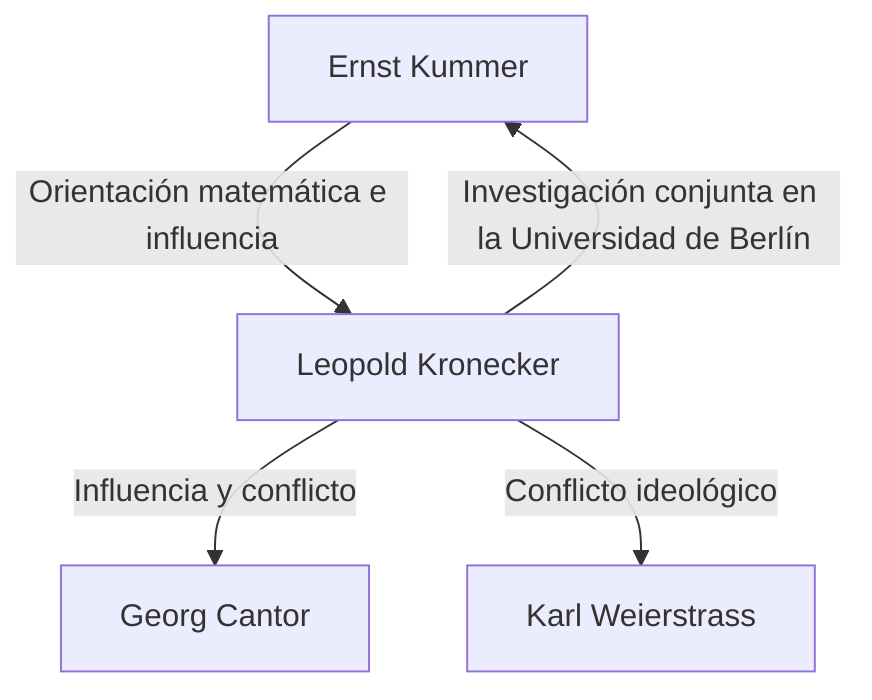

# 1. Introducción: Fe absoluta en los números enteros

> "Die ganzen Zahlen hat der liebe Gott gemacht, alles andere ist Menschenwerk."
> (Dios hizo los números enteros, el resto es obra de los hombres)

En la historia de las matemáticas, pocas citas son tan famosas o resumen tan perfectamente la ideología de un matemático como esta. El autor de estas palabras es el eminente matemático alemán del siglo XIX **Leopold Kronecker** (1823–1891).

Esta afirmación no fue meramente poética; estaba respaldada por su feroz creencia en el **constructivismo matemático**. En este artículo, profundizamos en la vida de Kronecker, las controversias que desató en la comunidad matemática y el magnífico legado que dejó en las matemáticas modernas.

# 2. La vida y los episodios de Kronecker

## 2.1. Talento floreciente y el encuentro con Kummer

Kronecker nació en 1823 en una adinerada familia judía en Liegnitz, Prusia (actualmente Legnica, Polonia). Mostrando un intelecto extraordinario desde temprana edad, se matriculó en el Gymnasium (escuela secundaria avanzada) local.

Fue aquí donde ocurrió un encuentro fatídico. Un nuevo profesor llegó al Gymnasium: **[Ernst Kummer](https://kenji.blog/p/kummer/)** , quien más tarde se convertiría en pionero de la teoría de ideales. Kummer reconoció de inmediato el talento de Kronecker y le brindó una instrucción matemática avanzada y personalizada.

## 2.2. Vida académica y éxito como empresario

En 1841, Kronecker ingresó a la Universidad de Berlín, estudiando con matemáticos de primer nivel como Peter Gustav Lejeune Dirichlet y [Carl Gustav Jacob Jacobi](https://kenji.blog/p/jacobi/). Para 1845, obtuvo su doctorado con una destacada tesis sobre teoría algebraica de números.

Sin embargo, Kronecker tomó luego un rumbo profesional extraño. En lugar de buscar un puesto universitario, regresó a su ciudad natal para hacerse cargo de la vasta finca agrícola y el negocio bancario de su tío. Logró un tremendo éxito como hombre de negocios y amasó una gran riqueza. Durante todo este período, continuó su investigación matemática como pasatiempo, lo que lo convirtió esencialmente en el matemático aficionado más fuerte de su tiempo.

## 2.3. Regreso a la Universidad de Berlín y prominencia académica

Habiendo alcanzado una completa independencia financiera, Kronecker regresó a Berlín en 1855. Comenzó a dar clases en la Universidad de Berlín como profesor privado no remunerado (Privatdozent). Dado que no necesitaba un salario para vivir, pudo sumergirse por completo en la investigación y las clases que amaba.

Finalmente, sus abrumadores logros fueron reconocidos y, en 1861, fue elegido miembro de pleno derecho de la Academia de Ciencias de Berlín. Esto le otorgó el privilegio de dar clases en la universidad sin tener una cátedra formal (aunque más tarde se convertiría en profesor titular).

# 3. Conflictos ideológicos: Constructivismo vs. Teoría de conjuntos

Al hablar de la vida de Kronecker, no se pueden omitir sus feroces debates con otros matemáticos.

## 3.1. Constructivismo estricto

Kronecker tenía la firme convicción de que "solo las cosas que pueden ser calculadas y construidas explícitamente en un número finito de operaciones existen matemáticamente". Despreciaba ferozmente las pruebas de existencia no constructivas por reducción al absurdo (la lógica de que "si asumimos que no existe, surge una contradicción; por lo tanto, existe").

Por ejemplo, con respecto al [Teorema Fundamental del Álgebra](https://kenji.blog/p/fundamental-theorem-of-algebra/), argumentó que demostrar simplemente que "existe una raíz" era insuficiente; debía ir acompañado de un algoritmo que detallara "cómo construir explícitamente la raíz".

## 3.2. Enfrentamientos con Cantor y Weierstrass

Esta ideología extrema lo llevó a entrar en conflicto con sus contemporáneos.

El más famoso de estos fue su vehemente crítica a **[Georg Cantor](https://kenji.blog/p/cantor/)** y su Teoría de Conjuntos. Kronecker condenó los conceptos de Cantor sobre cardinalidades de conjuntos infinitos y números transfinitos como "misticismo, no matemáticas", e incluso tomó medidas para obstaculizar la publicación de los artículos de Cantor.

También se enfrentó a **[Karl Weierstrass](https://kenji.blog/p/weierstrass/)** , quien alguna vez fue un amigo cercano. Con respecto al análisis de Weierstrass (como la construcción de funciones continuas que no son diferenciables en ninguna parte), Kronecker criticó tales funciones como "patológicas" y declaró que no existían.

# 4. Grandes contribuciones a las matemáticas

Si bien la ideología de Kronecker era a veces extrema, sus logros matemáticos fueron innegablemente de primer nivel, y su nombre corona numerosos conceptos en todas las matemáticas modernas.

## 4.1. Delta de Kronecker

Quizás la más conocida es la "Delta de Kronecker". Apareciendo frecuentemente en álgebra lineal y física (como en la mecánica cuántica y el análisis tensorial), este símbolo se define de la siguiente manera:

$$
\delta_{ij} = \begin{cases} 
1 & (i = j) \\ 
0 & (i \neq j) 
\end{cases}
$$

Este simple símbolo permite escribir definiciones de productos internos y matrices ortogonales de manera muy concisa. Por ejemplo, el producto interno de una base ortonormal $\mathbf{e}_1, \dots, \mathbf{e}_n$ se expresa como:

$$
\mathbf{e}_i \cdot \mathbf{e}_j = \delta_{ij}
$$

## 4.2. Producto de Kronecker

El "Producto de Kronecker", un tipo de producto tensorial para matrices, también lleva su nombre. Para una matriz $A$ (tamaño $m \times n$) y una matriz $B$ (tamaño $p \times q$), su producto de Kronecker $A \otimes B$ se define como una matriz de bloques de tamaño $(mp) \times (nq)$:

$$
A \otimes B = \begin{pmatrix}
a_{11} B & \cdots & a_{1n} B \\
\vdots & \ddots & \vdots \\
a_{m1} B & \cdots & a_{mn} B
\end{pmatrix}
$$

Esto juega un papel esencial en la descripción de sistemas de muchos cuerpos en la teoría de la información cuántica, el procesamiento de señales y los algoritmos de aprendizaje automático.

## 4.3. Teorema de Kronecker-Weber

Uno de los pilares monumentales en la teoría algebraica de números es el "Teorema de Kronecker-Weber". El teorema establece lo siguiente:

**Teorema (Kronecker-Weber):** 
Cualquier extensión abeliana finita del cuerpo de los números racionales $\mathbb{Q}$ es un subcuerpo de algún cuerpo ciclotómico $\mathbb{Q}(\zeta_n)$. (Donde $\zeta_n$ es una raíz primitiva enésima de la unidad).

$$
\text{Gal}(K / \mathbb{Q}) \text{ es abeliano} \implies \exists n, K \subseteq \mathbb{Q}(\zeta_n)
$$

Este teorema demuestra que el concepto abstracto de una "extensión abeliana de los números racionales" puede ser agotado por completo mediante la operación muy concreta y comprensible de "adjuntar raíces de la unidad". Encarna a la perfección la filosofía de Kronecker de que todo debe ser construible.

## 4.4. El sueño de juventud de Kronecker (Jugendtraum)

El teorema de Kronecker-Weber se refería a extensiones abelianas sobre los números racionales $\mathbb{Q}$. Kronecker soñaba con extender esto a cuerpos algebraicos más generales, como los cuerpos cuadráticos imaginarios. Su gran pregunta, "¿Todas las extensiones abelianas de un cuerpo cuadrático imaginario son generadas por los valores especiales de ciertas funciones?", fue formulada más tarde como el **12º Problema de Hilbert** .

Se refería a esto como su "más querido sueño de juventud". Si bien este problema experimentó un progreso masivo a través de la teoría de cuerpos de clases de Teiji Takagi y la posterior teoría de multiplicación compleja, sigue siendo un problema principal sin resolver para cuerpos algebraicos completamente generales.

# 5. Conclusión

Leopold Kronecker fue un matemático con fuertes convicciones únicas y un sentido de la belleza estética. Si bien su actitud constructivista causó fricciones con contemporáneos como Cantor, fue reevaluada en el siglo XX en el contexto del intuicionismo de Brouwer y los enfoques algorítmicos en la informática (teoría de la computabilidad).

"Dios hizo los números enteros": estas palabras resumen la obsesión de Kronecker por eliminar los conceptos inciertos basados en la intuición humana y construir las matemáticas sobre cimientos sólidos como una roca. Su "Delta de Kronecker" y su "Jugendtraum" continúan cautivando a los matemáticos hoy en día, brillando con intensidad a la vanguardia del álgebra y la física.
