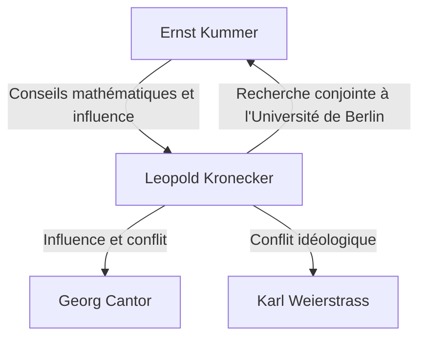

# 1. Introduction : Foi absolue dans les nombres entiers

> "Die ganzen Zahlen hat der liebe Gott gemacht, alles andere ist Menschenwerk."
> (Dieu a fait les nombres entiers, tout le reste est l'œuvre de l'homme)

Dans l'histoire des mathématiques, peu de citations sont aussi célèbres ou résument aussi parfaitement l'idéologie d'un mathématicien que celle-ci. L'auteur de ces mots est l'éminent mathématicien allemand du XIXe siècle **Leopold Kronecker** (1823–1891).

Cette déclaration n'était pas purement poétique ; elle était soutenue par sa croyance farouche dans le **constructivisme mathématique**. Dans cet article, nous plongeons profondément dans la vie de Kronecker, les controverses qu'il a suscitées dans la communauté mathématique, et le magnifique héritage qu'il a laissé aux mathématiques modernes.

# 2. La vie et les épisodes de Kronecker

## 2.1. L'épanouissement du talent et la rencontre avec Kummer

Kronecker est né en 1823 dans une riche famille juive de Liegnitz, en Prusse (aujourd'hui Legnica, en Pologne). Faisant preuve d'une intelligence extraordinaire dès son plus jeune âge, il s'inscrivit au Gymnasium local (école secondaire de niveau avancé).

C'est là qu'eut lieu une rencontre fatidique. Un nouveau professeur arriva au Gymnasium — **[Ernst Kummer](https://kenji.blog/p/kummer/)** , qui allait plus tard devenir un pionnier de la théorie des idéaux. Kummer reconnut immédiatement le talent de Kronecker et lui dispensa un enseignement mathématique avancé et personnalisé.

## 2.2. Parcours académique et succès en tant qu'homme d'affaires

En 1841, Kronecker entra à l'Université de Berlin, étudiant sous la direction de mathématiciens de premier plan comme Peter Gustav Lejeune Dirichlet et [Carl Gustav Jacob Jacobi](https://kenji.blog/p/jacobi/). En 1845, il obtint son doctorat avec une thèse exceptionnelle sur la théorie algébrique des nombres.

Cependant, Kronecker prit ensuite un chemin de carrière étrange. Au lieu de chercher un poste universitaire, il retourna dans sa ville natale pour reprendre le vaste domaine agricole et les affaires bancaires de son oncle. Il connut un succès fulgurant en tant qu'homme d'affaires et amassa une grande richesse. Tout au long de cette période, il continua ses recherches mathématiques comme passe-temps, ce qui faisait essentiellement de lui le mathématicien amateur le plus fort de son époque.

## 2.3. Retour à l'Université de Berlin et proéminence académique

Ayant atteint une indépendance financière complète, Kronecker retourna à Berlin en 1855. Il commença à donner des conférences à l'Université de Berlin en tant que professeur privé non rémunéré (Privatdozent). N'ayant pas besoin d'un salaire pour vivre, il pouvait se plonger entièrement dans la recherche et les cours qu'il aimait.

Finalement, ses réalisations écrasantes furent reconnues et, en 1861, il fut élu membre à part entière de l'Académie des sciences de Berlin. Cela lui accorda le privilège de donner des cours à l'université sans occuper de chaire officielle (bien qu'il devînt plus tard professeur titulaire).

# 3. Conflits idéologiques : Constructivisme contre Théorie des Ensembles

Lorsqu'on discute de la vie de Kronecker, on ne peut omettre ses débats féroces avec d'autres mathématiciens.

## 3.1. Constructivisme strict

Kronecker avait la forte conviction que "seules les choses qui peuvent être explicitement calculées et construites en un nombre fini d'opérations existent mathématiquement". Il méprisait farouchement les preuves d'existence non constructives par l'absurde (la logique selon laquelle "si nous supposons que cela n'existe pas, une contradiction survient ; par conséquent, cela existe").

Par exemple, en ce qui concerne le théorème fondamental de l'algèbre, il soutenait qu'il ne suffisait pas de prouver qu'"une racine existe" ; un algorithme détaillant "comment construire explicitement la racine" devait l'accompagner.

## 3.2. Affrontements avec Cantor et Weierstrass

Cette idéologie extrême l'a conduit à des conflits avec ses contemporains.

La plus célèbre d'entre elles fut sa critique véhémente de **[Georg Cantor](https://kenji.blog/p/cantor/)** et de sa théorie des ensembles. Kronecker condamnait les concepts de Cantor concernant les cardinalités des ensembles infinis et les nombres transfinis comme étant du "mysticisme, et non des mathématiques", et a même pris des mesures pour entraver la publication des articles de Cantor.

Il s'est également heurté à **[Karl Weierstrass](https://kenji.blog/p/weierstrass/)** , qui était autrefois un ami proche. En ce qui concerne l'analyse de Weierstrass (telle que la construction de fonctions continues qui ne sont dérivables nulle part), Kronecker a critiqué ces fonctions comme étant "pathologiques" et a déclaré qu'elles n'existaient pas.

# 4. Grandes contributions aux mathématiques

Bien que l'idéologie de Kronecker fût parfois extrême, ses réalisations mathématiques étaient indéniablement de premier ordre, et son nom couronne de nombreux concepts dans les mathématiques modernes.

## 4.1. Delta de Kronecker

Le plus connu est peut-être le "symbole de Kronecker" (ou delta de Kronecker). Apparaissant fréquemment en algèbre linéaire et en physique (comme dans la mécanique quantique et l'analyse tensorielle), ce symbole est défini comme suit :

$$
\delta_{ij} = \begin{cases} 
1 & (i = j) \\ 
0 & (i \neq j) 
\end{cases}
$$

Ce symbole simple permet d'écrire les définitions des produits scalaires et des matrices orthogonales de manière très concise. Par exemple, le produit scalaire d'une base orthonormée $\mathbf{e}_1, \dots, \mathbf{e}_n$ s'exprime par :

$$
\mathbf{e}_i \cdot \mathbf{e}_j = \delta_{ij}
$$

## 4.2. Produit de Kronecker

Le "produit de Kronecker", un type de produit tensoriel pour les matrices, porte également son nom. Pour une matrice $A$ (taille $m \times n$) et une matrice $B$ (taille $p \times q$), leur produit de Kronecker $A \otimes B$ est défini comme une matrice bloc de taille $(mp) \times (nq)$ :

$$
A \otimes B = \begin{pmatrix}
a_{11} B & \cdots & a_{1n} B \\
\vdots & \ddots & \vdots \\
a_{m1} B & \cdots & a_{mn} B
\end{pmatrix}
$$

Cela joue un rôle essentiel dans la description des systèmes à N corps dans la théorie de l'information quantique, le traitement du signal et les algorithmes d'apprentissage automatique.

## 4.3. Théorème de Kronecker-Weber

L'un des piliers monumentaux de la théorie algébrique des nombres est le "théorème de Kronecker-Weber". Le théorème énonce ce qui suit :

**Théorème (Kronecker-Weber) :** 
Toute extension abélienne finie du corps des nombres rationnels $\mathbb{Q}$ est un sous-corps d'un corps cyclotomique $\mathbb{Q}(\zeta_n)$. (Où $\zeta_n$ est une racine $n$-ième primitive de l'unité).

$$
\text{Gal}(K / \mathbb{Q}) \text{ est abélien} \implies \exists n, K \subseteq \mathbb{Q}(\zeta_n)
$$

Ce théorème démontre que le concept abstrait d'une "extension abélienne des nombres rationnels" peut être entièrement épuisé par l'opération très concrète et compréhensible de l'"adjonction de racines de l'unité". Il incarne parfaitement la philosophie de Kronecker selon laquelle tout doit être constructible.

## 4.4. Le rêve de jeunesse de Kronecker (Jugendtraum)

Le théorème de Kronecker-Weber concernait les extensions abéliennes sur les nombres rationnels $\mathbb{Q}$. Kronecker rêvait d'étendre cela à des corps algébriques plus généraux, tels que les corps quadratiques imaginaires. Sa grande question, "Toutes les extensions abéliennes d'un corps quadratique imaginaire sont-elles générées par les valeurs spéciales de certaines fonctions ?", a ensuite été formulée comme le **12ème problème de Hilbert** .

Il s'y référait comme son "plus cher rêve de jeunesse". Bien que ce problème ait connu des progrès massifs grâce à la théorie des corps de classes de Teiji Takagi et à la théorie ultérieure de la multiplication complexe, il reste un problème majeur non résolu pour les corps algébriques complètement généraux.

# 5. Conclusion

Leopold Kronecker était un mathématicien aux convictions uniques et fortes, et doté d'un sens de la beauté esthétique. Bien que son attitude constructiviste ait causé des frictions avec des contemporains comme Cantor, elle a été réévaluée au 20ème siècle dans le contexte de l'intuitionnisme de Brouwer et des approches algorithmiques en informatique (théorie de la calculabilité).

"Dieu a fait les nombres entiers" — ces mots résument l'obsession de Kronecker d'éliminer les concepts incertains basés sur l'intuition humaine et de construire les mathématiques sur des fondations solides. Son "delta de Kronecker" et son "Jugendtraum" continuent de captiver les mathématiciens aujourd'hui, brillant de mille feux à l'avant-garde de l'algèbre et de la physique.
