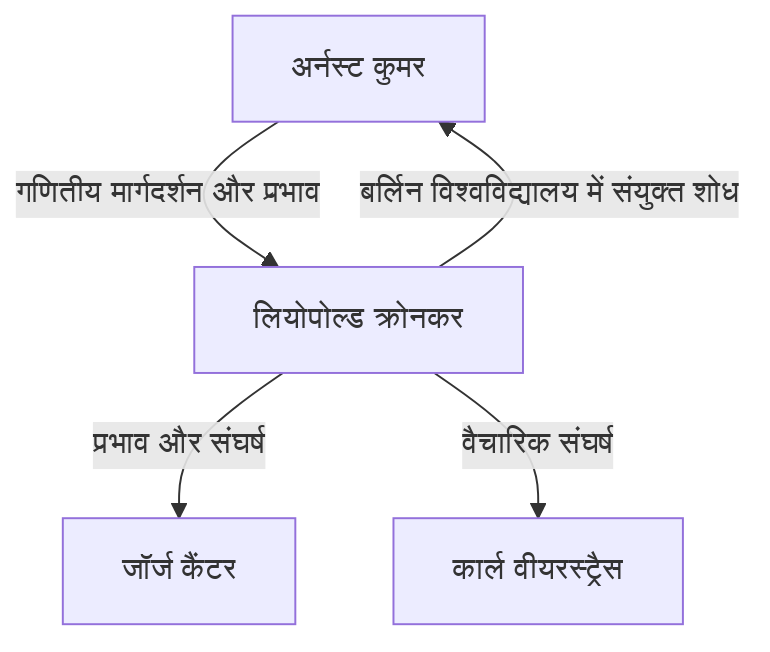

# 1. परिचय: पूर्णांकों में पूर्ण विश्वास

> "Die ganzen Zahlen hat der liebe Gott gemacht, alles andere ist Menschenwerk."
> (ईश्वर ने पूर्णांक बनाए, बाकी सब मनुष्य का कार्य है)

गणित के इतिहास में, बहुत कम उद्धरण इतने प्रसिद्ध हैं या किसी गणितज्ञ की विचारधारा का इतनी सटीकता से सारांश देते हैं जितना कि यह। इन शब्दों के लेखक 19वीं सदी के प्रख्यात जर्मन गणितज्ञ **लियोपोल्ड क्रोनकर** (1823–1891) हैं।

यह कथन केवल काव्यात्मक नहीं था; यह **गणितीय रचनावाद** (Mathematical constructivism) में उनके दृढ़ विश्वास द्वारा समर्थित था। इस लेख में, हम क्रोनकर के जीवन, गणितीय समुदाय में उनके द्वारा पैदा किए गए विवादों और आधुनिक गणित में उनके द्वारा छोड़ी गई शानदार विरासत की गहराई से पड़ताल करते हैं।

# 2. क्रोनकर का जीवन और प्रसंग

## 2.1. खिलती प्रतिभा और कुमर से मुलाकात

क्रोनकर का जन्म 1823 में लिग्निट्ज़, प्रशिया (अब लेग्निका, पोलैंड) में एक धनी यहूदी परिवार में हुआ था। कम उम्र से ही असाधारण बुद्धि का प्रदर्शन करते हुए, उन्होंने स्थानीय जिमनैजियम (उन्नत माध्यमिक विद्यालय) में दाखिला लिया।

यहीं पर एक भाग्यशाली मुलाकात हुई। जिमनैजियम में एक नए शिक्षक आए— **[अर्नस्ट कुमर](https://kenji.blog/p/kummer/)** , जो बाद में आदर्श सिद्धांत (Ideal theory) के प्रणेता बने। कुमर ने तुरंत क्रोनकर की प्रतिभा को पहचान लिया और उन्हें उन्नत, व्यक्तिगत गणितीय शिक्षा प्रदान की।

## 2.2. शिक्षा और एक व्यवसायी के रूप में सफलता

1841 में, क्रोनकर ने बर्लिन विश्वविद्यालय में प्रवेश लिया, जहाँ उन्होंने पीटर गुस्ताव लेज्यून डिरिचलेट और [कार्ल गुस्ताव जैकब जैकोबी](https://kenji.blog/p/jacobi/) जैसे शीर्ष स्तर के गणितज्ञों के अधीन अध्ययन किया। 1845 तक, उन्होंने बीजीय संख्या सिद्धांत (Algebraic number theory) पर एक उत्कृष्ट थीसिस के साथ डॉक्टरेट की उपाधि प्राप्त कर ली थी।

हालाँकि, क्रोनकर ने फिर एक अजीब करियर पथ अपनाया। विश्वविद्यालय में पद खोजने के बजाय, वह अपने चाचा की विशाल कृषि संपत्ति और बैंकिंग व्यवसाय को संभालने के लिए अपने गृहनगर लौट आए। उन्होंने एक व्यापारी के रूप में जबरदस्त सफलता हासिल की और अपार धन अर्जित किया। इस पूरी अवधि के दौरान, उन्होंने शौक के रूप में अपना गणितीय शोध जारी रखा, जिसने अनिवार्य रूप से उन्हें अपने समय का सबसे मजबूत शौकिया गणितज्ञ बना दिया।

## 2.3. बर्लिन विश्वविद्यालय में वापसी और अकादमिक प्रमुखता

पूर्ण वित्तीय स्वतंत्रता प्राप्त करने के बाद, क्रोनकर 1855 में बर्लिन लौट आए। उन्होंने बर्लिन विश्वविद्यालय में एक अवैतनिक निजी व्याख्याता (Privatdozent) के रूप में व्याख्यान देना शुरू किया। चूँकि उन्हें जीने के लिए वेतन की आवश्यकता नहीं थी, इसलिए वे अपने पसंदीदा शोध और व्याख्यानों में पूरी तरह से डूब सकते थे।

अंततः, उनकी असाधारण उपलब्धियों को मान्यता मिली, और 1861 में उन्हें बर्लिन एकेडमी ऑफ साइंसेज के पूर्ण सदस्य के रूप में चुना गया। इससे उन्हें औपचारिक प्रोफेसरशिप के बिना विश्वविद्यालय में व्याख्यान देने का विशेषाधिकार प्राप्त हुआ (हालाँकि बाद में वह पूर्ण प्रोफेसर बन गए)।

# 3. वैचारिक संघर्ष: रचनावाद बनाम समुच्चय सिद्धांत

क्रोनकर के जीवन पर चर्चा करते समय, कोई भी अन्य गणितज्ञों के साथ उनकी भयंकर बहसों को नज़रअंदाज़ नहीं कर सकता।

## 3.1. सख्त रचनावाद

क्रोनकर को यह दृढ़ विश्वास था कि "केवल वे चीजें जिन्हें स्पष्ट रूप से गणना की जा सकती है और सीमित संख्या में संचालन में निर्मित किया जा सकता है, गणितीय रूप से मौजूद हैं।" वे विरोधाभास द्वारा गैर-रचनात्मक अस्तित्व प्रमाणों (यह तर्क कि "यदि हम मान लें कि यह मौजूद नहीं है, तो विरोधाभास उत्पन्न होता है; इसलिए, यह मौजूद है") से घृणा करते थे।

उदाहरण के लिए, बीजगणित के मौलिक प्रमेय के संबंध में, उन्होंने तर्क दिया कि केवल यह साबित करना कि "एक मूल (root) मौजूद है" अपर्याप्त था; इसके साथ एक एल्गोरिथम होना चाहिए जो यह विस्तार से बताए कि "मूल का स्पष्ट रूप से निर्माण कैसे करें।"

## 3.2. कैंटर और वीयरस्ट्रैस के साथ टकराव

यह चरम विचारधारा उन्हें अपने समकालीनों के साथ संघर्ष में ले गई।

इनमें से सबसे प्रसिद्ध **[जॉर्ज कैंटर](https://kenji.blog/p/cantor/)** और उनके समुच्चय सिद्धांत (Set Theory) की उनकी कड़ी आलोचना थी। क्रोनकर ने अनंत समुच्चयों (infinite sets) की कार्डिनैलिटी और ट्रांसफिनिट संख्याओं (transfinite numbers) के कैंटर के अवधारणाओं को "रहस्यवाद, गणित नहीं" के रूप में निंदा की, और यहाँ तक कि कैंटर के शोधपत्रों के प्रकाशन में बाधा डालने के लिए भी कदम उठाए।

वह **कार्ल वीयरस्ट्रैस** से भी टकराए, जो कभी उनके करीबी दोस्त थे। वीयरस्ट्रैस के विश्लेषण (जैसे निरंतर कार्यों का निर्माण जो कहीं भी अवकलनीय नहीं हैं) के संबंध में, क्रोनकर ने ऐसे कार्यों को "रोग संबंधी (pathological)" के रूप में आलोचना की और घोषणा की कि वे मौजूद नहीं हैं।

# 4. गणित में महान योगदान

यद्यपि क्रोनकर की विचारधारा कभी-कभी चरम थी, उनकी गणितीय उपलब्धियां निर्विवाद रूप से शीर्ष स्तर की थीं, और उनका नाम आधुनिक गणित में कई अवधारणाओं का ताज पहनता है।

## 4.1. क्रोनकर डेल्टा (Kronecker Delta)

शायद सबसे व्यापक रूप से जाना जाने वाला "क्रोनकर डेल्टा" है। रैखिक बीजगणित और भौतिकी (जैसे क्वांटम यांत्रिकी और टेंसर विश्लेषण) में अक्सर दिखाई देने वाला यह प्रतीक इस प्रकार परिभाषित किया गया है:

$$
\delta_{ij} = \begin{cases} 
1 & (i = j) \\ 
0 & (i \neq j) 
\end{cases}
$$

यह सरल प्रतीक आंतरिक गुणनफल (inner products) और ऑर्थोगोनल मैट्रिक्स (orthogonal matrices) की परिभाषाओं को बहुत संक्षिप्त रूप से लिखे जाने की अनुमति देता है। उदाहरण के लिए, एक ऑर्थोनॉर्मल आधार $\mathbf{e}_1, \dots, \mathbf{e}_n$ के आंतरिक गुणनफल को इस प्रकार व्यक्त किया जाता है:

$$
\mathbf{e}_i \cdot \mathbf{e}_j = \delta_{ij}
$$

## 4.2. क्रोनकर गुणनफल (Kronecker Product)

मैट्रिक्स के लिए टेंसर गुणनफल का एक प्रकार, "क्रोनकर गुणनफल", भी उन्हीं के नाम पर रखा गया है। एक मैट्रिक्स $A$ (आकार $m \times n$) और मैट्रिक्स $B$ (आकार $p \times q$) के लिए, उनका क्रोनकर गुणनफल $A \otimes B$ आकार $(mp) \times (nq)$ के ब्लॉक मैट्रिक्स के रूप में परिभाषित किया गया है:

$$
A \otimes B = \begin{pmatrix}
a_{11} B & \cdots & a_{1n} B \\
\vdots & \ddots & \vdots \\
a_{m1} B & \cdots & a_{mn} B
\end{pmatrix}
$$

यह क्वांटम सूचना सिद्धांत, सिग्नल प्रोसेसिंग, और मशीन लर्निंग एल्गोरिदम में कई-निकाय प्रणालियों (many-body systems) का वर्णन करने में महत्वपूर्ण भूमिका निभाता है।

## 4.3. क्रोनकर-वेबर प्रमेय (Kronecker-Weber Theorem)

बीजीय संख्या सिद्धांत में स्मारकीय स्तंभों में से एक "क्रोनकर-वेबर प्रमेय" है। यह प्रमेय निम्नलिखित बताता है:

**प्रमेय (क्रोनकर-वेबर):** 
परिमेय संख्याओं $\mathbb{Q}$ के क्षेत्र का कोई भी परिमित आबेलियन विस्तार (finite abelian extension) किसी साइक्लोटोमिक क्षेत्र $\mathbb{Q}(\zeta_n)$ का उपक्षेत्र (subfield) है। (जहाँ $\zeta_n$ एकता (unity) का एक आदिम $n$-वाँ मूल है)।

$$
\text{Gal}(K / \mathbb{Q}) \text{ आबेलियन है } \implies \exists n, K \subseteq \mathbb{Q}(\zeta_n)
$$

यह प्रमेय प्रदर्शित करता है कि "परिमेय संख्याओं के एक आबेलियन विस्तार" की अमूर्त अवधारणा को "एकता के मूलों को जोड़ने" के अत्यंत मूर्त और बोधगम्य संचालन द्वारा पूरी तरह से समाप्त किया जा सकता है। यह क्रोनकर के दर्शन को पूरी तरह से अपनाता है कि सब कुछ निर्माण योग्य होना चाहिए।

## 4.4. क्रोनकर का युगेन्ट्राम (Jugendtraum)

क्रोनकर-वेबर प्रमेय परिमेय संख्याओं $\mathbb{Q}$ पर आबेलियन विस्तार से संबंधित था। क्रोनकर ने इसे काल्पनिक द्विघात क्षेत्रों (imaginary quadratic fields) जैसे अधिक सामान्य बीजीय क्षेत्रों तक विस्तारित करने का सपना देखा। उनका बड़ा सवाल, "क्या एक काल्पनिक द्विघात क्षेत्र के सभी आबेलियन विस्तार कुछ निश्चित कार्यों के विशेष मूल्यों द्वारा उत्पन्न होते हैं?", बाद में **हिल्बर्ट की 12वीं समस्या** के रूप में तैयार किया गया था।

उन्होंने इसे अपने "युवावस्था के सबसे प्यारे सपने (dearest dream of youth)" के रूप में संदर्भित किया। यद्यपि इस समस्या ने टीजी ताकागी (Teiji Takagi) के क्लास फील्ड थ्योरी और बाद के जटिल गुणन सिद्धांत के माध्यम से बड़े पैमाने पर प्रगति देखी, यह पूरी तरह से सामान्य बीजीय क्षेत्रों के लिए एक प्रमुख अनसुलझी समस्या बनी हुई है।

# 5. निष्कर्ष

लियोपोल्ड क्रोनकर अद्वितीय, मजबूत दृढ़ विश्वास और सौंदर्य की सुंदरता की भावना वाले गणितज्ञ थे। यद्यपि उनके रचनावादी रवैये ने कैंटर जैसे समकालीनों के साथ घर्षण पैदा किया, 20वीं सदी में ब्राउवर के अंतर्ज्ञानवाद (intuitionism) और कंप्यूटर विज्ञान (कम्प्यूटेबिलिटी थ्योरी) में एल्गोरिथम दृष्टिकोण के संदर्भ में इसका पुनर्मूल्यांकन किया गया।

"ईश्वर ने पूर्णांक बनाए"—ये शब्द मानव अंतर्ज्ञान पर आधारित अनिश्चित अवधारणाओं को समाप्त करने और गणित को चट्टान की तरह ठोस नींव पर बनाने के क्रोनकर के जुनून को समाहित करते हैं। उनका "क्रोनकर डेल्टा" और "युगेन्ट्राम" आज भी गणितज्ञों को मोहित करते हैं, जो बीजगणित और भौतिकी के अग्रिम मोर्चे पर चमक रहे हैं।
