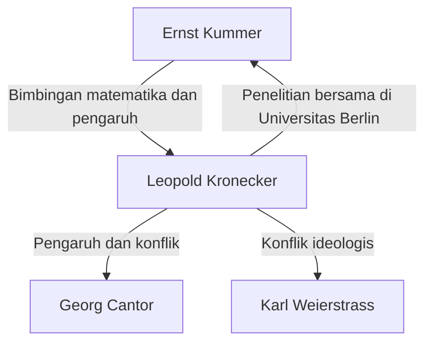

# 1. Pengantar: Keyakinan Mutlak pada Bilangan Bulat

> "Die ganzen Zahlen hat der liebe Gott gemacht, alles andere ist Menschenwerk."
> (Tuhan menciptakan bilangan bulat, yang lainnya adalah karya manusia)

Dalam sejarah matematika, jarang ada kutipan yang begitu terkenal atau meringkas ideologi seorang matematikawan dengan begitu sempurna seperti ini. Penulis kata-kata ini adalah matematikawan Jerman abad ke-19 yang terkemuka, **Leopold [Kronecker](https://kenji.blog/id/p/kronecker/)** (1823–1891).

Pernyataan ini bukan sekadar puitis; ia didukung oleh keyakinannya yang kuat pada **konstruktivisme matematika**. Dalam artikel ini, kita menyelami kehidupan [Kronecker](https://kenji.blog/id/p/kronecker/) secara mendalam, kontroversi yang ia timbulkan di komunitas matematika, dan warisan luar biasa yang ia tinggalkan pada matematika modern.

# 2. Kehidupan dan Episode [Kronecker](https://kenji.blog/id/p/kronecker/)

## 2.1. Bakat yang Berkembang dan Pertemuan dengan [Kummer](https://kenji.blog/id/p/kummer/)

[Kronecker](https://kenji.blog/id/p/kronecker/) lahir pada tahun 1823 di sebuah keluarga Yahudi yang kaya raya di Liegnitz, Prusia (sekarang Legnica, Polandia). Menunjukkan kecerdasan yang luar biasa sejak usia muda, ia mendaftar di Gymnasium (sekolah menengah lanjutan) setempat.

Di sinilah pertemuan yang menentukan terjadi. Seorang guru baru tiba di Gymnasium— **[Ernst Kummer](https://kenji.blog/id/p/kummer/)** , yang nantinya akan menjadi pelopor teori ideal. [Kummer](https://kenji.blog/id/p/kummer/) segera mengenali bakat [Kronecker](https://kenji.blog/id/p/kronecker/) dan memberinya instruksi matematika tingkat lanjut yang disesuaikan secara khusus.

## 2.2. Akademisi dan Kesuksesan sebagai Pengusaha

Pada tahun 1841, [Kronecker](https://kenji.blog/id/p/kronecker/) masuk ke Universitas Berlin, belajar di bawah bimbingan matematikawan papan atas seperti Peter Gustav Lejeune Dirichlet dan [Carl Gustav Jacob Jacobi](https://kenji.blog/id/p/jacobi/). Pada tahun 1845, ia memperoleh gelar doktornya dengan tesis yang luar biasa mengenai teori bilangan aljabar.

Namun, [Kronecker](https://kenji.blog/id/p/kronecker/) kemudian mengambil jalur karir yang aneh. Alih-alih mencari posisi di universitas, ia kembali ke kampung halamannya untuk mengambil alih perkebunan pertanian dan bisnis perbankan pamannya yang luas. Ia meraih kesuksesan luar biasa sebagai pengusaha dan mengumpulkan kekayaan yang besar. Sepanjang periode ini, ia melanjutkan penelitian matematikanya sebagai hobi, yang pada dasarnya menjadikannya matematikawan amatir terkuat di masanya.

## 2.3. Kembali ke Universitas Berlin dan Keunggulan Akademik

Setelah mencapai kemandirian finansial sepenuhnya, [Kronecker](https://kenji.blog/id/p/kronecker/) kembali ke Berlin pada tahun 1855. Ia mulai memberikan kuliah di Universitas Berlin sebagai dosen swasta yang tidak dibayar (Privatdozent). Karena ia tidak membutuhkan gaji untuk hidup, ia dapat membenamkan dirinya sepenuhnya dalam penelitian dan kuliah yang ia cintai.

Pada akhirnya, pencapaiannya yang luar biasa diakui, dan pada tahun 1861 ia terpilih sebagai anggota penuh Akademi Sains Berlin. Ini memberinya hak istimewa untuk memberikan kuliah di universitas tanpa memegang jabatan profesor formal (meskipun ia kemudian menjadi profesor penuh).

# 3. Konflik Ideologis: Konstruktivisme vs. Teori Himpunan

Saat membahas kehidupan [Kronecker](https://kenji.blog/id/p/kronecker/), seseorang tidak dapat mengabaikan perdebatan sengitnya dengan matematikawan lain.

## 3.1. Konstruktivisme yang Ketat

[Kronecker](https://kenji.blog/id/p/kronecker/) memiliki keyakinan yang kuat bahwa "hanya hal-hal yang dapat dihitung secara eksplisit dan dibangun dalam jumlah operasi yang terbatas yang ada secara matematis." Ia sangat membenci bukti eksistensi non-konstruktif melalui kontradiksi (logika bahwa "jika kita berasumsi ia tidak ada, kontradiksi muncul; oleh karena itu, ia ada").

Misalnya, mengenai [Teorema Fundamental Aljabar](https://kenji.blog/id/p/fundamental-theorem-of-algebra/), ia berpendapat bahwa sekadar membuktikan "akar itu ada" tidaklah cukup; sebuah algoritma yang merinci "bagaimana membangun akar tersebut secara eksplisit" harus menyertainya.

## 3.2. Bentrokan dengan Cantor dan Weierstrass

Ideologi ekstrem ini membawanya ke dalam konflik dengan rekan-rekan sezamannya.

Yang paling terkenal dari ini adalah kritiknya yang keras terhadap **[Georg Cantor](https://kenji.blog/id/p/cantor/)** dan Teori Himpunan-nya. [Kronecker](https://kenji.blog/id/p/kronecker/) mengutuk konsep Cantor tentang kardinalitas himpunan tak terhingga dan bilangan transfinit sebagai "mistisisme, bukan matematika," dan bahkan mengambil tindakan untuk menghalangi publikasi makalah Cantor.

Ia juga bentrok dengan **[Karl Weierstrass](https://kenji.blog/id/p/weierstrass/)** , yang dulunya adalah teman dekat. Mengenai analisis Weierstrass (seperti konstruksi fungsi kontinu yang tidak dapat didiferensialkan di mana pun), [Kronecker](https://kenji.blog/id/p/kronecker/) mengkritik fungsi semacam itu sebagai "patologis" dan menyatakan bahwa fungsi tersebut tidak ada.

# 4. Kontribusi Hebat untuk Matematika

Meskipun ideologi [Kronecker](https://kenji.blog/id/p/kronecker/) terkadang ekstrem, pencapaian matematikanya tidak dapat disangkal merupakan tingkat atas, dan namanya memahkotai banyak konsep di seluruh matematika modern.

## 4.1. Delta [Kronecker](https://kenji.blog/id/p/kronecker/)

Mungkin yang paling dikenal luas adalah "Delta [Kronecker](https://kenji.blog/id/p/kronecker/)." Sering muncul dalam aljabar linear dan fisika (seperti mekanika kuantum dan analisis tensor), simbol ini didefinisikan sebagai berikut:

$$
\delta_{ij} = \begin{cases} 
1 & (i = j) \\ 
0 & (i \neq j) 
\end{cases}
$$

Simbol sederhana ini memungkinkan definisi hasil kali dalam dan matriks ortogonal ditulis dengan sangat ringkas. Misalnya, hasil kali dalam dari basis ortonormal $\mathbf{e}_1, \dots, \mathbf{e}_n$ dinyatakan sebagai:

$$
\mathbf{e}_i \cdot \mathbf{e}_j = \delta_{ij}
$$

## 4.2. Hasil Kali [Kronecker](https://kenji.blog/id/p/kronecker/)

"Hasil Kali [Kronecker](https://kenji.blog/id/p/kronecker/)," sejenis hasil kali tensor untuk matriks, juga dinamai menurut namanya. Untuk sebuah matriks $A$ (ukuran $m \times n$) dan matriks $B$ (ukuran $p \times q$), hasil kali [Kronecker](https://kenji.blog/id/p/kronecker/) mereka $A \otimes B$ didefinisikan sebagai matriks blok berukuran $(mp) \times (nq)$:

$$
A \otimes B = \begin{pmatrix}
a_{11} B & \cdots & a_{1n} B \\
\vdots & \ddots & \vdots \\
a_{m1} B & \cdots & a_{mn} B
\end{pmatrix}
$$

Ini memainkan peran penting dalam menggambarkan sistem banyak-tubuh (many-body) dalam teori informasi kuantum, pemrosesan sinyal, dan algoritma pembelajaran mesin.

## 4.3. Teorema [Kronecker](https://kenji.blog/id/p/kronecker/)-Weber

Salah satu pilar monumental dalam teori bilangan aljabar adalah "Teorema [Kronecker](https://kenji.blog/id/p/kronecker/)-Weber." Teorema ini menyatakan hal berikut:

**Teorema ([Kronecker](https://kenji.blog/id/p/kronecker/)-Weber):** 
Setiap perluasan [Abel](https://kenji.blog/id/p/abel/)ian berhingga dari lapangan bilangan rasional $\mathbb{Q}$ adalah sublapangan dari suatu lapangan siklotomik $\mathbb{Q}(\zeta_n)$. (Di mana $\zeta_n$ adalah akar kesatuan primitif ke-$n$).

$$
\text{Gal}(K / \mathbb{Q}) \text{ adalah [Abel](https://kenji.blog/id/p/abel/)ian } \implies \exists n, K \subseteq \mathbb{Q}(\zeta_n)
$$

Teorema ini menunjukkan bahwa konsep abstrak dari "perluasan [Abel](https://kenji.blog/id/p/abel/)ian dari bilangan rasional" dapat sepenuhnya dihabiskan oleh operasi yang sangat konkret dan dapat dipahami yaitu "menambahkan akar kesatuan." Ini mewujudkan filosofi [Kronecker](https://kenji.blog/id/p/kronecker/) dengan sempurna bahwa segala sesuatu harus dapat dibangun.

## 4.4. Mimpi Masa Muda [Kronecker](https://kenji.blog/id/p/kronecker/) (Jugendtraum)

Teorema [Kronecker](https://kenji.blog/id/p/kronecker/)-Weber berkaitan dengan perluasan [Abel](https://kenji.blog/id/p/abel/)ian di atas bilangan rasional $\mathbb{Q}$. [Kronecker](https://kenji.blog/id/p/kronecker/) bermimpi untuk memperluas hal ini ke lapangan aljabar yang lebih umum, seperti lapangan kuadratik imajiner. Pertanyaan besarnya, "Apakah semua perluasan [Abel](https://kenji.blog/id/p/abel/)ian dari lapangan kuadratik imajiner dihasilkan oleh nilai-nilai khusus dari fungsi-fungsi tertentu?", kemudian dirumuskan sebagai **Masalah [Hilbert](https://kenji.blog/id/p/hilbert/) ke-12** .

Ia menyebut ini sebagai "mimpi masa mudanya yang paling disayangi." Meskipun masalah ini mengalami kemajuan besar melalui teori lapangan kelas Teiji [Takagi](https://kenji.blog/id/p/takagi-teiji/) dan teori perkalian kompleks yang menyusul, ia tetap menjadi masalah besar yang belum terpecahkan untuk lapangan aljabar yang sepenuhnya umum.

# 5. Kesimpulan

Leopold [Kronecker](https://kenji.blog/id/p/kronecker/) adalah seorang matematikawan dengan keyakinan yang unik dan kuat serta selera keindahan estetika. Meskipun sikap konstruktivisnya menyebabkan gesekan dengan rekan-rekan sezamannya seperti Cantor, hal ini dievaluasi ulang pada abad ke-20 dalam konteks intuisionisme Brouwer dan pendekatan algoritmik dalam ilmu komputer (teori komputabilitas).

"Tuhan menciptakan bilangan bulat"—kata-kata ini merangkum obsesi [Kronecker](https://kenji.blog/id/p/kronecker/) untuk menghilangkan konsep-konsep tidak pasti yang didasarkan pada intuisi manusia dan membangun matematika di atas fondasi yang sekokoh batu karang. "Delta [Kronecker](https://kenji.blog/id/p/kronecker/)" dan "Jugendtraum"-nya terus memikat para matematikawan saat ini, bersinar terang di garis depan aljabar dan fisika.
