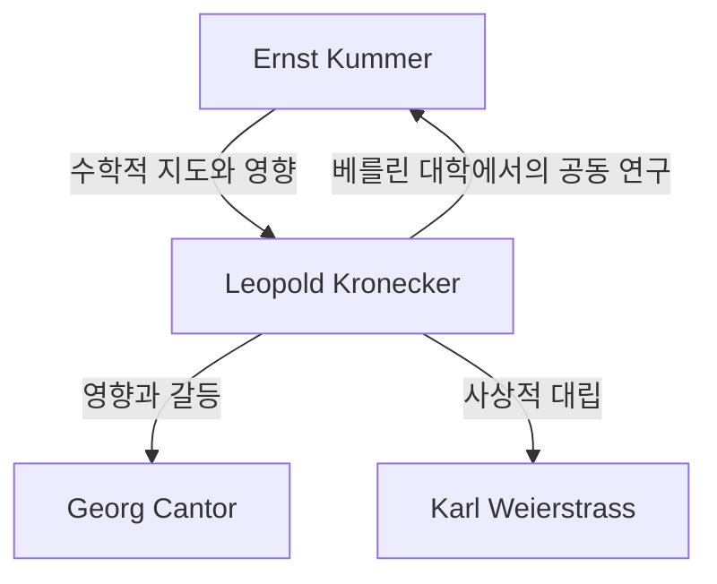

# 1. 서론: 정수에 대한 절대적인 믿음

> "Die ganzen Zahlen hat der liebe Gott gemacht, alles andere ist Menschenwerk."
> (신은 정수를 만들었고, 나머지는 모두 인간의 작품이다)

수학의 역사에서 이 명언만큼 유명하고 한 수학자의 사상을 단적으로 보여주는 구절은 없습니다. 이 말을 남긴 사람은 19세기 독일을 대표하는 수학자 **레오폴트 크로네커** (Leopold [Kronecker](https://kenji.blog/ko/p/kronecker/), 1823–1891)입니다.

그의 이 말은 단순한 시적 표현이 아니라, 그의 **수학적 구성주의** (Constructivism)라는 강렬한 신념에서 비롯된 것이었습니다. 이 글에서는 크로네커의 생애, 그가 수학계에서 일으킨 논쟁, 그리고 그가 현대 수학에 남긴 위대한 발자취에 대해 깊이 파헤쳐 봅니다.

# 2. 크로네커의 생애와 에피소드

## 2.1. 재능의 개화와 쿰머와의 만남

크로네커는 1823년 프로이센 왕국의 리그니츠(현재 폴란드의 레그니차)에서 부유한 유대인 가정에 태어났습니다. 어릴 때부터 뛰어난 지능을 보였던 그는 지역의 김나지움(고급 중등학교)에 입학했습니다.

이곳에서 그의 운명을 결정짓는 만남이 일어났습니다. 당시 김나지움에 새로운 교사로 부임한 사람이 훗날 이데알 이론의 선구자가 될 위대한 수학자 **[에른스트 쿰머](https://kenji.blog/ko/p/kummer/)** ([Ernst Kummer](https://kenji.blog/ko/p/kummer/))였던 것입니다. 쿰머는 크로네커의 재능을 즉시 알아보고 그에게 고도의 수학을 개별 지도했습니다.

## 2.2. 학업과 실업가로서의 성공

1841년 크로네커는 베를린 대학에 진학하여 페터 구스타프 디리클레와 야코비 같은 당대 최고의 수학자들 밑에서 배웠습니다. 1845년에는 대수적 정수론에 관한 훌륭한 논문으로 박사 학위를 취득했습니다.

그러나 여기서 크로네커는 기묘한 경력을 걷게 됩니다. 대학의 교수직을 구하는 대신 삼촌의 광대한 농장과 은행업을 이어받기 위해 고향으로 돌아간 것입니다. 그는 실업가로서 큰 성공을 거두고 막대한 재산을 모았습니다. 이 기간에도 그는 취미로 수학 연구를 계속했으며, 실로 당대 '최강의 아마추어 수학자'라 불릴 만했습니다.

## 2.3. 베를린 대학으로의 귀환과 학계의 거두

경제적으로 완전히 독립한 크로네커는 1855년에 다시 베를린으로 돌아옵니다. 그는 무급 사강사(Privatdozent)로서 베를린 대학에서 강의를 시작했습니다. 생계를 위해 월급을 벌 필요가 없었기 때문에 자신이 좋아하는 연구와 강의에 몰두할 수 있었습니다.

마침내 그의 압도적인 업적이 인정받아, 1861년에는 베를린 과학 아카데미의 정회원으로 선출됩니다. 이로써 그는 정식 교수직을 맡지 않고도 대학에서 강의할 특권을 얻었습니다(물론 훗날 정교수로 임명됩니다).

# 3. 사상적 대립: 구성주의 vs 집합론

크로네커의 생애를 논할 때 빼놓을 수 없는 것이 다른 수학자들과의 격렬한 논쟁입니다.

## 3.1. 구성주의의 철저함

크로네커는 "유한 번의 조작으로 구체적으로 계산하고 구성할 수 있는 것만이 수학적으로 존재한다"는 강한 신념을 가졌습니다. 그는 귀류법에 의한 비구성적 존재 증명("존재하지 않는다고 가정하면 모순이 발생한다, 고로 존재한다"는 논리)을 극도로 혐오했습니다.

예를 들어, [대수학의 기본 정리](https://kenji.blog/ko/p/fundamental-theorem-of-algebra/)에 대해서도 단순히 "근이 존재한다"는 증명만으로는 불충분하며, "어떻게 근을 구체적으로 구성할 것인가"라는 알고리즘이 반드시 수반되어야 한다고 주장했습니다.

## 3.2. 칸토어 및 바이어슈트라스와의 충돌

이러한 극단적인 사상은 동시대 수학자들과의 충돌을 낳았습니다.

가장 유명한 것은 **[게오르크 칸토어](https://kenji.blog/ko/p/cantor/)** ([Georg Cantor](https://kenji.blog/ko/p/cantor/))의 '집합론'에 대한 맹렬한 비판입니다. 칸토어가 제창한 무한 집합의 농도나 초한수 개념에 대해 크로네커는 이를 "수학이 아니라 신비주의다"라고 단정 짓고, 칸토어의 논문 출판을 방해하는 행동까지 서슴지 않았습니다.

또한 한때 절친한 친구였던 **[카를 바이어슈트라스](https://kenji.blog/ko/p/weierstrass/)** ([Karl Weierstrass](https://kenji.blog/ko/p/weierstrass/))와도 대립했습니다. 바이어슈트라스의 해석학(어디서도 미분 불가능한 연속 함수의 구성 등)에 대해 크로네커는 "그러한 병적인 함수는 존재하지 않는다"고 비판했습니다.

# 4. 수학에 대한 위대한 공헌

크로네커의 사상은 때때로 극단적이었지만, 그가 남긴 수학적 업적은 틀림없이 최고 수준이었으며 현대 수학 곳곳에 그의 이름이 붙은 개념들이 남아있습니다.

## 4.1. 크로네커 델타 ([Kronecker](https://kenji.blog/ko/p/kronecker/) Delta)

가장 널리 알려진 것은 아마도 '크로네커 델타'일 것입니다. 선형대수학이나 물리학(양자역학 및 텐서 해석)에서 자주 등장하는 이 기호는 다음과 같이 정의됩니다.

$$
\delta_{ij} = \begin{cases} 
1 & (i = j) \\ 
0 & (i \neq j) 
\end{cases}
$$

이 단순한 기호 덕분에 내적이나 직교 행렬의 정의를 매우 간결하게 기술할 수 있습니다. 예를 들어, 정규 직교 기저 $\mathbf{e}_1, \dots, \mathbf{e}_n$ 의 내적은 다음과 같이 표현됩니다.

$$
\mathbf{e}_i \cdot \mathbf{e}_j = \delta_{ij}
$$

## 4.2. 크로네커 곱 ([Kronecker](https://kenji.blog/ko/p/kronecker/) Product)

행렬 텐서 곱의 일종인 '크로네커 곱' 역시 그의 이름을 딴 것입니다. 행렬 $A$ (크기 $m \times n$)와 행렬 $B$ (크기 $p \times q$)의 크로네커 곱 $A \otimes B$ 는 크기 $(mp) \times (nq)$ 의 블록 행렬로서 다음과 같이 정의됩니다.

$$
A \otimes B = \begin{pmatrix}
a_{11} B & \cdots & a_{1n} B \\
\vdots & \ddots & \vdots \\
a_{m1} B & \cdots & a_{mn} B
\end{pmatrix}
$$

이는 양자 정보 이론에서의 다체계 기술, 신호 처리 및 머신 러닝 알고리즘에서 중요한 역할을 합니다.

## 4.3. 크로네커-베버 정리 ([Kronecker](https://kenji.blog/ko/p/kronecker/)-Weber Theorem)

대수적 정수론에서 금자탑 중 하나가 바로 '크로네커-베버 정리'입니다. 이 정리는 다음과 같이 주장합니다.

**정리 ([Kronecker](https://kenji.blog/ko/p/kronecker/)-Weber):** 
유리수체 $\mathbb{Q}$ 상의 임의의 유한 차수 아벨 확대체는 어떤 원분체 $\mathbb{Q}(\zeta_n)$ 의 부분체가 된다. (여기서 $\zeta_n$ 은 $1$ 의 원시 $n$ 제곱근)

$$
\text{Gal}(K / \mathbb{Q}) \text{ 가 아벨 군이다 } \implies \exists n, K \subseteq \mathbb{Q}(\zeta_n)
$$

이 정리는 "유리수체의 아벨 확대"라는 추상적인 대상이 "1의 거듭제곱근을 첨가한다"는 매우 구체적이고 이해하기 쉬운 조작에 의해 모두 설명될 수 있음을 보여줍니다. 참으로 모든 것이 구성 가능해야 한다는 크로네커의 사상을 완벽하게 구현한 아름다운 정리라 할 수 있습니다.

## 4.4. 크로네커의 청춘의 꿈 (Jugendtraum)

크로네커-베버 정리는 유리수체 $\mathbb{Q}$ 상의 아벨 확대에 관한 것이었습니다. 크로네커는 이를 허이차체 등 더 일반적인 대수체로 확장하기를 꿈꿨습니다. "허이차체의 임의의 아벨 확대는 어떤 특정 함수의 특수값에 의해 생성될 것인가?"라는 이 거대한 문제는 훗날 **힐베르트의 12번 문제** 로 정식화되었습니다.

그는 이를 "나의 가장 사랑하는 청춘의 꿈"이라고 불렀습니다. 이 문제는 다카기 데이지의 유체론 및 이후의 허수곱 이론에 의해 큰 진전이 있었지만, 완전한 일반 대수체에 대해서는 현재까지도 미해결된 주요 난제로 남아있습니다.

# 5. 결론

레오폴트 크로네커는 확고한 독자적 신념과 미적 감각을 지닌 수학자였습니다. 그의 구성주의적 태도는 동시대의 칸토어 등과 마찰을 빚기도 했지만, 20세기에 들어서 브라우어의 직관주의와 컴퓨터 과학에서의 알고리즘적 접근(계산 가능성 이론)의 맥락에서 재평가받게 됩니다.

"신은 정수를 만들었다" — 이 말에는 인간의 직관에 기초한 불확실한 개념을 배제하고, 수학을 반석같이 견고한 기초 위에 세우려 했던 크로네커의 집념이 담겨 있습니다. 그가 남긴 "크로네커 델타"와 "청춘의 꿈"은 오늘날에도 여전히 대수학과 물리학의 최전선에서 빛나며 수학자들을 매료시키고 있습니다.
