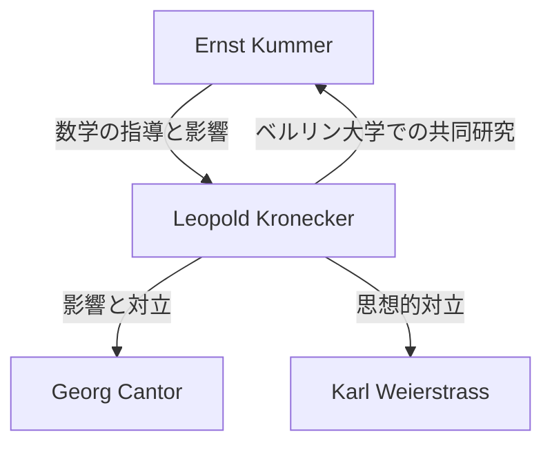

# 1. はじめに：整数への絶対的な信仰

> "Die ganzen Zahlen hat der liebe Gott gemacht, alles andere ist Menschenwerk."
> （神は整数を創り給うた、それ以外はすべて人間の作である）

数学の歴史において、これほどまでに有名で、かつ一人の数学者の思想を端的に表した言葉は他に類を見ません。この言葉を残したのは、19世紀ドイツを代表する数学者 **レオポルト・クロネッカー** （Leopold Kronecker, 1823–1891）です。

彼のこの言葉は、単なる詩的な表現ではなく、彼の **数学的構成主義** （Constructivism）という強烈な信念に裏打ちされたものでした。本記事では、クロネッカーの生涯、彼が巻き起こした数学界での論争、そして彼が現代数学に残した偉大な足跡について深く掘り下げていきます。

# 2. クロネッカーの生涯とエピソード

## 2.1. 才能の開花とクンマーとの出会い

クロネッカーは1823年、プロイセン王国のリーグニッツ（現在のポーランド領レグニツァ）で裕福なユダヤ人の家庭に生まれました。幼少期から卓越した知性を示した彼は、地元のギムナジウム（高等中学校）に入学します。

ここで彼の運命を決定づける出会いがありました。当時のギムナジウムの教師として赴任してきたのが、後にイデアル論の先駆者となる偉大な数学者 **[エルンスト・クンマー](https://kenji.blog/p/kummer/)** （[Ernst Kummer](https://kenji.blog/p/kummer/)）だったのです。クンマーはクロネッカーの才能を即座に見抜き、彼に高度な数学の個別指導を行いました。

## 2.2. 学業と実業家としての成功

1841年、クロネッカーはベルリン大学に進学し、ペーター・グスタフ・ディリクレやヤコビといった当時の最高峰の数学者たちから学びました。1845年には代数的整数論に関する優れた論文で博士号を取得します。

しかし、ここでクロネッカーは奇妙なキャリアを歩みます。大学のポストを求めるのではなく、叔父の広大な農場と銀行業の経営を引き継ぐため、故郷に戻ったのです。彼は実業家として大成功を収め、莫大な財産を築き上げました。この間も彼は趣味として数学の研究を続けており、まさに最強のアマチュア数学者と呼ぶべき状態でした。

## 2.3. ベルリン大学への帰還と学界の重鎮へ

経済的な独立を完全に果たしたクロネッカーは、1855年に再びベルリンへと戻ります。彼は無給の私講師としてベルリン大学で講義を始めました。生活のために給料を稼ぐ必要がなかったため、自分の好きな研究と講義に没頭できたのです。

やがて彼の圧倒的な業績が認められ、1861年にはベルリン科学アカデミーの正会員に選出されます。これにより、彼は正式な教授職に就くことなくベルリン大学で講義を行う特権を得ました（後に正式な教授にも就任します）。

# 3. 思想的対立：構成主義 vs 集合論

クロネッカーの生涯を語る上で欠かせないのが、他の数学者たちとの激しい論争です。

## 3.1. 構成主義の徹底

クロネッカーは、「有限回の操作で具体的に計算・構成できるものだけが数学的に存在する」という強い信念を持っていました。彼は、背理法による非構成的な存在証明（存在しないと仮定すると矛盾する、ゆえに存在する、という論法）を激しく嫌悪しました。

たとえば、[代数学の基本定理](https://kenji.blog/p/fundamental-theorem-of-algebra/)についても、単に「根が存在する」という証明だけでは不十分であり、「どのように根を具体的に構成するか」というアルゴリズムが伴わなければならないと主張しました。

## 3.2. カントールとワイエルシュトラスとの衝突

この極端な思想は、彼を同時代の数学者たちとの衝突へと導きます。

最も有名なのは、 **[ゲオルク・カントール](https://kenji.blog/p/cantor/)** （[Georg Cantor](https://kenji.blog/p/cantor/)）の「集合論」に対する猛烈な批判です。カントールが提唱した無限集合の濃度や超限数の概念に対し、クロネッカーはこれを「数学ではなく神秘主義である」と断じ、カントールの論文の出版を妨害するなどの行動に出ました。

また、かつては親友であった **[カール・ワイエルシュトラス](https://kenji.blog/p/weierstrass/)** （[Karl Weierstrass](https://kenji.blog/p/weierstrass/)）とも対立しました。ワイエルシュトラスの解析学（至る所微分不可能な連続関数の構成など）に対し、クロネッカーは「そのような病的な関数は存在しない」と批判しました。

# 4. 数学への偉大な貢献

クロネッカーの思想は時に極端でしたが、彼の残した数学的業績は間違いなく超一流であり、現代数学の至る所に彼の名前が冠されています。

## 4.1. クロネッカーのデルタ (Kronecker Delta)

最も広く知られているのが「クロネッカーのデルタ」でしょう。線形代数や物理学（量子力学やテンソル解析）において頻繁に登場するこの記号は、次のように定義されます。

$$
\delta_{ij} = \begin{cases} 
1 & (i = j) \\ 
0 & (i \neq j) 
\end{cases}
$$

この単純な記号により、内積や直交行列の定義が非常に簡潔に記述できるようになりました。例えば、正規直交基底 $\mathbf{e}_1, \dots, \mathbf{e}_n$ の内積は次のように表現されます。

$$
\mathbf{e}_i \cdot \mathbf{e}_j = \delta_{ij}
$$

## 4.2. クロネッカー積 (Kronecker Product)

行列のテンソル積の一種である「クロネッカー積」も、彼の名にちなんでいます。行列 $A$ （サイズ $m \times n$）と行列 $B$ （サイズ $p \times q$）のクロネッカー積 $A \otimes B$ は、サイズ $(mp) \times (nq)$ のブロック行列として次のように定義されます。

$$
A \otimes B = \begin{pmatrix}
a_{11} B & \cdots & a_{1n} B \\
\vdots & \ddots & \vdots \\
a_{m1} B & \cdots & a_{mn} B
\end{pmatrix}
$$

これは量子情報理論における多体系の記述や、信号処理、機械学習のアルゴリズムにおいても重要な役割を果たしています。

## 4.3. クロネッカー・ヴェーバーの定理 (Kronecker-Weber Theorem)

代数的整数論における金字塔の一つが「クロネッカー・ヴェーバーの定理」です。この定理は次のように主張します。

**定理 (Kronecker-Weber):** 
有理数体 $\mathbb{Q}$ 上の任意の有限次アーベル拡大は、ある円分体 $\mathbb{Q}(\zeta_n)$ の部分体となる。（ここで $\zeta_n$ は $1$ の原始 $n$ 乗根）

$$
\text{Gal}(K / \mathbb{Q}) \text{ がアーベル群である} \implies \exists n, K \subseteq \mathbb{Q}(\zeta_n)
$$

この定理は、「有理数体のアーベル拡大」という抽象的な対象が、「1の冪根を付加する」という非常に具体的で分かりやすい操作によってすべて尽くされることを示しています。まさに構成可能でなければならないというクロネッカーの思想を体現したような美しい定理です。

## 4.4. クロネッカーの青春の夢 (Kronecker's Jugendtraum)

クロネッカー・ヴェーバーの定理は有理数体 $\mathbb{Q}$ 上のアーベル拡大に関するものでした。クロネッカーはこれを、虚二次体などのより一般の代数体へ拡張することを夢見ました。「虚二次体の任意のアーベル拡大は、ある特定の関数の特殊値によって生成されるか？」というこの壮大な問題は、後に **ヒルベルトの第12問題** として定式化されました。

彼はこれを「私の最も愛すべき青春の夢」と呼びました。この問題は、高木貞治による類体論や、後の虚数乗法論によって大きく進展しましたが、完全に一般の代数体に対しては現在でも未解決の大きなテーマとなっています。

# 5. おわりに

レオポルト・クロネッカーは、独自の強い信念と美意識を持った数学者でした。彼の構成主義的な態度は、同時代のカントールらとの間に軋轢を生みましたが、20世紀に入り、ブラウワーの直観主義や、コンピュータ科学におけるアルゴリズム的アプローチ（計算可能論）として再評価されることになります。

「神は整数を創り給うた」——この言葉には、人間の直観に基づく不確かな概念を排し、確固たる基礎の上に数学を築き上げようとしたクロネッカーの執念が込められています。彼が残した「クロネッカーのデルタ」や「青春の夢」は、今もなお数学者たちの心を捉え、代数学や物理学の最前線で輝き続けています。
