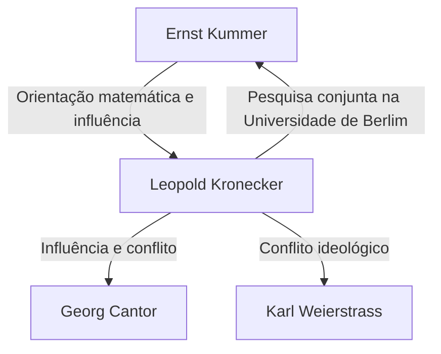

# 1. Introdução: Fé Absoluta nos Números Inteiros

> "Die ganzen Zahlen hat der liebe Gott gemacht, alles andere ist Menschenwerk."
> (Deus fez os números inteiros, o resto é obra do homem)

Na história da matemática, poucas citações são tão famosas ou resumem tão perfeitamente a ideologia de um matemático quanto esta. O autor destas palavras é o eminente matemático alemão do século XIX **Leopold [Kronecker](https://kenji.blog/pt/p/kronecker/)** (1823–1891).

Esta declaração não foi meramente poética; ela era apoiada por sua forte crença no **construtivismo matemático**. Neste artigo, mergulhamos profundamente na vida de [Kronecker](https://kenji.blog/pt/p/kronecker/), nas controvérsias que ele desencadeou na comunidade matemática e no magnífico legado que ele deixou na matemática moderna.

# 2. A Vida e os Episódios de [Kronecker](https://kenji.blog/pt/p/kronecker/)

## 2.1. Talento Florescente e o Encontro com [Kummer](https://kenji.blog/pt/p/kummer/)

[Kronecker](https://kenji.blog/pt/p/kronecker/) nasceu em 1823 em uma família judia rica em Liegnitz, Prússia (agora Legnica, Polônia). Exibindo um intelecto extraordinário desde tenra idade, matriculou-se no Gymnasium local (escola secundária avançada).

Foi aqui que ocorreu um encontro fatídico. Um novo professor chegou ao Gymnasium — **[Ernst Kummer](https://kenji.blog/pt/p/kummer/)** , que mais tarde se tornaria um pioneiro da teoria dos ideais. Kummer reconheceu imediatamente o talento de [Kronecker](https://kenji.blog/pt/p/kronecker/) e forneceu-lhe instrução matemática avançada e personalizada.

## 2.2. Academia e Sucesso como Empresário

Em 1841, [Kronecker](https://kenji.blog/pt/p/kronecker/) ingressou na Universidade de Berlim, estudando sob a tutela de matemáticos de primeira linha como Peter Gustav Lejeune Dirichlet e [Carl Gustav Jacob Jacobi](https://kenji.blog/pt/p/jacobi/). Em 1845, obteve seu doutorado com uma tese notável sobre a teoria algébrica dos números.

No entanto, [Kronecker](https://kenji.blog/pt/p/kronecker/) seguiu então um plano de carreira incomum. Em vez de procurar um cargo universitário, ele retornou à sua cidade natal para assumir a vasta propriedade agrícola e os negócios bancários de seu tio. Ele alcançou um tremendo sucesso como empresário e acumulou grande riqueza. Durante todo esse período, continuou sua pesquisa matemática como um hobby, o que essencialmente o tornou o matemático amador mais forte de sua época.

## 2.3. Retorno à Universidade de Berlim e Proeminência Acadêmica

Tendo alcançado total independência financeira, [Kronecker](https://kenji.blog/pt/p/kronecker/) retornou a Berlim em 1855. Começou a dar palestras na Universidade de Berlim como professor particular não remunerado (Privatdozent). Como não precisava de um salário para viver, pôde mergulhar inteiramente nas pesquisas e aulas que amava.

Eventualmente, suas conquistas impressionantes foram reconhecidas e, em 1861, ele foi eleito membro titular da Academia de Ciências de Berlim. Isso lhe concedeu o privilégio de dar palestras na universidade sem ocupar uma cátedra formal (embora mais tarde se tornasse professor titular).

# 3. Conflitos Ideológicos: Construtivismo vs. Teoria dos Conjuntos

Ao discutir a vida de [Kronecker](https://kenji.blog/pt/p/kronecker/), não se pode omitir seus ferozes debates com outros matemáticos.

## 3.1. Construtivismo Estrito

[Kronecker](https://kenji.blog/pt/p/kronecker/) tinha uma forte convicção de que "apenas as coisas que podem ser calculadas explicitamente e construídas em um número finito de operações existem matematicamente". Ele desprezava ferozmente provas de existência não construtivas por contradição (a lógica de que "se assumirmos que não existe, surge uma contradição; portanto, existe").

Por exemplo, com relação ao [Teorema Fundamental da Álgebra](https://kenji.blog/pt/p/fundamental-theorem-of-algebra/), ele argumentou que provar meramente que "uma raiz existe" era insuficiente; um algoritmo detalhando "como construir explicitamente a raiz" deveria acompanhá-lo.

## 3.2. Embates com Cantor e Weierstrass

Esta ideologia extrema o levou a conflitos com seus contemporâneos.

A mais famosa destas foi a sua veemente crítica a **[Georg Cantor](https://kenji.blog/pt/p/cantor/)** e à sua Teoria dos Conjuntos. [Kronecker](https://kenji.blog/pt/p/kronecker/) condenou os conceitos de Cantor de cardinalidades de conjuntos infinitos e números transfinitos como "misticismo, não matemática", e até tomou medidas para dificultar a publicação dos artigos de Cantor.

Ele também entrou em conflito com **[Karl Weierstrass](https://kenji.blog/pt/p/weierstrass/)** , que já fora um amigo íntimo. Com relação à análise de Weierstrass (como a construção de funções contínuas que não são diferenciáveis em nenhum ponto), [Kronecker](https://kenji.blog/pt/p/kronecker/) criticou tais funções como "patológicas" e declarou que elas não existiam.

# 4. Grandes Contribuições à Matemática

Embora a ideologia de [Kronecker](https://kenji.blog/pt/p/kronecker/) fosse por vezes extrema, suas conquistas matemáticas foram inegavelmente excelentes, e seu nome coroa inúmeros conceitos por toda a matemática moderna.

## 4.1. Delta de [Kronecker](https://kenji.blog/pt/p/kronecker/)

Talvez a mais conhecida seja o "Delta de [Kronecker](https://kenji.blog/pt/p/kronecker/)". Aparecendo frequentemente na álgebra linear e física (como mecânica quântica e análise tensorial), este símbolo é definido da seguinte forma:

$$
\delta_{ij} = \begin{cases} 
1 & (i = j) \\ 
0 & (i \neq j) 
\end{cases}
$$

Este símbolo simples permite que as definições de produtos internos e matrizes ortogonais sejam escritas de forma muito concisa. Por exemplo, o produto interno de uma base ortonormal $\mathbf{e}_1, \dots, \mathbf{e}_n$ é expresso como:

$$
\mathbf{e}_i \cdot \mathbf{e}_j = \delta_{ij}
$$

## 4.2. Produto de [Kronecker](https://kenji.blog/pt/p/kronecker/)

O "Produto de [Kronecker](https://kenji.blog/pt/p/kronecker/)", um tipo de produto tensorial para matrizes, também recebeu o seu nome. Para uma matriz $A$ (tamanho $m \times n$) e a matriz $B$ (tamanho $p \times q$), seu produto de [Kronecker](https://kenji.blog/pt/p/kronecker/) $A \otimes B$ é definido como uma matriz em blocos de tamanho $(mp) \times (nq)$:

$$
A \otimes B = \begin{pmatrix}
a_{11} B & \cdots & a_{1n} B \\
\vdots & \ddots & \vdots \\
a_{m1} B & \cdots & a_{mn} B
\end{pmatrix}
$$

Isso desempenha um papel essencial na descrição de sistemas de muitos corpos na teoria da informação quântica, processamento de sinais e algoritmos de aprendizado de máquina.

## 4.3. Teorema de [Kronecker](https://kenji.blog/pt/p/kronecker/)-Weber

Um dos pilares monumentais na teoria algébrica dos números é o "Teorema de [Kronecker](https://kenji.blog/pt/p/kronecker/)-Weber". O teorema afirma o seguinte:

**Teorema ([Kronecker](https://kenji.blog/pt/p/kronecker/)-Weber):** 
Qualquer extensão abeliana finita do corpo dos números racionais $\mathbb{Q}$ é um subcorpo de algum corpo ciclotômico $\mathbb{Q}(\zeta_n)$. (Onde $\zeta_n$ é uma raiz $n$-ésima primitiva da unidade).

$$
\text{Gal}(K / \mathbb{Q}) \text{ é abeliano} \implies \exists n, K \subseteq \mathbb{Q}(\zeta_n)
$$

Este teorema demonstra que o conceito abstrato de uma "extensão abeliana dos números racionais" pode ser totalmente esgotado pela operação altamente concreta e compreensível de "adjunção de raízes da unidade". Ele incorpora perfeitamente a filosofia de [Kronecker](https://kenji.blog/pt/p/kronecker/) de que tudo deve ser construtível.

## 4.4. O Sonho de Juventude de [Kronecker](https://kenji.blog/pt/p/kronecker/) (Jugendtraum)

O teorema de [Kronecker](https://kenji.blog/pt/p/kronecker/)-Weber dizia respeito às extensões abelianas sobre os números racionais $\mathbb{Q}$. Kronecker sonhava em estender isso para corpos algébricos mais gerais, como corpos quadráticos imaginários. A sua grande questão, "Será que todas as extensões abelianas de um corpo quadrático imaginário são geradas pelos valores especiais de certas funções?", foi mais tarde formulada como o **12º Problema de [Hilbert](https://kenji.blog/pt/p/hilbert/)** .

Ele se referia a isso como seu "mais querido sonho de juventude". Embora esse problema tenha visto um progresso maciço por meio da teoria de corpos de classes de Teiji [Takagi](https://kenji.blog/pt/p/takagi-teiji/) e a posterior teoria da multiplicação complexa, ele continua a ser um grande problema não resolvido para corpos algébricos completamente gerais.

# 5. Conclusão

Leopold [Kronecker](https://kenji.blog/pt/p/kronecker/) foi um matemático com convicções únicas e fortes e um senso de beleza estética. Embora sua atitude construtivista tenha causado atrito com contemporâneos como Cantor, ela foi reavaliada no século XX no contexto do intuicionismo de Brouwer e abordagens algorítmicas na ciência da computação (teoria da computabilidade).

"Deus fez os números inteiros" — essas palavras resumem a obsessão de [Kronecker](https://kenji.blog/pt/p/kronecker/) em eliminar conceitos incertos baseados na intuição humana e construir a matemática em bases sólidas como rocha. Seu "Delta de [Kronecker](https://kenji.blog/pt/p/kronecker/)" e seu "Jugendtraum" continuam a cativar os matemáticos hoje, brilhando intensamente na vanguarda da álgebra e da física.
