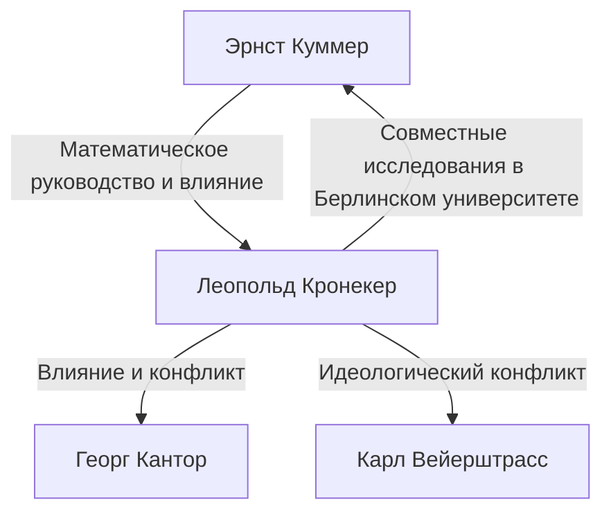

# 1. Введение: Абсолютная вера в целые числа

> "Die ganzen Zahlen hat der liebe Gott gemacht, alles andere ist Menschenwerk."
> (Бог создал целые числа, всё остальное — дело рук человека)

В истории математики мало цитат, столь же известных или так идеально резюмирующих идеологию математика, как эта. Автор этих слов — выдающийся немецкий математик 19 века **Леопольд Кронекер** (1823–1891).

Это утверждение не было просто поэтичным; оно подкреплялось его яростной верой в **математический конструктивизм**. В этой статье мы глубоко погружаемся в жизнь Кронекера, споры, которые он вызвал в математическом сообществе, и великолепное наследие, которое он оставил современной математике.

# 2. Жизнь и эпизоды Кронекера

## 2.1. Расцвет таланта и встреча с Куммером

Кронекер родился в 1823 году в богатой еврейской семье в Лигнице, Пруссия (ныне Легница, Польша). Продемонстрировав выдающийся интеллект с раннего возраста, он поступил в местную гимназию.

Здесь произошла судьбоносная встреча. В гимназию приехал новый учитель — **Эрнст Куммер** , который позже стал пионером теории идеалов. Куммер сразу распознал талант Кронекера и обеспечил ему углубленное, индивидуальное обучение математике.

## 2.2. Учеба и успех в качестве бизнесмена

В 1841 году Кронекер поступил в Берлинский университет, где учился у таких первоклассных математиков, как Петер Густав Лежён Дирихле и Карл Густав Якоб Якоби. К 1845 году он получил докторскую степень за выдающуюся диссертацию по алгебраической теории чисел.

Однако затем Кронекер выбрал странный карьерный путь. Вместо того чтобы искать должность в университете, он вернулся в свой родной город, чтобы взять на себя управление обширным фермерским хозяйством и банковским бизнесом своего дяди. Он добился огромного успеха как бизнесмен и накопил большое состояние. На протяжении всего этого периода он продолжал свои математические исследования в качестве хобби, что по сути сделало его самым сильным математиком-любителем своего времени.

## 2.3. Возвращение в Берлинский университет и академическая известность

Достигнув полной финансовой независимости, Кронекер вернулся в Берлин в 1855 году. Он начал читать лекции в Берлинском университете в качестве неоплачиваемого приват-доцента. Поскольку ему не нужна была зарплата для жизни, он мог полностью погрузиться в исследования и лекции, которые так любил.

В конце концов его выдающиеся достижения были признаны, и в 1861 году он был избран действительным членом Берлинской академии наук. Это дало ему привилегию читать лекции в университете, не занимая формальной должности профессора (хотя позже он стал полноправным профессором).

# 3. Идеологические конфликты: Конструктивизм против Теории множеств

Обсуждая жизнь Кронекера, нельзя обойти стороной его яростные дебаты с другими математиками.

## 3.1. Строгий конструктивизм

Кронекер был твердо убежден, что «только те вещи, которые могут быть явно вычислены и построены за конечное число операций, существуют математически». Он яростно презирал неконструктивные доказательства существования от противного (логика, согласно которой «если мы предположим, что этого не существует, возникает противоречие; следовательно, это существует»).

Например, что касается Основной теоремы алгебры, он утверждал, что просто доказать, что «корень существует», недостаточно; доказательство должно сопровождаться алгоритмом, подробно описывающим, «как явно построить корень».

## 3.2. Столкновения с Кантором и Вейерштрассом

Эта радикальная идеология привела его к конфликту с современниками.

Самым известным из них была его резкая критика **Георга Кантора** и его Теории множеств. Кронекер осудил концепции Кантора о мощностях бесконечных множеств и трансфинитных числах как «мистицизм, а не математику» и даже предпринял действия, чтобы воспрепятствовать публикации статей Кантора.

Он также вступил в конфликт с **Карлом Вейерштрассом** , который когда-то был его близким другом. Что касается анализа Вейерштрасса (такого как построение непрерывных функций, которые нигде не дифференцируемы), Кронекер раскритиковал такие функции как «патологические» и заявил, что их не существует.

# 4. Великие достижения в математике

Хотя идеология Кронекера иногда была радикальной, его математические достижения, несомненно, были на высшем уровне, и его имя носят многочисленные концепции во всей современной математике.

## 4.1. Символ Кронекера (Дельта Кронекера)

Возможно, самым известным является «Символ Кронекера». Часто появляющийся в линейной алгебре и физике (например, в квантовой механике и тензорном анализе), этот символ определяется следующим образом:

$$
\delta_{ij} = \begin{cases} 
1 & (i = j) \\ 
0 & (i \neq j) 
\end{cases}
$$

Этот простой символ позволяет очень лаконично записывать определения скалярных произведений и ортогональных матриц. Например, скалярное произведение ортонормированного базиса $\mathbf{e}_1, \dots, \mathbf{e}_n$ выражается как:

$$
\mathbf{e}_i \cdot \mathbf{e}_j = \delta_{ij}
$$

## 4.2. Произведение Кронекера

«Произведение Кронекера», тип тензорного произведения для матриц, также названо в его честь. Для матрицы $A$ (размером $m \times n$) и матрицы $B$ (размером $p \times q$), их произведение Кронекера $A \otimes B$ определяется как блочная матрица размером $(mp) \times (nq)$:

$$
A \otimes B = \begin{pmatrix}
a_{11} B & \cdots & a_{1n} B \\
\vdots & \ddots & \vdots \\
a_{m1} B & \cdots & a_{mn} B
\end{pmatrix}
$$

Оно играет важную роль в описании многочастичных систем в квантовой теории информации, обработке сигналов и алгоритмах машинного обучения.

## 4.3. Теорема Кронекера-Вебера

Одним из монументальных столпов алгебраической теории чисел является «Теорема Кронекера-Вебера». Теорема гласит следующее:

**Теорема (Кронекера-Вебера):** 
Любое конечное абелево расширение поля рациональных чисел $\mathbb{Q}$ является подполем некоторого кругового поля $\mathbb{Q}(\zeta_n)$. (Где $\zeta_n$ — первообразный корень $n$-й степени из единицы).

$$
\text{Gal}(K / \mathbb{Q}) \text{ - абелева } \implies \exists n, K \subseteq \mathbb{Q}(\zeta_n)
$$

Эта теорема демонстрирует, что абстрактная концепция «абелева расширения рациональных чисел» может быть полностью исчерпана в высшей степени конкретной и понятной операцией «присоединения корней из единицы». Она идеально воплощает философию Кронекера о том, что всё должно быть конструктивным.

## 4.4. Юношеская мечта Кронекера (Jugendtraum)

Теорема Кронекера-Вебера относилась к абелевым расширениям над рациональными числами $\mathbb{Q}$. Кронекер мечтал распространить это на более общие алгебраические поля, такие как мнимые квадратичные поля. Его великий вопрос: «Порождаются ли все абелевы расширения мнимого квадратичного поля специальными значениями определенных функций?» — позже был сформулирован как **12-я проблема Гильберта** .

Он называл это своей «самой дорогой юношеской мечтой». Хотя в решении этой проблемы был достигнут значительный прогресс благодаря теории полей классов Тэйдзи Такаги и последующей теории комплексного умножения, она остается главной нерешенной проблемой для полностью общих алгебраических полей.

# 5. Заключение

Леопольд Кронекер был математиком с уникальными, сильными убеждениями и чувством эстетической красоты. Хотя его конструктивистская позиция вызывала трения с такими современниками, как Кантор, она была переоценена в 20 веке в контексте интуиционизма Брауэра и алгоритмических подходов в информатике (теория вычислимости).

«Бог создал целые числа» — эти слова воплощают одержимость Кронекера устранением неопределенных концепций, основанных на человеческой интуиции, и построением математики на прочном, как скала, фундаменте. Его «Символ Кронекера» и «Юношеская мечта» продолжают очаровывать математиков и сегодня, ярко сияя на переднем крае алгебры и физики.
