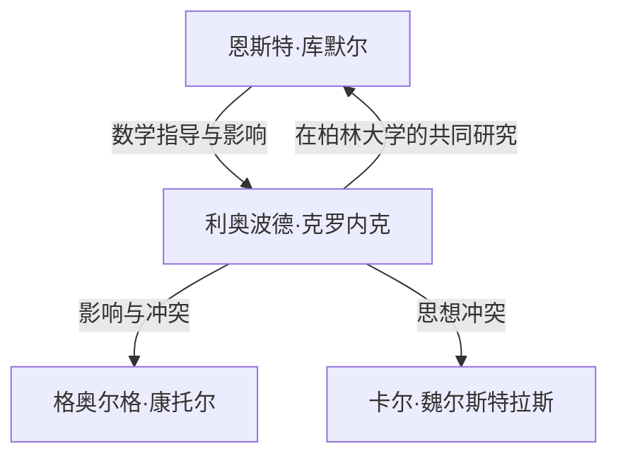

# 1. 引言：对整数的绝对信仰

> "Die ganzen Zahlen hat der liebe Gott gemacht, alles andere ist Menschenwerk."
> （上帝创造了整数，其余皆是人造）

在数学史上，很少有引言能像这句话一样著名，或者如此完美地概括了一位数学家的思想。说出这番话的是19世纪卓越的德国数学家 **利奥波德·克罗内克** （Leopold [Kronecker](https://kenji.blog/zh-cn/p/kronecker/), 1823–1891）。

这句话并非仅仅具有诗意；其背后是他对 **数学构造主义** （Constructivism）的强烈信仰。在这篇文章中，我们将深入探讨克罗内克的一生、他在数学界引发的争议，以及他为现代数学留下的宏伟遗产。

# 2. 克罗内克的一生与轶事

## 2.1. 才华的绽放与遇见库默尔

1823年，克罗内克出生于普鲁士利格尼茨（今波兰莱格尼察）的一个富裕犹太家庭。他从小就展现出非凡的智慧，并进入了当地的文理中学（高级中学）。

命运的邂逅就在这里发生。学校迎来了一位新教师—— **[恩斯特·库默尔](https://kenji.blog/zh-cn/p/kummer/)** （[Ernst Kummer](https://kenji.blog/zh-cn/p/kummer/)），他后来成为了理想数理论的先驱。库默尔立刻发现了克罗内克的才华，并为他提供了深入的、个性化的数学指导。

## 2.2. 学业与作为企业家的成功

1841年，克罗内克进入柏林大学，师从彼得·古斯塔夫·勒热纳·狄利克雷和[卡尔·古斯塔夫·雅各布·雅可比](https://kenji.blog/zh-cn/p/jacobi/)等顶尖数学家。到了1845年，他凭借一篇关于代数数论的杰出论文获得了博士学位。

然而，克罗内克随后走上了一条奇特的职业道路。他没有去寻求大学职位，而是回到家乡接管了叔叔庞大的农庄和银行业务。他作为一名商人取得了巨大的成功，并积累了巨额财富。在整个时期，他依然把数学研究当作一种爱好，这基本上使他成为了那个时代最强的业余数学家。

## 2.3. 重返柏林大学与学术巅峰

在实现了完全的财务自由后，克罗内克于1855年重返柏林。他开始在柏林大学担任无薪的私人讲师（Privatdozent）。因为他不再需要靠薪水生活，所以能够全身心地投入到他热爱的研究和讲课中。

最终，他那压倒性的成就获得了认可，在1861年，他被选为柏林科学院的正式院士。这赋予了他在大学里授课的特权，而无需担任正式的教授职务（尽管后来他确实成为了全职教授）。

# 3. 思想冲突：构造主义 vs 集合论

在讨论克罗内克的一生时，不可避免地要提到他与其他数学家的激烈辩论。

## 3.1. 严格的构造主义

克罗内克坚信：“只有那些可以在有限次操作中明确计算和构造出来的事物，在数学上才是存在的。”他强烈鄙视通过反证法得出的非构造性存在证明（即“如果我们假设它不存在，就会产生矛盾；因此，它必须存在”的逻辑）。

例如，关于[代数基本定理](https://kenji.blog/zh-cn/p/fundamental-theorem-of-algebra/)，他认为仅仅证明“根存在”是不够的；必须附有一个详细说明“如何明确构造出这个根”的算法。

## 3.2. 与康托尔和魏尔斯特拉斯的冲突

这种极端的思想使他与同时代的人发生了冲突。

其中最著名的就是他对 **[格奥尔格·康托尔](https://kenji.blog/zh-cn/p/cantor/)** （[Georg Cantor](https://kenji.blog/zh-cn/p/cantor/)）及其集合论的猛烈批评。克罗内克谴责康托尔关于无限集合的基数和超限数的概念是“神秘主义，而不是数学”，甚至采取行动阻碍康托尔论文的发表。

他还与曾经的密友 **[卡尔·魏尔斯特拉斯](https://kenji.blog/zh-cn/p/weierstrass/)** （[Karl Weierstrass](https://kenji.blog/zh-cn/p/weierstrass/)）发生了冲突。关于魏尔斯特拉斯的分析学（例如构造处处连续但处处不可微的函数），克罗内克批评这类函数是“病态的”，并宣称它们根本不存在。

# 4. 对数学的伟大贡献

尽管克罗内克的思想有时显得极端，但他的数学成就无可争议地处于顶尖水平，他的名字被冠于现代数学中众多的概念之上。

## 4.1. 克罗内克δ ([Kronecker](https://kenji.blog/zh-cn/p/kronecker/) Delta)

也许最广为人知的是“克罗内克δ”。这个符号频繁出现在线性代数和物理学（如量子力学和张量分析）中，其定义如下：

$$
\delta_{ij} = \begin{cases} 
1 & (i = j) \\ 
0 & (i \neq j) 
\end{cases}
$$

这个简单的符号使得内积和正交矩阵的定义可以写得非常简洁。例如，标准正交基 $\mathbf{e}_1, \dots, \mathbf{e}_n$ 的内积可以表示为：

$$
\mathbf{e}_i \cdot \mathbf{e}_j = \delta_{ij}
$$

## 4.2. 克罗内克积 ([Kronecker](https://kenji.blog/zh-cn/p/kronecker/) Product)

矩阵张量积的一种——“克罗内克积”，也是以他的名字命名的。对于矩阵 $A$ （大小为 $m \times n$）和矩阵 $B$ （大小为 $p \times q$），它们的克罗内克积 $A \otimes B$ 被定义为一个大小为 $(mp) \times (nq)$ 的分块矩阵：

$$
A \otimes B = \begin{pmatrix}
a_{11} B & \cdots & a_{1n} B \\
\vdots & \ddots & \vdots \\
a_{m1} B & \cdots & a_{mn} B
\end{pmatrix}
$$

这在量子信息理论中描述多体系统、信号处理以及机器学习算法中发挥着核心作用。

## 4.3. 克罗内克-韦伯定理 ([Kronecker](https://kenji.blog/zh-cn/p/kronecker/)-Weber Theorem)

代数数论中一个里程碑式的支柱是“克罗内克-韦伯定理”。该定理指出：

**定理 (克罗内克-韦伯)：** 
有理数域 $\mathbb{Q}$ 的任何有限阿贝尔扩张都是某个分圆域 $\mathbb{Q}(\zeta_n)$ 的子域。（其中 $\zeta_n$ 是本原 $n$ 次单位根）。

$$
\text{Gal}(K / \mathbb{Q}) \text{ 是阿贝尔群 } \implies \exists n, K \subseteq \mathbb{Q}(\zeta_n)
$$

这个定理表明，“有理数的阿贝尔扩张”这个抽象概念，可以通过“添加单位根”这个非常具体且易懂的操作来完全穷尽。这完美地体现了克罗内克“一切事物必须是可构造的”的哲学理念。

## 4.4. 克罗内克的青春之梦 (Jugendtraum)

克罗内克-韦伯定理涉及有理数 $\mathbb{Q}$ 上的阿贝尔扩张。克罗内克梦想将其推广到更一般的代数域上，例如虚二次域。他提出的宏大问题：“是否虚二次域的所有阿贝尔扩张都能由某些特定函数的特殊值生成？”，后来被系统地阐述为 **希尔伯特第12问题** 。

他将此称为他“最珍爱的青春之梦”。尽管这个问题在[高木贞治](/zh-cn/p/takagi-teiji/)的类域论以及后来的复乘理论推动下取得了巨大进展，但对于完全一般的代数域来说，这仍然是一个重大的未决问题。

# 5. 结语

利奥波德·克罗内克是一位拥有独特、强烈信念及审美情趣的数学家。虽然他的构造主义态度导致了与康托尔等同时代人的摩擦，但在20世纪，他的思想在布劳威尔的直觉主义和计算机科学的算法方法（可计算性理论）背景下重新获得了评价。

“上帝创造了整数”——这句话概括了克罗内克的执念：消除基于人类直觉的模糊概念，并将数学建立在坚如磐石的基础之上。他的“克罗内克δ”和“青春之梦”在代数和物理学的前沿继续熠熠生辉，至今仍让数学家们为之着迷。
