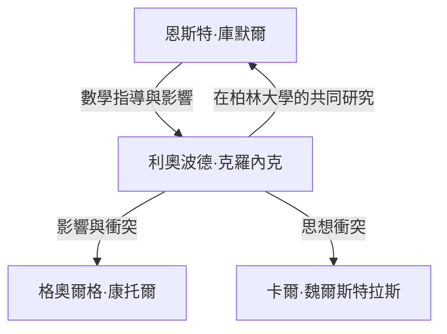

# 1. 引言：對整數的絕對信仰

> "Die ganzen Zahlen hat der liebe Gott gemacht, alles andere ist Menschenwerk."
> （上帝創造了整數，其餘皆是人造）

在數學史上，很少有引言能像這句話一樣著名，或者如此完美地概括了一位數學家的思想。說出這番話的是19世紀卓越的德國數學家 **利奧波德·克羅內克** （Leopold Kronecker, 1823–1891）。

這句話並非僅僅具有詩意；其背後是他對 **數學構造主義** （Constructivism）的強烈信仰。在這篇文章中，我們將深入探討克羅內克的一生、他在數學界引發的爭議，以及他為現代數學留下的宏偉遺產。

# 2. 克羅內克的一生與軼事

## 2.1. 才華的綻放與遇見庫默爾

1823年，克羅內克出生於普魯士利格尼茨（今波蘭萊格尼察）的一個富裕猶太家庭。他從小就展現出非凡的智慧，並進入了當地的文理中學（高級中學）。

命運的邂逅就在這裡發生。學校迎來了一位新教師—— **恩斯特·庫默爾** （Ernst Kummer），他後來成為了理想數理論的先驅。庫默爾立刻發現了克羅內克的才華，並為他提供了深入的、個性化的數學指導。

## 2.2. 學業與作為企業家的成功

1841年，克羅內克進入柏林大學，師從彼得·古斯塔夫·勒熱納·狄利克雷和卡爾·古斯塔夫·雅各布·雅可比等頂尖數學家。到了1845年，他憑藉一篇關於代數數論的傑出論文獲得了博士學位。

然而，克羅內克隨後走上了一條奇特的職業道路。他沒有去尋求大學職位，而是回到家鄉接管了叔叔龐大的農莊和銀行業務。他作為一名商人取得了巨大的成功，並積累了巨額財富。在整個時期，他依然把數學研究當作一種愛好，這基本上使他成為了那個時代最強的業餘數學家。

## 2.3. 重返柏林大學與學術巔峰

在實現了完全的財務自由後，克羅內克於1855年重返柏林。他開始在柏林大學擔任無薪的私人講師（Privatdozent）。因為他不再需要靠薪水生活，所以能夠全身心地投入到他熱愛的研究和講課中。

最終，他那壓倒性的成就獲得了認可，在1861年，他被選為柏林科學院的正式院士。這賦予了他在大學裡授業的特權，而無需擔任正式的教授職務（儘管後來他確實成為了全職教授）。

# 3. 思想衝突：構造主義 vs 集合論

在討論克羅內克的一生時，不可避免地要提到他與其他數學家的激烈辯論。

## 3.1. 嚴格的構造主義

克羅內克堅信：「只有那些可以在有限次操作中明確計算和構造出來的事物，在數學上才是存在的。」他強烈鄙視通過反證法得出的非構造性存在證明（即「如果我們假設它不存在，就會產生矛盾；因此，它必須存在」的邏輯）。

例如，關於代數基本定理，他認為僅僅證明「根存在」是不夠的；必須附有一個詳細說明「如何明確構造出這個根」的演算法。

## 3.2. 與康托爾和魏爾斯特拉斯的衝突

這種極端的思想使他與同時代的人發生了衝突。

其中最著名的就是他對 **格奧爾格·康托爾** （Georg Cantor）及其集合論的猛烈批評。克羅內克譴責康托爾關於無限集合的基數和超限數的概念是「神秘主義，而不是數學」，甚至採取行動阻礙康托爾論文的發表。

他還與曾經的密友 **卡爾·魏爾斯特拉斯** （Karl Weierstrass）發生了衝突。關於魏爾斯特拉斯的分析學（例如構造處處連續但處處不可微的函數），克羅內克批評這類函數是「病態的」，並宣稱它們根本不存在。

# 4. 對數學的偉大貢獻

儘管克羅內克的思想有時顯得極端，但他的數學成就無可爭議地處於頂尖水平，他的名字被冠於現代數學中眾多的概念之上。

## 4.1. 克羅內克δ (Kronecker Delta)

也許最廣為人知的是「克羅內克δ」。這個符號頻繁出現在線性代數和物理學（如量子力學和張量分析）中，其定義如下：

$$
\delta_{ij} = \begin{cases} 
1 & (i = j) \\ 
0 & (i \neq j) 
\end{cases}
$$

這個簡單的符號使得內積和正交矩陣的定義可以寫得非常簡潔。例如，標準正交基 $\mathbf{e}_1, \dots, \mathbf{e}_n$ 的內積可以表示為：

$$
\mathbf{e}_i \cdot \mathbf{e}_j = \delta_{ij}
$$

## 4.2. 克羅內克積 (Kronecker Product)

矩陣張量積的一種——「克羅內克積」，也是以他的名字命名的。對於矩陣 $A$ （大小為 $m \times n$）和矩陣 $B$ （大小為 $p \times q$），它們的克羅內克積 $A \otimes B$ 被定義為一個大小為 $(mp) \times (nq)$ 的分塊矩陣：

$$
A \otimes B = \begin{pmatrix}
a_{11} B & \cdots & a_{1n} B \\
\vdots & \ddots & \vdots \\
a_{m1} B & \cdots & a_{mn} B
\end{pmatrix}
$$

這在量子資訊理論中描述多體系統、信號處理以及機器學習演算法中發揮著核心作用。

## 4.3. 克羅內克-韋伯定理 (Kronecker-Weber Theorem)

代數數論中一個里程碑式的支柱是「克羅內克-韋伯定理」。該定理指出：

**定理 (克羅內克-韋伯)：** 
有理數域 $\mathbb{Q}$ 的任何有限阿貝爾擴張都是某個分圓域 $\mathbb{Q}(\zeta_n)$ 的子域。（其中 $\zeta_n$ 是本原 $n$ 次單位根）。

$$
\text{Gal}(K / \mathbb{Q}) \text{ 是阿貝爾群 } \implies \exists n, K \subseteq \mathbb{Q}(\zeta_n)
$$

這個定理表明，「有理數的阿貝爾擴張」這個抽象概念，可以通過「添加單位根」這個非常具體且易懂的操作來完全窮盡。這完美地體現了克羅內克「一切事物必須是可構造的」的哲學理念。

## 4.4. 克羅內克的青春之夢 (Jugendtraum)

克羅內克-韋伯定理涉及有理數 $\mathbb{Q}$ 上的阿貝爾擴張。克羅內克夢想將其推廣到更一般的代數域上，例如虛二次域。他提出的宏大問題：「是否虛二次域的所有阿貝爾擴張都能由某些特定函數的特殊值生成？」，後來被系統地闡述為 **希爾伯特第12問題** 。

他將此稱為他「最珍愛的青春之夢」。儘管這個問題在高木貞治的類域論以及後來的複乘理論推動下取得了巨大進展，但對於完全一般的代數域來說，這仍然是一個重大的未決問題。

# 5. 結語

利奧波德·克羅內克是一位擁有獨特、強烈信念及審美情趣的數學家。雖然他的構造主義態度導致了與康托爾等同時代人的摩擦，但在20世紀，他的思想在布勞威爾的直覺主義和電腦科學的演算法方法（可計算性理論）背景下重新獲得了評價。

「上帝創造了整數」——這句話概括了克羅內克的執念：消除基於人類直覺的模糊概念，並將數學建立在堅如磐石的基礎之上。他的「克羅內克δ」和「青春之夢」在代數和物理學的前沿繼續熠熠生輝，至今仍讓數學家們為之著迷。
