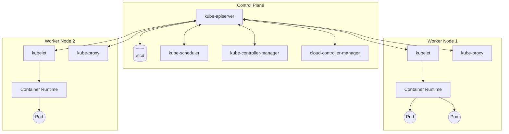
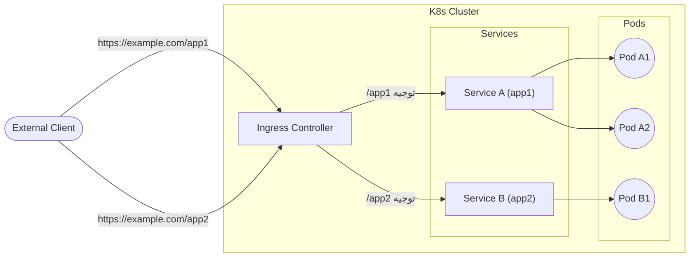

## 1. مقدمة

في تطوير البرمجيات وتشغيلها في العصر الحديث، أصبحت تقنية الحاويات (containers) لا غنى عنها. من بين هذه التقنيات، يُعتمد **Kubernetes** (والذي يُختصر عمومًا إلى **K8s** ) كمعيار فعلي لتنسيق الحاويات في الشركات حول العالم.

Kubernetes عبارة عن منصة مفتوحة المصدر لأتمتة نشر، توسيع، وإدارة التطبيقات المعبأة في حاويات. تم تصميمه في الأصل بواسطة Google وتتم صيانته حاليًا بواسطة مؤسسة Cloud Native Computing Foundation (CNCF).

في هذا المقال، سنتعمق في البنية المعمارية الشاملة لـ Kubernetes، وسنشرح بالتفصيل كيفية عمل مستوى التحكم (control plane) ودور الموارد الرئيسية مثل **Pod** ، **Service** ، و **Ingress** .

---

## 2. البنية المعمارية الشاملة لـ Kubernetes

تتكون مجموعة (cluster) Kubernetes بشكل أساسي من مكونين رئيسيين. وهما **مستوى التحكم (Control Plane)** و **عقدة العامل (Worker Node)** .

يوضح الشكل التالي البنية المعمارية الشاملة لـ Kubernetes.



يعمل مستوى التحكم كعقل مدبر للمجموعة بأكملها، وتعمل عقد العامل كأطراف تنفذ فعليًا التطبيقات (الحاويات).

---

## 3. مكونات مستوى التحكم

يتخذ مستوى التحكم قرارات عامة بشأن المجموعة (مثل الجدولة)، ويكتشف ويستجيب لأحداث المجموعة (على سبيل المثال، بدء Pod جديد عندما لا يتم تلبية حقل `replicas` الخاص بـ Deployment).

### 3.1. kube-apiserver

يعد **kube-apiserver** الواجهة الأمامية لمستوى تحكم Kubernetes. حيث يعرض واجهة برمجة تطبيقات Kubernetes (API) ويستقبل جميع الاتصالات من المستخدمين، وواجهة سطر الأوامر (CLI) (`kubectl`)، ومكونات مستوى التحكم الأخرى. تم تصميم خادم API ليكون قابلاً للتوسع (scale-out)، مما يسمح بتوزيع حركة المرور عبر مثيلات (instances) متعددة.

### 3.2. etcd

يعد **etcd** مخزنًا للقيم والمفاتيح (key-value store) متسقًا وعالي التوافر، يُستخدم لحفظ جميع بيانات المجموعة الخاصة بـ Kubernetes. يتم حفظ جميع حالات المجموعة، ومعلومات التكوين، والأسرار (Secrets) وما إلى ذلك في etcd. نظرًا لأن فقدان بيانات etcd يجعل استرداد المجموعة أمرًا صعبًا، فإن النسخ الاحتياطي المنتظم مهم جدًا.

### 3.3. kube-scheduler

يراقب **kube-scheduler** أي **Pod** تم إنشاؤه حديثًا ولم يتم تعيين عقدة له بعد، ويختار العقدة التي يجب أن يعمل عليها.
في قرارات الجدولة، يتم أخذ متطلبات الموارد الفردية، وقيود الأجهزة/البرامج/السياسات، ومواصفات التقارب (affinity) وعدم التقارب (anti-affinity)، وموقع البيانات في الاعتبار.

كجزء من خوارزمية الجدولة، يتم إجراء تقييم (scoring) للموارد. على سبيل المثال، يمكن التعبير عن المعادلة المستخدمة لحساب معدل استخدام موارد العقدة على النحو التالي:

$$
Score = \frac{Capacity - Requested}{Capacity} \times 100
$$

بناءً على هذه التقييمات، يتم اختيار العقدة المثلى.

### 3.4. kube-controller-manager

يعد **kube-controller-manager** المكون الذي يقوم بتشغيل عمليات وحدة التحكم (controller processes). منطقيًا، كل وحدة تحكم هي عملية منفصلة، ولكن لتقليل التعقيد، يتم تجميعها جميعًا في ملف ثنائي واحد ويتم تشغيلها كعملية واحدة.
تتضمن وحدات التحكم الرئيسية ما يلي:
- **Node Controller** : مسؤول عن الإشعار والاستجابة عندما تتعطل العقدة.
- **Job Controller** : يراقب كائنات Job التي تمثل مهام لمرة واحدة، وينشئ Pods لتنفيذ المهام حتى اكتمالها.
- **Endpoints Controller** : ينشئ كائنات Endpoints التي تربط بين Service و Pods.

### 3.5. cloud-controller-manager

مكون يقوم بتضمين منطق التحكم الخاص بمزود السحابة. يربط هذا المكون المجموعة بواجهة برمجة تطبيقات (API) مزود السحابة، ويفصل المكونات التي تتفاعل مع منصة السحابة عن المكونات التي تتفاعل فقط داخل المجموعة.

---

## 4. مكونات عقدة العامل

عقد العمال هي آلات افتراضية أو مادية تستضيف فعليًا أحمال عمل التطبيق (workloads).

### 4.1. kubelet

يعد **kubelet** وكيلاً (agent) يعمل على كل عقدة في المجموعة. يضمن أن الحاويات تعمل بشكل موثوق داخل الـ **Pod** .
يتلقى kubelet مجموعة من مواصفات Pod (PodSpec) المقدمة من خلال آليات مختلفة، ويتأكد من أن الحاويات الموصوفة في تلك المواصفات تعمل بشكل صحيح.

### 4.2. kube-proxy

يعد **kube-proxy** وكيل شبكة يعمل على كل عقدة في المجموعة، ويقوم بتنفيذ جزء من مفهوم **Service** الخاص بـ Kubernetes.
يحافظ kube-proxy على قواعد الشبكة على العقد، وتسمح هذه القواعد باتصالات الشبكة إلى Pods من داخل المجموعة أو خارجها. يستخدم طبقة تصفية الحزم (packet filtering layer) في نظام التشغيل (مثل iptables أو IPVS) لإجراء التوجيه.

### 4.3. [Container](https://kenji.blog/ar/p/docker-container-namespace-cgroups-layers/) Runtime

بيئة تشغيل الحاويات (Container Runtime) هي البرنامج المسؤول عن تشغيل الحاويات. يدعم Kubernetes بيئات تشغيل الحاويات مثل containerd و CRI-O.

---

## 5. Pod: أصغر وحدة نشر في Kubernetes

في Kubernetes، لا يتم نشر الحاويات مباشرةً. بدلاً من ذلك، نستخدم أصغر وحدة نشر في Kubernetes تُسمى **Pod** .

### 5.1. ما هو Pod؟

الـ Pod هو مجموعة تتكون من حاوية واحدة أو أكثر يتم نشرها على عقدة واحدة. تشترك الحاويات داخل Pod في التخزين (Volume) ومساحة الشبكة (عنوان IP ومساحة المنافذ). يتيح ذلك للحاويات المرتبطة ارتباطًا وثيقًا بالتواصل مع بعضها البعض بكفاءة.

### 5.2. مثال على ملف YAML الخاص بـ Pod

فيما يلي تعريف بسيط بصيغة YAML لـ Pod يقوم بتشغيل خادم الويب NGINX.

```yaml
apiVersion: v1
kind: Pod
metadata:
  name: nginx-pod
  labels:
    app: web
spec:
  containers:
  - name: nginx-container
    image: nginx:1.21.4
    ports:
    - containerPort: 80
```

عند تطبيق هذا الملف باستخدام `kubectl apply -f pod.yaml`، سيتم إنشاء الـ Pod. تلعب `labels` دورًا مهمًا للغاية في تحديد الـ Pods من قِبل Service و Deployment التي سيتم شرحها لاحقًا.

---

## 6. إدارة أحمال العمل (Deployment)

الـ Pods هي كيانات مؤقتة. إذا تعطلت العقدة، فستفقد الـ Pods الموجودة عليها أيضًا. لذلك، في بيئات الإنتاج، بدلاً من إنشاء Pods مباشرةً، يتم استخدام وحدات تحكم مثل **Deployment** لإدارتها.

يحافظ Deployment على عدد محدد من النسخ (replicas) الخاصة بـ Pod (عبر ReplicaSet)، ويتيح إجراء تحديثات متدرجة (rolling updates) أو تراجعات (rollbacks) بدون توقف.

```yaml
apiVersion: apps/v1
kind: Deployment
metadata:
  name: nginx-deployment
spec:
  replicas: 3
  selector:
    matchLabels:
      app: web
  template:
    metadata:
      labels:
        app: web
    spec:
      containers:
      - name: nginx
        image: nginx:1.21.4
        ports:
        - containerPort: 80
```

من خلال هذا الإعداد، يضمن Kubernetes وجود 3 نسخ (Pods) من NGINX قيد التشغيل في جميع الأوقات.

---

## 7. أساسيات الشبكات: Service

نظرًا لأنه يتم إنشاء وإتلاف الـ Pods بشكل ديناميكي، تتغير عناوين IP الخاصة بها أيضًا بشكل ديناميكي. هذا يعني أن العميل (سواء كان Pod آخر أو مستخدم خارجي) الذي يرغب في الوصول إلى مجموعة من الـ Pods لن يعرف عنوان IP الذي يجب أن يتصل به.
هنا يأتي دور **Service** لحل هذه المشكلة.

### 7.1. دور Service

الـ Service هو مفهوم مجرد (abstraction) يحدد مجموعة منطقية من الـ Pods والسياسة (التي تُسمى أحيانًا الخدمات المصغرة "microservices") للوصول إليها. يتم تعيين عنوان IP ثابت (ClusterIP) لـ Service، ويقوم بموازنة التحميل (load balancing) وتوجيه الطلبات إلى الـ Pods الموجودة خلفه.

### 7.2. أنواع Service

- **ClusterIP** (الافتراضي): يعرض Service على عنوان IP داخلي في المجموعة. يمكن الوصول إليه فقط من داخل المجموعة.
- **NodePort** : يعرض Service على منفذ ثابت (port) في عنوان IP الخاص بكل عقدة. يمكن الوصول إليه من خارج المجموعة عبر `<NodeIP>:<NodePort>`.
- **LoadBalancer** : يعرض Service للعالم الخارجي باستخدام موزع التحميل (load balancer) الخاص بمزود السحابة.
- **ExternalName** : يقوم بتعيين Service إلى اسم DNS خارجي.

### 7.3. مثال على ملف YAML الخاص بـ Service

```yaml
apiVersion: v1
kind: Service
metadata:
  name: nginx-service
spec:
  selector:
    app: web
  ports:
    - protocol: TCP
      port: 80
      targetPort: 80
  type: ClusterIP
```

يقوم هذا الـ Service بتوجيه حركة المرور إلى جميع الـ Pods التي تحتوي على التصنيف (label) `app: web`.

---

## 8. التحكم في الوصول الخارجي: Ingress

على الرغم من إمكانية الوصول الخارجي باستخدام `NodePort` أو `LoadBalancer` الخاص بـ Service، إلا أنه عند كشف (expose) خدمات متعددة، سيزداد عدد موزعات التحميل (LoadBalancers) لكل خدمة، مما يؤدي إلى ارتفاع التكاليف بشكل كبير. بالإضافة إلى ذلك، فهي غير كافية لإجراء توجيه HTTP متقدم (التوجيه القائم على مسار URL أو اسم المضيف) أو إنهاء (termination) SSL/TLS.

هنا يبرز دور **Ingress** .

### 8.1. ما هو Ingress؟

يعد Ingress كائن API يدير الوصول الخارجي عبر توجيهات HTTP و HTTPS إلى الخدمات (Services) داخل المجموعة. يتم التحكم في توجيه حركة المرور بواسطة القواعد المحددة في مورد Ingress.

لكي يعمل Ingress، يجب أن يكون هناك **Ingress Controller** (مثل NGINX Ingress Controller أو AWS ALB Ingress Controller) يعمل داخل المجموعة.

### 8.2. مخطط توجيه حركة المرور

يوضح مخطط Mermaid التالي تدفق حركة المرور عبر Ingress.



### 8.3. مثال على ملف YAML الخاص بـ Ingress

فيما يلي مثال على Ingress يقوم بالتوجيه بناءً على اسم المضيف والمسار.

```yaml
apiVersion: networking.k8s.io/v1
kind: Ingress
metadata:
  name: example-ingress
  annotations:
    nginx.ingress.kubernetes.io/rewrite-target: /
spec:
  rules:
  - host: www.example.com
    http:
      paths:
      - path: /app1
        pathType: Prefix
        backend:
          service:
            name: app1-service
            port:
              number: 80
      - path: /app2
        pathType: Prefix
        backend:
          service:
            name: app2-service
            port:
              number: 80
```

من خلال هذا الإعداد، يتم توجيه الوصول إلى `www.example.com/app1` إلى `app1-service`، والوصول إلى `/app2` يتم توجيهه إلى `app2-service`.

---

## 9. الخلاصة

في هذا المقال، قمنا بشرح تفصيلي حول الأساس المعماري لـ Kubernetes بدءًا من آلية عمل مستوى التحكم (Control Plane)، وصولاً إلى عقد العامل (Worker Nodes) والموارد الرئيسية لنشر التطبيقات ( **Pod** ، **Service** ، و **Ingress** ).

يُعد Kubernetes أداة قوية ومتعددة الاستخدامات، ولكنه معروف أيضًا بمنحنى تعلمه الحاد. ومع ذلك، من خلال فهم المكونات الأساسية الموضحة هنا وكيفية تعاونها (يقوم Pod بتغليف الحاويات، ويدير Deployment الـ Pods، ويقوم Service بتجريد الشبكة، ويتحكم Ingress في حركة المرور الخارجية)، ستبني أساسًا قويًا لإتقان الميزات الأكثر تقدمًا (مثل RBAC، Helm، و Service Mesh).

يُرجى محاولة إعداد مجموعة فعلية (مثل Minikube أو kind) وتطبيق ملفات البيان (manifests) للتحقق من كيفية عملها. إن تكرار الممارسة مع النظرية هو أقصر طريق لتصبح خبيرًا في Kubernetes.
