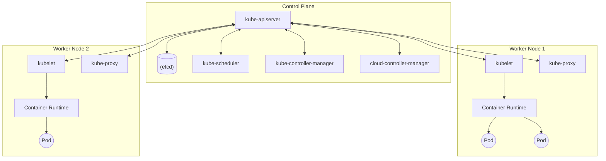

## 1. Einführung

In der modernen Softwareentwicklung und dem Betrieb ist die [Container](https://kenji.blog/de/p/docker-container-namespace-cgroups-layers/)-Technologie unverzichtbar geworden. Unter diesen hat sich **Kubernetes** (im Allgemeinen als **K8s** abgekürzt) als De-facto-Standard für die Container-Orchestrierung etabliert und wird von Unternehmen weltweit eingesetzt.

Kubernetes ist eine Open-Source-Plattform zur Automatisierung der Bereitstellung, Skalierung und Verwaltung von containerisierten Anwendungen. Es wurde ursprünglich von Google entworfen und wird heute von der Cloud Native Computing Foundation (CNCF) gepflegt.

In diesem Artikel werden wir tief in die Gesamtarchitektur von Kubernetes eintauchen und die Mechanismen der Control Plane sowie die Rollen wichtiger Ressourcen wie **Pod**, **Service** und **Ingress** im Detail erläutern.

---

## 2. Gesamtarchitektur von Kubernetes

Ein Kubernetes-Cluster besteht im Wesentlichen aus zwei Hauptkomponenten: der **Control Plane** und den **Worker Nodes**.

Das folgende Diagramm zeigt die Gesamtarchitektur von Kubernetes.



Die Control Plane fungiert als Gehirn des gesamten Clusters, während die Worker Nodes als Gliedmaßen dienen, die die Anwendungen ([Container](https://kenji.blog/de/p/docker-container-namespace-cgroups-layers/)) tatsächlich ausführen.

---

## 3. Control Plane Komponenten

Die Control Plane trifft globale Entscheidungen über den Cluster (wie z.B. Scheduling) und erkennt sowie reagiert auf Cluster-Ereignisse (wie das Starten eines neuen Pods, wenn das Feld `replicas` eines Deployments nicht erfüllt ist).

### 3.1. kube-apiserver

Der **kube-apiserver** ist das Frontend der Kubernetes Control Plane. Er legt die Kubernetes-API offen und verarbeitet die gesamte Kommunikation von Benutzern, der CLI (`kubectl`) und anderen Control Plane Komponenten. Der API-Server ist auf eine horizontale Skalierung (Scale-out) ausgelegt, wodurch der Traffic auf mehrere Instanzen verteilt werden kann.

### 3.2. etcd

**etcd** ist ein konsistenter, hochverfügbarer [Key-Value](https://kenji.blog/de/p/nosql-database-selection-kvs-document-graph-wide-column/)-Store zur Speicherung aller Clusterdaten von Kubernetes. Der Status des Clusters, Konfigurationsinformationen, Secrets und mehr werden in etcd gespeichert. Da der Verlust von etcd-Daten die Wiederherstellung des Clusters erschwert, sind regelmäßige Backups äußerst wichtig.

### 3.3. kube-scheduler

Der **kube-scheduler** überwacht neu erstellte **Pods**, denen noch kein Node zugewiesen wurde, und wählt den Node aus, auf dem sie ausgeführt werden sollen.
Bei den Scheduling-Entscheidungen werden individuelle Ressourcenanforderungen, Hardware-/Software-/Richtlinienbeschränkungen, Affinitäts- (Affinity) und Anti-Affinitätsspezifikationen (Anti-Affinity) sowie Datenlokalität berücksichtigt.

Als Teil des Scheduling-Algorithmus wird ein Ressourcen-Scoring durchgeführt. Die Formel zur Berechnung der Ressourcenauslastung eines Nodes kann beispielsweise wie folgt ausgedrückt werden:

$$
\text{Score} = \frac{\text{Kapazität} - \text{Angefordert}}{\text{Kapazität}} \times 100
$$

Basierend auf solchen Bewertungen wird der optimale Node ausgewählt.

### 3.4. kube-controller-manager

Der **kube-controller-manager** ist eine Komponente, die Controller-Prozesse ausführt. Logischerweise ist jeder Controller ein separater Prozess, aber um die Komplexität zu verringern, werden sie alle in ein einziges Binary kompiliert und als ein einzelner Prozess ausgeführt.
Zu den wichtigsten Controllern gehören:
- **Node Controller**: Verantwortlich für die Benachrichtigung und Reaktion, wenn Nodes ausfallen.
- **Job Controller**: Überwacht Job-Objekte, die einmalige Aufgaben darstellen, und erstellt Pods, um diese Aufgaben bis zum Abschluss auszuführen.
- **Endpoints Controller**: Generiert Endpoints-Objekte, die Services mit Pods verknüpfen.

### 3.5. cloud-controller-manager

Eine Komponente, die die spezifische Kontrolllogik des Cloud-Anbieters einbettet. Sie verbindet den Cluster mit der API des Cloud-Anbieters und trennt die Komponenten, die mit der Cloud-Plattform interagieren, von den Komponenten, die nur innerhalb des Clusters interagieren.

---

## 4. Worker Node Komponenten

Worker Nodes sind virtuelle oder physische Maschinen, die tatsächlich die Workloads der Anwendungen hosten.

### 4.1. kubelet

Das **kubelet** ist ein Agent, der auf jedem Node im Cluster ausgeführt wird. Es stellt sicher, dass die [Container](https://kenji.blog/de/p/docker-container-namespace-cgroups-layers/) in einem **Pod** zuverlässig ausgeführt werden.
Das kubelet nimmt eine Reihe von PodSpecs entgegen, die über verschiedene Mechanismen bereitgestellt werden, und stellt sicher, dass die in diesen PodSpecs beschriebenen Container ordnungsgemäß funktionieren.

### 4.2. kube-proxy

Der **kube-proxy** ist ein Netzwerk-Proxy, der auf jedem Node im Cluster ausgeführt wird und einen Teil des Kubernetes-Konzepts für **Services** implementiert.
Der kube-proxy pflegt Netzwerkregeln auf den Nodes, die eine Netzwerkkommunikation mit Pods von innerhalb oder außerhalb des Clusters ermöglichen. Er nutzt die Paketfilterschicht des Betriebssystems (wie iptables oder IPVS) für das Routing.

### 4.3. Container Runtime

Die Container Runtime ist die Software, die für die Ausführung von Containern verantwortlich ist. Kubernetes unterstützt Container Runtimes wie containerd, CRI-O und andere.

---

## 5. Pod: Die kleinste Deployment-Einheit in Kubernetes

In Kubernetes werden Container nicht direkt bereitgestellt. Stattdessen wird die kleinste Deployment-Einheit in Kubernetes verwendet, die als **Pod** bezeichnet wird.

### 5.1. Was ist ein Pod?

Ein Pod ist eine Gruppe von einem oder mehreren Containern, die auf einem einzigen Node bereitgestellt werden. Die Container in einem Pod teilen sich Speicher (Volumes) und den Netzwerkraum (IP-Adresse und Portraum). Dies ermöglicht eng gekoppelten Containern, effizient miteinander zu kommunizieren.

### 5.2. Beispiel eines Pod YAML-Manifests

Im Folgenden sehen Sie eine einfache YAML-Definition für einen Pod, der einen NGINX-Webserver ausführt.

```yaml
apiVersion: v1
kind: Pod
metadata:
  name: nginx-pod
  labels:
    app: web
spec:
  containers:
  - name: nginx-container
    image: nginx:1.21.4
    ports:
    - containerPort: 80
```

Wenn Sie dieses Manifest mit `kubectl apply -f pod.yaml` anwenden, wird der Pod erstellt. `labels` spielen eine sehr wichtige Rolle bei der Identifizierung von Pods in Services oder Deployments, was später erläutert wird.

---

## 6. Workload-Management (Deployment)

Pods sind flüchtig. Wenn ein Node ausfällt, gehen auch die Pods auf ihm verloren. Daher werden Pods in Produktionsumgebungen nicht direkt erstellt, sondern stattdessen über Controller wie **Deployments** verwaltet.

Ein Deployment hält die Anzahl der Pod-Replikate aufrecht (über ein ReplicaSet) und ermöglicht unterbrechungsfreie Rolling Updates und Rollbacks.

```yaml
apiVersion: apps/v1
kind: Deployment
metadata:
  name: nginx-deployment
spec:
  replicas: 3
  selector:
    matchLabels:
      app: web
  template:
    metadata:
      labels:
        app: web
    spec:
      containers:
      - name: nginx
        image: nginx:1.21.4
        ports:
        - containerPort: 80
```

Mit der obigen Konfiguration stellt Kubernetes sicher, dass immer drei NGINX-Pods ausgeführt werden.

---

## 7. Grundlagen des Netzwerks: Service

Da Pods dynamisch erstellt und zerstört werden, ändern sich auch ihre IP-Adressen dynamisch. Dadurch wissen Clients (andere Pods oder externe Benutzer), die auf eine Gruppe von Pods zugreifen möchten, nicht, mit welcher IP-Adresse sie kommunizieren sollen.
Die Lösung für dieses Problem ist der **Service**.

### 7.1. Die Rolle eines Services

Ein Service ist eine Abstraktion, die einen logischen Satz von Pods und eine Richtlinie für den Zugriff auf diese (manchmal auch als [Microservice](https://kenji.blog/de/p/microservices-architecture-bff-api-gateway/) bezeichnet) definiert. Einem Service wird eine feste IP-Adresse (ClusterIP) zugewiesen, und er führt einen Lastausgleich (Load Balancing) zu den dahinter liegenden Pods durch.

### 7.2. Service-Typen

- **ClusterIP** (Standard): Legt den Service unter einer internen IP im Cluster offen. Dadurch ist der Service nur innerhalb des Clusters erreichbar.
- **NodePort**: Legt den Service auf jedem Node an einem statischen Port offen. Sie können den Service von außerhalb des Clusters kontaktieren, indem Sie `<NodeIP>:<NodePort>` aufrufen.
- **LoadBalancer**: Legt den Service extern offen, indem ein Load Balancer des Cloud-Anbieters verwendet wird.
- **ExternalName**: Ordnet den Service einem externen DNS-Namen zu.

### 7.3. Beispiel eines Service YAML-Manifests

```yaml
apiVersion: v1
kind: Service
metadata:
  name: nginx-service
spec:
  selector:
    app: web
  ports:
    - protocol: TCP
      port: 80
      targetPort: 80
  type: ClusterIP
```

Dieser Service leitet den Datenverkehr an alle Pods weiter, die das Label `app: web` haben.

---

## 8. Externe Zugriffskontrolle: Ingress

Obwohl externer Zugriff über `NodePort` oder `LoadBalancer` eines Services möglich ist, steigen die Kosten aufgrund der Anzahl an Load Balancern erheblich, wenn mehrere Services offengelegt werden. Zudem reicht dies nicht für fortgeschrittenes HTTP-Routing (URL-Pfad- oder Hostnamen-basiertes Routing) oder SSL/TLS-Terminierung aus.

Hier kommt **Ingress** ins Spiel.

### 8.1. Was ist Ingress?

Ingress ist ein API-Objekt, das HTTP- und HTTPS-Routen von außerhalb des Clusters zu Services innerhalb des Clusters offenlegt. Das Routing des Datenverkehrs wird durch Regeln gesteuert, die auf der Ingress-Ressource definiert sind.

Damit die Ingress-Ressource funktioniert, muss im Cluster ein **Ingress Controller** (wie der NGINX Ingress Controller oder der AWS ALB Ingress Controller) laufen.

### 8.2. Routing-Diagramm für den Datenverkehr

Das folgende Mermaid-Diagramm zeigt den Fluss des Datenverkehrs über den Ingress.

```mermaid
flowchart LR
    Client(["External Client"])
    subgraph "K8s Cluster ["K8s Cluster"]"
        Ingress["Ingress Controller"]
        
        subgraph Services ["Services"]
            SvcA["Service A (app1)"]
            SvcB["Service B (app2)"]
        end
        
        subgraph Pods ["Pods"]
            PodA1(("Pod A1"))
            PodA2(("Pod A2"))
            PodB1(("Pod B1"))
        end
    end
    
    Client -->|"https://example.com/app1"| Ingress
    Client -->|"https://example.com/app2"| Ingress
    
    Ingress -->|"/app1 Routing"| SvcA
    Ingress -->|"/app2 Routing"| SvcB
    
    SvcA --> PodA1
    SvcA --> PodA2
    SvcB --> PodB1
```

### 8.3. Beispiel eines Ingress YAML-Manifests

Das Folgende ist ein Beispiel für ein Ingress, das hostnamen- und pfadbasiertes Routing durchführt.

```yaml
apiVersion: networking.k8s.io/v1
kind: Ingress
metadata:
  name: example-ingress
  annotations:
    nginx.ingress.kubernetes.io/rewrite-target: /
spec:
  rules:
  - host: www.example.com
    http:
      paths:
      - path: /app1
        pathType: Prefix
        backend:
          service:
            name: app1-service
            port:
              number: 80
      - path: /app2
        pathType: Prefix
        backend:
          service:
            name: app2-service
            port:
              number: 80
```

Mit dieser Konfiguration wird der Zugriff auf `www.example.com/app1` an den `app1-service` und der Zugriff auf `/app2` an den `app2-service` weitergeleitet.

---

## 9. Zusammenfassung

Dieser Artikel erläutert ausführlich die Mechanismen der Control Plane, die den Kern der Kubernetes-Architektur bildet, sowie die Worker Nodes und die wichtigsten Ressourcen (wie **Pod**, **Service** und **Ingress**) zur Bereitstellung von Anwendungen.

Kubernetes ist ein äußerst funktionsreiches und leistungsstarkes Tool, aber es ist auch für seine steile Lernkurve bekannt. Das Verständnis dieser Kernkomponenten und ihres Zusammenspiels (Pods, die [Container](https://kenji.blog/de/p/docker-container-namespace-cgroups-layers/) umhüllen, Deployments, die Pods verwalten, Services, die das Netzwerk abstrahieren, und Ingress, das den externen Traffic steuert) bietet jedoch eine solide Grundlage, um fortgeschrittenere Funktionen (wie RBAC, Helm, Service Mesh usw.) zu erlernen.

Bitte zögern Sie nicht, einen tatsächlichen Cluster (wie Minikube oder kind) hochzufahren, Manifeste anzuwenden und das Verhalten selbst zu überprüfen. Das ständige Wiederholen von Theorie und Praxis ist der schnellste Weg, um ein Kubernetes-Meister zu werden.
