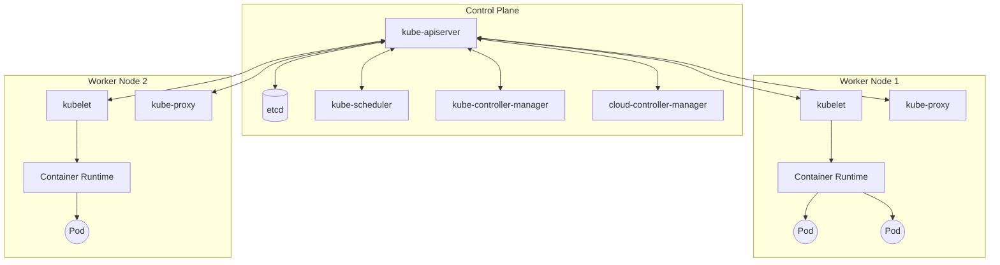
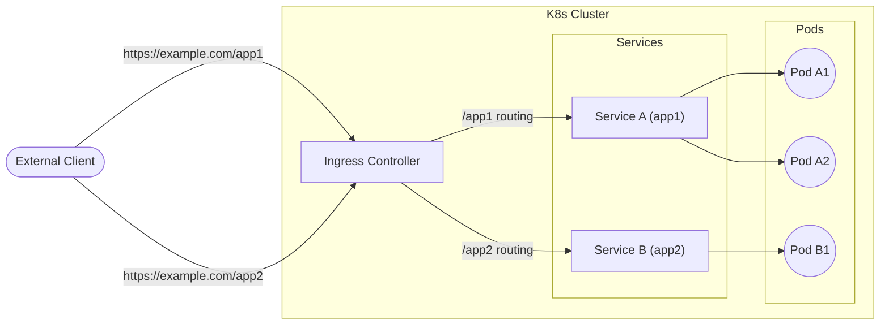

## 1. Introduction

In modern software development and operations, container technology has become indispensable. Among them, **Kubernetes** (commonly abbreviated as **K8s**) has been adopted by companies worldwide as the de facto standard for container orchestration.

Kubernetes is an open-source platform for automating the deployment, scaling, and management of containerized applications. Originally designed by Google, it is now maintained by the Cloud Native Computing Foundation (CNCF).

In this article, we will delve deep into the big picture of Kubernetes architecture, and explain in detail the roles of major resources such as **Pod**, **Service**, and **Ingress**, starting from how the control plane works.

---

## 2. Overall Kubernetes Architecture

A Kubernetes cluster is broadly composed of two major components. These are the **Control Plane** and the **Worker Node**.

The diagram below illustrates the overall architecture of Kubernetes.



The control plane functions as the brain of the entire cluster, while the worker nodes function as the limbs that actually run the applications (containers).

---

## 3. Control Plane Components

The control plane makes global decisions about the cluster (such as scheduling) and detects and responds to cluster events (for example, starting up a new Pod when a Deployment's `replicas` field is unsatisfied).

### 3.1. kube-apiserver

**kube-apiserver** is the front end of the Kubernetes control plane. It exposes the Kubernetes API and accepts all communications from users, the CLI (`kubectl`), and other control plane components. The API server is designed to scale out, allowing traffic to be distributed across multiple instances.

### 3.2. etcd

**etcd** is a consistent and highly-available key value store used as Kubernetes' backing store for all cluster data. Cluster state, configuration information, Secrets, and more are all stored in etcd. Since cluster recovery becomes difficult if etcd data is lost, regular backups are crucial.

### 3.3. kube-scheduler

**kube-scheduler** watches for newly created **Pods** with no assigned node, and selects a node for them to run on.
Scheduling decisions take into account individual resource requirements, hardware/software/policy constraints, affinity and anti-affinity specifications, data locality, and more.

As part of the scheduling algorithm, resource scoring is performed. For example, a formula to calculate a node's resource utilization rate can be expressed as follows.

$$
Score = \frac{Capacity - Requested}{Capacity} \times 100
$$

Based on such scores, the optimal node is selected.

### 3.4. kube-controller-manager

**kube-controller-manager** is a component that runs controller processes. Logically, each controller is a separate process, but to reduce complexity, they are all compiled into a single binary and run in a single process.
Some of the main controllers include:
- **Node Controller**: Responsible for noticing and responding when nodes go down.
- **Job Controller**: Watches for Job objects that represent one-off tasks, then creates Pods to run those tasks to completion.
- **Endpoints Controller**: Populates the Endpoints object (that is, joins Services & Pods).

### 3.5. cloud-controller-manager

A component that embeds cloud-provider-specific control logic. The cloud controller manager lets you link your cluster into your cloud provider's API, and separates out the components that interact with that cloud platform from components that only interact with your cluster.

---

## 4. Worker Node Components

Worker nodes are virtual or physical machines that actually host the workloads of applications.

### 4.1. kubelet

**kubelet** is an agent that runs on each node in the cluster. It makes sure that containers are running in a **Pod**.
The kubelet takes a set of PodSpecs that are provided through various mechanisms and ensures that the containers described in those PodSpecs are running and healthy.

### 4.2. kube-proxy

**kube-proxy** is a network proxy that runs on each node in your cluster, implementing part of the Kubernetes **Service** concept.
kube-proxy maintains network rules on nodes. These network rules allow network communication to your Pods from network sessions inside or outside of your cluster. It uses the operating system packet filtering layer (such as iptables or IPVS) to route traffic.

### 4.3. [Container](https://kenji.blog/en/p/docker-container-namespace-cgroups-layers/) Runtime

The container runtime is the software that is responsible for running containers. Kubernetes supports container runtimes such as containerd, CRI-O, and more.

---

## 5. Pod: The Smallest Deployable Unit in Kubernetes

In Kubernetes, you do not deploy containers directly. Instead, you use the smallest deployable unit in Kubernetes called a **Pod**.

### 5.1. What is a Pod?

A Pod is a group of one or more containers deployed to a single node. Containers within a Pod share storage (Volumes) and network space (IP address and port space). This allows closely coupled containers to communicate with each other efficiently.

### 5.2. Example of a Pod YAML Manifest

Below is an example of a simple Pod YAML definition that runs an NGINX web server.

```yaml
apiVersion: v1
kind: Pod
metadata:
  name: nginx-pod
  labels:
    app: web
spec:
  containers:
  - name: nginx-container
    image: nginx:1.21.4
    ports:
    - containerPort: 80
```

When this manifest is applied with `kubectl apply -f pod.yaml`, the Pod is created. The `labels` play a very important role in identifying Pods for Services and Deployments, which will be discussed later.

---

## 6. Workload Management (Deployment)

Pods are ephemeral by nature. When a node goes down, the Pods on it are also lost. Therefore, in production environments, you do not create Pods directly, but manage them using a controller such as a **Deployment**.

A Deployment maintains the number of Pod replicas (via a ReplicaSet) and enables zero-downtime rolling updates and rollbacks.

```yaml
apiVersion: apps/v1
kind: Deployment
metadata:
  name: nginx-deployment
spec:
  replicas: 3
  selector:
    matchLabels:
      app: web
  template:
    metadata:
      labels:
        app: web
    spec:
      containers:
      - name: nginx
        image: nginx:1.21.4
        ports:
        - containerPort: 80
```

With the above configuration, Kubernetes ensures that three NGINX Pods are always running.

---

## 7. Basics of Networking: Service

Since Pods are dynamically created and destroyed, their IP addresses also change dynamically. This makes it impossible for clients (other Pods or external users) wanting to access a group of Pods to know which IP to communicate with.
This is solved by a **Service**.

### 7.1. Role of a Service

A Service is an abstract concept that defines a logical set of Pods and a policy by which to access them (sometimes called a micro-service). A Service is assigned a fixed IP address (ClusterIP) and performs load balancing to the backend Pods.

### 7.2. Types of Services

- **ClusterIP** (Default): Exposes the Service on a cluster-internal IP. Accessible only from within the cluster.
- **NodePort**: Exposes the Service on each Node's IP at a static port. It can be accessed from outside the cluster at `<NodeIP>:<NodePort>`.
- **LoadBalancer**: Exposes the Service externally using a cloud provider's load balancer.
- **ExternalName**: Maps the Service to the contents of the `externalName` field (e.g. `foo.bar.example.com`), by returning a CNAME record with its value.

### 7.3. Example of a Service YAML Manifest

```yaml
apiVersion: v1
kind: Service
metadata:
  name: nginx-service
spec:
  selector:
    app: web
  ports:
    - protocol: TCP
      port: 80
      targetPort: 80
  type: ClusterIP
```

This Service routes traffic to all Pods with the label `app: web`.

---

## 8. External Access Control: Ingress

While external access is possible using a Service's `NodePort` or `LoadBalancer`, if you are exposing multiple services, the number of LoadBalancers will increase per service, causing costs to soar. It is also insufficient for advanced HTTP routing (URL path or hostname-based routing) or SSL/TLS termination.

This is where **Ingress** comes into play.

### 8.1. What is an Ingress?

An Ingress is an API object that exposes HTTP and HTTPS routes from outside the cluster to Services within the cluster. Traffic routing is controlled by rules defined on the Ingress resource.

For an Ingress to work, an **Ingress Controller** (such as the NGINX Ingress Controller or AWS ALB Ingress Controller) must be running in the cluster.

### 8.2. Traffic Routing Diagram

The Mermaid diagram below shows the flow of traffic through an Ingress.



### 8.3. Example of an Ingress YAML Manifest

Below is an example of an Ingress that performs hostname and path-based routing.

```yaml
apiVersion: networking.k8s.io/v1
kind: Ingress
metadata:
  name: example-ingress
  annotations:
    nginx.ingress.kubernetes.io/rewrite-target: /
spec:
  rules:
  - host: www.example.com
    http:
      paths:
      - path: /app1
        pathType: Prefix
        backend:
          service:
            name: app1-service
            port:
              number: 80
      - path: /app2
        pathType: Prefix
        backend:
          service:
            name: app2-service
            port:
              number: 80
```

With this configuration, accesses to `www.example.com/app1` are routed to `app1-service`, and accesses to `/app2` are routed to `app2-service`.

---

## 9. Conclusion

In this article, we explained in detail the core architecture of Kubernetes, starting from how the control plane works, to worker nodes, and the primary resources used to deploy applications (**Pod**, **Service**, and **Ingress**).

Kubernetes is a highly functional and powerful tool, but it is also known for having a steep learning curve. However, understanding these basic components and how they interact (Pods wrap containers, Deployments manage Pods, Services abstract networks, and Ingresses control external traffic) provides a solid foundation for mastering more advanced features (such as RBAC, Helm, and Service Mesh).

By all means, try standing up a real cluster (using Minikube or kind, for example) and apply the manifests to see them in action. Repeating theory and practice is the fastest way to becoming a Kubernetes master.
