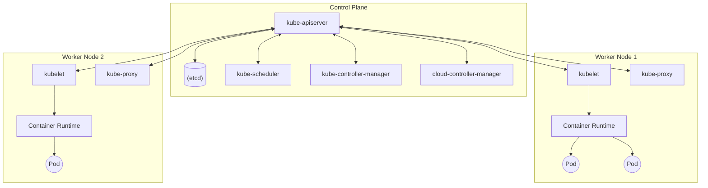

## 1. Introducción

En el desarrollo y operación de software moderno, la tecnología de contenedores se ha vuelto indispensable. Entre ellas, **Kubernetes** (generalmente abreviado como **K8s**) ha sido adoptado por empresas de todo el mundo como el estándar de facto para la orquestación de contenedores.

Kubernetes es una plataforma de código abierto para automatizar el despliegue, escalado y gestión de aplicaciones en contenedores. Originalmente diseñado por Google, actualmente es mantenido por la Cloud Native Computing Foundation (CNCF).

En este artículo, profundizaremos en la visión general de la arquitectura de Kubernetes y explicaremos en detalle desde el mecanismo del plano de control hasta los roles de los recursos principales como **Pod**, **Service** e **Ingress**.

---

## 2. Arquitectura general de Kubernetes

Un clúster de Kubernetes se compone principalmente de dos componentes principales: el **plano de control (Control Plane)** y los **nodos de trabajo (Worker Nodes)**.

El siguiente diagrama muestra la arquitectura general de Kubernetes.



El plano de control funciona como el cerebro de todo el clúster, y los nodos de trabajo funcionan como las extremidades que realmente ejecutan las aplicaciones (contenedores).

---

## 3. Componentes del plano de control

El plano de control toma decisiones globales sobre el clúster (como la programación) y detecta y responde a los eventos del clúster (por ejemplo, iniciar un nuevo Pod cuando el campo `replicas` de un Deployment no se cumple).

### 3.1. kube-apiserver

**kube-apiserver** es el frontend del plano de control de Kubernetes. Expone la API de Kubernetes y recibe todas las comunicaciones de los usuarios, la CLI (`kubectl`) y otros componentes del plano de control. El servidor API está diseñado para escalar horizontalmente, permitiendo que el tráfico se distribuya a través de múltiples instancias.

### 3.2. etcd

**etcd** es un almacén de clave-valor consistente y de alta disponibilidad utilizado para guardar todos los datos del clúster de Kubernetes. El estado del clúster, la información de configuración, los Secrets, etc., se guardan todos en etcd. Dado que la recuperación del clúster se vuelve difícil si se pierden los datos de etcd, las copias de seguridad periódicas son muy importantes.

### 3.3. kube-scheduler

**kube-scheduler** vigila los **Pods** recién creados que aún no tienen un nodo asignado y selecciona el nodo en el que deben ejecutarse.
Las decisiones de programación tienen en cuenta los requisitos de recursos individuales, las restricciones de hardware/software/políticas, las especificaciones de afinidad y antiafinidad, la localidad de los datos, etc.

Como parte del algoritmo de programación, se realiza una puntuación de los recursos. Por ejemplo, la fórmula para calcular la tasa de utilización de recursos de un nodo se puede expresar de la siguiente manera:

$$
Score = \frac{Capacity - Requested}{Capacity} \times 100
$$

A partir de tales puntuaciones, se selecciona el nodo óptimo.

### 3.4. kube-controller-manager

**kube-controller-manager** es el componente que ejecuta los procesos del controlador. Lógicamente, cada controlador es un proceso separado, pero para reducir la complejidad, todos se compilan en un solo binario y se ejecutan como un solo proceso.
Los principales controladores incluyen:
- **Node Controller**: Encargado de notar y responder cuando los nodos se caen.
- **Job Controller**: Observa los objetos Job que representan tareas únicas y crea Pods para ejecutar esas tareas hasta su finalización.
- **Endpoints Controller**: Rellena el objeto Endpoints (es decir, une Service y Pod).

### 3.5. cloud-controller-manager

Un componente que integra la lógica de control específica del proveedor de la nube. Vincula el clúster a la API del proveedor de la nube y separa los componentes que interactúan con la plataforma de la nube de los componentes que solo interactúan dentro del clúster.

---

## 4. Componentes del nodo de trabajo

Los nodos de trabajo son máquinas físicas o virtuales que realmente alojan las cargas de trabajo de la aplicación.

### 4.1. kubelet

**kubelet** es un agente que se ejecuta en cada nodo del clúster. Asegura que los contenedores se estén ejecutando de manera confiable en un **Pod**.
El kubelet toma un conjunto de PodSpecs que se proporcionan a través de varios mecanismos y asegura que los contenedores descritos en esos PodSpecs estén funcionando correctamente.

### 4.2. kube-proxy

**kube-proxy** es un proxy de red que se ejecuta en cada nodo de su clúster, implementando parte del concepto **Service** de Kubernetes.
kube-proxy mantiene reglas de red en los nodos; estas reglas de red permiten la comunicación de red con sus Pods desde sesiones de red dentro o fuera de su clúster. Utiliza la capa de filtrado de paquetes del sistema operativo (como iptables o IPVS) para el enrutamiento.

### 4.3. [Container](https://kenji.blog/es/p/docker-container-namespace-cgroups-layers/) Runtime

El tiempo de ejecución de contenedores es el software responsable de ejecutar los contenedores. Kubernetes soporta tiempos de ejecución de contenedores como containerd, CRI-O, etc.

---

## 5. Pod: La unidad de despliegue más pequeña de Kubernetes

En Kubernetes, los contenedores no se despliegan directamente. En su lugar, utilizamos la unidad de despliegue más pequeña en Kubernetes llamada **Pod**.

### 5.1. ¿Qué es un Pod?

Un Pod es un grupo de uno o más contenedores que se despliegan en un solo nodo. Los contenedores en un Pod comparten el almacenamiento (Volume) y el espacio de red (dirección IP y espacio de puertos). Esto permite que los contenedores fuertemente acoplados se comuniquen eficientemente entre sí.

### 5.2. Ejemplo de manifiesto YAML de Pod

A continuación se muestra una definición YAML simple de un Pod que ejecuta el servidor web NGINX.

```yaml
apiVersion: v1
kind: Pod
metadata:
  name: nginx-pod
  labels:
    app: web
spec:
  containers:
  - name: nginx-container
    image: nginx:1.21.4
    ports:
    - containerPort: 80
```

Si aplica este manifiesto con `kubectl apply -f pod.yaml`, se creará el Pod. Las etiquetas (`labels`) juegan un papel muy importante en la identificación de los Pods en Services y Deployments, que se discutirán más adelante.

---

## 6. Gestión de cargas de trabajo (Deployment)

Los Pods son efímeros. Si un nodo se cae, los Pods que están en él también se pierden. Por lo tanto, en un entorno de producción, en lugar de crear Pods directamente, gestionamos los Pods utilizando un controlador como **Deployment**.

Un Deployment mantiene el número de réplicas de Pod (a través de ReplicaSet) y permite actualizaciones y reversiones (rollbacks) continuas sin tiempo de inactividad.

```yaml
apiVersion: apps/v1
kind: Deployment
metadata:
  name: nginx-deployment
spec:
  replicas: 3
  selector:
    matchLabels:
      app: web
  template:
    metadata:
      labels:
        app: web
    spec:
      containers:
      - name: nginx
        image: nginx:1.21.4
        ports:
        - containerPort: 80
```

Con la configuración anterior, Kubernetes garantiza que siempre haya tres Pods de NGINX ejecutándose.

---

## 7. Conceptos básicos de redes: Service

Debido a que los Pods se crean y destruyen dinámicamente, sus direcciones IP también cambian dinámicamente. Con esto, los clientes que quieran acceder a un grupo de Pods (otros Pods o usuarios externos) no sabrán a qué IP comunicarse.
Esto se soluciona con **Service**.

### 7.1. El rol del Service

Un Service es una abstracción que define un conjunto lógico de Pods y una política para acceder a ellos (a veces llamado microservicio). Al Service se le asigna una dirección IP fija (ClusterIP) y balancea la carga a los Pods que están detrás.

### 7.2. Tipos de Service

- **ClusterIP** (predeterminado): Expone el Service en una IP interna del clúster. Solo es accesible desde dentro del clúster.
- **NodePort**: Expone el Service en un puerto estático en la IP de cada nodo. Se puede acceder desde fuera del clúster usando `<NodeIP>:<NodePort>`.
- **LoadBalancer**: Expone el Service externamente usando el balanceador de carga de un proveedor de la nube.
- **ExternalName**: Mapea el Service a un nombre DNS externo.

### 7.3. Ejemplo de manifiesto YAML de Service

```yaml
apiVersion: v1
kind: Service
metadata:
  name: nginx-service
spec:
  selector:
    app: web
  ports:
    - protocol: TCP
      port: 80
      targetPort: 80
  type: ClusterIP
```

Este Service enruta el tráfico a todos los Pods con la etiqueta `app: web`.

---

## 8. Control de acceso externo: Ingress

El acceso externo es posible usando `NodePort` o `LoadBalancer` de Service, pero si publica múltiples servicios, el número de LoadBalancers aumenta por cada servicio y el costo se dispara. Además, es insuficiente para el enrutamiento HTTP avanzado (enrutamiento basado en rutas de URL o nombres de host) o la terminación SSL/TLS.

Aquí es donde entra **Ingress**.

### 8.1. ¿Qué es Ingress?

Ingress es un objeto de API que gestiona el acceso externo a los servicios en un clúster, típicamente rutas HTTP y HTTPS. El enrutamiento de tráfico está controlado por las reglas definidas en el recurso Ingress.

Para que Ingress funcione, un **Ingress Controller** (como NGINX Ingress Controller o AWS ALB Ingress Controller) debe estar ejecutándose en el clúster.

### 8.2. Diagrama de enrutamiento de tráfico

El siguiente diagrama Mermaid muestra el flujo de tráfico a través de Ingress.

```mermaid
flowchart LR
    Client(["External Client"])
    subgraph "K8s Cluster ["K8s Cluster"]"
        Ingress["Ingress Controller"]
        
        subgraph Services ["Services"]
            SvcA["Service A (app1)"]
            SvcB["Service B (app2)"]
        end
        
        subgraph Pods ["Pods"]
            PodA1(("Pod A1"))
            PodA2(("Pod A2"))
            PodB1(("Pod B1"))
        end
    end
    
    Client -->|"https://example.com/app1"| Ingress
    Client -->|"https://example.com/app2"| Ingress
    
    Ingress -->|"/app1 enrutamiento"| SvcA
    Ingress -->|"/app2 enrutamiento"| SvcB
    
    SvcA --> PodA1
    SvcA --> PodA2
    SvcB --> PodB1
```

### 8.3. Ejemplo de manifiesto YAML de Ingress

A continuación se muestra un ejemplo de un Ingress que realiza enrutamiento basado en el nombre de host y la ruta.

```yaml
apiVersion: networking.k8s.io/v1
kind: Ingress
metadata:
  name: example-ingress
  annotations:
    nginx.ingress.kubernetes.io/rewrite-target: /
spec:
  rules:
  - host: www.example.com
    http:
      paths:
      - path: /app1
        pathType: Prefix
        backend:
          service:
            name: app1-service
            port:
              number: 80
      - path: /app2
        pathType: Prefix
        backend:
          service:
            name: app2-service
            port:
              number: 80
```

Con esta configuración, el acceso a `www.example.com/app1` se enrutará a `app1-service` y el acceso a `/app2` se enrutará a `app2-service`.

---

## 9. Resumen

En este artículo, hemos explicado en detalle la base de la arquitectura de Kubernetes: desde los mecanismos del plano de control hasta los nodos de trabajo y los principales recursos para desplegar aplicaciones (**Pod**, **Service** e **Ingress**).

Kubernetes es una herramienta muy versátil y poderosa, pero es conocida por tener una curva de aprendizaje pronunciada. Sin embargo, comprender estos componentes básicos y su colaboración (los Pods envuelven los contenedores, los Deployments gestionan los Pods, los Services abstraen la red y los Ingress controlan el tráfico externo) proporcionará una base sólida para aprender características más avanzadas (RBAC, Helm, Service Mesh, etc.).

Te animamos a que inicies un clúster real (como Minikube o kind), apliques los manifiestos y verifiques cómo funciona. Repetir la teoría y la práctica es el atajo más rápido para convertirse en un maestro de Kubernetes.
