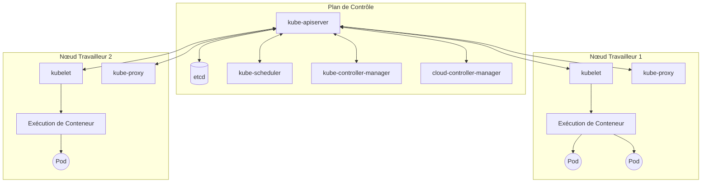
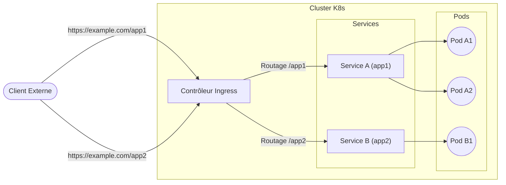

## 1. Introduction

Dans le développement et l'exploitation de logiciels modernes, la technologie des conteneurs est devenue indispensable. Parmi celles-ci, **Kubernetes** (généralement abrégé en **K8s**) est adopté par des entreprises du monde entier comme le standard de facto pour l'orchestration de conteneurs.

Kubernetes est une plateforme open source pour automatiser le déploiement, la mise à l'échelle et la gestion d'applications conteneurisées. Conçue à l'origine par Google, elle est maintenant maintenue par la Cloud Native Computing Foundation (CNCF).

Dans cet article, nous allons approfondir l'architecture globale de Kubernetes et expliquer en détail les mécanismes du plan de contrôle et le rôle des ressources clés telles que **Pod**, **Service** et **Ingress**.

---

## 2. L'Architecture Globale de Kubernetes

Un cluster Kubernetes est composé de deux composants principaux. Il s'agit du **Plan de Contrôle (Control Plane)** et du **Nœud Travailleur (Worker Node)**.

Le schéma ci-dessous montre l'architecture globale de Kubernetes.



Le plan de contrôle agit comme le cerveau de l'ensemble du cluster, tandis que les nœuds travailleurs agissent comme les mains et les pieds qui exécutent réellement les applications (conteneurs).

---

## 3. Les Composants du Plan de Contrôle

Le plan de contrôle prend des décisions globales concernant le cluster (telles que la planification) et détecte et répond aux événements du cluster (par exemple, le démarrage d'un nouveau Pod lorsque le champ `replicas` d'un Deployment n'est pas satisfait).

### 3.1. kube-apiserver

**kube-apiserver** est le frontal du plan de contrôle de Kubernetes. Il expose l'API Kubernetes et accepte toutes les communications des utilisateurs, de la CLI (`kubectl`) et des autres composants du plan de contrôle. Le serveur d'API est conçu pour évoluer horizontalement, permettant de répartir le trafic sur plusieurs instances.

### 3.2. etcd

**etcd** est un magasin de clés-valeurs cohérent et hautement disponible utilisé pour stocker toutes les données du cluster Kubernetes. L'état du cluster, les informations de configuration, les Secrets, etc. sont tous stockés dans etcd. La perte des données etcd rend la récupération du cluster difficile, c'est pourquoi des sauvegardes régulières sont extrêmement importantes.

### 3.3. kube-scheduler

**kube-scheduler** surveille les nouveaux **Pod** créés auxquels aucun nœud n'a encore été attribué et sélectionne un nœud sur lequel ils doivent s'exécuter.
Les décisions de planification prennent en compte les besoins en ressources individuels, les contraintes matérielles/logicielles/de stratégie, les spécifications d'affinité et d'anti-affinité, la localisation des données, etc.

Dans le cadre de l'algorithme de planification, une évaluation (scoring) des ressources est effectuée. Par exemple, la formule pour calculer le taux d'utilisation des ressources d'un nœud peut être exprimée comme suit.

$$
\text{Score} = \frac{\text{Capacité} - \text{Demandé}}{\text{Capacité}} \times 100
$$

Sur la base de ces scores, le nœud optimal est sélectionné.

### 3.4. kube-controller-manager

**kube-controller-manager** est le composant qui exécute les processus du contrôleur. Logiquement, chaque contrôleur est un processus distinct, mais pour réduire la complexité, ils sont tous compilés dans un seul binaire et s'exécutent comme un seul processus.
Les principaux contrôleurs incluent :
- **Node Controller** : Responsable de la notification et de la réponse lorsqu'un nœud tombe en panne.
- **Job Controller** : Surveille les objets Job qui représentent des tâches ponctuelles, puis crée des Pods pour exécuter ces tâches jusqu'à leur achèvement.
- **Endpoints Controller** : Génère les objets Endpoints qui relient les Services et les Pods.

### 3.5. cloud-controller-manager

Il s'agit du composant qui intègre la logique de contrôle spécifique au fournisseur de cloud. Il relie le cluster à l'API du fournisseur de cloud et sépare les composants qui interagissent avec la plateforme cloud de ceux qui n'interagissent qu'à l'intérieur du cluster.

---

## 4. Les Composants du Nœud Travailleur

Les nœuds travailleurs sont des machines virtuelles ou physiques qui hébergent réellement les charges de travail des applications.

### 4.1. kubelet

**kubelet** est un agent qui s'exécute sur chaque nœud du cluster. Il s'assure que les conteneurs s'exécutent de manière fiable dans un **Pod**.
Le kubelet prend un ensemble de PodSpecs fournis par divers mécanismes et s'assure que les conteneurs décrits dans ces PodSpecs fonctionnent correctement.

### 4.2. kube-proxy

**kube-proxy** est un proxy réseau qui s'exécute sur chaque nœud du cluster, implémentant une partie du concept de **Service** de Kubernetes.
kube-proxy maintient les règles réseau sur le nœud, et ces règles réseau permettent la communication réseau vers les Pods depuis l'intérieur ou l'extérieur du cluster. Il utilise la couche de filtrage de paquets du système d'exploitation (telle que iptables ou IPVS) pour effectuer le routage.

### 4.3. Exécution de Conteneur ([Container](https://kenji.blog/fr/p/docker-container-namespace-cgroups-layers/) Runtime)

L'exécution de conteneur est le logiciel responsable de l'exécution des conteneurs. Kubernetes prend en charge des exécutions de conteneurs telles que containerd et CRI-O.

---

## 5. Pod : La Plus Petite Unité de Déploiement de Kubernetes

Dans Kubernetes, vous ne déployez pas directement des conteneurs. À la place, vous utilisez la plus petite unité de déploiement de Kubernetes appelée **Pod**.

### 5.1. Qu'est-ce qu'un Pod ?

Un Pod est un groupe d'un ou plusieurs conteneurs déployés sur un seul nœud. Les conteneurs au sein d'un Pod partagent le stockage (Volume) et l'espace réseau (adresse IP et espace de port). Cela permet aux conteneurs étroitement couplés de communiquer efficacement entre eux.

### 5.2. Exemple de Manifeste YAML d'un Pod

Voici la définition YAML d'un Pod simple exécutant le serveur web NGINX.

```yaml
apiVersion: v1
kind: Pod
metadata:
  name: nginx-pod
  labels:
    app: web
spec:
  containers:
  - name: nginx-container
    image: nginx:1.21.4
    ports:
    - containerPort: 80
```

Lorsque vous appliquez ce manifeste avec `kubectl apply -f pod.yaml`, le Pod est créé. Les `labels` jouent un rôle très important dans l'identification du Pod par le Service ou le Deployment, comme décrit plus loin.

---

## 6. Gestion des Charges de Travail (Deployment)

Les Pods sont éphémères. Si un nœud tombe en panne, les Pods qu'il héberge sont également perdus. Par conséquent, dans les environnements de production, les Pods ne sont pas créés directement ; ils sont plutôt gérés à l'aide d'un contrôleur tel qu'un **Deployment**.

Un Deployment maintient le nombre de réplicas de Pod (via un ReplicaSet) et permet des mises à jour continues et des restaurations sans temps d'arrêt.

```yaml
apiVersion: apps/v1
kind: Deployment
metadata:
  name: nginx-deployment
spec:
  replicas: 3
  selector:
    matchLabels:
      app: web
  template:
    metadata:
      labels:
        app: web
    spec:
      containers:
      - name: nginx
        image: nginx:1.21.4
        ports:
        - containerPort: 80
```

Avec la configuration ci-dessus, Kubernetes garantit qu'il y a toujours 3 Pods NGINX en cours d'exécution.

---

## 7. Bases de la Mise en Réseau : Service

Étant donné que les Pods sont créés et détruits dynamiquement, leurs adresses IP changent également dynamiquement. Par conséquent, les clients (d'autres Pods ou des utilisateurs externes) qui souhaitent accéder à un groupe de Pods ne sauraient pas à quelle adresse IP s'adresser.
Le **Service** résout ce problème.

### 7.1. Le Rôle du Service

Un Service est une abstraction qui définit un ensemble logique de Pods et une stratégie d'accès à ceux-ci (parfois appelée microservice). Un Service se voit attribuer une adresse IP fixe (ClusterIP) et équilibre la charge vers les Pods derrière lui.

### 7.2. Types de Service

- **ClusterIP** (par défaut) : Expose le Service sur une IP interne au cluster. Accessible uniquement depuis l'intérieur du cluster.
- **NodePort** : Expose le Service sur un port statique de l'IP de chaque nœud. Accessible depuis l'extérieur du cluster via `<NodeIP>:<NodePort>`.
- **LoadBalancer** : Utilise l'équilibreur de charge du fournisseur de cloud pour exposer le Service à l'extérieur.
- **ExternalName** : Mappe le Service à un nom DNS externe.

### 7.3. Exemple de Manifeste YAML d'un Service

```yaml
apiVersion: v1
kind: Service
metadata:
  name: nginx-service
spec:
  selector:
    app: web
  ports:
    - protocol: TCP
      port: 80
      targetPort: 80
  type: ClusterIP
```

Ce Service achemine le trafic vers tous les Pods ayant l'étiquette `app: web`.

---

## 8. Contrôle d'Accès Externe : Ingress

Bien que l'accès externe soit possible à l'aide de `NodePort` ou `LoadBalancer` d'un Service, lors de l'exposition de plusieurs services, le nombre d'équilibreurs de charge augmente pour chaque service, ce qui fait grimper les coûts. De plus, c'est insuffisant pour un routage HTTP avancé (basé sur le chemin d'URL ou le nom d'hôte) et la terminaison SSL/TLS.

C'est là qu'**Ingress** entre en jeu.

### 8.1. Qu'est-ce qu'Ingress ?

Ingress est un objet de l'API qui expose les routes HTTP et HTTPS de l'extérieur du cluster vers les Services à l'intérieur du cluster. Le routage du trafic est contrôlé par les règles définies sur la ressource Ingress.

Pour qu'Ingress fonctionne, un **Ingress Controller** (tel que NGINX Ingress Controller ou AWS ALB Ingress Controller) doit s'exécuter dans le cluster.

### 8.2. Diagramme de Routage du Trafic

Le diagramme Mermaid suivant montre le flux du trafic via Ingress.



### 8.3. Exemple de Manifeste YAML d'Ingress

Voici un exemple d'Ingress qui effectue un routage basé sur le nom d'hôte et le chemin.

```yaml
apiVersion: networking.k8s.io/v1
kind: Ingress
metadata:
  name: example-ingress
  annotations:
    nginx.ingress.kubernetes.io/rewrite-target: /
spec:
  rules:
  - host: www.example.com
    http:
      paths:
      - path: /app1
        pathType: Prefix
        backend:
          service:
            name: app1-service
            port:
              number: 80
      - path: /app2
        pathType: Prefix
        backend:
          service:
            name: app2-service
            port:
              number: 80
```

Avec cette configuration, l'accès à `www.example.com/app1` est distribué à `app1-service`, et l'accès à `/app2` est distribué à `app2-service`.

---

## 9. Conclusion

Dans cet article, nous avons expliqué en détail les mécanismes du plan de contrôle, qui est le cœur de l'architecture de Kubernetes, ainsi que le nœud travailleur et les principales ressources pour déployer des applications (**Pod**, **Service** et **Ingress**).

Kubernetes est un outil extrêmement riche en fonctionnalités et puissant, mais il est également connu pour sa courbe d'apprentissage abrupte. Cependant, comprendre les composants de base décrits ici et leurs interactions (le Pod enveloppe le conteneur, le Deployment gère les Pods, le Service abstrait le réseau et Ingress contrôle le trafic externe) fournit une base solide pour maîtriser des fonctionnalités plus avancées (RBAC, Helm, Service Mesh, etc.).

Nous vous encourageons vivement à démarrer un cluster réel (tel que Minikube ou kind), à appliquer les manifestes et à vérifier le fonctionnement. Répéter la théorie et la pratique est le chemin le plus court pour devenir un maître Kubernetes.
