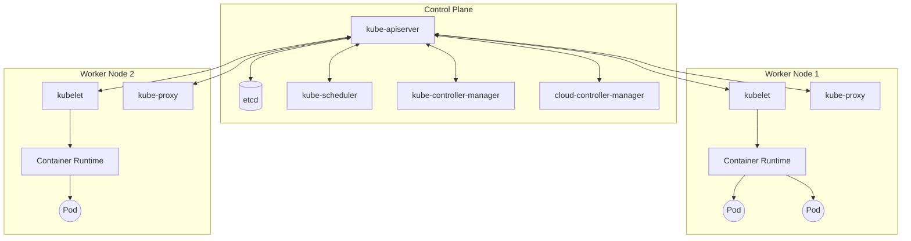
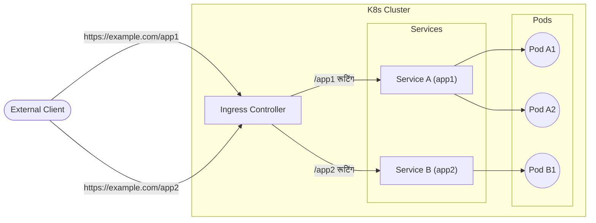

## 1. परिचय

आधुनिक सॉफ्टवेयर विकास और संचालन में, कंटेनर तकनीक अपरिहार्य हो गई है। इनमें से, **Kubernetes** (आमतौर पर **K8s** के रूप में संक्षिप्त) को कंटेनर ऑर्केस्ट्रेशन के वास्तविक मानक के रूप में दुनिया भर की कंपनियों द्वारा अपनाया गया है।

Kubernetes कंटेनरीकृत अनुप्रयोगों की तैनाती, स्केलिंग और प्रबंधन को स्वचालित करने के लिए एक ओपन-सोर्स प्लेटफॉर्म है। इसे मूल रूप से Google द्वारा डिज़ाइन किया गया था और वर्तमान में Cloud Native Computing Foundation (CNCF) द्वारा बनाए रखा गया है।

इस लेख में, हम Kubernetes आर्किटेक्चर के संपूर्ण परिदृश्य में गहराई से उतरेंगे, और कंट्रोल प्लेन के तंत्र से लेकर **Pod** , **Service** , और **Ingress** जैसे प्रमुख संसाधनों की भूमिकाओं तक हर चीज का विस्तार से वर्णन करेंगे।

---

## 2. Kubernetes का संपूर्ण आर्किटेक्चर

एक Kubernetes क्लस्टर मुख्य रूप से दो प्रमुख घटकों से बना होता है: **Control Plane** (कंट्रोल प्लेन) और **Worker Node** (वर्कर नोड)।

नीचे दिया गया चित्र Kubernetes के समग्र आर्किटेक्चर को दर्शाता है।



कंट्रोल प्लेन क्लस्टर के मस्तिष्क के रूप में कार्य करता है, जबकि वर्कर नोड हाथ और पैर के रूप में कार्य करते हैं जो वास्तव में अनुप्रयोगों (कंटेनरों) को चलाते हैं।

---

## 3. कंट्रोल प्लेन घटक

कंट्रोल प्लेन क्लस्टर के बारे में वैश्विक निर्णय (जैसे शेड्यूलिंग) लेता है और क्लस्टर घटनाओं (उदाहरण के लिए, जब Deployment का `replicas` फ़ील्ड पूरा नहीं होता है तो नए Pod को शुरू करना) का पता लगाता है और प्रतिक्रिया देता है।

### 3.1. kube-apiserver

**kube-apiserver** Kubernetes कंट्रोल प्लेन का फ्रंटएंड है। यह Kubernetes API को उजागर करता है और उपयोगकर्ताओं, CLI (`kubectl`), और अन्य कंट्रोल प्लेन घटकों से सभी संचार स्वीकार करता है। API सर्वर को स्केल आउट करने के लिए डिज़ाइन किया गया है, जिससे ट्रैफ़िक को कई उदाहरणों में वितरित किया जा सकता है।

### 3.2. etcd

**etcd** सभी Kubernetes क्लस्टर डेटा को संग्रहीत करने के लिए एक सुसंगत और उच्च-उपलब्धता वाला की-वैल्यू स्टोर है। क्लस्टर की स्थिति, कॉन्फ़िगरेशन जानकारी, Secret आदि सभी etcd में सहेजे जाते हैं। चूँकि etcd डेटा खो जाने पर क्लस्टर को पुनर्प्राप्त करना मुश्किल होता है, इसलिए नियमित बैकअप बहुत महत्वपूर्ण है।

### 3.3. kube-scheduler

**kube-scheduler** उन नए बनाए गए **Pod** की निगरानी करता है जिन्हें अभी तक कोई नोड नहीं सौंपा गया है, और उस नोड का चयन करता है जिस पर उन्हें चलना चाहिए।
शेड्यूलिंग निर्णयों में व्यक्तिगत संसाधन आवश्यकताएं, हार्डवेयर/सॉफ़्टवेयर/नीति की बाधाएं, एफ़िनिटी (आत्मीयता) और एंटी-एफ़िनिटी विनिर्देश, डेटा स्थान आदि शामिल हैं।

शेड्यूलिंग एल्गोरिथम के भाग के रूप में, संसाधनों की स्कोरिंग की जाती है। उदाहरण के लिए, नोड के संसाधन उपयोग की गणना करने वाले सूत्र को इस प्रकार व्यक्त किया जा सकता है:

$$
\text{स्कोर} = \frac{\text{क्षमता} - \text{अनुरोधित}}{\text{क्षमता}} \times 100
$$

ऐसे स्कोर के आधार पर इष्टतम नोड का चयन किया जाता है।

### 3.4. kube-controller-manager

**kube-controller-manager** वह घटक है जो नियंत्रक प्रक्रियाओं को चलाता है। तार्किक रूप से, प्रत्येक नियंत्रक एक अलग प्रक्रिया है, लेकिन जटिलता को कम करने के लिए, इन सभी को एक ही बाइनरी में संकलित किया जाता है और एक ही प्रक्रिया के रूप में चलाया जाता है।
मुख्य नियंत्रकों में शामिल हैं:
- **Node Controller** : जब कोई नोड डाउन हो जाता है तो अधिसूचना और प्रतिक्रिया के लिए जिम्मेदार।
- **Job Controller** : Job ऑब्जेक्ट्स की निगरानी करता है जो एक बार के कार्यों का प्रतिनिधित्व करते हैं, और कार्य को पूरा करने के लिए Pod बनाता है।
- **Endpoints Controller** : Service और Pod को जोड़ने वाले Endpoints ऑब्जेक्ट उत्पन्न करता है।

### 3.5. cloud-controller-manager

यह घटक क्लाउड प्रदाता-विशिष्ट नियंत्रण तर्क को एम्बेड करता है। यह क्लस्टर को क्लाउड प्रदाता के API से जोड़ता है और उन घटकों को अलग करता है जो क्लाउड प्लेटफॉर्म के साथ इंटरैक्ट करते हैं, उन घटकों से जो केवल क्लस्टर के भीतर इंटरैक्ट करते हैं।

---

## 4. वर्कर नोड घटक

वर्कर नोड वर्चुअल या भौतिक मशीनें हैं जो वास्तव में एप्लिकेशन वर्कलोड को होस्ट करती हैं।

### 4.1. kubelet

**kubelet** एक एजेंट है जो क्लस्टर में प्रत्येक नोड पर चलता है। यह सुनिश्चित करता है कि कंटेनर **Pod** के भीतर मज़बूती से चल रहे हैं।
kubelet विभिन्न तंत्रों के माध्यम से प्रदान किए गए PodSpec के एक सेट को प्राप्त करता है और यह सुनिश्चित करता है कि उन PodSpec में वर्णित कंटेनर ठीक से काम कर रहे हैं।

### 4.2. kube-proxy

**kube-proxy** एक नेटवर्क प्रॉक्सी है जो क्लस्टर के प्रत्येक नोड पर चलता है, और यह Kubernetes की **Service** अवधारणा के एक हिस्से को लागू करता है।
kube-proxy नोड पर नेटवर्क नियमों को बनाए रखता है, और ये नेटवर्क नियम क्लस्टर के अंदर या बाहर से Pod तक नेटवर्क संचार की अनुमति देते हैं। यह रूटिंग के लिए OS की पैकेट फ़िल्टरिंग लेयर (जैसे iptables या IPVS) का उपयोग करता है।

### 4.3. [Container](https://kenji.blog/hi/p/docker-container-namespace-cgroups-layers/) Runtime

कंटेनर रनटाइम कंटेनरों को चलाने के लिए जिम्मेदार सॉफ़्टवेयर है। Kubernetes containerd, CRI-O आदि जैसे कंटेनर रनटाइम का समर्थन करता है।

---

## 5. Pod: Kubernetes की न्यूनतम परिनियोजन इकाई

Kubernetes में, कंटेनरों को सीधे तैनात नहीं किया जाता है। इसके बजाय, **Pod** (पॉड) नामक Kubernetes में न्यूनतम परिनियोजन इकाई का उपयोग किया जाता है।

### 5.1. Pod क्या है

Pod एक या अधिक कंटेनरों का समूह है जिसे एकल नोड पर तैनात किया जाता है। Pod के भीतर के कंटेनर स्टोरेज (Volume) और नेटवर्क स्पेस (IP एड्रेस और पोर्ट स्पेस) साझा करते हैं। यह कसकर युग्मित कंटेनरों को एक-दूसरे के साथ कुशलतापूर्वक संवाद करने की अनुमति देता है।

### 5.2. Pod का YAML मेनिफेस्ट उदाहरण

नीचे NGINX वेब सर्वर चलाने वाले एक साधारण Pod की YAML परिभाषा दी गई है।

```yaml
apiVersion: v1
kind: Pod
metadata:
  name: nginx-pod
  labels:
    app: web
spec:
  containers:
  - name: nginx-container
    image: nginx:1.21.4
    ports:
    - containerPort: 80
```

जब इस मेनिफेस्ट को `kubectl apply -f pod.yaml` के साथ लागू किया जाता है, तो Pod बन जाता है। `labels` बाद में वर्णित Service और Deployment में Pod की पहचान करने में बहुत महत्वपूर्ण भूमिका निभाते हैं।

---

## 6. वर्कलोड प्रबंधन (Deployment)

Pod अस्थायी होते हैं। यदि कोई नोड डाउन हो जाता है, तो उस पर मौजूद Pod भी खो जाते हैं। इसलिए, उत्पादन वातावरण में, हम सीधे Pod बनाने के बजाय Pod को प्रबंधित करने के लिए **Deployment** जैसे नियंत्रकों का उपयोग करते हैं।

Deployment Pod की प्रतिकृति संख्या (ReplicaSet के माध्यम से) को बनाए रखता है, और बिना डाउनटाइम के रोलिंग अपडेट और रोलबैक की अनुमति देता है।

```yaml
apiVersion: apps/v1
kind: Deployment
metadata:
  name: nginx-deployment
spec:
  replicas: 3
  selector:
    matchLabels:
      app: web
  template:
    metadata:
      labels:
        app: web
    spec:
      containers:
      - name: nginx
        image: nginx:1.21.4
        ports:
        - containerPort: 80
```

उपरोक्त कॉन्फ़िगरेशन के साथ, Kubernetes गारंटी देता है कि 3 NGINX Pod हमेशा चल रहे हैं।

---

## 7. नेटवर्किंग की मूल बातें: Service

चूंकि Pod गतिशील रूप से बनाए और नष्ट किए जाते हैं, इसलिए उनके IP एड्रेस भी गतिशील रूप से बदलते हैं। इसके साथ, क्लाइंट (अन्य Pod या बाहरी उपयोगकर्ता) जो Pod के एक समूह तक पहुंचना चाहते हैं, उन्हें नहीं पता होगा कि किस IP से संवाद करना है।
**Service** इस समस्या का समाधान करती है।

### 7.1. Service की भूमिका

Service एक तार्किक Pod सेट और उन तक पहुँचने के लिए एक नीति (कभी-कभी माइक्रोसर्विस कहा जाता है) को परिभाषित करने वाली एक अमूर्त अवधारणा है। Service को एक निश्चित IP एड्रेस (ClusterIP) सौंपा जाता है, और यह पीछे के Pod पर लोड बैलेंसिंग करता है।

### 7.2. Service के प्रकार

- **ClusterIP** (डिफ़ॉल्ट): क्लस्टर के आंतरिक IP पर Service को उजागर करता है। यह केवल क्लस्टर के भीतर से ही पहुँचा जा सकता है।
- **NodePort** : प्रत्येक नोड के IP के स्थिर पोर्ट पर Service को उजागर करता है। इसे क्लस्टर के बाहर से `<NodeIP>:<NodePort>` पर पहुँचा जा सकता है।
- **LoadBalancer** : क्लाउड प्रदाता के लोड बैलेंसर का उपयोग करके Service को बाहरी रूप से उजागर करता है।
- **ExternalName** : Service को बाहरी DNS नाम पर मैप करता है।

### 7.3. Service का YAML मेनिफेस्ट उदाहरण

```yaml
apiVersion: v1
kind: Service
metadata:
  name: nginx-service
spec:
  selector:
    app: web
  ports:
    - protocol: TCP
      port: 80
      targetPort: 80
  type: ClusterIP
```

यह Service `app: web` लेबल वाले सभी Pod पर ट्रैफ़िक को रूट करती है।

---

## 8. बाहरी पहुँच नियंत्रण: Ingress

यद्यपि Service के `NodePort` या `LoadBalancer` का उपयोग करके बाहरी पहुँच संभव है, कई सेवाओं को उजागर करते समय, LoadBalancer की संख्या प्रत्येक सेवा के साथ बढ़ती है, और लागत आसमान छूती है। इसके अलावा, उन्नत HTTP रूटिंग (URL पथ या होस्टनाम-आधारित रूटिंग) और SSL/TLS टर्मिनेशन करने के लिए यह अपर्याप्त है।

यहीं पर **Ingress** काम आता है।

### 8.1. Ingress क्या है

Ingress एक API ऑब्जेक्ट है जो क्लस्टर के बाहर से क्लस्टर के भीतर Service तक HTTP और HTTPS रूट को उजागर करता है। ट्रैफ़िक रूटिंग को Ingress संसाधन में परिभाषित नियमों द्वारा नियंत्रित किया जाता है।

Ingress को काम करने के लिए, क्लस्टर में एक **Ingress Controller** (जैसे NGINX Ingress Controller या AWS ALB Ingress Controller) का चलना आवश्यक है।

### 8.2. ट्रैफ़िक रूटिंग आरेख

नीचे दिया गया Mermaid आरेख Ingress के माध्यम से ट्रैफ़िक के प्रवाह को दर्शाता है।



### 8.3. Ingress का YAML मेनिफेस्ट उदाहरण

नीचे होस्टनाम और पथ-आधारित रूटिंग करने वाले Ingress का एक उदाहरण दिया गया है।

```yaml
apiVersion: networking.k8s.io/v1
kind: Ingress
metadata:
  name: example-ingress
  annotations:
    nginx.ingress.kubernetes.io/rewrite-target: /
spec:
  rules:
  - host: www.example.com
    http:
      paths:
      - path: /app1
        pathType: Prefix
        backend:
          service:
            name: app1-service
            port:
              number: 80
      - path: /app2
        pathType: Prefix
        backend:
          service:
            name: app2-service
            port:
              number: 80
```

इस सेटिंग के साथ, `www.example.com/app1` तक पहुँच को `app1-service` पर, और `/app2` तक पहुँच को `app2-service` पर रूट किया जाता है।

---

## 9. सारांश

इस लेख में, हमने Kubernetes आर्किटेक्चर के मूल कंट्रोल प्लेन के तंत्र से लेकर वर्कर नोड और एप्लिकेशन ( **Pod** , **Service** , और **Ingress** ) को तैनात करने के लिए प्रमुख संसाधनों तक विस्तार से बताया है।

Kubernetes एक बहुत ही बहुमुखी और शक्तिशाली उपकरण है, लेकिन इसे एक तीव्र सीखने की अवस्था के लिए भी जाना जाता है। हालाँकि, यहाँ समझाए गए बुनियादी घटकों और उनके समन्वय को समझकर (Pod कंटेनरों को लपेटते हैं, Deployment Pod का प्रबंधन करता है, Service नेटवर्क को अमूर्त करती है, और Ingress बाहरी ट्रैफ़िक को नियंत्रित करता है), यह अधिक उन्नत सुविधाओं (RBAC, Helm, Service Mesh आदि) में महारत हासिल करने के लिए एक मजबूत आधार बन जाता है।

कृपया एक वास्तविक क्लस्टर (जैसे Minikube या kind) शुरू करें, मेनिफेस्ट लागू करें और इसके संचालन की जांच करें। सिद्धांत और व्यवहार को दोहराना Kubernetes मास्टर बनने का सबसे तेज़ तरीका है।
