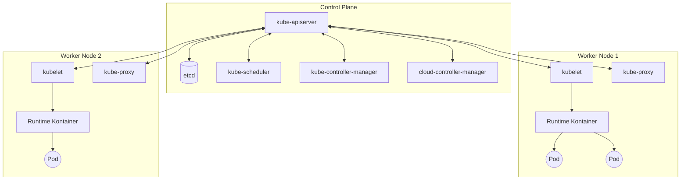
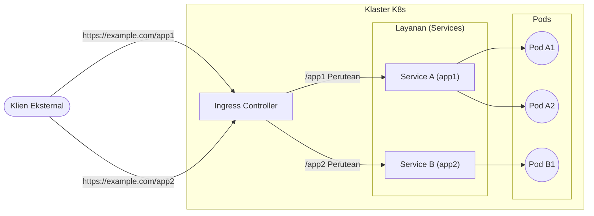

## 1. Pendahuluan

Dalam pengembangan dan operasional perangkat lunak modern, teknologi kontainer telah menjadi sangat penting. Di antaranya, **Kubernetes** (umumnya disingkat **K8s**) telah diadopsi oleh perusahaan di seluruh dunia sebagai standar de facto untuk orkestrasi kontainer.

Kubernetes adalah platform sumber terbuka untuk mengotomatiskan penerapan (deployment), penskalaan, dan pengelolaan aplikasi dalam kontainer. Awalnya dirancang oleh Google, dan saat ini dikelola oleh Cloud Native Computing Foundation (CNCF).

Pada artikel ini, kita akan menggali lebih dalam tentang arsitektur keseluruhan Kubernetes, dan menjelaskan secara rinci mekanisme dari control plane, hingga peran dari sumber daya utama seperti **Pod**, **Service**, dan **Ingress**.

---

## 2. Arsitektur Keseluruhan Kubernetes

Klaster Kubernetes secara garis besar terdiri dari dua komponen utama. Yaitu **Control Plane** dan **Worker Node**.

Diagram berikut menunjukkan arsitektur keseluruhan Kubernetes.



Control plane berfungsi sebagai otak dari seluruh klaster, sedangkan worker node berfungsi sebagai tangan dan kaki yang benar-benar menjalankan aplikasi (kontainer).

---

## 3. Komponen Control Plane

Control plane membuat keputusan global terkait klaster (seperti penjadwalan), serta mendeteksi dan merespons event pada klaster (contohnya, memulai Pod baru jika field `replicas` pada Deployment belum terpenuhi).

### 3.1. kube-apiserver

**kube-apiserver** adalah front end dari control plane Kubernetes. Ini mengekspos API Kubernetes dan menerima semua komunikasi dari pengguna, CLI (`kubectl`), serta komponen control plane lainnya. Server API dirancang untuk dapat ditingkatkan skalanya (scale out), dan lalu lintas jaringan (traffic) dapat didistribusikan ke banyak instans.

### 3.2. etcd

**etcd** adalah penyimpanan key-value yang konsisten dan memiliki ketersediaan tinggi (high availability), digunakan untuk menyimpan semua data klaster Kubernetes. Status klaster, informasi konfigurasi, dan Secret semuanya disimpan di etcd. Karena pemulihan klaster akan sulit jika data etcd hilang, pencadangan (backup) secara berkala menjadi sangat penting.

### 3.3. kube-scheduler

**kube-scheduler** mengawasi **Pod** yang baru dibuat dan belum ditugaskan ke sebuah node, lalu memilih node di mana Pod tersebut harus dijalankan.
Keputusan penjadwalan ini mempertimbangkan kebutuhan sumber daya masing-masing, batasan perangkat keras/perangkat lunak/kebijakan, spesifikasi afinitas (affinity) dan anti-afinitas, serta lokalitas data.

Sebagai bagian dari algoritme penjadwalan, dilakukan penilaian (scoring) terhadap sumber daya. Contohnya, rumus untuk menghitung tingkat penggunaan sumber daya sebuah node dapat dinyatakan sebagai berikut:

$$
\text{Skor} = \frac{\text{Kapasitas} - \text{Diminta}}{\text{Kapasitas}} \times 100
$$

Berdasarkan skor seperti ini, node yang paling optimal akan dipilih.

### 3.4. kube-controller-manager

**kube-controller-manager** adalah komponen yang menjalankan proses pengontrol (controller). Secara logis, tiap controller merupakan proses tersendiri, tetapi untuk mengurangi kompleksitas, semuanya dikompilasi menjadi sebuah binari tunggal dan dijalankan sebagai satu proses tunggal.
Controller utama meliputi:
- **Node Controller**: Bertanggung jawab untuk memberi notifikasi dan merespons ketika sebuah node down.
- **Job Controller**: Mengawasi objek Job yang merepresentasikan tugas sekali jalan, dan membuat Pod yang menjalankan tugas tersebut hingga selesai.
- **Endpoints Controller**: Membuat objek Endpoints yang menghubungkan Service dengan Pod.

### 3.5. cloud-controller-manager

Komponen yang menyematkan logika kontrol spesifik penyedia cloud. Ini menghubungkan klaster dengan API penyedia cloud, dan memisahkan komponen yang berinteraksi dengan platform cloud dari komponen yang hanya berinteraksi di dalam klaster itu sendiri.

---

## 4. Komponen Worker Node

Worker node merupakan mesin virtual atau fisik yang benar-benar meng-host beban kerja (workload) aplikasi.

### 4.1. kubelet

**kubelet** adalah agen yang dijalankan pada tiap node di klaster. Agen ini memastikan bahwa kontainer benar-benar berjalan di dalam **Pod**.
Kubelet menerima serangkaian PodSpec yang disediakan melalui berbagai mekanisme, dan memastikan kontainer yang dideskripsikan pada PodSpec tersebut beroperasi dengan normal.

### 4.2. kube-proxy

**kube-proxy** adalah proxy jaringan yang dijalankan pada tiap node di klaster, mengimplementasikan bagian dari konsep **Service** pada Kubernetes.
kube-proxy memelihara aturan jaringan pada node. Aturan ini memungkinkan komunikasi jaringan ke Pod dari dalam maupun luar klaster. Proxy ini memanfaatkan lapisan packet filtering sistem operasi (seperti iptables atau IPVS) untuk melakukan perutean (routing).

### 4.3. [Container](https://kenji.blog/id/p/docker-container-namespace-cgroups-layers/) Runtime

Runtime kontainer (Container Runtime) merupakan perangkat lunak yang bertanggung jawab untuk menjalankan kontainer. Kubernetes mendukung runtime kontainer seperti containerd, CRI-O, dan lain-lain.

---

## 5. Pod: Unit Deployment Terkecil Kubernetes

Pada Kubernetes, kita tidak men-deploy kontainer secara langsung. Sebagai gantinya, digunakan unit deployment terkecil dalam Kubernetes yang disebut **Pod**.

### 5.1. Apa itu Pod?

Pod adalah sekumpulan satu atau lebih kontainer yang di-deploy pada sebuah node tunggal. Kontainer-kontainer di dalam Pod berbagi penyimpanan (Volume) dan ruang jaringan (alamat IP serta ruang port). Hal ini memungkinkan kontainer yang tergabung secara erat untuk saling berkomunikasi secara efisien.

### 5.2. Contoh Manifes YAML Pod

Berikut adalah contoh definisi YAML Pod sederhana yang menjalankan web server NGINX.

```yaml
apiVersion: v1
kind: Pod
metadata:
  name: nginx-pod
  labels:
    app: web
spec:
  containers:
  - name: nginx-container
    image: nginx:1.21.4
    ports:
    - containerPort: 80
```

Jika manifes ini diterapkan (apply) dengan perintah `kubectl apply -f pod.yaml`, maka sebuah Pod akan dibuat. `labels` memainkan peran yang sangat penting dalam mengidentifikasi Pod pada Service atau Deployment, yang akan dijelaskan kemudian.

---

## 6. Manajemen Beban Kerja (Deployment)

Pod bersifat sementara (ephemeral). Jika sebuah node down, Pod di atasnya juga akan hilang. Oleh karena itu, pada lingkungan produksi (production), Pod tidak dibuat secara langsung, melainkan menggunakan pengontrol seperti **Deployment** untuk mengelola Pod.

Deployment menjaga jumlah replika Pod (melalui ReplicaSet), dan memungkinkan pembaruan bergulir (rolling update) serta pengembalian ke versi sebelumnya (rollback) tanpa adanya waktu henti (downtime).

```yaml
apiVersion: apps/v1
kind: Deployment
metadata:
  name: nginx-deployment
spec:
  replicas: 3
  selector:
    matchLabels:
      app: web
  template:
    metadata:
      labels:
        app: web
    spec:
      containers:
      - name: nginx
        image: nginx:1.21.4
        ports:
        - containerPort: 80
```

Dengan konfigurasi di atas, Kubernetes akan memastikan bahwa selalu terdapat 3 Pod NGINX yang berjalan.

---

## 7. Dasar-dasar Jaringan: Service

Karena Pod dibuat dan dihancurkan secara dinamis, alamat IP-nya juga berubah-ubah. Hal ini menyebabkan klien (Pod lain atau pengguna eksternal) yang ingin mengakses sekelompok Pod menjadi tidak tahu alamat IP mana yang harus dihubungi.
Solusi untuk masalah ini adalah **Service**.

### 7.1. Peran Service

Service adalah sebuah konsep abstrak yang mendefinisikan himpunan Pod logis dan kebijakan (policy) untuk mengaksesnya (terkadang disebut sebagai layanan mikro atau microservice). Service diberikan alamat IP yang tetap (ClusterIP) dan melakukan load balancing ke Pod di belakangnya.

### 7.2. Tipe Service

- **ClusterIP** (Bawaan): Mengekspos Service pada IP internal klaster. Hanya dapat diakses dari dalam klaster.
- **NodePort**: Mengekspos Service pada port statis IP setiap node. Dapat diakses dari luar klaster melalui `<NodeIP>:<NodePort>`.
- **LoadBalancer**: Menggunakan load balancer dari penyedia cloud untuk mengekspos Service secara eksternal.
- **ExternalName**: Memetakan Service ke nama DNS eksternal.

### 7.3. Contoh Manifes YAML Service

```yaml
apiVersion: v1
kind: Service
metadata:
  name: nginx-service
spec:
  selector:
    app: web
  ports:
    - protocol: TCP
      port: 80
      targetPort: 80
  type: ClusterIP
```

Service ini akan merutekan lalu lintas jaringan ke semua Pod yang memiliki label `app: web`.

---

## 8. Kontrol Akses Eksternal: Ingress

Meskipun akses eksternal dimungkinkan menggunakan `NodePort` atau `LoadBalancer` pada Service, jika kita mengekspos banyak layanan, jumlah LoadBalancer akan meningkat dan biayanya akan melonjak. Selain itu, cara ini tidak cukup memadai untuk melakukan perutean HTTP tingkat lanjut (berdasarkan path URL atau nama host) maupun terminasi SSL/TLS.

Di sinilah **Ingress** berperan.

### 8.1. Apa itu Ingress?

Ingress adalah objek API yang mengekspos rute HTTP dan HTTPS dari luar klaster ke Service di dalam klaster. Perutean lalu lintas dikontrol oleh aturan-aturan (rules) yang didefinisikan pada sumber daya Ingress.

Agar Ingress dapat berfungsi, sebuah **Ingress Controller** (seperti NGINX Ingress Controller, AWS ALB Ingress Controller, dll.) harus sedang berjalan di dalam klaster.

### 8.2. Diagram Perutean Lalu Lintas

Diagram Mermaid berikut menunjukkan aliran lalu lintas yang melewati Ingress.



### 8.3. Contoh Manifes YAML Ingress

Berikut adalah contoh Ingress yang melakukan perutean berbasis nama host dan path.

```yaml
apiVersion: networking.k8s.io/v1
kind: Ingress
metadata:
  name: example-ingress
  annotations:
    nginx.ingress.kubernetes.io/rewrite-target: /
spec:
  rules:
  - host: www.example.com
    http:
      paths:
      - path: /app1
        pathType: Prefix
        backend:
          service:
            name: app1-service
            port:
              number: 80
      - path: /app2
        pathType: Prefix
        backend:
          service:
            name: app2-service
            port:
              number: 80
```

Dengan konfigurasi ini, akses ke `www.example.com/app1` akan didistribusikan ke `app1-service`, dan akses ke `/app2` akan didistribusikan ke `app2-service`.

---

## 9. Kesimpulan

Pada artikel ini, kita telah menjelaskan secara rinci tentang mekanisme control plane, yang merupakan inti dari arsitektur Kubernetes, kemudian worker node, dan sumber daya utama (**Pod**, **Service**, **Ingress**) untuk men-deploy aplikasi.

Kubernetes adalah perangkat yang sangat multifungsi dan tangguh, namun hal ini membuatnya dikenal memiliki kurva pembelajaran (learning curve) yang curam. Meskipun demikian, memahami komponen-komponen dasar ini beserta interaksinya (Pod membungkus kontainer, Deployment mengelola Pod, Service mengabstraksikan jaringan, dan Ingress mengontrol lalu lintas eksternal) akan menjadi fondasi kuat untuk mempelajari fungsi-fungsi yang lebih canggih (RBAC, Helm, Service Mesh, dll.).

Silakan coba nyalakan klaster nyata (seperti Minikube atau kind), terapkan manifes, dan periksa perilakunya. Mengulangi teori dan praktik secara bergantian adalah jalan pintas terbaik untuk menjadi ahli Kubernetes.
