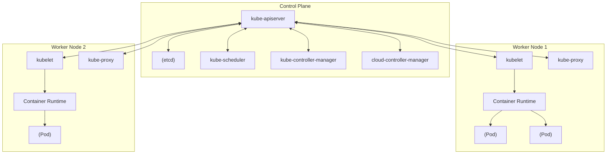
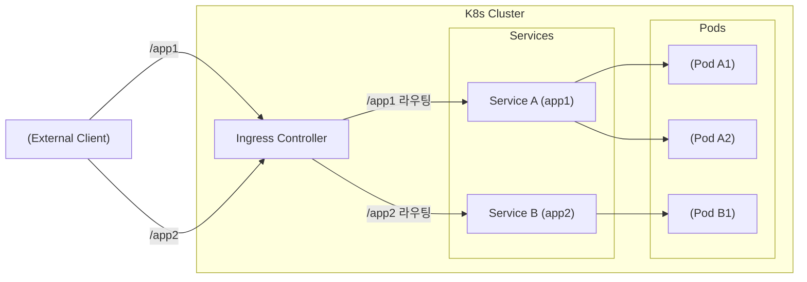

## 1. 소개

현대 소프트웨어 개발 및 운영에서 컨테이너 기술은 필수 불가결한 요소가 되었습니다. 그중에서도 **Kubernetes** (일반적으로 **K8s** 라고 줄여서 부릅니다)는 컨테이너 오케스트레이션의 사실상 표준으로서 전 세계 기업에서 채택되고 있습니다.

Kubernetes는 컨테이너화된 애플리케이션의 배포, 스케일링 및 관리를 자동화하기 위한 오픈 소스 플랫폼입니다. 원래 Google에서 설계했으며 현재는 Cloud Native Computing Foundation (CNCF) 에 의해 유지 관리되고 있습니다.

이 글에서는 Kubernetes 아키텍처의 전체적인 모습을 깊이 파고들어, 컨트롤 플레인의 구조부터 **Pod** , **Service** , **Ingress** 와 같은 주요 리소스의 역할까지 상세하게 해설합니다.

---

## 2. Kubernetes의 전체 아키텍처

Kubernetes 클러스터는 크게 두 가지 주요 컴포넌트로 구성됩니다. 바로 **컨트롤 플레인 (Control Plane)** 과 **워커 노드 (Worker Node)** 입니다.

다음 그림은 Kubernetes의 전체적인 아키텍처를 보여줍니다.



컨트롤 플레인은 클러스터 전체의 두뇌 역할을 하며, 워커 노드는 실제로 애플리케이션(컨테이너)을 실행하는 손발 역할을 합니다.

---

## 3. 컨트롤 플레인 컴포넌트

컨트롤 플레인은 클러스터에 관한 글로벌한 결정(스케줄링 등)을 내리고 클러스터의 이벤트(예를 들어, Deployment의 `replicas` 필드가 충족되지 않았을 때 새로운 Pod의 시작)를 감지하고 응답합니다.

### 3.1. kube-apiserver

**kube-apiserver** 는 Kubernetes 컨트롤 플레인의 프론트엔드입니다. Kubernetes API를 노출하고 사용자, CLI(`kubectl`) 및 기타 컨트롤 플레인 컴포넌트로부터의 모든 통신을 수락합니다. API 서버는 스케일 아웃이 가능한 설계로 되어 있어 트래픽을 여러 인스턴스에 분산시킬 수 있습니다.

### 3.2. etcd

**etcd** 는 Kubernetes의 모든 클러스터 데이터를 저장하기 위한 일관성 있는 고가용성 키-값 저장소입니다. 클러스터의 상태, 구성 정보, Secret 등은 모두 etcd에 저장됩니다. etcd의 데이터가 손실되면 클러스터 복구가 어려워지므로 정기적인 백업이 매우 중요합니다.

### 3.3. kube-scheduler

**kube-scheduler** 는 새로 생성된 **Pod** 중 아직 노드가 할당되지 않은 것을 모니터링하고, 해당 Pod가 실행되어야 할 노드를 선택합니다.
스케줄링 결정에는 개별 리소스 요구 사항, 하드웨어/소프트웨어/정책 제약, 어피니티(친화성) 및 안티 어피니티 사양, 데이터 지역성 등이 고려됩니다.

스케줄링 알고리즘의 일부로 리소스 스코어링이 수행됩니다. 예를 들어, 노드의 리소스 사용률을 계산하는 수식은 다음과 같이 표현할 수 있습니다.

$$
Score = \frac{Capacity - Requested}{Capacity} \times 100
$$

이러한 점수를 바탕으로 최적의 노드가 선출됩니다.

### 3.4. kube-controller-manager

**kube-controller-manager** 는 컨트롤러 프로세스를 실행하는 컴포넌트입니다. 논리적으로 각 컨트롤러는 개별 프로세스이지만 복잡성을 줄이기 위해 이들은 모두 단일 바이너리로 컴파일되어 단일 프로세스로 실행됩니다.
주요 컨트롤러에는 다음이 포함됩니다:
- **Node Controller** : 노드가 다운되었을 때의 알림 및 응답을 담당합니다.
- **Job Controller** : 단발성 태스크를 나타내는 Job 객체를 모니터링하고 태스크를 완료까지 실행할 Pod를 생성합니다.
- **Endpoints Controller** : Service와 Pod를 연결하는 Endpoints 객체를 생성합니다.

### 3.5. cloud-controller-manager

클라우드 공급자 고유의 제어 로직을 내장하는 컴포넌트입니다. 클러스터를 클라우드 공급자의 API에 연결하고, 클라우드 플랫폼과 상호 작용하는 컴포넌트를 클러스터 내에서만 상호 작용하는 컴포넌트와 분리합니다.

---

## 4. 워커 노드 컴포넌트

워커 노드는 애플리케이션의 워크로드를 실제로 호스팅하는 가상 또는 물리 머신입니다.

### 4.1. kubelet

**kubelet** 은 클러스터 내의 각 노드에서 실행되는 에이전트입니다. 컨테이너가 **Pod** 내에서 확실하게 실행되고 있음을 보장합니다.
kubelet은 다양한 메커니즘을 통해 제공되는 PodSpec 세트를 수신하고, 이러한 PodSpec에 설명된 컨테이너가 정상적으로 동작하고 있는지 확인합니다.

### 4.2. kube-proxy

**kube-proxy** 는 클러스터 내의 각 노드에서 실행되는 네트워크 프록시이며 Kubernetes의 **Service** 개념의 일부를 구현합니다.
kube-proxy는 노드 상의 네트워크 규칙을 유지 관리하고, 이러한 네트워크 규칙에 의해 클러스터 내부 또는 외부에서 Pod로의 네트워크 통신이 가능해집니다. OS의 패킷 필터링 계층(iptables나 IPVS 등)을 이용하여 라우팅을 수행합니다.

### 4.3. [Container](https://kenji.blog/ko/p/docker-container-namespace-cgroups-layers/) Runtime

컨테이너 런타임은 컨테이너의 실행을 담당하는 소프트웨어입니다. Kubernetes는 containerd, CRI-O 등의 컨테이너 런타임을 지원합니다.

---

## 5. Pod: Kubernetes의 최소 배포 단위

Kubernetes에서는 컨테이너를 직접 배포하지 않습니다. 대신 **Pod** (포드)라고 불리는 Kubernetes의 최소 배포 단위를 사용합니다.

### 5.1. Pod란?

Pod는 단일 노드에 배포되는 하나 이상의 컨테이너 그룹입니다. Pod 내의 컨테이너는 스토리지(Volume)와 네트워크 공간(IP 주소 및 포트 공간)을 공유합니다. 이를 통해 밀접하게 결합된 컨테이너가 서로 효율적으로 통신할 수 있습니다.

### 5.2. Pod의 YAML 매니페스트 예시

다음은 NGINX 웹 서버를 실행하는 간단한 Pod의 YAML 정의입니다.

```yaml
apiVersion: v1
kind: Pod
metadata:
  name: nginx-pod
  labels:
    app: web
spec:
  containers:
  - name: nginx-container
    image: nginx:1.21.4
    ports:
    - containerPort: 80
```

이 매니페스트를 `kubectl apply -f pod.yaml` 로 적용하면 Pod가 생성됩니다. `labels` 는 나중에 설명할 Service나 Deployment에서 Pod를 식별하는 데 매우 중요한 역할을 합니다.

---

## 6. 워크로드 관리 (Deployment)

Pod는 일시적인 존재입니다. 노드가 다운되면 그 위의 Pod도 손실됩니다. 따라서 프로덕션 환경에서는 Pod를 직접 생성하는 대신 **Deployment** 와 같은 컨트롤러를 사용하여 Pod를 관리합니다.

Deployment는 Pod의 레플리카 수를 유지하고(ReplicaSet을 통해) 무중단 롤링 업데이트나 롤백을 가능하게 합니다.

```yaml
apiVersion: apps/v1
kind: Deployment
metadata:
  name: nginx-deployment
spec:
  replicas: 3
  selector:
    matchLabels:
      app: web
  template:
    metadata:
      labels:
        app: web
    spec:
      containers:
      - name: nginx
        image: nginx:1.21.4
        ports:
        - containerPort: 80
```

위의 설정에서는 항상 3개의 NGINX Pod가 실행되고 있는 상태를 Kubernetes가 보장합니다.

---

## 7. 네트워킹의 기본: Service

Pod는 동적으로 생성되고 파괴되기 때문에 IP 주소도 동적으로 변합니다. 이렇게 되면 특정 Pod 그룹에 접근하려는 클라이언트(다른 Pod나 외부 사용자)가 어떤 IP로 통신해야 할지 알 수 없게 됩니다.
이를 해결하는 것이 **Service** 입니다.

### 7.1. Service의 역할

Service는 논리적인 Pod의 집합과 그들에 접근하기 위한 정책(마이크로서비스라고도 불림)을 정의하는 추상 개념입니다. Service에는 고정 IP 주소(ClusterIP)가 할당되며 배후의 Pod로 로드 밸런싱을 수행합니다.

### 7.2. Service의 유형

- **ClusterIP** (기본값): 클러스터 내부의 IP로 Service를 노출합니다. 클러스터 내에서만 접근할 수 있습니다.
- **NodePort** : 각 노드 IP의 정적 포트로 Service를 노출합니다. 클러스터 외부에서 `<NodeIP>:<NodePort>` 로 접근할 수 있습니다.
- **LoadBalancer** : 클라우드 공급자의 로드 밸런서를 사용하여 Service를 외부에 노출합니다.
- **ExternalName** : Service를 외부 DNS 이름에 매핑합니다.

### 7.3. Service의 YAML 매니페스트 예시

```yaml
apiVersion: v1
kind: Service
metadata:
  name: nginx-service
spec:
  selector:
    app: web
  ports:
    - protocol: TCP
      port: 80
      targetPort: 80
  type: ClusterIP
```

이 Service는 `app: web` 이라는 레이블을 가진 모든 Pod로 트래픽을 라우팅합니다.

---

## 8. 외부로부터의 접근 제어: Ingress

Service의 `NodePort` 나 `LoadBalancer` 를 사용해도 외부 접근은 가능하지만, 여러 서비스를 노출할 경우 서비스마다 LoadBalancer의 수가 늘어나 비용이 급등합니다. 또한 고도의 HTTP 라우팅(URL 경로 또는 호스트 이름 기반 라우팅)이나 SSL/TLS 종료를 수행하기에는 부족합니다.

여기서 등장하는 것이 **Ingress** 입니다.

### 8.1. Ingress란?

Ingress는 클러스터 외부에서 클러스터 내부의 Service로의 HTTP 및 HTTPS 경로를 노출하는 API 객체입니다. 트래픽의 라우팅은 Ingress 리소스에 정의된 규칙에 의해 제어됩니다.

Ingress가 기능하려면 **Ingress Controller** (NGINX Ingress Controller나 AWS ALB Ingress Controller 등)가 클러스터 내에서 동작하고 있어야 합니다.

### 8.2. 트래픽 라우팅 다이어그램

다음 Mermaid 다이어그램은 Ingress를 경유하는 트래픽의 흐름을 보여줍니다.



### 8.3. Ingress의 YAML 매니페스트 예시

다음은 호스트 이름 및 경로 기반의 라우팅을 수행하는 Ingress의 예시입니다.

```yaml
apiVersion: networking.k8s.io/v1
kind: Ingress
metadata:
  name: example-ingress
  annotations:
    nginx.ingress.kubernetes.io/rewrite-target: /
spec:
  rules:
  - host: www.example.com
    http:
      paths:
      - path: /app1
        pathType: Prefix
        backend:
          service:
            name: app1-service
            port:
              number: 80
      - path: /app2
        pathType: Prefix
        backend:
          service:
            name: app2-service
            port:
              number: 80
```

이 설정에 의해 `www.example.com/app1` 로의 접근은 `app1-service` 로, `/app2` 로의 접근은 `app2-service` 로 분배됩니다.

---

## 9. 요약

이 글에서는 Kubernetes 아키텍처의 근간이 되는 컨트롤 플레인의 구조부터 워커 노드, 그리고 애플리케이션을 배포하기 위한 주요 리소스( **Pod** , **Service** , **Ingress** )에 대해 상세하게 해설했습니다.

Kubernetes는 매우 다기능적이고 강력한 도구이지만, 그만큼 학습 곡선이 가파른 것으로도 알려져 있습니다. 하지만 여기서 설명한 기본 컴포넌트와 그들의 연동(Pod가 컨테이너를 감싸고, Deployment가 Pod를 관리하며, Service가 네트워크를 추상화하고, Ingress가 외부 트래픽을 제어함)을 이해함으로써, 보다 고도의 기능(RBAC, Helm, Service Mesh 등)을 습득하기 위한 견고한 토대가 됩니다.

꼭 실제 클러스터(Minikube나 kind 등)를 띄워보고, 매니페스트를 적용하여 동작을 확인해 보세요. 이론과 실습을 반복하는 것이 Kubernetes 마스터로 가는 가장 빠른 지름길입니다.
