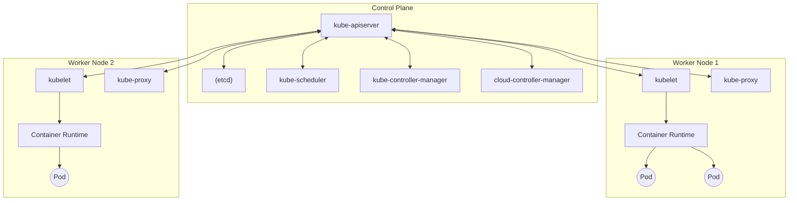
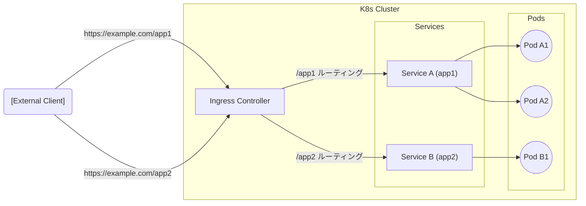

## 1. はじめに

現代のソフトウェア開発と運用において、[コンテナ](https://kenji.blog/p/docker-container-namespace-cgroups-layers/)技術は欠かせないものとなりました。その中でも、 **Kubernetes** （一般に **K8s** と略されます）はコンテナオーケストレーションのデファクトスタンダードとして、世界中の企業で採用されています。

Kubernetesは、コンテナ化されたアプリケーションのデプロイ、スケーリング、および管理を自動化するためのオープンソースプラットフォームです。元々はGoogleによって設計され、現在はCloud Native Computing Foundation (CNCF) によって維持されています。

本記事では、Kubernetesのアーキテクチャの全体像を深く掘り下げ、コントロールプレーンの仕組みから、 **Pod** 、 **Service** 、 **Ingress** といった主要なリソースの役割までを詳細に解説します。

---

## 2. Kubernetesの全体アーキテクチャ

Kubernetesクラスタは、大きく分けて2つの主要なコンポーネントから構成されています。それが **コントロールプレーン (Control Plane)** と **ワーカーノード (Worker Node)** です。

以下の図は、Kubernetesの全体的なアーキテクチャを示しています。



コントロールプレーンはクラスタ全体の頭脳として機能し、ワーカーノードは実際にアプリケーション（[コンテナ](https://kenji.blog/p/docker-container-namespace-cgroups-layers/)）を実行する手足として機能します。

---

## 3. コントロールプレーンコンポーネント

コントロールプレーンは、クラスタに関するグローバルな決定（スケジューリングなど）を行い、クラスタのイベント（例えば、Deploymentの `replicas` フィールドが満たされていない場合の新しいPodの起動）を検知して応答します。

### 3.1. kube-apiserver

**kube-apiserver** は、Kubernetesコントロールプレーンのフロントエンドです。Kubernetes APIを公開し、ユーザー、CLI（`kubectl`）、および他のコントロールプレーンコンポーネントからのすべての通信を受け付けます。APIサーバーはスケールアウトが可能な設計となっており、トラフィックを複数のインスタンスに分散させることができます。

### 3.2. etcd

**etcd** は、Kubernetesのすべてのクラスタデータを保存するための、一貫性のある高可用性キーバリューストアです。クラスタの状態、構成情報、Secretなどはすべてetcdに保存されます。etcdのデータが失われるとクラスタの復旧が困難になるため、定期的なバックアップが非常に重要です。

### 3.3. kube-scheduler

**kube-scheduler** は、新しく作成された **Pod** で、まだノードが割り当てられていないものを監視し、それらが実行されるべきノードを選択します。
スケジューリングの決定には、個々のリソース要件、ハードウェア/ソフトウェア/ポリシーの制約、アフィニティ（親和性）およびアンチアフィニティの仕様、データローカリティなどが考慮されます。

スケジューリングアルゴリズムの一部として、リソースのスコアリングが行われます。例えば、ノードのリソース利用率を計算する数式は以下のように表すことができます。

$$
Score = \frac{Capacity - Requested}{Capacity} \times 100
$$

このようなスコアを元に、最適なノードが選出されます。

### 3.4. kube-controller-manager

**kube-controller-manager** は、コントローラプロセスを実行するコンポーネントです。論理的には、各コントローラは個別のプロセスですが、複雑さを減らすために、これらはすべて単一のバイナリにコンパイルされ、単一のプロセスとして実行されます。
主なコントローラには以下のものがあります：
-  **Node Controller** : ノードがダウンしたときの通知と応答を担当します。
-  **Job Controller** : 単発のタスクを表すJobオブジェクトを監視し、タスクを完了まで実行するPodを作成します。
-  **Endpoints Controller** : ServiceとPodを紐づけるEndpointsオブジェクトを生成します。

### 3.5. cloud-controller-manager

クラウドプロバイダー固有の制御ロジックを埋め込むコンポーネントです。クラスタをクラウドプロバイダーのAPIにリンクし、クラウドプラットフォームと相互作用するコンポーネントを、クラスタ内でのみ相互作用するコンポーネントから分離します。

---

## 4. ワーカーノードコンポーネント

ワーカーノードは、アプリケーションのワークロードを実際にホストする仮想または物理マシンです。

### 4.1. kubelet

**kubelet** は、クラスタ内の各ノードで実行されるエージェントです。[コンテナ](https://kenji.blog/p/docker-container-namespace-cgroups-layers/)が **Pod** 内で確実に実行されていることを保証します。
kubeletは、様々なメカニズムを通じて提供されるPodSpecのセットを受け取り、それらのPodSpecに記述されたコンテナが正常に動作していることを確認します。

### 4.2. kube-proxy

**kube-proxy** は、クラスタ内の各ノードで実行されるネットワークプロキシであり、Kubernetesの **Service** 概念の一部を実装しています。
kube-proxyは、ノード上のネットワークルールを維持し、これらのネットワークルールにより、クラスタの内部または外部からPodへのネットワーク通信が可能になります。OSのパケットフィルタリング層（iptablesやIPVSなど）を利用してルーティングを行います。

### 4.3. [Container](https://kenji.blog/p/docker-container-namespace-cgroups-layers/) Runtime

コンテナランタイムは、コンテナの実行を担当するソフトウェアです。Kubernetesは、containerd、CRI-Oなどのコンテナランタイムをサポートしています。

---

## 5. Pod：Kubernetesの最小デプロイ単位

Kubernetesでは、コンテナを直接デプロイすることはありません。代わりに、 **Pod** （ポッド）と呼ばれるKubernetesにおける最小のデプロイメント単位を使用します。

### 5.1. Podとは

Podは、単一のノードにデプロイされる1つ以上のコンテナのグループです。Pod内のコンテナは、ストレージ（Volume）とネットワーク空間（IPアドレスとポート空間）を共有します。これにより、密接に結合されたコンテナが互いに効率的に通信できます。

### 5.2. PodのYAMLマニフェスト例

以下は、NGINXウェブサーバーを実行するシンプルなPodのYAML定義です。

```yaml
apiVersion: v1
kind: Pod
metadata:
  name: nginx-pod
  labels:
    app: web
spec:
  containers:
  - name: nginx-container
    image: nginx:1.21.4
    ports:
    - containerPort: 80
```

このマニフェストを `kubectl apply -f pod.yaml` で適用すると、Podが作成されます。 `labels` は後述するServiceやDeploymentでPodを識別するために非常に重要な役割を果たします。

---

## 6. ワークロードの管理（Deployment）

Podは一時的な存在です。ノードがダウンすると、その上のPodも失われます。そのため、本番環境ではPodを直接作成するのではなく、 **Deployment** などのコントローラを使用してPodを管理します。

Deploymentは、Podのレプリカ数を維持し（ReplicaSetを介して）、無停止でのローリングアップデートやロールバックを可能にします。

```yaml
apiVersion: apps/v1
kind: Deployment
metadata:
  name: nginx-deployment
spec:
  replicas: 3
  selector:
    matchLabels:
      app: web
  template:
    metadata:
      labels:
        app: web
    spec:
      containers:
      - name: nginx
        image: nginx:1.21.4
        ports:
        - containerPort: 80
```

上記の設定では、常に3つのNGINX Podが実行されている状態をKubernetesが保証します。

---

## 7. ネットワーキングの基本：Service

Podは動的に作成・破棄されるため、IPアドレスも動的に変わります。これでは、あるPod群にアクセスしたいクライアント（別のPodや外部ユーザー）が、どのIPに通信すればよいか分からなくなります。
これを解決するのが **Service** です。

### 7.1. Serviceの役割

Serviceは、論理的なPodのセットと、それらにアクセスするためのポリシー（[マイクロサービス](https://kenji.blog/p/microservices-architecture-bff-api-gateway/)と呼ばれることもあります）を定義する抽象概念です。Serviceには固定のIPアドレス（ClusterIP）が割り当てられ、背後のPodへのロードバランシングを行います。

### 7.2. Serviceのタイプ

-  **ClusterIP** （デフォルト）: クラスタ内部のIPでServiceを公開します。クラスタ内からのみアクセス可能です。
-  **NodePort** : 各ノードのIPの静的ポートでServiceを公開します。クラスタ外部から `<NodeIP>:<NodePort>` でアクセスできます。
-  **LoadBalancer** : クラウドプロバイダーのロードバランサーを使用して、Serviceを外部に公開します。
-  **ExternalName** : Serviceを外部のDNS名にマッピングします。

### 7.3. ServiceのYAMLマニフェスト例

```yaml
apiVersion: v1
kind: Service
metadata:
  name: nginx-service
spec:
  selector:
    app: web
  ports:
    - protocol: TCP
      port: 80
      targetPort: 80
  type: ClusterIP
```

このServiceは、 `app: web` というラベルを持つすべてのPodへトラフィックをルーティングします。

---

## 8. 外部からのアクセス制御：Ingress

Serviceの `NodePort` や `LoadBalancer` を使っても外部アクセスは可能ですが、複数のサービスを公開する場合、LoadBalancerの数がサービスごとに増え、コストが高騰します。また、高度なHTTPルーティング（URLパスやホスト名ベースのルーティング）やSSL/TLS終端を行うには不十分です。

ここで登場するのが **Ingress** です。

### 8.1. Ingressとは

Ingressは、クラスタ外からクラスタ内のServiceへのHTTPおよびHTTPSルートを公開するAPIオブジェクトです。トラフィックのルーティングは、Ingressリソースで定義されたルールによって制御されます。

Ingressを機能させるには、 **Ingress Controller** （NGINX Ingress ControllerやAWS ALB Ingress Controllerなど）がクラスタ内で動作している必要があります。

### 8.2. トラフィックのルーティング図

以下のMermaid図は、Ingressを経由したトラフィックの流れを示しています。



### 8.3. IngressのYAMLマニフェスト例

以下は、ホスト名とパスベースのルーティングを行うIngressの例です。

```yaml
apiVersion: networking.k8s.io/v1
kind: Ingress
metadata:
  name: example-ingress
  annotations:
    nginx.ingress.kubernetes.io/rewrite-target: /
spec:
  rules:
  - host: www.example.com
    http:
      paths:
      - path: /app1
        pathType: Prefix
        backend:
          service:
            name: app1-service
            port:
              number: 80
      - path: /app2
        pathType: Prefix
        backend:
          service:
            name: app2-service
            port:
              number: 80
```

この設定により、 `www.example.com/app1` へのアクセスは `app1-service` へ、 `/app2` へのアクセスは `app2-service` へと振り分けられます。

---

## 9. まとめ

本記事では、Kubernetesのアーキテクチャの根幹となるコントロールプレーンの仕組みから、ワーカーノード、そしてアプリケーションを展開するための主要リソース（ **Pod** 、 **Service** 、 **Ingress** ）について詳細に解説しました。

Kubernetesは非常に多機能で強力なツールですが、その分学習曲線が急であることでも知られています。しかし、ここで解説した基本コンポーネントとそれらの連携（Podが[コンテナ](https://kenji.blog/p/docker-container-namespace-cgroups-layers/)を包み、DeploymentがPodを管理し、Serviceがネットワークを抽象化し、Ingressが外部トラフィックを制御する）を理解することで、より高度な機能（RBAC、Helm、Service Meshなど）を習得するための強固な土台となります。

ぜひ、実際のクラスタ（Minikubeやkindなど）を立ち上げ、マニフェストを適用して動作を確認してみてください。理論と実践を繰り返すことが、Kubernetesマスターへの一番の近道です。
