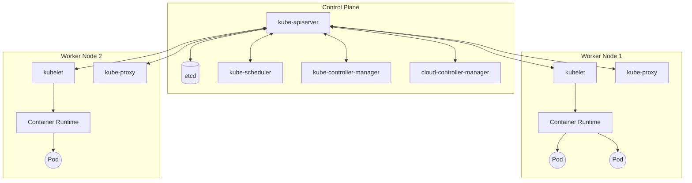
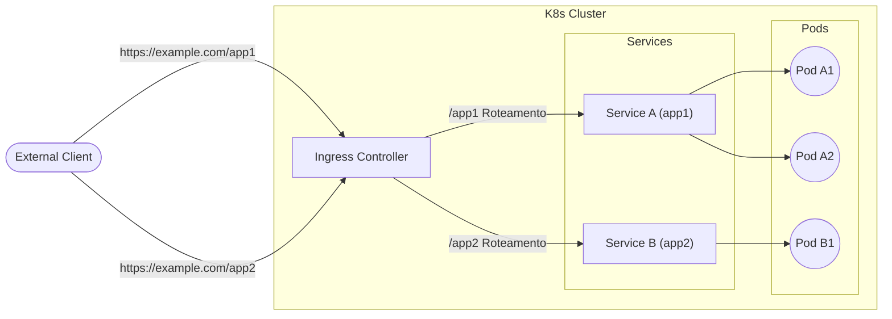

## 1. Introdução

No desenvolvimento e operação de software modernos, a tecnologia de contêineres tornou-se indispensável. Entre eles, o **Kubernetes** (geralmente abreviado como **K8s**) foi adotado por empresas em todo o mundo como o padrão de fato para a orquestração de contêineres.

O Kubernetes é uma plataforma de código aberto para automatizar a implantação, o dimensionamento e o gerenciamento de aplicativos em contêineres. Ele foi originalmente projetado pelo Google e agora é mantido pela Cloud Native Computing Foundation (CNCF).

Neste artigo, aprofundaremos na arquitetura geral do Kubernetes, detalhando desde o mecanismo do control plane até as funções dos principais recursos, como **Pod**, **Service** e **Ingress**.

---

## 2. Arquitetura Geral do Kubernetes

Um cluster Kubernetes é composto basicamente por dois componentes principais: o **Control Plane** (Plano de Controle) e o **Worker Node** (Nó de Trabalho).

O diagrama abaixo mostra a arquitetura geral do Kubernetes.



O control plane atua como o cérebro de todo o cluster, enquanto os worker nodes atuam como os membros que executam os aplicativos (contêineres) na prática.

---

## 3. Componentes do Control Plane

O control plane toma decisões globais sobre o cluster (como agendamento) e detecta e responde a eventos do cluster (por exemplo, iniciando um novo Pod quando o campo `replicas` de um Deployment não é atendido).

### 3.1. kube-apiserver

O **kube-apiserver** é o front-end do control plane do Kubernetes. Ele expõe a API do Kubernetes e recebe todas as comunicações de usuários, da CLI (`kubectl`) e de outros componentes do control plane. O servidor da API foi projetado para escalar horizontalmente, permitindo que o tráfego seja distribuído em várias instâncias.

### 3.2. etcd

O **etcd** é um armazenamento de chave-valor consistente e de alta disponibilidade usado para armazenar todos os dados do cluster do Kubernetes. O estado do cluster, as informações de configuração, os Secrets, etc., são todos armazenados no etcd. Como a perda de dados do etcd torna difícil a recuperação do cluster, backups regulares são extremamente importantes.

### 3.3. kube-scheduler

O **kube-scheduler** monitora **Pods** recém-criados aos quais ainda não foi atribuído um nó e seleciona o nó onde eles devem ser executados.
As decisões de agendamento consideram os requisitos de recursos individuais, restrições de hardware/software/políticas, especificações de afinidade (affinity) e antiafinidade (anti-affinity), localidade de dados, etc.

Como parte do algoritmo de agendamento, é realizada a pontuação (scoring) dos recursos. Por exemplo, a fórmula para calcular a taxa de utilização de recursos de um nó pode ser expressa da seguinte forma:

$$
Score = \frac{Capacity - Requested}{Capacity} \times 100
$$

Com base em pontuações como essa, o nó ideal é selecionado.

### 3.4. kube-controller-manager

O **kube-controller-manager** é o componente que executa os processos do controlador. Logicamente, cada controlador é um processo separado, mas para reduzir a complexidade, todos são compilados em um único binário e executados como um único processo.
Os principais controladores incluem:
- **Node Controller**: Responsável por perceber e responder quando os nós caem.
- **Job Controller**: Monitora os objetos Job que representam tarefas únicas e cria Pods para executar essas tarefas até a conclusão.
- **Endpoints Controller**: Preenche os objetos Endpoints que vinculam Services e Pods.

### 3.5. cloud-controller-manager

Um componente que incorpora lógicas de controle específicas do provedor de nuvem. Ele vincula o cluster à API do provedor de nuvem e separa os componentes que interagem com a plataforma de nuvem daqueles que interagem apenas dentro do cluster.

---

## 4. Componentes do Worker Node

Os worker nodes são máquinas virtuais ou físicas que hospedam as cargas de trabalho (workloads) dos aplicativos.

### 4.1. kubelet

O **kubelet** é um agente executado em cada nó do cluster. Ele garante que os contêineres estejam sendo executados de forma confiável dentro de um **Pod**.
O kubelet recebe um conjunto de PodSpecs fornecidos por meio de vários mecanismos e garante que os contêineres descritos nesses PodSpecs estejam operando normalmente.

### 4.2. kube-proxy

O **kube-proxy** é um proxy de rede executado em cada nó do cluster, implementando parte do conceito de **Service** do Kubernetes.
O kube-proxy mantém as regras de rede nos nós, as quais permitem a comunicação de rede de dentro ou fora do cluster para os Pods. Ele usa a camada de filtragem de pacotes do SO (como iptables ou IPVS) para realizar o roteamento.

### 4.3. [Container](https://kenji.blog/pt/p/docker-container-namespace-cgroups-layers/) Runtime

O runtime de contêiner é o software responsável por executar os contêineres. O Kubernetes suporta runtimes de contêiner como containerd, CRI-O, etc.

---

## 5. Pod: A Menor Unidade de Implantação do Kubernetes

No Kubernetes, os contêineres nunca são implantados diretamente. Em vez disso, é utilizada a menor unidade de implantação no Kubernetes, chamada **Pod**.

### 5.1. O que é um Pod

Um Pod é um grupo de um ou mais contêineres implantados em um único nó. Os contêineres dentro de um Pod compartilham o armazenamento (Volume) e o espaço de rede (endereço IP e espaço de portas). Isso permite que contêineres fortemente acoplados se comuniquem uns com os outros de forma eficiente.

### 5.2. Exemplo de Manifesto YAML de um Pod

Abaixo está uma definição YAML simples de um Pod que executa um servidor web NGINX.

```yaml
apiVersion: v1
kind: Pod
metadata:
  name: nginx-pod
  labels:
    app: web
spec:
  containers:
  - name: nginx-container
    image: nginx:1.21.4
    ports:
    - containerPort: 80
```

Aplicar este manifesto com `kubectl apply -f pod.yaml` criará o Pod. As `labels` desempenham um papel muito importante na identificação do Pod em Services e Deployments, que serão abordados mais adiante.

---

## 6. Gerenciamento de Carga de Trabalho (Deployment)

Os Pods são efémeros. Quando um nó cai, os Pods nele também são perdidos. Portanto, em ambientes de produção, os Pods não são criados diretamente; em vez disso, controladores como o **Deployment** são usados para gerenciá-los.

O Deployment mantém o número de réplicas de um Pod (através de um ReplicaSet) e permite atualizações contínuas (rolling updates) sem tempo de inatividade e reversões (rollbacks).

```yaml
apiVersion: apps/v1
kind: Deployment
metadata:
  name: nginx-deployment
spec:
  replicas: 3
  selector:
    matchLabels:
      app: web
  template:
    metadata:
      labels:
        app: web
    spec:
      containers:
      - name: nginx
        image: nginx:1.21.4
        ports:
        - containerPort: 80
```

Com a configuração acima, o Kubernetes garante que 3 Pods do NGINX estejam sempre em execução.

---

## 7. Fundamentos de Rede: Service

Como os Pods são criados e destruídos dinamicamente, seus endereços IP também mudam dinamicamente. Isso torna impossível para clientes (outros Pods ou usuários externos) que desejam acessar um grupo de Pods saberem com qual IP se comunicar.
O **Service** resolve esse problema.

### 7.1. Papel do Service

Um Service é uma abstração que define um conjunto lógico de Pods e a política para acessá-los (às vezes chamado de microsserviço). Um Service recebe um endereço IP fixo (ClusterIP) e atua como um balanceador de carga para os Pods por trás dele.

### 7.2. Tipos de Service

- **ClusterIP** (Padrão): Expõe o Service em um IP interno do cluster. Só é acessível a partir de dentro do cluster.
- **NodePort**: Expõe o Service na porta estática do IP de cada nó. Pode ser acessado de fora do cluster via `<NodeIP>:<NodePort>`.
- **LoadBalancer**: Usa o balanceador de carga do provedor de nuvem para expor o Service externamente.
- **ExternalName**: Mapeia o Service para um nome DNS externo.

### 7.3. Exemplo de Manifesto YAML de um Service

```yaml
apiVersion: v1
kind: Service
metadata:
  name: nginx-service
spec:
  selector:
    app: web
  ports:
    - protocol: TCP
      port: 80
      targetPort: 80
  type: ClusterIP
```

Esse Service roteará o tráfego para todos os Pods com a label `app: web`.

---

## 8. Controle de Acesso Externo: Ingress

Embora o acesso externo seja possível usando `NodePort` ou `LoadBalancer` em um Service, ao expor vários serviços, o número de LoadBalancers aumenta para cada serviço, elevando os custos. Além disso, eles são insuficientes para realizar roteamento HTTP avançado (roteamento baseado em caminho de URL ou nome de host) e terminação SSL/TLS.

É aqui que entra o **Ingress**.

### 8.1. O que é o Ingress

O Ingress é um objeto da API que expõe rotas HTTP e HTTPS de fora do cluster para Services dentro do cluster. O roteamento de tráfego é controlado por regras definidas no recurso Ingress.

Para que o Ingress funcione, um **Ingress Controller** (como NGINX Ingress Controller ou AWS ALB Ingress Controller) deve estar em execução no cluster.

### 8.2. Diagrama de Roteamento de Tráfego

O diagrama Mermaid abaixo ilustra o fluxo de tráfego através do Ingress.



### 8.3. Exemplo de Manifesto YAML do Ingress

Abaixo está um exemplo de Ingress que realiza o roteamento com base no nome de host e caminho.

```yaml
apiVersion: networking.k8s.io/v1
kind: Ingress
metadata:
  name: example-ingress
  annotations:
    nginx.ingress.kubernetes.io/rewrite-target: /
spec:
  rules:
  - host: www.example.com
    http:
      paths:
      - path: /app1
        pathType: Prefix
        backend:
          service:
            name: app1-service
            port:
              number: 80
      - path: /app2
        pathType: Prefix
        backend:
          service:
            name: app2-service
            port:
              number: 80
```

Com esta configuração, os acessos para `www.example.com/app1` serão roteados para o `app1-service` e os acessos para `/app2` serão direcionados para o `app2-service`.

---

## 9. Conclusão

Neste artigo, detalhamos a arquitetura do Kubernetes, desde o funcionamento do control plane, que é o seu núcleo, passando pelos worker nodes, até os principais recursos usados para implantar aplicativos (**Pod**, **Service** e **Ingress**).

Embora o Kubernetes seja uma ferramenta muito poderosa e rica em recursos, ele também é conhecido por ter uma curva de aprendizado acentuada. No entanto, entender os componentes fundamentais explicados aqui e como eles interagem (o Pod envolve o contêiner, o Deployment gerencia o Pod, o Service abstrai a rede e o Ingress controla o tráfego externo) criará uma base sólida para dominar recursos mais avançados (RBAC, Helm, Service Mesh, etc.).

Sugerimos que você tente criar um cluster real (usando Minikube, kind, etc.) e aplique os manifestos para ver como eles funcionam na prática. Repetir teoria e prática é o caminho mais curto para se tornar um mestre no Kubernetes.
