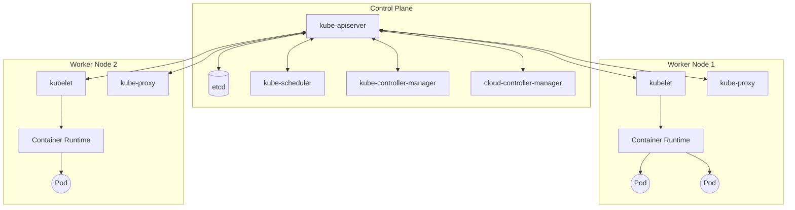
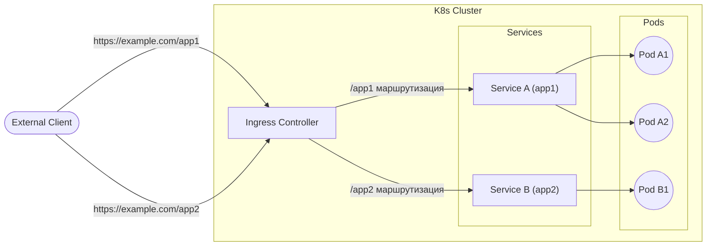

## 1. Введение

В современной разработке и эксплуатации программного обеспечения контейнерные технологии стали незаменимыми. Среди них **Kubernetes** (обычно сокращаемый как **K8s**) был принят компаниями по всему миру в качестве де-факто стандарта для оркестрации контейнеров.

Kubernetes — это платформа с открытым исходным кодом для автоматизации развертывания, масштабирования и управления контейнеризованными приложениями. Изначально она была разработана Google, а в настоящее время поддерживается Cloud Native Computing Foundation (CNCF).

В этой статье мы подробно рассмотрим общую архитектуру Kubernetes, объясним механизмы работы плоскости управления (Control Plane) и подробно остановимся на ролях основных ресурсов, таких как **Pod**, **Service** и **Ingress**.

---

## 2. Общая архитектура Kubernetes

Кластер Kubernetes в основном состоит из двух главных компонентов: **Control Plane** (Плоскость управления) и **Worker Node** (Рабочий узел).

На следующем рисунке показана общая архитектура Kubernetes.



Плоскость управления действует как мозг всего кластера, а рабочие узлы функционируют как руки и ноги, которые фактически выполняют приложения (контейнеры).

---

## 3. Компоненты Control Plane

Плоскость управления принимает глобальные решения о кластере (например, планирование) и обнаруживает события кластера (например, запуск нового пода, когда поле `replicas` в Deployment не удовлетворяется) и реагирует на них.

### 3.1. kube-apiserver

**kube-apiserver** является фронтендом для плоскости управления Kubernetes. Он предоставляет API Kubernetes и принимает все коммуникации от пользователей, CLI (`kubectl`) и других компонентов Control Plane. Сервер API спроектирован с возможностью горизонтального масштабирования, что позволяет распределять трафик между несколькими экземплярами.

### 3.2. etcd

**etcd** — это согласованное и высокодоступное хранилище пар "ключ-значение", используемое для хранения всех данных кластера Kubernetes. Состояние кластера, информация о конфигурации, секреты (Secret) и прочее — всё это хранится в etcd. Поскольку восстановление кластера становится затруднительным при потере данных etcd, регулярное резервное копирование крайне важно.

### 3.3. kube-scheduler

**kube-scheduler** отслеживает вновь созданные **Pod**, которым еще не назначен узел, и выбирает узел, на котором они должны быть запущены.
При принятии решений о планировании учитываются индивидуальные требования к ресурсам, ограничения оборудования/программного обеспечения/политик, спецификации сходства (affinity) и анти-сходства (anti-affinity), локальность данных и т. д.

В рамках алгоритма планирования выполняется оценка ресурсов (scoring). Например, формула для расчета коэффициента использования ресурсов узла может быть представлена следующим образом.

$$
Score = \frac{Capacity - Requested}{Capacity} \times 100
$$

На основе таких оценок выбирается оптимальный узел.

### 3.4. kube-controller-manager

**kube-controller-manager** — это компонент, который запускает процессы контроллеров. Логически каждый контроллер является отдельным процессом, но для снижения сложности все они скомпилированы в один двоичный файл и выполняются как один процесс.
Основные контроллеры включают в себя:
- **Node Controller**: отвечает за уведомление и реагирование в случае сбоя узла.
- **Job Controller**: отслеживает объекты Job, представляющие собой разовые задачи, и создает поды для выполнения задач до их завершения.
- **Endpoints Controller**: создает объекты Endpoints, которые связывают Service и Pod.

### 3.5. cloud-controller-manager

Компонент, в который встроена логика управления, специфичная для облачного провайдера. Он связывает кластер с API облачного провайдера и отделяет компоненты, взаимодействующие с облачной платформой, от компонентов, взаимодействующих только внутри кластера.

---

## 4. Компоненты Worker Node

Рабочие узлы — это виртуальные или физические машины, на которых фактически размещаются рабочие нагрузки (workloads) приложений.

### 4.1. kubelet

**kubelet** — это агент, работающий на каждом узле в кластере. Он гарантирует, что контейнеры надежно работают внутри **Pod**.
kubelet получает набор спецификаций подов (PodSpec), предоставляемых с помощью различных механизмов, и следит за тем, чтобы контейнеры, описанные в этих PodSpec, функционировали исправно.

### 4.2. kube-proxy

**kube-proxy** — это сетевой прокси, работающий на каждом узле кластера, который реализует часть концепции **Service** в Kubernetes.
kube-proxy поддерживает сетевые правила на узлах, которые позволяют осуществлять сетевое взаимодействие с подами как изнутри, так и снаружи кластера. Он использует уровень фильтрации пакетов ОС (например, iptables или IPVS) для маршрутизации.

### 4.3. [Container](https://kenji.blog/ru/p/docker-container-namespace-cgroups-layers/) Runtime

Среда выполнения контейнеров (Container Runtime) — это программное обеспечение, отвечающее за выполнение контейнеров. Kubernetes поддерживает такие среды выполнения контейнеров, как containerd, CRI-O и другие.

---

## 5. Pod: Минимальная единица развертывания в Kubernetes

В Kubernetes контейнеры не развертываются напрямую. Вместо этого используется наименьшая единица развертывания в Kubernetes, называемая **Pod** (под).

### 5.1. Что такое Pod

Pod — это группа из одного или нескольких контейнеров, развернутых на одном узле. Контейнеры внутри пода совместно используют хранилище (Volume) и сетевое пространство (IP-адрес и пространство портов). Это позволяет тесно связанным контейнерам эффективно взаимодействовать друг с другом.

### 5.2. Пример YAML манифеста Pod

Ниже приведен простой пример YAML-определения Pod, в котором работает веб-сервер NGINX.

```yaml
apiVersion: v1
kind: Pod
metadata:
  name: nginx-pod
  labels:
    app: web
spec:
  containers:
  - name: nginx-container
    image: nginx:1.21.4
    ports:
    - containerPort: 80
```

Применение этого манифеста с помощью `kubectl apply -f pod.yaml` создаст Pod. Поле `labels` играет очень важную роль в идентификации подов для Service или Deployment, которые будут описаны позже.

---

## 6. Управление рабочими нагрузками (Deployment)

Поды являются эфемерными (временными) сущностями. Если узел выходит из строя, поды на нем также теряются. Поэтому в производственных средах поды не создаются напрямую; вместо этого для управления подами используются такие контроллеры, как **Deployment**.

Deployment поддерживает количество реплик подов (через ReplicaSet) и обеспечивает возможность скользящих обновлений (rolling updates) и откатов без простоев.

```yaml
apiVersion: apps/v1
kind: Deployment
metadata:
  name: nginx-deployment
spec:
  replicas: 3
  selector:
    matchLabels:
      app: web
  template:
    metadata:
      labels:
        app: web
    spec:
      containers:
      - name: nginx
        image: nginx:1.21.4
        ports:
        - containerPort: 80
```

Приведенная выше конфигурация гарантирует, что Kubernetes будет постоянно поддерживать в работающем состоянии три пода NGINX.

---

## 7. Основы сетей: Service

Поскольку поды создаются и уничтожаются динамически, их IP-адреса также динамически изменяются. Это означает, что клиент (другой под или внешний пользователь), желающий получить доступ к группе подов, не будет знать, с каким IP-адресом ему следует обмениваться данными.
Эту проблему решает **Service**.

### 7.1. Роль Service

Service — это абстракция, которая определяет логический набор подов и политику доступа к ним (иногда называемую микросервисом). Service назначается фиксированный IP-адрес (ClusterIP), и он выполняет балансировку нагрузки на стоящие за ним поды.

### 7.2. Типы Service

- **ClusterIP** (по умолчанию): Открывает Service по внутреннему IP-адресу кластера. Доступен только изнутри кластера.
- **NodePort**: Открывает Service на статическом порту IP-адреса каждого узла. Доступен снаружи кластера по адресу `<NodeIP>:<NodePort>`.
- **LoadBalancer**: Использует балансировщик нагрузки облачного провайдера для предоставления доступа к Service извне.
- **ExternalName**: Сопоставляет Service с внешним DNS-именем.

### 7.3. Пример YAML манифеста Service

```yaml
apiVersion: v1
kind: Service
metadata:
  name: nginx-service
spec:
  selector:
    app: web
  ports:
    - protocol: TCP
      port: 80
      targetPort: 80
  type: ClusterIP
```

Этот Service маршрутизирует трафик ко всем подам с меткой `app: web`.

---

## 8. Контроль внешнего доступа: Ingress

Внешний доступ возможен с помощью `NodePort` или `LoadBalancer` ресурса Service, но при публикации нескольких сервисов количество LoadBalancer будет увеличиваться для каждого сервиса, что приведет к резкому росту затрат. Кроме того, этого недостаточно для сложной HTTP-маршрутизации (на основе URL-путей или имен хостов) или терминации SSL/TLS.

Здесь на сцену выходит **Ingress**.

### 8.1. Что такое Ingress

Ingress — это объект API, который управляет внешним доступом к HTTP и HTTPS маршрутам для сервисов (Service) внутри кластера. Маршрутизация трафика контролируется правилами, определенными в ресурсе Ingress.

Для работы Ingress в кластере должен быть запущен **Ingress Controller** (например, NGINX Ingress Controller или AWS ALB Ingress Controller).

### 8.2. Схема маршрутизации трафика

Следующая диаграмма Mermaid иллюстрирует поток трафика через Ingress.



### 8.3. Пример YAML манифеста Ingress

Ниже приведен пример Ingress, который выполняет маршрутизацию на основе имени хоста и пути.

```yaml
apiVersion: networking.k8s.io/v1
kind: Ingress
metadata:
  name: example-ingress
  annotations:
    nginx.ingress.kubernetes.io/rewrite-target: /
spec:
  rules:
  - host: www.example.com
    http:
      paths:
      - path: /app1
        pathType: Prefix
        backend:
          service:
            name: app1-service
            port:
              number: 80
      - path: /app2
        pathType: Prefix
        backend:
          service:
            name: app2-service
            port:
              number: 80
```

С помощью этой конфигурации доступ к `www.example.com/app1` распределяется на `app1-service`, а доступ к `/app2` — на `app2-service`.

---

## 9. Заключение

В этой статье мы подробно рассмотрели механизмы плоскости управления (Control Plane), которая является основой архитектуры Kubernetes, рабочие узлы (Worker Nodes), а также основные ресурсы для развертывания приложений (**Pod**, **Service**, **Ingress**).

Kubernetes является чрезвычайно многофункциональным и мощным инструментом, но, с другой стороны, он известен своей крутой кривой обучения. Однако, понимание этих базовых компонентов и их взаимодействия (Pod оборачивает контейнер, Deployment управляет подами, Service абстрагирует сеть, а Ingress контролирует внешний трафик) станет прочным фундаментом для освоения более сложных функций (таких как RBAC, Helm, Service Mesh и т.д.).

Обязательно попробуйте запустить реальный кластер (например, Minikube или kind), применить манифесты и проверить их работу. Повторение теории и практики — это лучший путь к тому, чтобы стать мастером Kubernetes.
