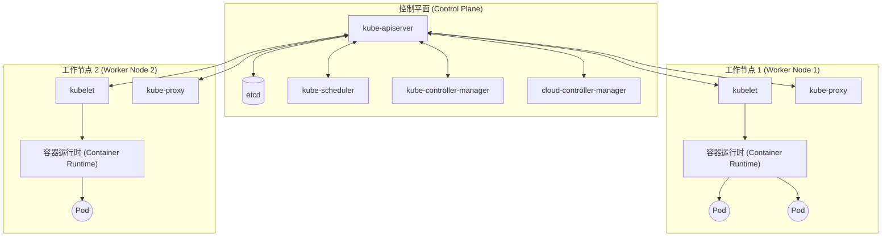
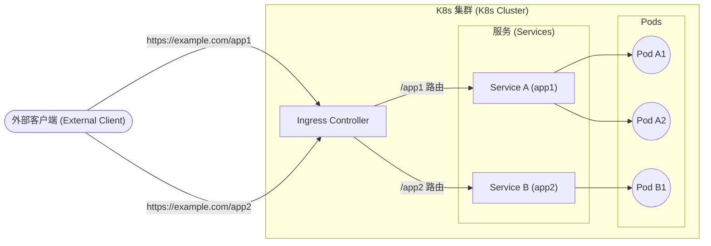

## 1. 引言

在现代软件开发与运维中，容器技术已经变得不可或缺。其中， **Kubernetes** （通常简称为 **K8s** ）作为容器编排的事实标准，已被全球各地的企业所采用。

Kubernetes是一个用于自动部署、扩展和管理容器化应用程序的开源平台。它最初由Google设计，目前由云原生计算基金会（CNCF）维护。

本文将深入探讨Kubernetes架构的全貌，详细解析从控制平面机制到 **Pod** 、 **Service** 、 **Ingress** 等主要资源的作用。

---

## 2. Kubernetes的整体架构

Kubernetes集群主要由两个核心组件构成： **控制平面 (Control Plane)** 和 **工作节点 (Worker Node)** 。

下图展示了Kubernetes的整体架构。



控制平面作为整个集群的大脑运行，而工作节点则作为实际运行应用程序（容器）的手脚来发挥作用。

---

## 3. 控制平面组件

控制平面负责做出集群相关的全局决策（例如调度），以及检测并响应集群事件（例如，当Deployment的 `replicas` 字段未满足时启动新的Pod）。

### 3.1. kube-apiserver

**kube-apiserver** 是Kubernetes控制平面的前端。它公开了Kubernetes API，并接收来自用户、CLI（`kubectl`）以及其他控制平面组件的所有通信。API服务器设计为可横向扩展，能够将流量分散到多个实例中。

### 3.2. etcd

**etcd** 是一致且高可用的键值存储，用于保存Kubernetes的所有集群数据。集群状态、配置信息、Secret等均保存在etcd中。一旦etcd的数据丢失，集群的恢复将变得非常困难，因此定期备份至关重要。

### 3.3. kube-scheduler

**kube-scheduler** 负责监视新创建但尚未分配节点的 **Pod** ，并为它们选择应在哪个节点上运行。
调度的决策会考虑个体的资源需求、硬件/软件/策略的限制、亲和性（Affinity）及反亲和性规范、数据局部性等因素。

作为调度算法的一部分，会对资源进行打分。例如，计算节点资源利用率的公式可以表示如下。

$$
Score = \frac{Capacity - Requested}{Capacity} \times 100
$$

基于这些得分，将选出最合适的节点。

### 3.4. kube-controller-manager

**kube-controller-manager** 是运行控制器进程的组件。逻辑上，每个控制器都是独立的进程，但为了降低复杂性，它们都被编译成了单一的二进制文件，并作为单一进程运行。
主要的控制器包括：
-  **Node Controller** ：负责在节点宕机时进行通知和响应。
-  **Job Controller** ：监视代表一次性任务的Job对象，并创建Pod以运行任务直至完成。
-  **Endpoints Controller** ：生成Endpoints对象，将Service与Pod关联起来。

### 3.5. cloud-controller-manager

嵌入特定云提供商控制逻辑的组件。它将集群链接到云提供商的API，并将与云平台交互的组件同仅在集群内部交互的组件分离开来。

---

## 4. 工作节点组件

工作节点是实际承载应用程序工作负载的虚拟或物理机。

### 4.1. kubelet

**kubelet** 是在集群中每个节点上运行的代理。它确保容器在 **Pod** 内可靠地运行。
kubelet接收通过各种机制提供的一组PodSpec，并确保这些PodSpec中描述的容器正常运行。

### 4.2. kube-proxy

**kube-proxy** 是在集群中每个节点上运行的网络代理，它实现了Kubernetes中 **Service** 概念的一部分。
kube-proxy维护节点上的网络规则，这些网络规则允许从集群内部或外部与Pod进行网络通信。它利用操作系统的包过滤层（如iptables或IPVS）进行路由。

### 4.3. 容器运行时 ([Container](https://kenji.blog/zh-cn/p/docker-container-namespace-cgroups-layers/) Runtime)

容器运行时是负责运行容器的软件。Kubernetes支持containerd、CRI-O等容器运行时。

---

## 5. Pod：Kubernetes的最小部署单元

在Kubernetes中，绝不会直接部署容器。取而代之的是使用Kubernetes中的最小部署单元，即 **Pod** 。

### 5.1. 什么是Pod

Pod是部署在单个节点上的一个或多个容器的组合。Pod内的容器共享存储（Volume）和网络空间（IP地址与端口空间）。这使得紧密耦合的容器能够高效地相互通信。

### 5.2. Pod的YAML清单示例

以下是运行NGINX Web服务器的简单Pod的YAML定义。

```yaml
apiVersion: v1
kind: Pod
metadata:
  name: nginx-pod
  labels:
    app: web
spec:
  containers:
  - name: nginx-container
    image: nginx:1.21.4
    ports:
    - containerPort: 80
```

通过 `kubectl apply -f pod.yaml` 应用此清单，将创建一个Pod。 `labels` 在通过后文所述的Service或Deployment识别Pod时发挥着极其重要的作用。

---

## 6. 工作负载管理（Deployment）

Pod是短暂的存在。一旦节点宕机，其上的Pod也会丢失。因此，在生产环境中不会直接创建Pod，而是使用 **Deployment** 等控制器来管理Pod。

Deployment负责维护Pod的副本数量（通过ReplicaSet），并实现零停机的滚动更新与回滚。

```yaml
apiVersion: apps/v1
kind: Deployment
metadata:
  name: nginx-deployment
spec:
  replicas: 3
  selector:
    matchLabels:
      app: web
  template:
    metadata:
      labels:
        app: web
    spec:
      containers:
      - name: nginx
        image: nginx:1.21.4
        ports:
        - containerPort: 80
```

在上述配置中，Kubernetes将始终保证有3个NGINX Pod处于运行状态。

---

## 7. 基础网络：Service

由于Pod是动态创建和销毁的，其IP地址也会动态变化。这就导致想要访问某一组Pod的客户端（其他Pod或外部用户）无法知道应该与哪个IP进行通信。
解决这个问题的就是 **Service** 。

### 7.1. Service的作用

Service是一个抽象概念，定义了逻辑上的Pod集合以及访问它们的策略（有时也称为微服务）。Service被分配了一个固定的IP地址（ClusterIP），并对其背后的Pod进行负载均衡。

### 7.2. Service的类型

-  **ClusterIP** （默认）：通过集群内部的IP公开Service。仅能在集群内部访问。
-  **NodePort** ：在每个节点的IP的静态端口上公开Service。可以从集群外部通过 `<NodeIP>:<NodePort>` 进行访问。
-  **LoadBalancer** ：使用云提供商的负载均衡器，将Service公开到外部。
-  **ExternalName** ：将Service映射到外部DNS名称。

### 7.3. Service的YAML清单示例

```yaml
apiVersion: v1
kind: Service
metadata:
  name: nginx-service
spec:
  selector:
    app: web
  ports:
    - protocol: TCP
      port: 80
      targetPort: 80
  type: ClusterIP
```

该Service会将流量路由到所有带有 `app: web` 标签的Pod。

---

## 8. 外部访问控制：Ingress

虽然可以使用Service的 `NodePort` 或 `LoadBalancer` 进行外部访问，但在公开多个服务时，LoadBalancer的数量会随服务增加，从而导致成本飙升。此外，这也不足以执行高级HTTP路由（基于URL路径或主机名的路由）以及SSL/TLS终止。

此时登场的就是 **Ingress** 。

### 8.1. 什么是Ingress

Ingress是公开从集群外部到集群内Service的HTTP和HTTPS路由的API对象。流量的路由由Ingress资源中定义的规则来控制。

为了让Ingress发挥作用，集群内必须运行着 **Ingress Controller** （如NGINX Ingress Controller或AWS ALB Ingress Controller等）。

### 8.2. 流量路由图

下面的Mermaid图展示了经过Ingress的流量走向。



### 8.3. Ingress的YAML清单示例

以下是执行基于主机名和路径路由的Ingress示例。

```yaml
apiVersion: networking.k8s.io/v1
kind: Ingress
metadata:
  name: example-ingress
  annotations:
    nginx.ingress.kubernetes.io/rewrite-target: /
spec:
  rules:
  - host: www.example.com
    http:
      paths:
      - path: /app1
        pathType: Prefix
        backend:
          service:
            name: app1-service
            port:
              number: 80
      - path: /app2
        pathType: Prefix
        backend:
          service:
            name: app2-service
            port:
              number: 80
```

通过此配置，对 `www.example.com/app1` 的访问将被分配给 `app1-service` ，而对 `/app2` 的访问将被分配给 `app2-service` 。

---

## 9. 总结

本文从作为Kubernetes架构基础的控制平面机制，到工作节点，再到部署应用程序的主要资源（ **Pod** 、 **Service** 、 **Ingress** ），进行了详细解析。

Kubernetes是一个功能极其丰富且强大的工具，但也因此以学习曲线陡峭而闻名。然而，通过理解本文介绍的基本组件以及它们的协同作用（Pod包裹容器、Deployment管理Pod、Service抽象网络、Ingress控制外部流量），将为您掌握更高级功能（RBAC、Helm、Service Mesh等）奠定坚实的基础。

请务必尝试启动实际的集群（如Minikube或kind等），并应用清单以确认运行情况。不断地重复理论与实践，是通向Kubernetes大师之路的最短捷径。
