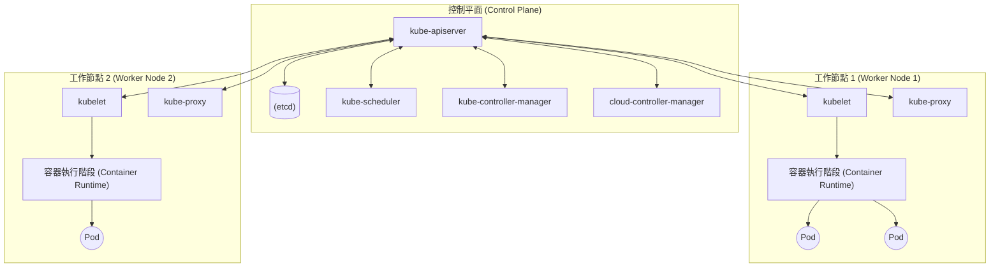

## 1. 簡介

在現代的軟體開發與維運中，容器技術已經成為不可或缺的一部分。其中， **Kubernetes** （通常縮寫為 **K8s** ）作為容器編排的事實標準，已被世界各地的企業廣泛採用。

Kubernetes 是一個開源平台，用於自動化部署、擴展和管理容器化應用程式。它最初由 Google 設計，目前由雲端原生運算基金會 (CNCF) 維護。

本文將深入探討 Kubernetes 架構的整體樣貌，並詳細解說從控制平面的機制，到 **Pod** 、 **Service** 、 **Ingress** 等主要資源的角色。

---

## 2. Kubernetes 整體架構

Kubernetes 叢集主要由兩個核心元件組成： **控制平面 (Control Plane)** 與 **工作節點 (Worker Node)** 。

下圖展示了 Kubernetes 的整體架構。



控制平面作為整個叢集的大腦運作，而工作節點則作為實際執行應用程式（容器）的手腳。

---

## 3. 控制平面元件

控制平面負責做出有關叢集的全域決策（例如排程），以及偵測並回應叢集事件（例如，當 Deployment 的 `replicas` 欄位未滿足時啟動新的 Pod）。

### 3.1. kube-apiserver

**kube-apiserver** 是 Kubernetes 控制平面的前端。它公開了 Kubernetes API，並接收來自使用者、CLI（`kubectl`）以及其他控制平面元件的所有通訊。API 伺服器被設計為可橫向擴展，能夠將流量分散至多個執行個體中。

### 3.2. etcd

**etcd** 是一個具備一致性且高可用性的鍵值儲存系統，用於保存 Kubernetes 的所有叢集資料。叢集的狀態、設定資訊、Secret 等全都儲存在 etcd 中。一旦 etcd 的資料遺失，叢集的復原將會變得非常困難，因此定期備份至關重要。

### 3.3. kube-scheduler

**kube-scheduler** 負責監控新建立但尚未被分配到任何節點的 **Pod** ，並為它們選擇應該執行的節點。
排程的決策會考量個別的資源需求、硬體/軟體/策略的限制、親和性 (affinity) 與反親和性 (anti-affinity) 規範、資料在地性 (data locality) 等因素。

作為排程演算法的一部分，會進行資源的評分。例如，計算節點資源使用率的公式可以表示如下：

$$
Score = \frac{Capacity - Requested}{Capacity} \times 100
$$

基於這樣的評分，系統會選出最合適的節點。

### 3.4. kube-controller-manager

**kube-controller-manager** 是執行控制器程序的元件。在邏輯上，每個控制器都是獨立的程序，但為了降低複雜度，它們全都被編譯為單一二進位檔，並作為單一程序執行。
主要的控制器包含以下幾種：
-  **節點控制器 (Node Controller)** ：負責在節點發生故障時進行通知與回應。
-  **工作控制器 (Job Controller)** ：監控代表一次性任務的 Job 物件，並建立 Pod 來將任務執行至完成。
-  **端點控制器 (Endpoints Controller)** ：產生用來連結 Service 與 Pod 的 Endpoints 物件。

### 3.5. cloud-controller-manager

這是嵌入了雲端供應商專屬控制邏輯的元件。它將叢集連結至雲端供應商的 API，並將與雲端平台互動的元件，與僅在叢集內部互動的元件分離開來。

---

## 4. 工作節點元件

工作節點是實際託管應用程式工作負載的虛擬或實體機器。

### 4.1. kubelet

**kubelet** 是在叢集內每個節點上執行的代理程式。它確保容器能在 **Pod** 內穩定地執行。
kubelet 會接收透過各種機制提供的 PodSpec 集合，並確認這些 PodSpec 中所描述的容器是否正常運作。

### 4.2. kube-proxy

**kube-proxy** 是在叢集內每個節點上執行的網路代理程式，它實作了 Kubernetes 中 **Service** 概念的一部分。
kube-proxy 會維護節點上的網路規則，這些網路規則允許從叢集內部或外部與 Pod 進行網路通訊。它會利用作業系統的封包過濾層（如 iptables 或 IPVS）來進行路由。

### 4.3. 容器執行階段 ([Container](https://kenji.blog/zh-tw/p/docker-container-namespace-cgroups-layers/) Runtime)

容器執行階段是負責執行容器的軟體。Kubernetes 支援 containerd、CRI-O 等容器執行階段。

---

## 5. Pod：Kubernetes 的最小部署單位

在 Kubernetes 中，我們不會直接部署容器。取而代之的是，我們會使用被稱為 **Pod** 的 Kubernetes 最小部署單位。

### 5.1. 什麼是 Pod

Pod 是部署在單一節點上的一個或多個容器的群組。Pod 內的容器會共享儲存空間 (Volume) 與網路空間（IP 位址與通訊埠空間）。這使得緊密耦合的容器能夠彼此有效率地通訊。

### 5.2. Pod 的 YAML 部署清單範例

以下是執行 NGINX 網頁伺服器的簡易 Pod YAML 定義。

```yaml
apiVersion: v1
kind: Pod
metadata:
  name: nginx-pod
  labels:
    app: web
spec:
  containers:
  - name: nginx-container
    image: nginx:1.21.4
    ports:
    - containerPort: 80
```

使用 `kubectl apply -f pod.yaml` 套用這個部署清單後，就會建立 Pod。 `labels` 在後續提到的 Service 或 Deployment 中，對於識別 Pod 扮演著非常重要的角色。

---

## 6. 工作負載管理 (Deployment)

Pod 是短暫的存在。當節點發生故障時，其上的 Pod 也會隨之遺失。因此，在正式環境中，我們不會直接建立 Pod，而是使用 **Deployment** 等控制器來管理 Pod。

Deployment 會維持 Pod 的複本數量（透過 ReplicaSet），並允許進行無停機的滾動更新 (rolling update) 與還原 (rollback)。

```yaml
apiVersion: apps/v1
kind: Deployment
metadata:
  name: nginx-deployment
spec:
  replicas: 3
  selector:
    matchLabels:
      app: web
  template:
    metadata:
      labels:
        app: web
    spec:
      containers:
      - name: nginx
        image: nginx:1.21.4
        ports:
        - containerPort: 80
```

在上述設定中，Kubernetes 會確保隨時都有 3 個 NGINX Pod 處於執行狀態。

---

## 7. 網路基礎：Service

由於 Pod 是動態建立與銷毀的，因此 IP 位址也會動態改變。這樣一來，想要存取某個 Pod 群組的用戶端（其他 Pod 或外部使用者），就會不知道該與哪個 IP 進行通訊。
解決這個問題的就是 **Service** 。

### 7.1. Service 的角色

Service 是一個抽象概念，它定義了一組邏輯上的 Pod，以及存取這些 Pod 的策略（有時也被稱為微服務）。Service 會被分配一個固定的 IP 位址 (ClusterIP)，並對其後方的 Pod 進行負載平衡。

### 7.2. Service 的類型

-  **ClusterIP** （預設）：使用叢集內部的 IP 公開 Service。只能從叢集內部存取。
-  **NodePort** : 在每個節點 IP 的靜態通訊埠上公開 Service。可以從叢集外部透過 `<NodeIP>:<NodePort>` 進行存取。
-  **LoadBalancer** : 使用雲端供應商的負載平衡器，將 Service 公開至外部。
-  **ExternalName** : 將 Service 對應至外部的 DNS 名稱。

### 7.3. Service 的 YAML 部署清單範例

```yaml
apiVersion: v1
kind: Service
metadata:
  name: nginx-service
spec:
  selector:
    app: web
  ports:
    - protocol: TCP
      port: 80
      targetPort: 80
  type: ClusterIP
```

這個 Service 會將流量路由至所有帶有 `app: web` 標籤的 Pod。

---

## 8. 外部存取控制：Ingress

雖然可以使用 Service 的 `NodePort` 或 `LoadBalancer` 進行外部存取，但如果公開多個服務，LoadBalancer 的數量會隨著服務增加，導致成本高昂。此外，它們也不足以執行進階的 HTTP 路由（基於 URL 路徑或主機名稱的路由）以及 SSL/TLS 終端。

這時登場的就是 **Ingress** 。

### 8.1. 什麼是 Ingress

Ingress 是將叢集外部至叢集內部 Service 的 HTTP 與 HTTPS 路由公開的 API 物件。流量的路由是由 Ingress 資源中定義的規則所控制。

要讓 Ingress 運作，叢集內必須有正在執行的 **Ingress Controller** （例如 NGINX Ingress Controller 或 AWS ALB Ingress Controller 等）。

### 8.2. 流量路由圖

以下的 Mermaid 圖展示了經過 Ingress 的流量流向。

```mermaid
flowchart LR
    Client(["外部用戶端 (External Client)"])
    subgraph "K8s Cluster ["K8s 叢集 (K8s Cluster)"]"
        Ingress["Ingress Controller"]
        
        subgraph Services ["服務 (Services)"]
            SvcA["Service A (app1)"]
            SvcB["Service B (app2)"]
        end
        
        subgraph Pods ["Pods"]
            PodA1(("Pod A1"))
            PodA2(("Pod A2"))
            PodB1(("Pod B1"))
        end
    end
    
    Client -->|"https://example.com/app1"| Ingress
    Client -->|"https://example.com/app2"| Ingress
    
    Ingress -->|"/app1 路由"| SvcA
    Ingress -->|"/app2 路由"| SvcB
    
    SvcA --> PodA1
    SvcA --> PodA2
    SvcB --> PodB1
```

### 8.3. Ingress 的 YAML 部署清單範例

以下是執行基於主機名稱與路徑路由的 Ingress 範例。

```yaml
apiVersion: networking.k8s.io/v1
kind: Ingress
metadata:
  name: example-ingress
  annotations:
    nginx.ingress.kubernetes.io/rewrite-target: /
spec:
  rules:
  - host: www.example.com
    http:
      paths:
      - path: /app1
        pathType: Prefix
        backend:
          service:
            name: app1-service
            port:
              number: 80
      - path: /app2
        pathType: Prefix
        backend:
          service:
            name: app2-service
            port:
              number: 80
```

透過這個設定，對 `www.example.com/app1` 的存取將被分配至 `app1-service` ，對 `/app2` 的存取則會被分配至 `app2-service` 。

---

## 9. 總結

本文詳細解說了從作為 Kubernetes 架構根基的控制平面機制，到工作節點，以及用於部署應用程式的主要資源（ **Pod** 、 **Service** 、 **Ingress** ）。

Kubernetes 雖然是功能非常豐富且強大的工具，但也因此以學習曲線陡峭而聞名。然而，透過理解這裡所解說的基本元件與它們之間的協作（Pod 包裝容器，Deployment 管理 Pod，Service 抽象化網路，Ingress 控制外部流量），將能為學習更進階的功能（RBAC、Helm、Service Mesh 等）打下堅實的基礎。

請務必嘗試啟動實際的叢集（如 Minikube 或 kind 等），套用部署清單並確認其運作情況。反覆進行理論與實作，是成為 Kubernetes 大師的最佳捷徑。
