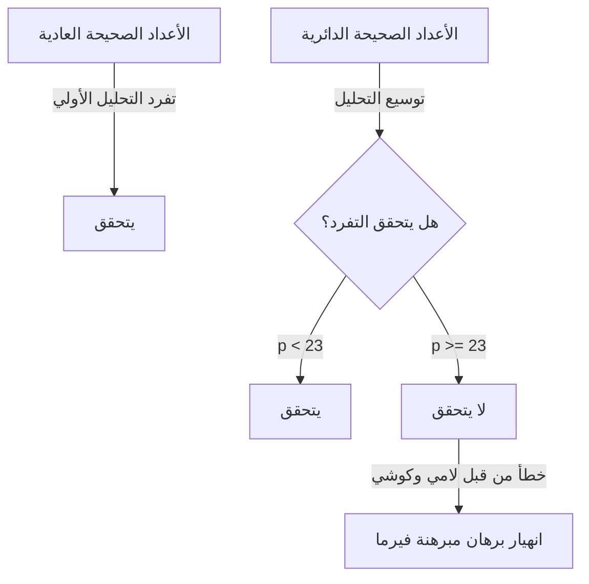
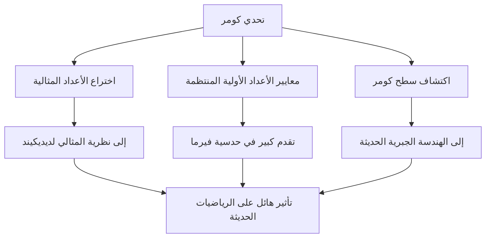

# [إرنست كومر](https://kenji.blog/ar/p/kummer/): أبو الأعداد المثالية وفجر نظرية الأعداد الجبرية

في تاريخ الرياضيات، ليس من غير المألوف أن يفتح تحدي مشكلة مفتوحة معينة مجالات دراسة جديدة بالكامل. إرنست إدوارد كومر ( **Ernst Eduard [Kummer](https://kenji.blog/ar/p/kummer/)** ) هو عملاق رياضي ألماني من القرن التاسع عشر صنع نقطة تحول تاريخية كهذه. خلال صراعه العميق مع **[مبرهنة فيرما الأخيرة](/ar/p/fermats-last-theorem/)** ( **[Fermat's Last Theorem](https://kenji.blog/ar/p/fermats-last-theorem/)** )، قدم المفهوم الثوري لـ **الأعداد المثالية** ( **Ideal Numbers** )، واضعاً الأساس لنظرية الأعداد الجبرية الحديثة.

في هذا المقال، سنتعمق في حياة كومر المضطربة، والحلقات الإنسانية التي تحيط به، وإنجازاته الرائعة التي تستمر في التألق في التاريخ الرياضي.

---

## حياة كومر وتعليمه

### الحياة المبكرة والتحول من اللاهوت

ولد [إرنست كومر](https://kenji.blog/ar/p/kummer/) في 29 يناير 1810 في سوراو ( **Sorau** )، مملكة بروسيا (موجودة في بولندا حالياً). توفي والده، الذي كان طبيباً، عندما كان كومر صغيراً جداً، ونشأ على يد والدته. على الرغم من فقره، تلقى كومر تعليماً مخلصاً ودخل جامعة هاله في عام 1828.

في البداية، تخصص في اللاهوت البروتستانتي، ولكن تحت تأثير البروفيسور هاينريش فرديناند شيرك ( **Heinrich Ferdinand Scherk** )، أسر بجمال وعمق الرياضيات. بتوجيه من البروفيسور شيرك، كرس كومر نفسه للرياضيات وحصل على الدكتوراه بعد ثلاث سنوات فقط، في عام 1831.

### أيامه كمعلم في صالة الألعاب الرياضية ولقائه بكرونيكر

بعد التخرج، لم يتمكن كومر من تأمين منصب جامعي على الفور، لذلك عمل لمدة عشر سنوات تقريباً كمعلم رياضيات وفيزياء في مدرسة (جيمنازيوم) في ليغنيتز ( **Liegnitz** )، بالقرب من مسقط رأسه. هذه الفترة كمعلم لم تكن بأي حال من الأحوال مضيعة للوقت. كان لديه شغف عميق كمعلم وقام بتربية طلاب استثنائيين.

أحد هؤلاء الطلاب كان ليوبولد كرونيكر ( **Leopold [Kronecker](https://kenji.blog/ar/p/kronecker/)** )، الذي سيصبح لاحقاً زميل كومر وصديقه مدى الحياة. أدرك كومر موهبة كرونيكر الاستثنائية، وعلمه الرياضيات المتقدمة، ووضعه على طريق البحث. أثناء عمله كمعلم في الجيمنازيوم، واصل كومر أبحاثه الخاصة، ونشر سلسلة من الأوراق البحثية المتميزة في المجلات الأكاديمية في برلين.

### المجد كأستاذ جامعي

لفتت إنجازاته البحثية الرائعة انتباه كبار علماء الرياضيات في ذلك الوقت. في عام 1842، بناءً على توصية من [كارل غوستاف جاكوب جاكوبي](https://kenji.blog/ar/p/jacobi/) ( **[Carl Gustav Jacob Jacobi](https://kenji.blog/ar/p/jacobi/)** ) وبيتر غوستاف لوجون ديريخليه ( **Peter Gustav Lejeune Dirichlet** )، أصبح كومر أستاذاً متفرغاً في جامعة بريسلاو. علاوة على ذلك، في عام 1855، تم تعيينه أستاذاً في جامعة برلين خلفاً لديريخليه، الذي انتقل إلى غوتنغن.

في جامعة برلين، عمل كومر، جنباً إلى جنب مع كارل فايرشتراس ( **[Karl Weierstrass](https://kenji.blog/ar/p/weierstrass/)** ) وتلميذه السابق كرونيكر، على الارتقاء ببرلين لتصبح مركزاً عالمياً للرياضيات. كانت محاضراته واضحة للغاية وعاطفية، مما جذب العديد من الطلاب اللامعين من جميع أنحاء أوروبا.

---

## حكاية: عالم الرياضيات العظيم الذي كافح مع الحساب

واحدة من أشهر القصص عن كومر هي أنه كان "ضعيفاً في الحساب". على الرغم من كونه عبقرياً بنى رياضيات مجردة للغاية ونظريات معقدة، فقد أفادت التقارير أنه كان يعاني في كثير من الأحيان من الحساب الأساسي.

خلال إحدى المحاضرات في أحد الأيام، علق كومر في محاولة حساب $7 \times 9$ على السبورة.

التفت إلى طلابه وتساءل: "سبعة في تسعة هو... أم..."
"هل هو 61؟" سأل، فأجاب أحد الطلاب: "لا يا أستاذ".
"إذن، هل هو 65؟"
صرخ طالب آخر: "إنه 63!"
شعر كومر بالارتياح، ووافق: "نعم، 63. هذا صحيح"، وواصل محاضرته بسلاسة كما لو لم يحدث شيء.

لا تزال هذه الحكاية تُروى بين علماء الرياضيات اليوم كمثال يبعث على الدفء على أن الحدس الرياضي المتقدم ومهارات الحساب الذهني البسيطة هي قدرات مختلفة تماماً.

---

## [مبرهنة فيرما الأخيرة](https://kenji.blog/ar/p/fermats-last-theorem/) وانهيار التحليل الفريد

كان أعظم إنجاز لكومر هو نهجه في **[مبرهنة فيرما الأخيرة](https://kenji.blog/ar/p/fermats-last-theorem/)** في نظرية الأعداد. تنص المبرهنة على ما يلي:

$$
x^n + y^n = z^n \quad (\text{حيث } n \ge 3 \text{ عدد صحيح})
$$

لا توجد حلول صحيحة موجبة $(x, y, z)$ تلبي هذه المعادلة.

في عام 1847، أعلن علماء الرياضيات الفرنسيون [غابرييل لامي](https://kenji.blog/ar/p/lame/) ( **Gabriel Lamé** ) وأوغستين لوي كوشي ( **[Augustin-Louis Cauchy](https://kenji.blog/ar/p/cauchy/)** ) أنهم نجحوا في إثبات هذه المبرهنة. كان نهجهم هو توسيع التحليل إلى مجال الأعداد المركبة (الحقول الدائرية).

باستخدام الجذر البدائي النوني للوحدة $\zeta$ (حيث $\zeta^p = 1, \zeta \neq 1$)، يمكن تحليل المعادلة $x^p + y^p = z^p$ على النحو التالي:

$$
x^p + y^p = (x + y)(x + \zeta y)(x + \zeta^2 y) \dots (x + \zeta^{p-1} y)
$$

افترض لامي وآخرون ضمناً أن "تفرد التحليل الأولي" في الأعداد الصحيحة العادية (حيث يمكن التعبير عن أي عدد صحيح بشكل فريد كحاصل ضرب أعداد أولية) سيستمر أيضاً في هذا العالم الممتد من الأعداد الصحيحة المركبة (الأعداد الصحيحة الدائرية).

ومع ذلك، كان كومر قد اكتشف بالفعل قبل بضع سنوات أن هذا الافتراض خاطئ. على سبيل المثال، عندما يكون $p=23$، يفشل تفرد التحليل الأولي. بدون تحليل فريد، انهار برهان لامي وكوشي تماماً.

---

## ولادة الأعداد المثالية

للتغلب على الوضع الحرج لانهيار التحليل الفريد، ابتكر كومر مفهوماً جديداً تماماً: **الأعداد المثالية** ( **Ideal Numbers** ).

كانت فكرة كومر كالتالي: "إذا لم يكن التحليل الأولي فريداً، فربما توجد 'أعداد أولية مثالية' غير مرئية، ومن خلال تقسيم العناصر إلى هذه الأعداد الأولية المثالية، يمكن استعادة التفرد". هذا يشبه الكيمياء، حيث يؤدي تقسيم المادة من جزيئات إلى ذرات إلى توضيح تركيبها الأساسي.

حدد كومر "عوامل مثالية" داخل مجموعة الأعداد الصحيحة الدائرية - العوامل التي لا توجد كأعداد عادية ولكن يمكن التعامل معها باتساق كامل في العمليات الجبرية. من خلال هذا، نجح ببراعة في إحياء تفرد التحليل الأولي في مجال الأعداد الصحيحة الدائرية.

في وقت لاحق، قام ريتشارد ديديكيند ( **Richard Dedekind** ) بتعميم أعداد كومر المثالية، والارتقاء بها إلى مفهوم **المثالي** ( **Ideal** ) باستخدام نظرية المجموعات. أصبح هذا أساس الهندسة الجبرية الحديثة ونظرية الحلقات.

---

## الأعداد الأولية المنتظمة والبرهان الجزئي ل[مبرهنة فيرما الأخيرة](https://kenji.blog/ar/p/fermats-last-theorem/)

باستخدام نظرية الأعداد المثالية، وجه كومر ضربة هائلة ل[مبرهنة فيرما الأخيرة](https://kenji.blog/ar/p/fermats-last-theorem/). حدد مفهوم **الأعداد الأولية المنتظمة** ( **Regular Primes** ) وأثبت النتيجة المذهلة أنه "إذا كان $p$ عدداً أولياً منتظماً، فإن [مبرهنة فيرما الأخيرة](https://kenji.blog/ar/p/fermats-last-theorem/) تتحقق بالنسبة لـ $p$."

العدد الأولي المنتظم هو عدد أولي $p$ لا يقسم رقم الفئة $h_p$ للحقل الدائري $\mathbb{Q}(\zeta_p)$. رقم الفئة هو مؤشر يقيس مدى سوء فشل التحليل الفريد؛ إذا كان رقم الفئة $1$، فإن التحليل الفريد يتحقق.

اكتشف كومر علاوة على ذلك معياراً قوياً لتحديد ما إذا كان عدد أولي معين منتظماً. يستخدم **أعداد برنولي** ( **Bernoulli Numbers** ) $B_k$. يكون العدد الأولي $p$ منتظماً إذا لم يقسم بسط أي من أعداد برنولي التالية:

$$
B_2, B_4, B_6, \dots, B_{p-3}
$$

باستخدام هذا المعيار، أثبت كومر أن [مبرهنة فيرما الأخيرة](https://kenji.blog/ar/p/fermats-last-theorem/) تنطبق على جميع الأعداد الأولية الأقل من $100$، باستثناء الأعداد الأولية غير المنتظمة $37, 59$، و $67$. كان هذا إنجازاً ضخماً أرسل موجات صدمة عبر مجتمع الرياضيات في ذلك الوقت.

---

## المساهمة في الهندسة: سطح كومر

بالإضافة إلى عمله الرائد في نظرية الأعداد، قام كومر باكتشافات حاسمة في مجال الهندسة. أكثرها تمثيلاً هو **سطح كومر** ( **[Kummer](https://kenji.blog/ar/p/kummer/) Surface** ).

في عام 1864، درس كومر فئة معينة من الأسطح الرباعية في الفضاء ثلاثي الأبعاد. يحتوي هذا السطح على خاصية رائعة للغاية تتمثل في امتلاك أكبر عدد ممكن من النقاط المفردة (النقاط التي لا يكون فيها السطح أملس، مثل القمم الحادة) - بالضبط $16$.

$$
\text{ميزات سطح كومر:} \quad \text{سطح رباعي، ولكنه يحتوي على 16 نقطة مفردة}
$$

سيلعب هذا السطح لاحقاً دوراً حيوياً في مجموعة واسعة من المجالات، من نظرية الدوال الأبيلية في الرياضيات البحتة إلى نظرية الأوتار في الفيزياء الحديثة. في الهندسة الجبرية، لا يزال يُدرس بشكل مكثف كأحد الأمثلة الأكثر كلاسيكية وجمالاً لما يُعرف باسم أسطح K3.

---

## خاتمة

وسّع [إرنست كومر](https://kenji.blog/ar/p/kummer/) إطار الرياضيات ذاته أثناء معالجته لـ "اللغز غير القابل للحل" الخاص ب[مبرهنة فيرما الأخيرة](https://kenji.blog/ar/p/fermats-last-theorem/). أصبحت فكرته عن **الأعداد المثالية** لغة لا غنى عنها في الجبر اللاحق وتستمر في التأثير على كل فرع من فروع الرياضيات الحديثة.

بامتلاكه لجانب إنساني يتمثل في كونه ضعيفاً في الحساب، ولكنه يتمتع بالبصيرة لاكتشاف "أعداد مثالية غير مرئية" تفوق الحدس البشري، فإن تألق كومر جدير حقاً بلقب العبقري. تعلمنا إنجازات كومر أهمية إعادة النظر في الإطار نفسه عند مواجهة مشاكل تبدو مستحيلة.

يستمر إرثه الخالد في إلهام علماء الرياضيات حتى يومنا هذا.
