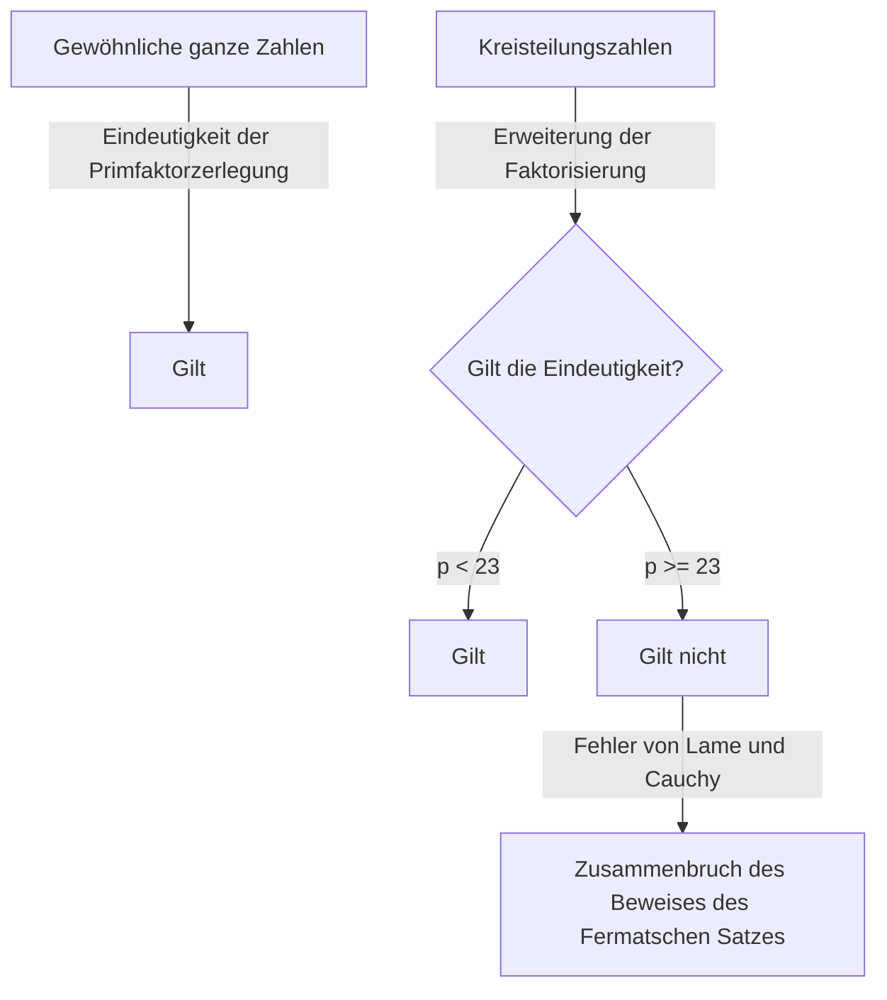
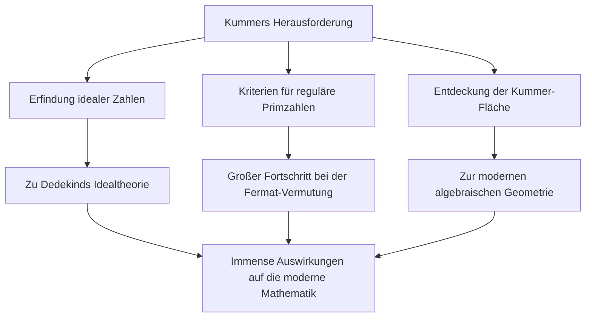

# Ernst Kummer: Vater der idealen Zahlen und die Morgendämmerung der algebraischen Zahlentheorie

In der Geschichte der Mathematik ist es nicht ungewöhnlich, dass die Herausforderung eines bestimmten offenen Problems völlig neue Forschungsfelder eröffnet. Ernst Eduard Kummer ( **Ernst Eduard Kummer** ) ist ein deutscher mathematischer Gigant des 19. Jahrhunderts, der genau solch einen historischen Wendepunkt schuf. Während seines tiefgründigen Kampfes mit dem **Großen Fermatschen Satz** ( **Fermat's Last Theorem** ) führte er das bahnbrechende Konzept der **idealen Zahlen** ( **Ideal Numbers** ) ein und legte damit den Grundstein für die moderne algebraische Zahlentheorie.

In diesem Artikel werden wir tief in Kummers turbulentes Leben, die menschlichen Episoden um ihn herum und seine brillanten Errungenschaften, die in der Mathematikgeschichte weiterhin strahlen, eintauchen.

---

## Kummers Leben und Bildung

### Frühes Leben und Wechsel von der Theologie

Ernst Kummer wurde am 29. Januar 1810 in Sorau ( **Sorau** ), im Königreich Preußen (heute in Polen), geboren. Sein Vater, ein Arzt, verstarb, als Kummer noch sehr jung war, und er wurde von seiner Mutter aufgezogen. Obwohl sie arm waren, erhielt Kummer eine engagierte Ausbildung und trat 1828 in die Universität Halle ein.

Zunächst studierte er protestantische Theologie, aber unter dem Einfluss von Professor Heinrich Ferdinand Scherk ( **Heinrich Ferdinand Scherk** ) wurde er von der Schönheit und Tiefe der Mathematik fasziniert. Unter der Anleitung von Professor Scherk widmete sich Kummer der Mathematik und promovierte bereits drei Jahre später, im Jahr 1831.

### Zeit als Gymnasiallehrer und Begegnung mit Kronecker

Nach seinem Abschluss konnte Kummer nicht sofort eine Universitätsstelle sichern, weshalb er etwa zehn Jahre lang als Mathematik- und Physiklehrer an einem Gymnasium in Liegnitz ( **Liegnitz** ), nahe seiner Heimatstadt, arbeitete. Diese Zeit als Lehrer war keineswegs verschwendet. Er hatte eine tiefe Leidenschaft als Pädagoge und bildete außergewöhnliche Schüler aus.

Einer dieser Schüler war Leopold Kronecker ( **Leopold Kronecker** ), der später Kummers Kollege und lebenslanger Freund werden sollte. Kummer erkannte Kroneckers außergewöhnliches Talent, brachte ihm höhere Mathematik bei und brachte ihn auf den Weg der Forschung. Während seiner Zeit als Gymnasiallehrer setzte Kummer seine eigenen Forschungen fort und veröffentlichte eine Reihe herausragender Arbeiten in akademischen Zeitschriften in Berlin.

### Ruhm als Universitätsprofessor

Seine bemerkenswerten Forschungsleistungen zogen die Aufmerksamkeit der führenden Mathematiker der damaligen Zeit auf sich. 1842 wurde Kummer auf Empfehlung von Carl Gustav Jacob Jacobi ( **Carl Gustav Jacob Jacobi** ) und Peter Gustav Lejeune Dirichlet ( **Peter Gustav Lejeune Dirichlet** ) ordentlicher Professor an der Universität Breslau. Darüber hinaus wurde er 1855 zum Professor an der Universität Berlin ernannt, um Dirichlet nachzufolgen, der nach Göttingen gewechselt war.

An der Universität Berlin machte Kummer zusammen mit Karl Weierstrass ( **Karl Weierstrass** ) und seinem ehemaligen Schüler Kronecker Berlin zu einem globalen Zentrum der Mathematik. Seine Vorlesungen waren extrem klar und leidenschaftlich und zogen viele brillante Studenten aus ganz Europa an.

---

## Episode: Der große Mathematiker, der mit dem Rechnen kämpfte

Eine der berühmtesten Episoden über Kummer ist, dass er "schlecht im Rechnen" war. Obwohl er ein Genie war, das hocharabstrakte Mathematik und komplexe Theorien konstruierte, hatte er angeblich oft Probleme mit der einfachen Arithmetik.

Während einer Vorlesung eines Tages blieb Kummer bei dem Versuch, $7 \times 9$ an der Tafel zu berechnen, stecken.

Er wandte sich an seine Studenten und überlegte: "Sieben mal neun ist... ähm..."
"Ist es 61?", fragte er, worauf ein Student antwortete: "Nein, Herr Professor."
"Dann, ist es 65?"
Ein anderer Student rief: "Es ist 63!"
Erleichtert stimmte Kummer zu: "Ja, 63. Das ist richtig," und setzte seine Vorlesung nahtlos fort, als ob nichts geschehen wäre.

Diese Anekdote wird auch heute noch unter Mathematikern als herzerwärmendes Beispiel dafür erzählt, dass fortgeschrittene mathematische Intuition und einfache Kopfrechenfähigkeiten völlig unterschiedliche Fähigkeiten sind.

---

## Der Große Fermatsche Satz und der Zusammenbruch der eindeutigen Faktorisierung

Kummers größte Errungenschaft war sein Ansatz zum **Großen Fermatschen Satz** in der Zahlentheorie. Der Satz besagt Folgendes:

$$
x^n + y^n = z^n \quad (\text{wobei } n \ge 3 \text{ eine ganze Zahl ist})
$$

Es gibt keine positiven ganzzahligen Lösungen $(x, y, z)$, die diese Gleichung erfüllen.

1847 gaben die französischen Mathematiker Gabriel Lamé ( **Gabriel Lamé** ) und Augustin-Louis Cauchy ( **Augustin-Louis Cauchy** ) bekannt, dass es ihnen gelungen sei, diesen Satz zu beweisen. Ihr Ansatz bestand darin, die Faktorisierung auf das Reich der komplexen Zahlen (Kreisteilungskörper) auszudehnen.

Unter Verwendung der primitiven $p$-ten Einheitswurzel $\zeta$ (wobei $\zeta^p = 1, \zeta \neq 1$) kann die Gleichung $x^p + y^p = z^p$ wie folgt faktorisiert werden:

$$
x^p + y^p = (x + y)(x + \zeta y)(x + \zeta^2 y) \dots (x + \zeta^{p-1} y)
$$

Lamé und andere nahmen stillschweigend an, dass die "Eindeutigkeit der Primfaktorzerlegung" bei gewöhnlichen ganzen Zahlen (bei der jede ganze Zahl eindeutig als Produkt von Primzahlen ausgedrückt werden kann) auch in dieser erweiterten Welt der komplexen ganzen Zahlen (Kreisteilungszahlen) gelten würde.

Kummer hatte jedoch bereits einige Jahre zuvor entdeckt, dass diese Annahme falsch war. Zum Beispiel schlägt die Eindeutigkeit der Primfaktorzerlegung fehl, wenn $p=23$. Ohne eindeutige Faktorisierung brach der Beweis von Lamé und Cauchy vollständig zusammen.

---

## Die Geburt der idealen Zahlen

Um die kritische Situation des Zusammenbruchs der eindeutigen Faktorisierung zu überwinden, schuf Kummer ein völlig neues Konzept: **ideale Zahlen** ( **Ideal Numbers** ).

Kummers Idee war diese: "Wenn die Primfaktorzerlegung nicht eindeutig ist, existieren vielleicht unsichtbare 'ideale Primzahlen', und indem man Elemente in diese idealen Primzahlen zerlegt, könnte die Eindeutigkeit wiederhergestellt werden." Dies ähnelt der Chemie, bei der die Zerlegung von Materie von Molekülen in Atome ihre grundlegende Zusammensetzung klärt.

Kummer definierte "ideale Faktoren" innerhalb der Menge der Kreisteilungszahlen – Faktoren, die als gewöhnliche Zahlen nicht existieren, aber mit vollkommener Konsistenz in algebraischen Operationen behandelt werden können. Dadurch stellte er die Eindeutigkeit der Primfaktorzerlegung im Bereich der Kreisteilungszahlen auf brillante Weise wieder her.

Später verallgemeinerte Richard Dedekind ( **Richard Dedekind** ) Kummers ideale Zahlen und erhob sie mit Hilfe der Mengenlehre zum Konzept des **Ideals** ( **Ideal** ). Dies wurde zur Grundlage der modernen algebraischen Geometrie und Ringtheorie.

---

## Reguläre Primzahlen und der teilweise Beweis des Großen Fermatschen Satzes

Unter Verwendung der Theorie der idealen Zahlen versetzte Kummer dem Großen Fermatschen Satz einen gewaltigen Schlag. Er definierte das Konzept der **regulären Primzahlen** ( **Regular Primes** ) und bewies das erstaunliche Ergebnis, dass "wenn $p$ eine reguläre Primzahl ist, dann gilt der Große Fermatsche Satz für $p$."

Eine reguläre Primzahl ist eine Primzahl $p$, die die Klassenzahl $h_p$ des Kreisteilungskörpers $\mathbb{Q}(\zeta_p)$ nicht teilt. Die Klassenzahl ist ein Index, der misst, wie stark die eindeutige Faktorisierung fehlschlägt; wenn die Klassenzahl $1$ ist, gilt die eindeutige Faktorisierung.

Kummer entdeckte ferner ein starkes Kriterium, um zu bestimmen, ob eine gegebene Primzahl regulär ist. Es verwendet **Bernoulli-Zahlen** ( **Bernoulli Numbers** ) $B_k$. Eine Primzahl $p$ ist regulär, wenn sie den Zähler keiner der folgenden Bernoulli-Zahlen teilt:

$$
B_2, B_4, B_6, \dots, B_{p-3}
$$

Unter Verwendung dieses Kriteriums bewies Kummer, dass der Große Fermatsche Satz für alle Primzahlen unter $100$ gilt, mit Ausnahme der irregulären Primzahlen $37, 59$ und $67$. Dies war eine monumentale Leistung, die damals Schockwellen durch die mathematische Gemeinschaft schickte.

---

## Beitrag zur Geometrie: Die Kummer-Fläche

Zusätzlich zu seiner bahnbrechenden Arbeit in der Zahlentheorie machte Kummer entscheidende Entdeckungen auf dem Gebiet der Geometrie. Die repräsentativste davon ist die **Kummer-Fläche** ( **Kummer Surface** ).

Im Jahr 1864 studierte Kummer eine spezifische Klasse von Flächen vierten Grades im dreidimensionalen Raum. Diese Fläche hat die zutiefst faszinierende Eigenschaft, die maximal mögliche Anzahl an Singularitäten (Punkte, an denen die Fläche nicht glatt ist, z.B. scharfe Spitzen) zu besitzen – genau $16$.

$$
\text{Eigenschaften der Kummer-Fläche:} \quad \text{Eine Fläche 4. Grades mit 16 singulären Punkten}
$$

Diese Fläche sollte später eine entscheidende Rolle in einer Vielzahl von Bereichen spielen, von der abelschen Funktionentheorie in der reinen Mathematik bis hin zur Stringtheorie in der modernen Physik. In der algebraischen Geometrie wird sie immer noch intensiv als eines der klassischsten und schönsten Beispiele der sogenannten K3-Flächen studiert.

---

## Fazit

Ernst Kummer erweiterte den Rahmen der Mathematik selbst, während er das "unlösbare Rätsel" des Großen Fermatschen Satzes in Angriff nahm. Seine Idee der **idealen Zahlen** wurde zu einer unverzichtbaren Sprache in der späteren Algebra und beeinflusst weiterhin jeden Zweig der modernen Mathematik.

Mit der menschlichen Seite, schlecht im Rechnen zu sein, aber mit der Einsicht ausgestattet, "unsichtbare ideale Zahlen" jenseits der menschlichen Intuition zu entdecken, ist Kummers Brillanz den Titel eines Genies wahrlich wert. Kummers Errungenschaften lehren uns, wie wichtig es ist, den Rahmen selbst zu überdenken, wenn wir mit scheinbar unmöglichen Problemen konfrontiert sind.

Sein bleibendes Erbe inspiriert Mathematiker bis zum heutigen Tag.
