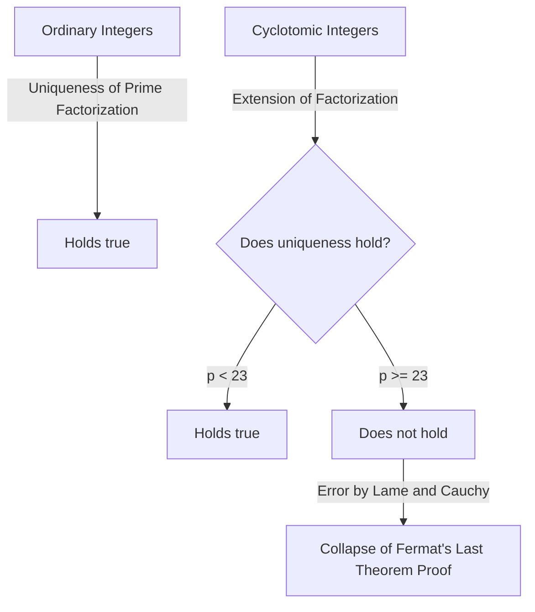
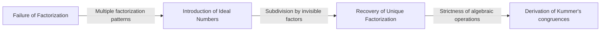
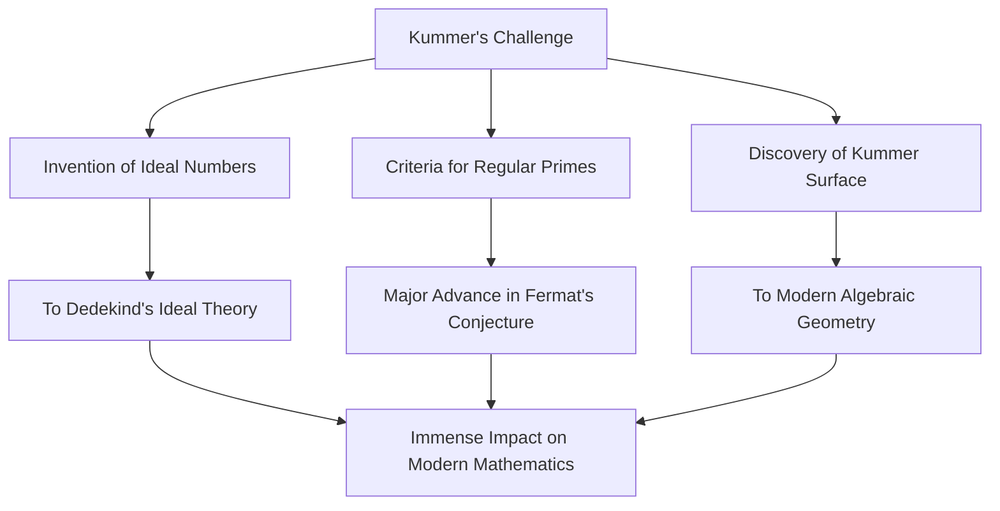

# Ernst Kummer: Father of Ideal Numbers and the Dawn of Algebraic Number Theory

In the history of mathematics, it is not uncommon for a challenge to a specific open problem to carve out entirely new fields of study. Ernst Eduard Kummer ( **Ernst Eduard Kummer** ) is a 19th-century German mathematical giant who created exactly such a historic turning point. During his profound struggle with **Fermat's Last Theorem** ( **Fermat's Last Theorem** ), he introduced the groundbreaking concept of **Ideal Numbers** ( **Ideal Numbers** ), laying the foundation for modern algebraic number theory.

In this article, we will delve deeply into Kummer's turbulent life, the humanizing episodes surrounding him, and his brilliant achievements that continue to shine in mathematical history.

---

## Kummer's Life and Education

### Early Life and Shift from Theology

Ernst Kummer was born on January 29, 1810, in Sorau ( **Sorau** ), Kingdom of Prussia (now in Poland). His father, a physician, passed away when Kummer was very young, and he was raised by his mother. Despite being poor, Kummer received a dedicated education and entered the University of Halle in 1828.

Initially, he majored in Protestant theology, but under the influence of Professor Heinrich Ferdinand Scherk ( **Heinrich Ferdinand Scherk** ), he became captivated by the beauty and depth of mathematics. Guided by Professor Scherk, Kummer dedicated himself to mathematics and earned his doctorate just three years later, in 1831.

### Days as a Gymnasium Teacher and Meeting Kronecker

After graduation, Kummer could not immediately secure a university position, so he worked for about ten years as a mathematics and physics teacher at a gymnasium in Liegnitz ( **Liegnitz** ), close to his hometown. This period as a teacher was by no means a waste of time. He had a deep passion as an educator and raised exceptional students.

One of these students was Leopold Kronecker ( **Leopold Kronecker** ), who would later become Kummer's colleague and lifelong friend. Kummer recognized Kronecker's extraordinary talent, taught him advanced mathematics, and set him on the path of research. While working as a gymnasium teacher, Kummer continued his own research, publishing a series of outstanding papers in academic journals in Berlin.

### Glory as a University Professor

His remarkable research achievements attracted the attention of the leading mathematicians of the time. In 1842, upon the recommendation of Carl Gustav Jacob Jacobi ( **Carl Gustav Jacob Jacobi** ) and Peter Gustav Lejeune Dirichlet ( **Peter Gustav Lejeune Dirichlet** ), Kummer became a full professor at the University of Breslau. Furthermore, in 1855, he was appointed professor at the University of Berlin to succeed Dirichlet, who had moved to Göttingen.

At the University of Berlin, Kummer, along with Karl Weierstrass ( **Karl Weierstrass** ) and his former student Kronecker, elevated Berlin into a global center of mathematics. His lectures were extremely clear and passionate, attracting many brilliant students from all over Europe.

---

## Episode: The Great Mathematician Who Struggled with Arithmetic

One of the most famous episodes about Kummer is that he was "poor at calculation." Although he was a genius who constructed highly abstract mathematics and complex theories, he reportedly often struggled with basic arithmetic.

During a lecture one day, Kummer got stuck trying to calculate $7 \times 9$ on the blackboard.

He faced his students and pondered, "Seven times nine is... um..."
"Is it 61?" he asked, to which a student replied, "No, Professor."
"Then, is it 65?"
Another student shouted, "It's 63!"
Relieved, Kummer agreed, "Yes, 63. That is correct," and seamlessly continued his lecture as if nothing had happened.

This anecdote is still recounted among mathematicians today as a heartwarming example that advanced mathematical intuition and simple mental arithmetic skills are entirely different faculties.

---

## Fermat's Last Theorem and the Collapse of Unique Factorization

Kummer's greatest achievement was his approach to **Fermat's Last Theorem** in number theory. The theorem states the following:

$$
x^n + y^n = z^n \quad (\text{where } n \ge 3 \text{ is an integer})
$$

There are no positive integer solutions $(x, y, z)$ that satisfy this equation.

In 1847, French mathematicians Gabriel Lamé ( **Gabriel Lamé** ) and Augustin-Louis Cauchy ( **Augustin-Louis Cauchy** ) announced that they had succeeded in proving this theorem. Their approach was to extend factorization into the realm of complex numbers (cyclotomic fields).

Using the primitive $p$-th root of unity $\zeta$ (where $\zeta^p = 1, \zeta \neq 1$), the equation $x^p + y^p = z^p$ can be factored as follows:

$$
x^p + y^p = (x + y)(x + \zeta y)(x + \zeta^2 y) \dots (x + \zeta^{p-1} y)
$$

Lamé and others implicitly assumed that the "uniqueness of prime factorization" in ordinary integers (where any integer can be expressed uniquely as a product of prime numbers) would also hold in this extended world of complex integers (cyclotomic integers).

However, Kummer had already discovered a few years prior that this assumption was false. For example, when $p=23$, the uniqueness of prime factorization fails. Without unique factorization, the proof by Lamé and Cauchy completely collapsed.

---

## The Birth of Ideal Numbers

To overcome the critical situation of the collapse of unique factorization, Kummer created an entirely new concept: **Ideal Numbers** ( **Ideal Numbers** ).

Kummer's idea was this: "If prime factorization is not unique, perhaps there exist invisible 'ideal primes,' and by breaking elements down into these ideal primes, uniqueness could be restored." This is akin to chemistry, where breaking matter down from molecules into atoms clarifies its fundamental composition.

Kummer defined "ideal factors" within the set of cyclotomic integers—factors that do not exist as ordinary numbers but can be handled with complete consistency in algebraic operations. Through this, he brilliantly resurrected the uniqueness of prime factorization in the realm of cyclotomic integers.

Later, Richard Dedekind ( **Richard Dedekind** ) generalized Kummer's ideal numbers, elevating them into the concept of the **Ideal** ( **Ideal** ) using set theory. This became the foundation of modern algebraic geometry and ring theory.

---

## Regular Primes and the Partial Proof of Fermat's Last Theorem

Using the theory of ideal numbers, Kummer struck a massive blow against Fermat's Last Theorem. He defined the concept of **Regular Primes** ( **Regular Primes** ) and proved the astonishing result that "if $p$ is a regular prime, then Fermat's Last Theorem holds for $p$."

A regular prime is a prime number $p$ that does not divide the class number $h_p$ of the cyclotomic field $\mathbb{Q}(\zeta_p)$. The class number is an index that measures how badly unique factorization fails; if the class number is $1$, unique factorization holds.

Kummer further discovered a powerful criterion to determine whether a given prime is regular. It uses **Bernoulli Numbers** ( **Bernoulli Numbers** ) $B_k$. A prime $p$ is regular if it does not divide the numerator of any of the following Bernoulli numbers:

$$
B_2, B_4, B_6, \dots, B_{p-3}
$$

Using this criterion, Kummer proved that Fermat's Last Theorem holds for all primes under $100$, except for the irregular primes $37, 59$, and $67$. This was a monumental achievement that sent shockwaves through the mathematical community at the time.

---

## Contribution to Geometry: The Kummer Surface

In addition to his groundbreaking work in number theory, Kummer made crucial discoveries in the field of geometry. The most representative of these is the **Kummer Surface** ( **Kummer Surface** ).

In 1864, Kummer studied a specific class of quartic surfaces in three-dimensional space. This surface has the deeply fascinating property of possessing the maximum possible number of singular points (points where the surface is not smooth, e.g., sharp peaks)—exactly $16$.

$$
\text{Features of Kummer Surface:} \quad \text{A quartic surface, yet has 16 singular points}
$$

This surface would later play a vital role in a wide range of fields, from Abelian function theory in pure mathematics to string theory in modern physics. In algebraic geometry, it is still intensely studied as one of the most classical and beautiful examples of what are known as K3 surfaces.

---

## Conclusion

Ernst Kummer expanded the very framework of mathematics while tackling the "unsolvable puzzle" of Fermat's Last Theorem. His idea of **Ideal Numbers** became an indispensable language in later algebra and continues to influence every branch of modern mathematics.

Possessing a human side of being poor at calculation, yet endowed with the insight to discover "invisible ideal numbers" beyond human intuition, Kummer's brilliance is truly worthy of the title of genius. Kummer's achievements teach us the importance of reconsidering the framework itself when faced with seemingly impossible problems.

His enduring legacy continues to inspire mathematicians to this day.
