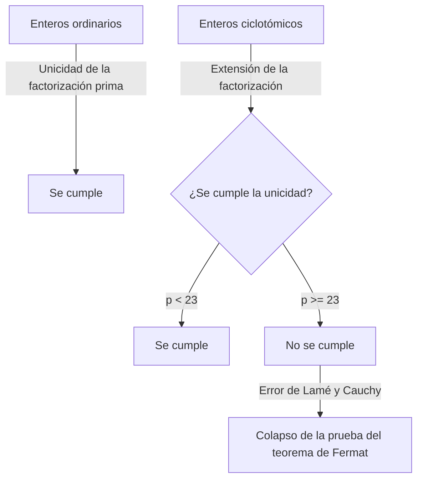
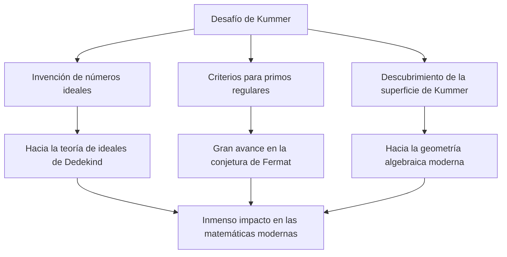

# Ernst Kummer: Padre de los números ideales y el amanecer de la teoría algebraica de números

En la historia de las matemáticas, no es infrecuente que el desafío a un problema abierto específico abra campos de estudio completamente nuevos. Ernst Eduard Kummer ( **Ernst Eduard Kummer** ) es un gigante matemático alemán del siglo XIX que creó exactamente ese punto de inflexión histórico. Durante su profunda lucha con el **último teorema de Fermat** ( **Fermat's Last Theorem** ), introdujo el concepto revolucionario de **números ideales** ( **Ideal Numbers** ), sentando las bases para la teoría algebraica de números moderna.

En este artículo, profundizaremos en la turbulenta vida de Kummer, los episodios humanos que lo rodean y sus brillantes logros que continúan brillando en la historia matemática.

---

## La vida y educación de Kummer

### Primeros años y cambio de la teología

Ernst Kummer nació el 29 de enero de 1810 en Sorau ( **Sorau** ), Reino de Prusia (actualmente en Polonia). Su padre, médico, falleció cuando Kummer era muy joven, y fue criado por su madre. A pesar de ser pobre, Kummer recibió una educación dedicada e ingresó a la Universidad de Halle en 1828.

Inicialmente, se especializó en teología protestante, pero bajo la influencia del profesor Heinrich Ferdinand Scherk ( **Heinrich Ferdinand Scherk** ), quedó cautivado por la belleza y profundidad de las matemáticas. Guiado por el profesor Scherk, Kummer se dedicó a las matemáticas y obtuvo su doctorado solo tres años después, en 1831.

### Días como profesor de Gymnasium y encuentro con Kronecker

Después de graduarse, Kummer no pudo asegurar de inmediato un puesto universitario, por lo que trabajó durante unos diez años como profesor de matemáticas y física en un gymnasium en Liegnitz ( **Liegnitz** ), cerca de su ciudad natal. Este período como maestro no fue en absoluto una pérdida de tiempo. Tenía una profunda pasión como educador y formó estudiantes excepcionales.

Uno de estos estudiantes fue Leopold Kronecker ( **Leopold Kronecker** ), quien más tarde se convertiría en colega y amigo de toda la vida de Kummer. Kummer reconoció el extraordinario talento de Kronecker, le enseñó matemáticas avanzadas y lo encaminó hacia la investigación. Mientras trabajaba como profesor de gymnasium, Kummer continuó su propia investigación, publicando una serie de artículos sobresalientes en revistas académicas en Berlín.

### Gloria como profesor universitario

Sus notables logros de investigación atrajeron la atención de los principales matemáticos de la época. En 1842, por recomendación de Carl Gustav Jacob Jacobi ( **Carl Gustav Jacob Jacobi** ) y Peter Gustav Lejeune Dirichlet ( **Peter Gustav Lejeune Dirichlet** ), Kummer se convirtió en profesor titular en la Universidad de Breslau. Además, en 1855, fue nombrado profesor en la Universidad de Berlín para suceder a Dirichlet, quien se había mudado a Gotinga.

En la Universidad de Berlín, Kummer, junto con Karl Weierstrass ( **Karl Weierstrass** ) y su antiguo alumno Kronecker, elevaron a Berlín a un centro mundial de matemáticas. Sus conferencias eran extremadamente claras y apasionadas, atrayendo a muchos estudiantes brillantes de toda Europa.

---

## Episodio: El gran matemático que tenía problemas con la aritmética

Uno de los episodios más famosos sobre Kummer es que era "malo para el cálculo". Aunque era un genio que construyó matemáticas altamente abstractas y teorías complejas, se informa que a menudo luchaba con la aritmética básica.

Durante una conferencia un día, Kummer se atascó tratando de calcular $7 \times 9$ en la pizarra.

Miró a sus estudiantes y reflexionó: "Siete por nueve es... um..."
"¿Es 61?", preguntó, a lo que un estudiante respondió: "No, profesor."
"Entonces, ¿es 65?"
Otro estudiante gritó: "¡Es 63!"
Aliviado, Kummer estuvo de acuerdo: "Sí, 63. Eso es correcto", y continuó su conferencia sin problemas como si nada hubiera pasado.

Esta anécdota todavía se cuenta hoy entre los matemáticos como un ejemplo conmovedor de que la intuición matemática avanzada y las simples habilidades de aritmética mental son facultades completamente diferentes.

---

## El último teorema de Fermat y el colapso de la factorización única

El mayor logro de Kummer fue su enfoque del **último teorema de Fermat** en la teoría de números. El teorema establece lo siguiente:

$$
x^n + y^n = z^n \quad (\text{donde } n \ge 3 \text{ es un entero})
$$

No hay soluciones enteras positivas $(x, y, z)$ que satisfagan esta ecuación.

En 1847, los matemáticos franceses Gabriel Lamé ( **Gabriel Lamé** ) y Augustin-Louis Cauchy ( **Augustin-Louis Cauchy** ) anunciaron que habían logrado probar este teorema. Su enfoque consistía en extender la factorización al ámbito de los números complejos (cuerpos ciclotómicos).

Usando la $p$-ésima raíz primitiva de la unidad $\zeta$ (donde $\zeta^p = 1, \zeta \neq 1$), la ecuación $x^p + y^p = z^p$ puede ser factorizada de la siguiente manera:

$$
x^p + y^p = (x + y)(x + \zeta y)(x + \zeta^2 y) \dots (x + \zeta^{p-1} y)
$$

Lamé y otros asumieron implícitamente que la "unicidad de la factorización prima" en los enteros ordinarios (donde cualquier entero puede expresarse de forma única como un producto de números primos) también se mantendría en este mundo extendido de enteros complejos (enteros ciclotómicos).

Sin embargo, Kummer ya había descubierto unos años antes que esta suposición era falsa. Por ejemplo, cuando $p=23$, la unicidad de la factorización prima falla. Sin una factorización única, la prueba de Lamé y Cauchy se derrumbó por completo.

---

## El nacimiento de los números ideales

Para superar la situación crítica del colapso de la factorización única, Kummer creó un concepto completamente nuevo: los **números ideales** ( **Ideal Numbers** ).

La idea de Kummer era esta: "Si la factorización prima no es única, tal vez existan 'primos ideales' invisibles, y al descomponer los elementos en estos primos ideales, se podría restaurar la unicidad". Esto es similar a la química, donde descomponer la materia de moléculas en átomos aclara su composición fundamental.

Kummer definió "factores ideales" dentro del conjunto de enteros ciclotómicos: factores que no existen como números ordinarios pero que pueden manejarse con total consistencia en las operaciones algebraicas. A través de esto, resucitó brillantemente la unicidad de la factorización prima en el reino de los enteros ciclotómicos.

Más tarde, Richard Dedekind ( **Richard Dedekind** ) generalizó los números ideales de Kummer, elevándolos al concepto del **Ideal** ( **Ideal** ) utilizando la teoría de conjuntos. Esto se convirtió en la base de la geometría algebraica moderna y la teoría de anillos.

---

## Primos regulares y la prueba parcial del último teorema de Fermat

Usando la teoría de los números ideales, Kummer asestó un golpe masivo al último teorema de Fermat. Definió el concepto de **primos regulares** ( **Regular Primes** ) y demostró el sorprendente resultado de que "si $p$ es un primo regular, entonces el último teorema de Fermat se cumple para $p$".

Un primo regular es un número primo $p$ que no divide el número de clase $h_p$ del cuerpo ciclotómico $\mathbb{Q}(\zeta_p)$. El número de clase es un índice que mide qué tan mal falla la factorización única; si el número de clase es $1$, se cumple la factorización única.

Kummer descubrió además un poderoso criterio para determinar si un primo dado es regular. Utiliza los **números de Bernoulli** ( **Bernoulli Numbers** ) $B_k$. Un primo $p$ es regular si no divide el numerador de ninguno de los siguientes números de Bernoulli:

$$
B_2, B_4, B_6, \dots, B_{p-3}
$$

Usando este criterio, Kummer demostró que el último teorema de Fermat se cumple para todos los primos menores de $100$, excepto para los primos irregulares $37, 59$ y $67$. Este fue un logro monumental que envió ondas de choque a través de la comunidad matemática en ese momento.

---

## Contribución a la geometría: La superficie de Kummer

Además de su trabajo innovador en teoría de números, Kummer hizo descubrimientos cruciales en el campo de la geometría. El más representativo de estos es la **superficie de Kummer** ( **Kummer Surface** ).

En 1864, Kummer estudió una clase específica de superficies cuárticas en el espacio tridimensional. Esta superficie tiene la propiedad profundamente fascinante de poseer el número máximo posible de puntos singulares (puntos donde la superficie no es lisa, por ejemplo, picos afilados), exactamente $16$.

$$
\text{Características de la superficie de Kummer:} \quad \text{Una superficie cuártica, pero con 16 puntos singulares}
$$

Esta superficie desempeñaría más tarde un papel vital en una amplia gama de campos, desde la teoría de funciones abelianas en matemáticas puras hasta la teoría de cuerdas en física moderna. En geometría algebraica, todavía se estudia intensamente como uno de los ejemplos más clásicos y hermosos de lo que se conoce como superficies K3.

---

## Conclusión

Ernst Kummer amplió el marco mismo de las matemáticas al abordar el "rompecabezas irresoluble" del último teorema de Fermat. Su idea de los **números ideales** se convirtió en un lenguaje indispensable en el álgebra posterior y continúa influyendo en todas las ramas de las matemáticas modernas.

Poseyendo el lado humano de ser malo para el cálculo, pero dotado de la perspicacia para descubrir "números ideales invisibles" más allá de la intuición humana, la brillantez de Kummer es verdaderamente digna del título de genio. Los logros de Kummer nos enseñan la importancia de reconsiderar el marco en sí cuando nos enfrentamos a problemas aparentemente imposibles.

Su legado perdurable continúa inspirando a los matemáticos hasta el día de hoy.
