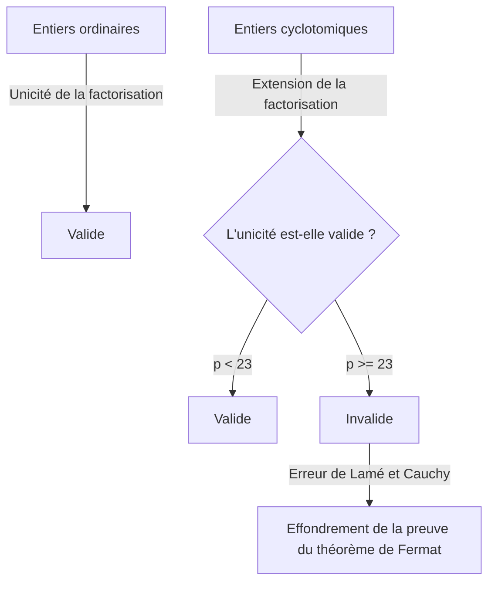
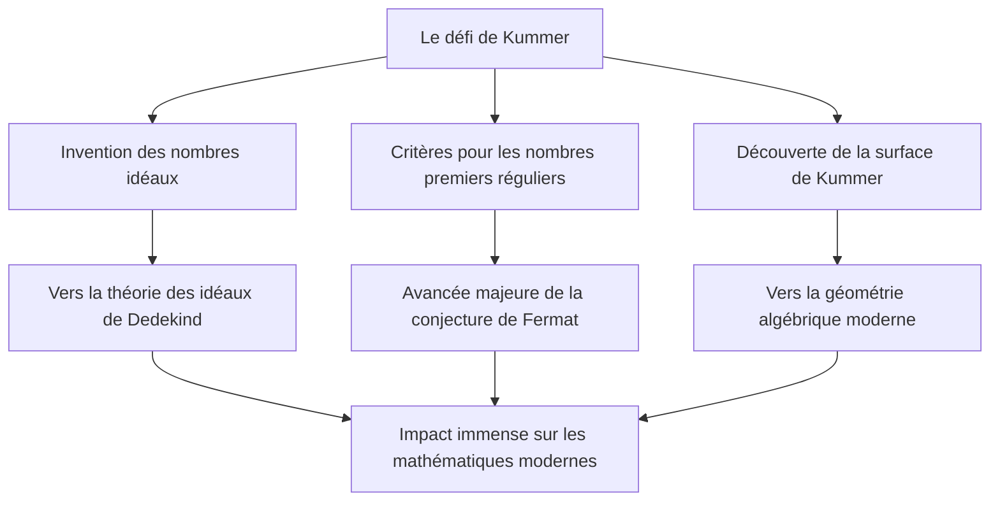

# [Ernst Kummer](https://kenji.blog/fr/p/kummer/) : Père des nombres idéaux et l'aube de la théorie algébrique des nombres

Dans l'histoire des mathématiques, il n'est pas rare que la confrontation à un problème ouvert spécifique ouvre des domaines de recherche entièrement nouveaux. Ernst Eduard [Kummer](https://kenji.blog/fr/p/kummer/) ( **Ernst Eduard [Kummer](https://kenji.blog/fr/p/kummer/)** ) est un géant des mathématiques allemand du XIXe siècle qui a créé exactement un tel tournant historique. Au cours de sa lutte acharnée avec le **dernier théorème de [Fermat](https://kenji.blog/fr/p/fermat/)** ( **[Fermat's Last Theorem](https://kenji.blog/fr/p/fermats-last-theorem/)** ), il a introduit le concept révolutionnaire de **nombres idéaux** ( **Ideal Numbers** ), jetant les bases de la théorie algébrique moderne des nombres.

Dans cet article, nous plongerons profondément dans la vie tumultueuse de [Kummer](https://kenji.blog/fr/p/kummer/), les anecdotes humaines qui l'entourent, et ses brillantes réalisations qui continuent de briller dans l'histoire des mathématiques.

---

## La vie et l'éducation de [Kummer](https://kenji.blog/fr/p/kummer/)

### Jeunesse et abandon de la théologie

[Ernst Kummer](https://kenji.blog/fr/p/kummer/) est né le 29 janvier 1810 à Sorau ( **Sorau** ), dans le Royaume de Prusse (aujourd'hui en Pologne). Son père, médecin, est décédé alors que [Kummer](https://kenji.blog/fr/p/kummer/) était très jeune, et il a été élevé par sa mère. Bien que pauvre, [Kummer](https://kenji.blog/fr/p/kummer/) a reçu une éducation dévouée et est entré à l'Université de Halle en 1828.

Initialement, il s'est spécialisé en théologie protestante, mais sous l'influence du professeur Heinrich Ferdinand Scherk ( **Heinrich Ferdinand Scherk** ), il a été captivé par la beauté et la profondeur des mathématiques. Guidé par le professeur Scherk, [Kummer](https://kenji.blog/fr/p/kummer/) s'est consacré aux mathématiques et a obtenu son doctorat seulement trois ans plus tard, en 1831.

### L'époque du Gymnase et la rencontre avec [Kronecker](https://kenji.blog/fr/p/kronecker/)

Après l'obtention de son diplôme, [Kummer](https://kenji.blog/fr/p/kummer/) n'a pas pu obtenir immédiatement un poste universitaire. Il a donc travaillé pendant une dizaine d'années comme professeur de mathématiques et de physique dans un gymnase à Liegnitz ( **Liegnitz** ), près de sa ville natale. Cette période d'enseignement n'était en aucun cas une perte de temps. Il avait une profonde passion d'éducateur et a formé des étudiants exceptionnels.

L'un de ces étudiants était Leopold [Kronecker](https://kenji.blog/fr/p/kronecker/) ( **Leopold [Kronecker](https://kenji.blog/fr/p/kronecker/)** ), qui deviendra plus tard le collègue et l'ami de toujours de [Kummer](https://kenji.blog/fr/p/kummer/). [Kummer](https://kenji.blog/fr/p/kummer/) a reconnu le talent extraordinaire de [Kronecker](https://kenji.blog/fr/p/kronecker/), lui a enseigné les mathématiques avancées et l'a mis sur la voie de la recherche. Tout en travaillant comme professeur de gymnase, [Kummer](https://kenji.blog/fr/p/kummer/) a poursuivi ses propres recherches, publiant une série d'articles exceptionnels dans des revues universitaires à Berlin.

### La gloire en tant que professeur d'université

Ses remarquables résultats de recherche ont attiré l'attention des plus grands mathématiciens de l'époque. En 1842, sur recommandation de [Carl Gustav Jacob Jacobi](https://kenji.blog/fr/p/jacobi/) ( **[Carl Gustav Jacob Jacobi](https://kenji.blog/fr/p/jacobi/)** ) et de Peter Gustav Lejeune Dirichlet ( **Peter Gustav Lejeune Dirichlet** ), [Kummer](https://kenji.blog/fr/p/kummer/) devient professeur titulaire à l'Université de Breslau. De plus, en 1855, il est nommé professeur à l'Université de Berlin pour succéder à Dirichlet, parti pour Göttingen.

À l'Université de Berlin, [Kummer](https://kenji.blog/fr/p/kummer/), avec [Karl Weierstrass](https://kenji.blog/fr/p/weierstrass/) ( **[Karl Weierstrass](https://kenji.blog/fr/p/weierstrass/)** ) et son ancien élève [Kronecker](https://kenji.blog/fr/p/kronecker/), a fait de Berlin un centre mondial des mathématiques. Ses cours étaient extrêmement clairs et passionnés, attirant de nombreux étudiants brillants de toute l'Europe.

---

## Anecdote : Le grand mathématicien qui avait des difficultés en calcul

L'une des anecdotes les plus célèbres à propos de [Kummer](https://kenji.blog/fr/p/kummer/) est qu'il était "mauvais en calcul". Bien qu'il ait été un génie ayant construit des mathématiques hautement abstraites et des théories complexes, on dit qu'il avait souvent du mal avec l'arithmétique de base.

Un jour, lors d'un cours, [Kummer](https://kenji.blog/fr/p/kummer/) est resté bloqué en essayant de calculer $7 \times 9$ au tableau.

Il s'est tourné vers ses étudiants et a réfléchi : "Sept fois neuf font... euh..."
"Est-ce 61 ?" a-t-il demandé, ce à quoi un étudiant a répondu : "Non, professeur."
"Alors, est-ce 65 ?"
Un autre étudiant a crié : "C'est 63 !"
Soulagé, [Kummer](https://kenji.blog/fr/p/kummer/) a approuvé : "Oui, 63. C'est correct," et a continué son cours comme si de rien n'était.

Cette anecdote est encore racontée aujourd'hui parmi les mathématiciens comme un exemple réconfortant que l'intuition mathématique avancée et les simples compétences en calcul mental sont des facultés totalement différentes.

---

## [Le dernier théorème de Fermat](https://kenji.blog/fr/p/fermats-last-theorem/) et l'effondrement de la factorisation unique

La plus grande réussite de [Kummer](https://kenji.blog/fr/p/kummer/) fut son approche du **dernier théorème de [Fermat](https://kenji.blog/fr/p/fermat/)** en théorie des nombres. Le théorème stipule ce qui suit :

$$
x^n + y^n = z^n \quad (\text{où } n \ge 3 \text{ est un entier})
$$

Il n'existe aucune solution entière positive $(x, y, z)$ satisfaisant cette équation.

En 1847, les mathématiciens français [Gabriel Lamé](https://kenji.blog/fr/p/lame/) ( **[Gabriel Lamé](https://kenji.blog/fr/p/lame/)** ) et [Augustin-Louis Cauchy](https://kenji.blog/fr/p/cauchy/) ( **[Augustin-Louis Cauchy](https://kenji.blog/fr/p/cauchy/)** ) annoncèrent avoir réussi à prouver ce théorème. Leur approche consistait à étendre la factorisation dans le domaine des nombres complexes (corps cyclotomiques).

En utilisant la racine primitive $p$-ième de l'unité $\zeta$ (où $\zeta^p = 1, \zeta \neq 1$), l'équation $x^p + y^p = z^p$ peut être factorisée comme suit :

$$
x^p + y^p = (x + y)(x + \zeta y)(x + \zeta^2 y) \dots (x + \zeta^{p-1} y)
$$

[Lamé](https://kenji.blog/fr/p/lame/) et d'autres supposaient implicitement que "l'unicité de la factorisation en nombres premiers" dans les entiers ordinaires (où tout entier peut être exprimé de manière unique comme un produit de nombres premiers) s'appliquerait également dans ce monde étendu des entiers complexes (entiers cyclotomiques).

Cependant, [Kummer](https://kenji.blog/fr/p/kummer/) avait déjà découvert quelques années auparavant que cette hypothèse était fausse. Par exemple, lorsque $p=23$, l'unicité de la factorisation en nombres premiers échoue. Sans factorisation unique, la preuve de [Lamé](https://kenji.blog/fr/p/lame/) et [Cauchy](https://kenji.blog/fr/p/cauchy/) s'est complètement effondrée.

---

## La naissance des nombres idéaux

Pour surmonter la situation critique de l'effondrement de la factorisation unique, [Kummer](https://kenji.blog/fr/p/kummer/) a créé un concept entièrement nouveau : les **nombres idéaux** ( **Ideal Numbers** ).

L'idée de [Kummer](https://kenji.blog/fr/p/kummer/) était la suivante : "Si la factorisation en nombres premiers n'est pas unique, peut-être existe-t-il des 'nombres premiers idéaux' invisibles, et en décomposant les éléments en ces nombres premiers idéaux, l'unicité pourrait être restaurée." C'est semblable à la chimie, où la décomposition de la matière des molécules en atomes clarifie sa composition fondamentale.

[Kummer](https://kenji.blog/fr/p/kummer/) a défini des "facteurs idéaux" au sein de l'ensemble des entiers cyclotomiques - des facteurs qui n'existent pas en tant que nombres ordinaires, mais qui peuvent être manipulés avec une parfaite cohérence dans les opérations algébriques. Grâce à cela, il a brillamment ressuscité l'unicité de la factorisation en nombres premiers dans le domaine des entiers cyclotomiques.

Plus tard, Richard Dedekind ( **Richard Dedekind** ) a généralisé les nombres idéaux de [Kummer](https://kenji.blog/fr/p/kummer/), les élevant au concept de l'**idéal** ( **Ideal** ) à l'aide de la théorie des ensembles. Cela est devenu le fondement de la géométrie algébrique et de la théorie des anneaux modernes.

---

## Nombres premiers réguliers et preuve partielle du dernier théorème de [Fermat](https://kenji.blog/fr/p/fermat/)

En utilisant la théorie des nombres idéaux, [Kummer](https://kenji.blog/fr/p/kummer/) a porté un coup massif au dernier théorème de [Fermat](https://kenji.blog/fr/p/fermat/). Il a défini le concept de **nombres premiers réguliers** ( **Regular Primes** ) et a prouvé le résultat étonnant que "si $p$ est un nombre premier régulier, alors le dernier théorème de [Fermat](https://kenji.blog/fr/p/fermat/) s'applique pour $p$."

Un nombre premier régulier est un nombre premier $p$ qui ne divise pas le nombre de classes $h_p$ du corps cyclotomique $\mathbb{Q}(\zeta_p)$. Le nombre de classes est un indice qui mesure à quel point la factorisation unique échoue ; si le nombre de classes est $1$, la factorisation unique est valable.

[Kummer](https://kenji.blog/fr/p/kummer/) a en outre découvert un critère puissant pour déterminer si un nombre premier donné est régulier. Il utilise les **nombres de Bernoulli** ( **Bernoulli Numbers** ) $B_k$. Un nombre premier $p$ est régulier s'il ne divise le numérateur d'aucun des nombres de Bernoulli suivants :

$$
B_2, B_4, B_6, \dots, B_{p-3}
$$

En utilisant ce critère, [Kummer](https://kenji.blog/fr/p/kummer/) a prouvé que le dernier théorème de [Fermat](https://kenji.blog/fr/p/fermat/) s'applique à tous les nombres premiers inférieurs à $100$, à l'exception des nombres premiers irréguliers $37, 59$ et $67$. Ce fut une réalisation monumentale qui provoqua une onde de choc au sein de la communauté mathématique de l'époque.

---

## Contribution à la géométrie : La surface de [Kummer](https://kenji.blog/fr/p/kummer/)

En plus de ses travaux révolutionnaires en théorie des nombres, [Kummer](https://kenji.blog/fr/p/kummer/) a fait des découvertes cruciales dans le domaine de la géométrie. La plus représentative d'entre elles est la **surface de [Kummer](https://kenji.blog/fr/p/kummer/)** ( **[Kummer](https://kenji.blog/fr/p/kummer/) Surface** ).

En 1864, [Kummer](https://kenji.blog/fr/p/kummer/) a étudié une classe spécifique de surfaces quartiques dans l'espace tridimensionnel. Cette surface a la propriété profondément fascinante de posséder le nombre maximum possible de points singuliers (points où la surface n'est pas lisse, par exemple, des pics aigus) - exactement $16$.

$$
\text{Caractéristiques de la surface de [Kummer](https://kenji.blog/fr/p/kummer/) :} \quad \text{Une surface quartique possédant 16 points singuliers}
$$

Cette surface jouera plus tard un rôle vital dans un large éventail de domaines, de la théorie des fonctions abéliennes en mathématiques pures à la théorie des cordes en physique moderne. En géométrie algébrique, elle est encore intensément étudiée comme l'un des exemples les plus classiques et les plus beaux de ce que l'on appelle les surfaces K3.

---

## Conclusion

[Ernst Kummer](https://kenji.blog/fr/p/kummer/) a élargi le cadre même des mathématiques tout en s'attaquant au "puzzle insoluble" du dernier théorème de [Fermat](https://kenji.blog/fr/p/fermat/). Son idée de **nombres idéaux** est devenue un langage indispensable dans l'algèbre ultérieure et continue d'influencer chaque branche des mathématiques modernes.

Possédant le trait humain d'être mauvais en calcul, mais doté de la perspicacité nécessaire pour découvrir des "nombres idéaux invisibles" au-delà de l'intuition humaine, l'éclat de [Kummer](https://kenji.blog/fr/p/kummer/) est vraiment digne du titre de génie. Les réalisations de [Kummer](https://kenji.blog/fr/p/kummer/) nous enseignent l'importance de reconsidérer le cadre lui-même face à des problèmes apparemment impossibles.

Son héritage durable continue d'inspirer les mathématiciens à ce jour.
