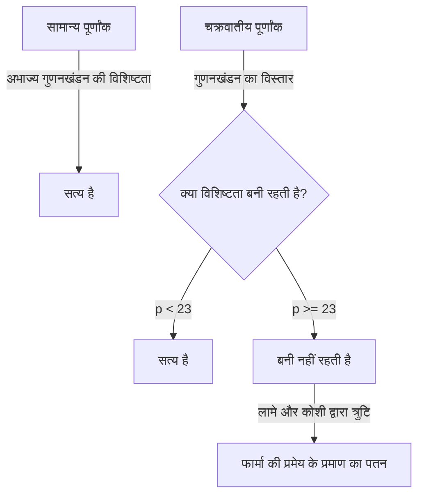
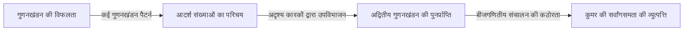
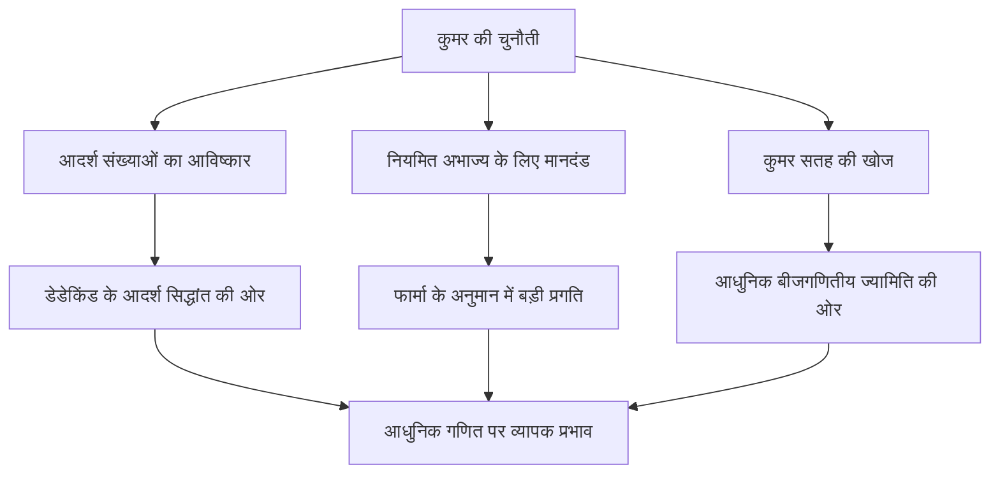

# [अर्नस्ट कुमर](https://kenji.blog/hi/p/kummer/): आदर्श संख्याओं के जनक और बीजगणितीय संख्या सिद्धांत का उदय

गणित के इतिहास में, किसी विशिष्ट अनसुलझी समस्या को चुनौती देने से अध्ययन के पूरी तरह से नए क्षेत्रों का खुलना असामान्य नहीं है। अर्नस्ट एडुआर्ड कुमर ( **Ernst Eduard Kummer** ) 19वीं सदी के एक जर्मन गणितीय दिग्गज हैं जिन्होंने बिल्कुल ऐसा ही ऐतिहासिक मोड़ पैदा किया। **फार्मा की अंतिम प्रमेय** ( **[Fermat's Last Theorem](https://kenji.blog/hi/p/fermats-last-theorem/)** ) के साथ अपने गहरे संघर्ष के दौरान, उन्होंने **आदर्श संख्या** ( **Ideal Numbers** ) की अभूतपूर्व अवधारणा पेश की, जिसने आधुनिक बीजगणितीय संख्या सिद्धांत की नींव रखी।

इस लेख में, हम कुमर के अशांत जीवन, उनके आस-पास के मानवीय प्रसंगों और उनकी शानदार उपलब्धियों में गहराई से उतरेंगे जो गणितीय इतिहास में आज भी चमकती हैं।

---

## कुमर का जीवन और शिक्षा

### प्रारंभिक जीवन और धर्मशास्त्र से बदलाव

[अर्नस्ट कुमर](https://kenji.blog/hi/p/kummer/) का जन्म 29 जनवरी, 1810 को प्रशिया के साम्राज्य (अब पोलैंड में) के सोरौ ( **Sorau** ) में हुआ था। उनके पिता, जो एक चिकित्सक थे, का निधन तब हो गया जब कुमर बहुत छोटे थे, और उनका पालन-पोषण उनकी माँ ने किया। गरीब होने के बावजूद, कुमर ने समर्पित शिक्षा प्राप्त की और 1828 में हाले विश्वविद्यालय में प्रवेश लिया।

शुरुआत में, उन्होंने प्रोटेस्टेंट धर्मशास्त्र में प्रमुखता हासिल की, लेकिन प्रोफेसर हेनरिक फर्डिनेंड शर्क ( **Heinrich Ferdinand Scherk** ) के प्रभाव में, वह गणित की सुंदरता और गहराई से मोहित हो गए। प्रोफेसर शर्क के मार्गदर्शन में, कुमर ने खुद को गणित के लिए समर्पित कर दिया और केवल तीन साल बाद, 1831 में डॉक्टरेट की उपाधि प्राप्त की।

### जिमनैजियम शिक्षक के रूप में दिन और क्रोनेकर से मुलाकात

स्नातक होने के बाद, कुमर तुरंत विश्वविद्यालय में पद प्राप्त नहीं कर सके, इसलिए उन्होंने अपने गृहनगर के करीब लिग्निट्ज़ ( **Liegnitz** ) में एक जिमनैजियम में लगभग दस वर्षों तक गणित और भौतिकी के शिक्षक के रूप में काम किया। शिक्षक के रूप में यह अवधि किसी भी तरह से समय की बर्बादी नहीं थी। एक शिक्षक के रूप में उनमें गहरा जुनून था और उन्होंने असाधारण छात्रों को तैयार किया।

इन छात्रों में से एक लियोपोल्ड क्रोनेकर ( **Leopold Kronecker** ) थे, जो बाद में कुमर के सहयोगी और आजीवन मित्र बने। कुमर ने क्रोनेकर की असाधारण प्रतिभा को पहचाना, उन्हें उन्नत गणित पढ़ाया और उन्हें अनुसंधान के मार्ग पर स्थापित किया। एक जिमनैजियम शिक्षक के रूप में काम करते हुए, कुमर ने अपना स्वयं का शोध जारी रखा, और बर्लिन में अकादमिक पत्रिकाओं में उत्कृष्ट शोध पत्रों की एक श्रृंखला प्रकाशित की।

### विश्वविद्यालय के प्रोफेसर के रूप में गौरव

उनकी उल्लेखनीय शोध उपलब्धियों ने उस समय के प्रमुख गणितज्ञों का ध्यान आकर्षित किया। 1842 में, [कार्ल गुस्ताव जैकब जैकोबी](https://kenji.blog/hi/p/jacobi/) ( **[Carl Gustav Jacob Jacobi](https://kenji.blog/hi/p/jacobi/)** ) और पीटर गुस्ताव लेज्यून डिरिचलेट ( **Peter Gustav Lejeune Dirichlet** ) की सिफारिश पर, कुमर ब्रेस्लाउ विश्वविद्यालय में पूर्ण प्रोफेसर बन गए। इसके अलावा, 1855 में, उन्हें डिरिचलेट के उत्तराधिकारी के रूप में बर्लिन विश्वविद्यालय में प्रोफेसर नियुक्त किया गया, जो गौटिंगेन चले गए थे।

बर्लिन विश्वविद्यालय में, कुमर ने [कार्ल वीयरस्ट्रास](https://kenji.blog/hi/p/weierstrass/) ( **[Karl Weierstrass](https://kenji.blog/hi/p/weierstrass/)** ) और अपने पूर्व छात्र क्रोनेकर के साथ मिलकर बर्लिन को गणित के वैश्विक केंद्र के रूप में ऊपर उठाया। उनके व्याख्यान अत्यंत स्पष्ट और भावुक थे, जिससे पूरे यूरोप से कई मेधावी छात्र आकर्षित हुए।

---

## प्रसंग: महान गणितज्ञ जो अंकगणित में संघर्ष करते थे

कुमर के बारे में सबसे प्रसिद्ध प्रसंगों में से एक यह है कि वह "गणना में खराब" थे। हालाँकि वह एक प्रतिभाशाली व्यक्ति थे जिन्होंने अत्यधिक अमूर्त गणित और जटिल सिद्धांतों का निर्माण किया था, लेकिन बताया जाता है कि वह अक्सर बुनियादी अंकगणित के साथ संघर्ष करते थे।

एक दिन एक व्याख्यान के दौरान, कुमर ब्लैकबोर्ड पर $7 \times 9$ की गणना करने की कोशिश करते हुए अटक गए।

उन्होंने अपने छात्रों की ओर देखा और विचार किया, "सात गुणा नौ होता है... उम..."
"क्या यह 61 है?" उन्होंने पूछा, जिस पर एक छात्र ने उत्तर दिया, "नहीं, प्रोफेसर।"
"तो, क्या यह 65 है?"
एक अन्य छात्र चिल्लाया, "यह 63 है!"
राहत महसूस करते हुए, कुमर सहमत हुए, "हाँ, 63। यह सही है," और निर्बाध रूप से अपना व्याख्यान ऐसे जारी रखा जैसे कुछ हुआ ही न हो।

यह किस्सा आज भी गणितज्ञों के बीच एक दिल छू लेने वाले उदाहरण के रूप में सुनाया जाता है कि उन्नत गणितीय अंतर्ज्ञान और सरल मानसिक अंकगणितीय कौशल पूरी तरह से अलग-अलग संकाय हैं।

---

## फार्मा की अंतिम प्रमेय और अद्वितीय गुणनखंडन का पतन

कुमर की सबसे बड़ी उपलब्धि संख्या सिद्धांत में **फार्मा की अंतिम प्रमेय** के प्रति उनका दृष्टिकोण था। यह प्रमेय निम्नलिखित बताता है:

$$
x^n + y^n = z^n \quad (\text{जहाँ } n \ge 3 \text{ एक पूर्णांक है})
$$

कोई धनात्मक पूर्णांक हल $(x, y, z)$ नहीं हैं जो इस समीकरण को संतुष्ट करते हों।

1847 में, फ्रांसीसी गणितज्ञों [गेब्रियल लामे](https://kenji.blog/hi/p/lame/) ( **[Gabriel Lamé](https://kenji.blog/hi/p/lame/)** ) और ऑगस्टिन-लुई कोशी ( **[Augustin-Louis Cauchy](https://kenji.blog/hi/p/cauchy/)** ) ने घोषणा की कि वे इस प्रमेय को सिद्ध करने में सफल रहे हैं। उनका दृष्टिकोण सम्मिश्र संख्याओं (चक्रवातीय क्षेत्रों) के दायरे में गुणनखंडन का विस्तार करना था।

इकाई के आदिम $p$-वें मूल $\zeta$ (जहाँ $\zeta^p = 1, \zeta \neq 1$) का उपयोग करते हुए, समीकरण $x^p + y^p = z^p$ को इस प्रकार गुणित किया जा सकता है:

$$
x^p + y^p = (x + y)(x + \zeta y)(x + \zeta^2 y) \dots (x + \zeta^{p-1} y)
$$

लामे और अन्य लोगों ने स्पष्ट रूप से यह मान लिया था कि सामान्य पूर्णांकों में "अभाज्य गुणनखंडन की विशिष्टता" (जहाँ किसी भी पूर्णांक को अभाज्य संख्याओं के गुणनफल के रूप में विशिष्ट रूप से व्यक्त किया जा सकता है) सम्मिश्र पूर्णांकों (चक्रवातीय पूर्णांकों) की इस विस्तारित दुनिया में भी लागू होगी।

हालाँकि, कुमर ने कुछ साल पहले ही खोज लिया था कि यह धारणा गलत थी। उदाहरण के लिए, जब $p=23$ होता है, तो अभाज्य गुणनखंडन की विशिष्टता विफल हो जाती है। अद्वितीय गुणनखंडन के बिना, लामे और कोशी द्वारा दिया गया प्रमाण पूरी तरह से ढह गया।

---

## आदर्श संख्याओं का जन्म

अद्वितीय गुणनखंडन के पतन की गंभीर स्थिति को दूर करने के लिए, कुमर ने एक पूरी तरह से नई अवधारणा बनाई: **आदर्श संख्याएँ** ( **Ideal Numbers** )।

कुमर का विचार यह था: "यदि अभाज्य गुणनखंडन अद्वितीय नहीं है, तो शायद अदृश्य 'आदर्श अभाज्य' मौजूद हैं, और तत्वों को इन आदर्श अभाज्यों में तोड़कर, विशिष्टता को बहाल किया जा सकता है।" यह रसायन विज्ञान के समान है, जहाँ पदार्थ को अणुओं से परमाणुओं में तोड़ने से इसकी मूल संरचना स्पष्ट हो जाती है।

कुमर ने चक्रवातीय पूर्णांकों के समुच्चय के भीतर "आदर्श कारकों" को परिभाषित किया - ऐसे कारक जो सामान्य संख्याओं के रूप में मौजूद नहीं हैं, लेकिन बीजगणितीय संचालन में पूर्ण स्थिरता के साथ संभाले जा सकते हैं। इसके माध्यम से, उन्होंने चक्रवातीय पूर्णांकों के दायरे में अभाज्य गुणनखंडन की विशिष्टता को शानदार ढंग से पुनर्जीवित किया।

बाद में, रिचर्ड डेडेकिंड ( **Richard Dedekind** ) ने सेट सिद्धांत का उपयोग करते हुए कुमर की आदर्श संख्याओं का सामान्यीकरण किया और उन्हें **आदर्श** ( **Ideal** ) की अवधारणा में उन्नत किया। यह आधुनिक बीजगणितीय ज्यामिति और वलय सिद्धांत की नींव बन गया।

---

## नियमित अभाज्य और फार्मा की अंतिम प्रमेय का आंशिक प्रमाण

आदर्श संख्याओं के सिद्धांत का उपयोग करते हुए, कुमर ने फार्मा की अंतिम प्रमेय पर एक बड़ा प्रहार किया। उन्होंने **नियमित अभाज्य** ( **Regular Primes** ) की अवधारणा को परिभाषित किया और यह आश्चर्यजनक परिणाम सिद्ध किया कि "यदि $p$ एक नियमित अभाज्य है, तो फार्मा की अंतिम प्रमेय $p$ के लिए सत्य है।"

एक नियमित अभाज्य एक अभाज्य संख्या $p$ है जो चक्रवातीय क्षेत्र $\mathbb{Q}(\zeta_p)$ की वर्ग संख्या $h_p$ को विभाजित नहीं करती है। वर्ग संख्या एक सूचकांक है जो यह मापता है कि अद्वितीय गुणनखंडन कितनी बुरी तरह विफल होता है; यदि वर्ग संख्या $1$ है, तो अद्वितीय गुणनखंडन लागू होता है।

कुमर ने आगे यह निर्धारित करने के लिए एक शक्तिशाली मानदंड की खोज की कि कोई दी गई अभाज्य संख्या नियमित है या नहीं। यह **बर्नौली संख्या** ( **Bernoulli Numbers** ) $B_k$ का उपयोग करता है। एक अभाज्य संख्या $p$ नियमित होती है यदि वह निम्नलिखित में से किसी भी बर्नौली संख्या के अंश को विभाजित नहीं करती है:

$$
B_2, B_4, B_6, \dots, B_{p-3}
$$

इस मानदंड का उपयोग करते हुए, कुमर ने साबित किया कि फार्मा की अंतिम प्रमेय अनियमित अभाज्य संख्याओं $37, 59$, और $67$ को छोड़कर $100$ से कम सभी अभाज्य संख्याओं के लिए सत्य है। यह एक स्मारकीय उपलब्धि थी जिसने उस समय गणितीय समुदाय में हलचल मचा दी थी।

---

## ज्यामिति में योगदान: कुमर सतह

संख्या सिद्धांत में अपने अभूतपूर्व कार्य के अलावा, कुमर ने ज्यामिति के क्षेत्र में महत्वपूर्ण खोजें कीं। इनमें से सबसे अधिक प्रतिनिधि **कुमर सतह** ( **Kummer Surface** ) है।

1864 में, कुमर ने त्रि-आयामी अंतरिक्ष में चतुर्थक सतहों के एक विशिष्ट वर्ग का अध्ययन किया। इस सतह में विलक्षण बिंदुओं (ऐसे बिंदु जहाँ सतह चिकनी नहीं होती, उदाहरण के लिए, तीखी चोटियाँ) की अधिकतम संभव संख्या - ठीक $16$ - रखने का गहरा आकर्षक गुण है।

$$
\text{कुमर सतह की विशेषताएँ:} \quad \text{एक चतुर्थक सतह, फिर भी 16 विलक्षण बिंदु हैं}
$$

यह सतह बाद में शुद्ध गणित में एबेलियन फ़ंक्शन सिद्धांत से लेकर आधुनिक भौतिकी में स्ट्रिंग सिद्धांत तक, क्षेत्रों की एक विस्तृत श्रृंखला में एक महत्वपूर्ण भूमिका निभाएगी। बीजगणितीय ज्यामिति में, यह अभी भी K3 सतहों के रूप में जाने जाने वाले सबसे शास्त्रीय और सुंदर उदाहरणों में से एक के रूप में गहनता से अध्ययन किया जाता है।

---

## निष्कर्ष

फार्मा की अंतिम प्रमेय की "अनसुलझी पहेली" से निपटते हुए [अर्नस्ट कुमर](https://kenji.blog/hi/p/kummer/) ने स्वयं गणित के ढांचे का विस्तार किया। **आदर्श संख्या** का उनका विचार बाद के बीजगणित में एक अपरिहार्य भाषा बन गया और आधुनिक गणित की हर शाखा को प्रभावित करना जारी रखता है।

गणना में खराब होने के मानवीय पक्ष को रखने के बावजूद, मानव अंतर्ज्ञान से परे "अदृश्य आदर्श संख्या" खोजने की अंतर्दृष्टि से संपन्न, कुमर की प्रतिभा वास्तव में जीनियस की उपाधि के योग्य है। कुमर की उपलब्धियाँ हमें सिखाती हैं कि असंभव प्रतीत होने वाली समस्याओं का सामना करते समय रूपरेखा पर ही पुनर्विचार करना कितना महत्वपूर्ण है।

उनकी स्थायी विरासत आज भी गणितज्ञों को प्रेरित करती है।
